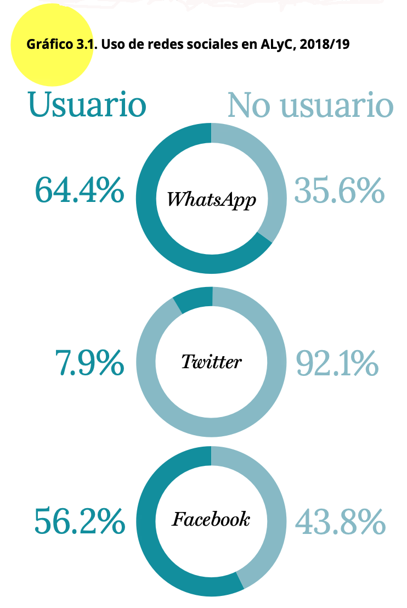

```{r setup, include=FALSE}
knitr::opts_chunk$set(message=FALSE,warning=FALSE, cache=TRUE)
```

```{css color, echo=FALSE}
.columns {display: flex;}
h1 {color: #3366CC;}
```

# Introducción

En este documento empezaremos con los aspectos básicos de cómo usar la base de datos del Barómetro de las Américas de LAPOP para fines estadísticos.
En primer lugar, veremos aspectos básicos de cómo describir una variable mediante una tabla de distribución de frecuencias y cómo graficar esa variable mediante gráficos circulares o de barras.
Para eso, vamos a usar el último informe regional "El pulso de la democracia", disponible [aquí](https://www.vanderbilt.edu/lapop/ab2018/2018-19_AmericasBarometer_Regional_Report_Spanish_W_03.27.20.pdf), donde se presentan los principales hallazgos de la ronda 2018/19 del Barómetro de las Américas.
Una de las secciones de este informe, reporta los datos sobre redes sociales y actitudes políticas.
En esta sección, se presentan datos sobre el uso de internet y el uso de redes sociales, en general y por país.
Con los datos del Barómetro de las Américas se puede saber el porcentaje de hogares con acceso a celulares, con acceso a internet, así como el porcentaje de personas que usa Whatsapp, Facebook o Twitter.
En este documento vamos a reproducir estos resultados.

# Sobre la base de datos

Los datos que vamos a usar deben citarse de la siguiente manera: Fuente: Barómetro de las Américas por el Proyecto de Opinión Pública de América Latina (LAPOP), wwww.LapopSurveys.org.
En este documento se carga nuevamente desde cero una base de datos recortada.
Se recomienda nuevamente limpiar el Environment de los objetos usados en módulos anteriores.

Esta base de datos se encuentra alojada en el repositorio "materials_edu" de la cuenta de LAPOP en GitHub.
Mediante la librería `rio` y el comando `import` se puede importar esta base de datos desde este repositorio.
Además, se seleccionan los datos de países con códigos menores o iguales a 35, es decir, se eliminan las observaciones de Estados Unidos y Canadá.

```{r base, message=FALSE, warning=FALSE}
library(rio)
lapop18 <- import("https://raw.github.com/lapop-central/materials_edu/main/LAPOP_AB_Merge_2018_v1.0.sav")
lapop18 <- subset(lapop18, pais<=35)
```

Las variables con las que se trabajará son: SMEDIA1.
¿Tiene usted cuenta de Facebook?;
SMEDIA4.
¿Tiene usted cuenta de Twitter?;
SMEDIA7.
¿Tiene usted cuenta de Whatsapp?.
Estas preguntas tienen como opciones de respuesta:

1.  Sí

2.  No

Al momento de leer la base de datos en R, este programa importa las variables como "num", que la mayoría de funciones en R trata como numéricas.
Estas variables se tienen que convertir a variables de tipo "factor" con el comando `as.factor`, pues son variables categóricas.
Esta nuevas variables las guardamos en el dataframe.
Aquí se ha usado el operador `=` que es similar al operador `<-` que asigna un procedimiento a un nuevo objeto de un dataframe de R.

```{r factor}
lapop18$smedia1r = as.factor(lapop18$smedia1)
lapop18$smedia4r = as.factor(lapop18$smedia4)
lapop18$smedia7r = as.factor(lapop18$smedia7)
```

Estas nuevas variables de tipo factor se tienen que etiquetar con el comando `levels`.
Se usa un vector con las etiquetas concatenadas, usando el comando `c()`.

```{r etiqueta}
levels(lapop18$smedia1r) <- c("Sí", "No")
levels(lapop18$smedia4r) <- c("Sí", "No")
levels(lapop18$smedia7r) <- c("Sí", "No")
```

# Calcular las variables de usuarios de redes sociales

Como vimos en un módulo anterior, se puede calcular nuevas variables con valores condicionales de otras variables usando el comando `ifelse`.
De esta manera, se crea las variables de usuarios de redes sociales.

```{r usuario}
lapop18$fb_user <- ifelse(lapop18$smedia1==1 & lapop18$smedia2<=4, 1, 0)
lapop18$tw_user <- ifelse(lapop18$smedia4==1 & lapop18$smedia5<=4, 1, 0)
lapop18$wa_user <- ifelse(lapop18$smedia7==1 & lapop18$smedia8<=4, 1, 0)
```

# Describir las variables

Con las variables listas, ahora procedemos a hacer las tablas generales con el comando `table`.
Se puede notar el uso de `#` como forma de hacer anotaciones, que no son código en R.

```{r tablas}
table(lapop18$smedia1r) #Facebook
table(lapop18$smedia4r) #Twitter
table(lapop18$smedia7r) #Whatsapp
```

Este comando `table` nos brinda las frecuencias absolutas (número de observaciones) por cada categoría de las variables (en este caso Sí y No).
Para obtener las frecuencias relativas, usaremos el comando `prop.table`, donde se anida el comando anterior `table`.

```{r proporciones}
prop.table(table(lapop18$smedia1r))
prop.table(table(lapop18$smedia4r))
prop.table(table(lapop18$smedia7r))
```

Sin embargo, el comando `prop.table` nos devuelve demasiados decimales y las frecuencias relativas en una escala de 0 a 1.
Para redondear esta cifra usamos el comando `round`, que nos permite especificar el número de decimales que se quiere mostrar.
Tanto el comando `table`, como `prop.table` se anidan dentro de este nuevo comando.
En este caso se ha usado 3 decimales, para cuando se multiplique por 100, quede en forma de porcentaje con 1 decimal.

```{r tabla}
round(prop.table(table(lapop18$smedia1r)), 3)*100
round(prop.table(table(lapop18$smedia4r)), 3)*100
round(prop.table(table(lapop18$smedia7r)), 3)*100
```

No es práctico presentar 3 tablas cuando las variables tienen las mismas categorías de respuesta.
Para fines de presentación podría ser mejor construir una sola tabla.
Se puede guardar las tablas parciales en nuevos objetos con el operador `<-` y luego unirlas como filas con el comando `rbind` en un nuevo dataframe "tabla", de tal manera que las respuestas a cada red social aparezcan en filas.

```{r tablajunta}
Facebook <- round(prop.table(table(lapop18$smedia1r)), 3)*100
Twitter <- round(prop.table(table(lapop18$smedia4r)), 3)*100
Whatsapp <- round(prop.table(table(lapop18$smedia7r)), 3)*100
tabla <- as.data.frame(rbind(Facebook, Twitter, Whatsapp))
tabla
```

Para tener una mejor presentación de la tabla, se puede usar el comando `kable` del paquete `knitr`, usando la tabla construida anteriormente.

```{r tablamejorada, results='asis'}
library(knitr)
knitr::kable(tabla, format="markdown")
```

# Graficar las variables

En el Gráfico 3.1 del reporte se observa que se reportan estos datos mediante un gráfico de sectores circulares.

{width="418"}

Se puede reproducir ese gráfico usando el comando `pie` que es parte de la sintaxis básica de R.
Dentro de este comando se puede anidar el comando `table` para graficar estos valores.

```{r pie}
pie(table(lapop18$smedia1r))
```

También se podría pensar en un gráfico de barras.
Usando los comandos básicos de R, se puede usar el comando `barplot`.

```{r barras simple}
barplot(prop.table(table(lapop18$smedia1r)))
```

Estos comandos gráficos tienen opciones para adecuar el gráfico, por ejemplo, para incluir los porcentajes y adecuar las escalas.
Pero, para tener más opciones gráficas, podemos usar el paquete `ggplot` para reproducir el gráfico circular.

En este ejemplo lo primero que tenemos que definir son los datos que se van a usar.
Se ha usado el comando `subset` nuevamente, pero dentro de `ggplot` para que el comando (internamente) trabaje con la variable pero sin los valores perdidos.
La sintaxis `!is.na()` hace que el comando no incluya los valores perdidos de una variable en los cálculos.
Si se hubiera usado `data=lapop` el gráfico hubiera incluido un gran sector correspondiente a la proporción de NA.
Si se hubiera usado `!is.na()` fuera de `ggplot` creando una nueva variable, se hubieran eliminado todas las observaciones con valores perdidos, lo que disminuiría el N, afectando futuros cálculos.

El comando `ggplot` trabaja sumando capas.
La especificación `aes` sirve para definir la "estética" del gráfico.
Generalmente se usa para indicar qué variable se va a graficar en qué eje (x o y).
También se puede usar la especificación `fill=` para definir los grupos que se van a generar.

Luego de especificar los datos y los ejes, se tiene que especificar el tipo de gráfico que se quiere realizar.
Esto se hace con las geometrías ("geom").
No existe una geometría directa para hacer un gráfico circular, por lo que se tiene que usar inicialmente un gráfico de barras simple, usando el comando `geom_bar()`, donde internamente se define el ancho de la barra.
Si dejáramos la sintaxis en este punto, se generaría una barra que se dividiría entre los valores de la variable "smedia1r".
Para genera el gráfico circular, se tiene que agregar otro comando `coord_polar`, que transforma la barra a coordenadas polares, creando un gráfico circular.

```{r ggpie, message=FALSE, warning=FALSE}
library(ggplot2) #librería especializada en gráficos
ggplot(data=subset(lapop18, !is.na(smedia1r)), aes(x="", fill=smedia1r))+
  geom_bar(width=1) +
  coord_polar("y", start=0)
```

El gráfico anterior ha partido desde el mismo dataframe "lapop18", usando los datos de "smedia1r".
Sin embargo, para manipular mejor el gráfico es más fácil crear un nuevo dataframe con los datos agregados (frecuencia y %).
Es decir, guardar en un nuevo dataframe los datos de resultados de la tabla de "smedia1r".
Luego se usa ese nuevo dataframe para hacer el pie con `ggplot`.

Un aspecto a resaltar es que en este caso se está usando el tidyverse, que incluye el comando pipe `%>%` de la librería `dply`, que es una forma (un poco) diferente de escribir códigos en R, de manera concatenada, paso a paso.
Una explicación simple de cómo se usa el pipe se puede encontrar [aquí](https://psyr.djnavarro.net/prelude-to-data.html#124_the_pipe,_%%).

Lo primero que hay que notar es que se va a crear un nuevo objeto llamado "df".
En este objeto se va a guardar información que viene del dataframe "lapop18".
Se usa el comando `subset` para eliminar los valores perdidos de "smedia1r" del cálculo de los porcentajes.
Luego (`%>%`), estos datos se van a agrupar por categorías de la variable "smedia1r".
A continuación (`%>%`), en cada grupo se calcula el total de observaciones con el comando `summarise(n = n())`.
Finalmente (último paso con `%>%`), con este total por grupos se calcula los porcentajes y se guarda estos porcentajes en una nueva columna "per".

```{r tablaresumen, message=FALSE, warning=FALSE}
library(dplyr)
df <- subset(lapop18, !is.na(smedia1r)) %>%
      group_by(smedia1r) %>% 
      dplyr::summarise(n = n()) %>%
      mutate(per=round(n/sum(n), 3)*100)
df
```

Con esta sintaxis se crea una tabla donde se tiene el total de observaciones y el porcentaje por cada categoría de la variable "smedia1r".
Una forma más directa de crear los mismos datos es usando la librería `janitor` y el comando `tabyl`.
En R existen múltiples maneras de llegar a los mismos resultados.

```{r tablaresumen2, message=FALSE, warning=FALSE}
library(janitor)
subset(lapop18, !is.na(smedia1r)) %>%
  tabyl(smedia1r)
```

Una vez que tenemos la tabla, podemos usarla para trabajar el gráfico circular con `ggplot`.
Nótese que en este caso los datos que se usan vienen del dataframe df (no de lapop18).
Este dataframe tiene una columna llamada "per" con los porcentajes respectivos que se grafican en el eje Y.
Igual que en el caso anterior, para hacer el gráfico circular, se parte del gráfico de barras (por eso `geom_bar`), que luego se pasa a coordenadas polares (por eso `coord_polar`).

Se agrega una capa de texto, con la especificación `geom_text`.
Dentro de esta especificación se determina una "estética" con la etiqueta del dato `aes(label=...)`, donde se junta con el comando `paste` el dato del porcentaje "per" y el símbolo "%", con un espacio (`sep=...`) entre ellos.
Se establece el color de la fuente con `color="..."`.
Se ajusta a blanco para que contraste con los colores del gráfico circular.
Con el comando `hjust=...` se ajusta la posición horizontal de este texto.
El comando `ggplot` puede incluir varios "temas" para el gráfico.
En este caso se ha usado `theme_void()` que indica un fondo vacío.
Finalmente, con la especificación `scale_fill_discrete(name=...)` se puede cambiar el título de la leyenda para que no aparezca el nombre de la variable, sino una etiqueta más adecuada.

```{r ggpie2}
ggplot(data=df, aes(x="", y=per, fill=smedia1r))+
  geom_bar(width=1, stat="identity")+
  geom_text(aes(label=paste(per, "%", sep="")), color="white",
            position=position_stack(vjust=0.5), size=3)+
  coord_polar("y")+
  theme_void()+
  scale_fill_discrete(name="¿Usa Facebook?")
```

Si en lugar de un gráfico circular se quiere presentar un gráfico de barras, con los datos del dataframe "lapop18" se puede utilizar el siguiente código.
A diferencia del primer gráfico circular, ahora la especificación `aes(..)` incluye la variable "smedia1r" como variable a graficar en el eje X.
Dentro del objeto geométrico `geom_bar()` se indica que la barra debe representar las proporciones en porcentajes `aes(y=..prop..*100, group=1)`.
En este ejemplo, se ha incluido un etiqueta general para el gráfico y para los ejes con el comando `labs(...)`.
En este comando también se puede agregar un "caption" para indicar la fuente de los datos.
Finalmente, con la especificación `coord_cartesian(ylim=c(0,60))` se limita el eje Y a valores entre 0 y 60.

```{r barras}
ggplot(data=subset(lapop18, !is.na(smedia1r)), aes(x=smedia1r))+
  geom_bar(aes(y=..prop..*100, group=1), width=0.5)+
  labs(title="¿Qué tan frecuente se usan las redes sociales?", x="Usuario de Facebook", y="Porcentaje", caption="Barómetro de las Américas por LAPOP, 2018/19")+
  coord_cartesian(ylim=c(0, 60))
```

En este caso también se puede usar los datos agrupados del dataframe "df".
A diferencia de la opción anterior, en "df" se cuenta con el dato del porcentaje, por lo que no se debe calcular en el código, por lo que en la especificación de la estética indica que en el eje X se debe mostrar las alternativas de la variable "smedia1r" y en el eje Y el porcentaje, de esta manera `aes(x=media1r, y=per)`.
Por este motivo también en la especificación `geom_bar`, ahora en lugar de requerir el cálculo del porcentaje, solo se indica que replique los datos (con `stat="identity"`) de `aes`.
Finalmente, en este caso le agregamos la capa de texto para incluir los porcentajes en cada columna, con la especificación `geom_text`.

```{r tabla final}
ggplot(df, aes(x=smedia1r, y=per))+
  geom_bar(stat="identity",  width=0.5)+
  geom_text(aes(label=paste(per, "%", sep="")), color="black", vjust=-0.5)+
  labs(title="¿Qué tan frecuente se usan las redes sociales?", x="Usuario de Facebook", y="Porcentaje", caption="Barómetro de las Américas por LAPOP, 2018/19")+
  coord_cartesian(ylim=c(0, 60))
```

# Resumen

En este documento se ha trabajado con variables categóricas nominales, como si usa o no usa redes sociales.
Se ha presentando las formas de cómo describir en tablas de frecuencia y cómo graficar estas variables, mediante gráficos circulares o de barras.

# Cálculos incluyendo el efecto de diseño

Los resultados presentados no son exactamente iguales a los del reporte pues LAPOP incluye el efecto del diseño muestral en sus cálculos.
Según esta sintaxis, se encuentra que el 57.1% de entrevistados reporta ser usuario de Facebook, cuando en el reporte aparece 56.2%.
Lo mismo con Twitter, que aquí se calcula en 8.8% y en el reporte 7.9%; y con Whatsapp que aquí aparece con 64.6% y en el reporte con 64.4%.
Como se indicó en el documento sobre el uso de los factores de expansión usando los datos del Barómetro de las Américas (disponible [aquí](https://arturomaldonado.github.io/BarometroEdu_Web/Expansion.html)), hay varias maneras de reproducir los resultados incorporando el efecto de diseño.
Una primera opción es usar el comando `freq` que permite la inclusión de una variable de factor de expansión, como "weight1500".
Se incluye la especificación `plot=F` para no producir los gráficos de barras.

```{r descriptivos ponderados}
library(descr)
descr::freq(lapop18$fb_user, lapop18$weight1500, plot = F)
descr::freq(lapop18$tw_user, lapop18$weight1500, plot = F)
descr::freq(lapop18$wa_user, lapop18$weight1500, plot = F)
```

Sin considerar el efecto de diseño, se tiene que 57.1% de entrevistados cuenta con una cuenta de Facebook.
Este porcentaje varía a 55.2% si se incluye la variable de expansión, que es el valor que se muestra en el reporte.
Estos resultados ponderados también se pueden guardar en objetos y luego graficar de la misma manera que se ha hecho con los resultados sin ponderar.

Para el caso de Facebook, la tabla se puede guardar como un dataframe, usando el comando `as.data.frame`.
Esta tabla incluye datos que no requerimos, como la fila de NA´s y del total y como la columna de Percent.
Estas filas y esta columna se borran usando la especificación `[-c(3,4), -2]`.

Luego, se le cambia el nombre a las columnas para evitar el nombre "Valid Percent".
Se las nombre simplemente como "freq" y "per".
Esta columna "per" es la que tiene los datos que graficaremos.
Finalmente, se añade una columna "lab" con las etiquetas de cada fila de resultados.

```{r tabla fb}
fb <- as.data.frame(descr::freq(lapop18$fb_user, lapop18$weight1500, plot = F))
fb = fb[-c(3,4), -2]
colnames(fb) = c("freq", "per")
fb$lab = c("No", "Sí")
fb
```

Con este nuevo dataframe podemos replicar los mismo códigos usados más arriba para hacer un gráfico de barras o un gráfico circular.
El siguiente código muestra el gráfico de barras.
Nótese que ahora se usa el dataframe "fb" y que en aes se especifica que en el eje X deben estar los datos de la columna "lab" y en el eje Y los datos de la columna "per".

```{r barras ponderadas}
ggplot(data=fb, aes(x=lab, y=per))+
  geom_bar(stat="identity",  width=0.5)+
  geom_text(aes(label=paste(round(per, 1), "%", sep="")), color="black", vjust=-0.5)+
  labs(title="¿Qué tan frecuente se usan las redes sociales?", x="Usuario de Facebook", 
       y="Porcentaje", caption="Barómetro de las Américas por LAPOP, 2018/19")+
  coord_cartesian(ylim=c(0, 60))
```

Esto mismo se puede hacer para crear un gráfico circular.
Este gráfico reproduce los resultados hallados en el Gráfico 3.1 del reporte.

```{r pie ponderado}
ggplot(data=fb, aes(x=2, y=per, fill=lab))+
  geom_bar(stat="identity")+
  geom_text(aes(label=paste(round(per, 1), "%", sep="")), color="white", 
            position=position_stack(vjust=0.5), size=3)+
  coord_polar("y")+
  theme_void()+
  labs(title="¿Qué tan frecuente se usan las redes sociales?", 
       caption="Barómetro de las Américas por LAPOP, 2018/19")+
  scale_fill_discrete(name="¿Usa Facebook?")+
  xlim(0.5, 2.5)
```

La segunda opción para reproducir los datos del reporte exactamente es mediante el paquete `survey`.
Como se indicó en esta [sección](https://arturomaldonado.github.io/BarometroEdu_Web/Expansion.html), primero se tiene que definir el diseño muestral con el comando `svydesign`.

```{r survey}
library(survey)
lapop.design<-svydesign(ids = ~upm, strata = ~estratopri, weights = ~weight1500, nest=TRUE, data=lapop18)
```

Una vez creado los datos con el factor de expansión en el objeto "lapop.design", se puede usar los comandos nativos del paquete `survey` para realizar cálculos.
Por ejemplo, para calcular la tabla de distribución de frecuencias se puede usar el comando `svytable`.

```{r svytable}
svytable(~fb_user, design=lapop.design)
```

Estas frecuencias se pueden anidar en el comando `prop.table` para calcular los porcentajes de usuarios de redes sociales.
Estos resultados son iguales a los mostrados en los gráficos anteriores y a los que aparecen en el reporte.

Estos datos también se pueden guardar en un dataframe que se adapta para graficar, siguiendo el mismo procedimiento que en los gráficos anteriores.

```{r svytable prop}
prop.table(svytable(~fb_user, design=lapop.design))
prop.table(svytable(~tw_user, design=lapop.design))
prop.table(svytable(~wa_user, design=lapop.design))
```
