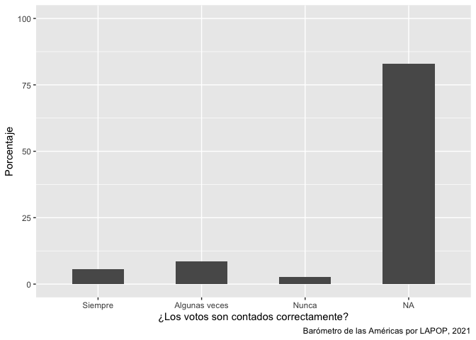
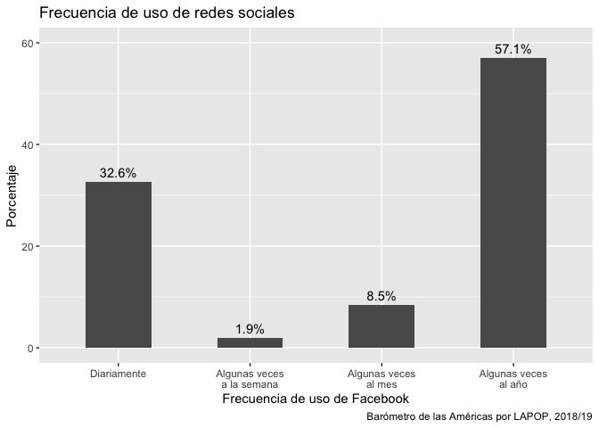
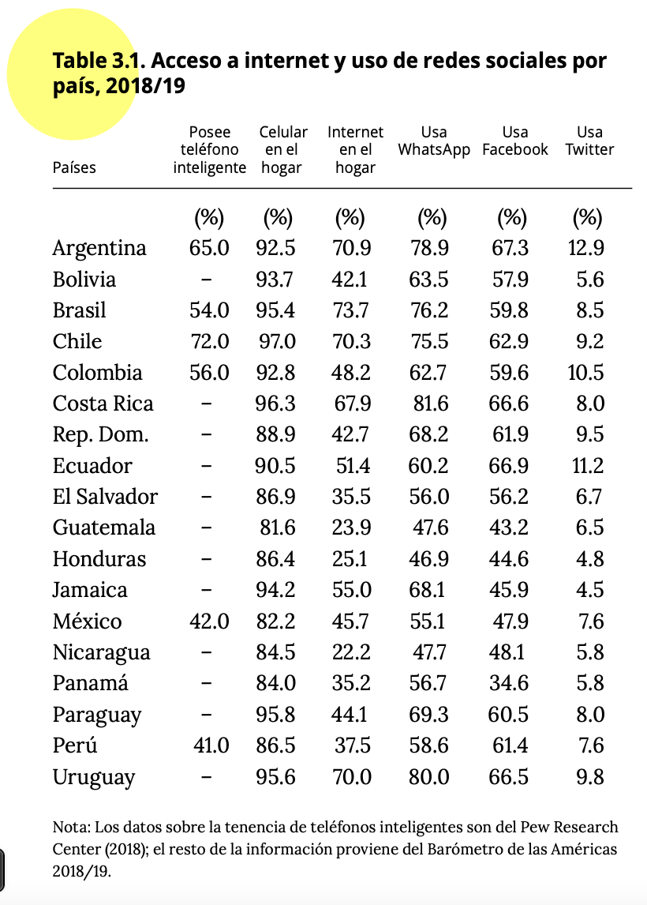
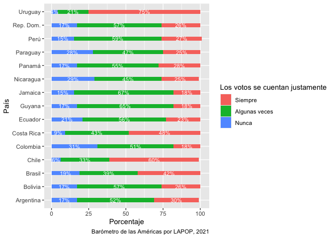

<style type="text/css">
.columns {display: flex;}
h1 {color: #3366CC;}
</style>

# Introducción

En este documento vamos a continuar usando el último informe regional "El pulso de la democracia", disponible [aquí](https://www.vanderbilt.edu/lapop/ab2018/2018-19_AmericasBarometer_Regional_Report_Spanish_W_03.27.20.pdf), donde se presentan los principales hallazgos de la ronda 2018/19 del Barómetro de las Américas.
Una de las secciones de este informe, reporta los datos sobre redes sociales y actitudes políticas.
En esta sección, se presentan datos sobre el uso de internet y el uso de redes sociales, en general y por país.
En este caso vamos a trabajar con la frecuencia de uso de las redes sociales.
En este documento vamos a analizar descriptivamente estas variables sobre frecuencia de uso de redes sociales, variables de tipo ordinal (o de factor, en el lenguaje de R).

# Sobre la base de datos

Los datos que vamos a usar deben citarse de la siguiente manera: Fuente: Barómetro de las Américas por el Proyecto de Opinión Pública de América Latina (LAPOP), wwww.LapopSurveys.org.
En este documento se carga nuevamente una base de datos recortada.
Para reproducir los resultados mostrados en esta sección se debe limpiar en Environment.

Esta base de datos se encuentra alojada en el repositorio "materials_edu" de la cuenta de LAPOP en GitHub.
Mediante la librería `rio` y el comando `import` se puede importar esta base de datos desde este repositorio.
Además, se seleccionan los datos de países con códigos menores o iguales a 35, es decir, se elimina las observaciones de Estados Unidos y Canadá.


```r
library(rio)
lapop18 <- import("https://raw.github.com/lapop-central/materials_edu/main/LAPOP_AB_Merge_2018_v1.0.sav")
lapop18 <- subset(lapop18, pais<=35)
```

También cargamos la base de datos de la ronda 2021.


```r
lapop21 = import("lapop21.RData")
lapop21 <- subset(lapop21, pais<=35)
```

# Describir y graficar las variables

En el documento sobre estadística descriptiva, que se puede ver [aquí](https://rpubs.com/arturo_maldonado/696770), se trabajó con variables nominales, con opciones de respuesta dicotómica (Sí/No).
En este documento se va a trabajar con variables ordinales politómicas.

# Los votos son contados correctamente

En esta sección se va a usar la variable COUNTFAIR1.
Los votos son contados correcta y justamente.
¿Diría usted que sucede siempre, algunas veces o nunca?
El gráfico 2.5 del reporte el Pulso de la Democracia, disponible [aquí](https://www.vanderbilt.edu/lapop/ab2021/2021_LAPOP_AmericasBarometer_Pulse_of_Democracy.pdf), presenta los resultados de esta variable por país.

{width="519"}

De la misma manera que con las variables nominales, estas variables tienen que ser declaradas como "factor" en nuevas variables.


```r
library(haven)
lapop21$countfair1r = as.factor(lapop21$countfair1)
```

Luego, estas variables se tienen que etiquetar y generar las tablas descriptivas básicas, con el comando `table`.


```r
levels(lapop21$countfair1r) <- c("Siempre", "Algunas veces", "Nunca")
table(lapop21$countfair1r)
```

```
## 
##       Siempre Algunas veces         Nunca 
##          3477          5235          1698
```

Para calcular las tablas con porcentajes, redondeados a un decimal, usamos `prop.table` y `round`.
Nuevamente, estos porcentajes no son exactamente iguales a los presentados en el reporte debido a que estos cálculos no incluyen el factor de expansión.


```r
round(prop.table(table(lapop21$countfair1r)), 3)*100
```

```
## 
##       Siempre Algunas veces         Nunca 
##          33.4          50.3          16.3
```

Como se mencionó en la sección anterior, se puede graficar esta variable usando el comando `barplot`.


```r
barplot(prop.table(table(lapop21$countfair1r))*100)
```

<!-- -->

Otra opción es elaborar el gráfico de barras usando la librería `ggplot`.
Una primera opción es trabajar directamente de la base de datos.
El siguiente código, sin embargo, muestra una gran barra del porcentaje de casos perdidos.
Esto se debe a que esta pregunta se realizó a la mitad de la muestra.
Se registra NA a la otra mitad a la que no se le hizo esta pregunta.


```r
library(ggplot2)
ggplot(data=lapop21, aes(x=countfair1r))+
  geom_bar(aes(y=..prop..*100, group=1), width=0.5)+
  labs(x="¿Los votos son contados correctamente?", y="Porcentaje", 
       caption="Barómetro de las Américas por LAPOP, 2021")+
  coord_cartesian(ylim=c(0, 100))
```

<!-- -->

Para evitar que el gráfico presente la barra de NAs, estas observaciones se tienen que filtrar antes de producir el gráfico.
Tal como indicamos en el módulo anterior, se filtra los NAs de la variable "countfair1r" con el comando `subset` y la especificación `!is.na`.


```r
ggplot(data=subset(lapop21, !is.na(countfair1r)), aes(x=countfair1r))+
  geom_bar(aes(y=..prop..*100, group=1), width=0.5)+
  labs(x="¿Los votos son contados correctamente?", y="Porcentaje", 
       caption="Barómetro de las Américas por LAPOP, 2021")+
  coord_cartesian(ylim=c(0, 60))
```

<!-- -->

Otra opción, que simplifica el código, es crear una tabla de frecuencias de esta variable con el comando `table` y `prop.table`.
Esta table se redondea a un decimal con el comando `round` y se guarda como un dataframe con el comando `as.data.frame` en un objeto "count".
Esta tabla almacena dos columnas, la primera llamada "Var1" con las etiquetas de la variable y la segunda llamada "Freq" con los porcentajes.


```r
count <- as.data.frame(round(prop.table(table(lapop21$countfair1r)), 3)*100)
count
```

<div data-pagedtable="false">
  <script data-pagedtable-source type="application/json">
{"columns":[{"label":["Var1"],"name":[1],"type":["fct"],"align":["left"]},{"label":["Freq"],"name":[2],"type":["dbl"],"align":["right"]}],"data":[{"1":"Siempre","2":"33.4"},{"1":"Algunas veces","2":"50.3"},{"1":"Nunca","2":"16.3"}],"options":{"columns":{"min":{},"max":[10]},"rows":{"min":[10],"max":[10]},"pages":{}}}
  </script>
</div>

Podemos usar esta tabla "count" para producir el gráfico de barras con el comando `ggplot`.
En la especificación `aes` se define que los valores de la columna "Var1" se presenten en el eje X y los valores de la columna a "Freq" en el eje Y.
Se define un gráfico de barras simple, usando el comando `geom_bar()`, donde internamente se define el ancho de la barra.
Con la especificación `labs` se define las etiquetas de ejes y el "caption".


```r
ggplot(data=count, aes(x=Var1, y=Freq))+
  geom_bar(stat="identity", width=0.5)+
  geom_text(aes(label=paste(Freq, "%", sep="")), color="white", 
            position=position_stack(vjust=0.5), size=3)+
  labs(x="Los votos se cuentan justamente", y="Porcentaje", 
       caption="Barómetro de las Américas por LAPOP, 2021")
```

<!-- -->

El gráfico 2.5 presenta una barra apilada con los datos por cada país.
Primero presentaremos el gráfico de barras apilado usando los datos de toda la ronda 2021 del Barómetro de las Américas, es decir de todos los países.
Para producir una barra apilada horizontal, se usará la variable "Freq" ahora en el eje X.
Se usará la opción `fill` para dividir esta barra por los valores de la variable "Var1".
Como en el eje Y no se mostrará una variable se define como `""`.
De la misma manera que se cambiaron las variables en los ejes, también se cambian las etiquetas en `labs`.
En esta especificación se cambia la etiqueta de la leyenda con `fill`.


```r
ggplot(data=count, aes(fill=Var1, x=Freq, y=""))+
  geom_bar(stat="identity", width=0.3)+
  geom_text(aes(label=paste(Freq, "%", sep="")), color="white", 
            position=position_stack(vjust=0.5), size=3)+
  labs(x="Porcentaje", y="", fill="Los votos se cuentan justamente",
       caption="Barómetro de las Américas por LAPOP, 2021")
```

<!-- -->

Para replicar el gráfico comparativo por país se requiere crear la tabla de contingencia entre la variable "countfair" y "pais".
Esta tabla cruzada se guarda en un objeto "count_pais".
Se debe notar que el dataframe que se crea crea una fila por cada valor de "countfair" en cada país.
De esta manera tenemos 3 opciones x 20 países = 60 filas.


```r
count_pais = as.data.frame(round(prop.table(table(lapop21$pais, lapop21$countfair1r), 1), 3)*100)
count_pais
```

<div data-pagedtable="false">
  <script data-pagedtable-source type="application/json">
{"columns":[{"label":["Var1"],"name":[1],"type":["fct"],"align":["left"]},{"label":["Var2"],"name":[2],"type":["fct"],"align":["left"]},{"label":["Freq"],"name":[3],"type":["dbl"],"align":["right"]}],"data":[{"1":"1","2":"Siempre","3":"NaN"},{"1":"2","2":"Siempre","3":"NaN"},{"1":"3","2":"Siempre","3":"NaN"},{"1":"4","2":"Siempre","3":"NaN"},{"1":"5","2":"Siempre","3":"26.2"},{"1":"6","2":"Siempre","3":"52.3"},{"1":"7","2":"Siempre","3":"27.6"},{"1":"8","2":"Siempre","3":"18.1"},{"1":"9","2":"Siempre","3":"21.5"},{"1":"10","2":"Siempre","3":"24.5"},{"1":"11","2":"Siempre","3":"25.1"},{"1":"12","2":"Siempre","3":"25.9"},{"1":"13","2":"Siempre","3":"64.1"},{"1":"14","2":"Siempre","3":"80.0"},{"1":"15","2":"Siempre","3":"48.1"},{"1":"17","2":"Siempre","3":"31.5"},{"1":"21","2":"Siempre","3":"25.2"},{"1":"22","2":"Siempre","3":"NaN"},{"1":"23","2":"Siempre","3":"17.9"},{"1":"24","2":"Siempre","3":"17.0"},{"1":"1","2":"Algunas veces","3":"NaN"},{"1":"2","2":"Algunas veces","3":"NaN"},{"1":"3","2":"Algunas veces","3":"NaN"},{"1":"4","2":"Algunas veces","3":"NaN"},{"1":"5","2":"Algunas veces","3":"49.4"},{"1":"6","2":"Algunas veces","3":"40.2"},{"1":"7","2":"Algunas veces","3":"57.1"},{"1":"8","2":"Algunas veces","3":"50.4"},{"1":"9","2":"Algunas veces","3":"59.1"},{"1":"10","2":"Algunas veces","3":"59.2"},{"1":"11","2":"Algunas veces","3":"61.1"},{"1":"12","2":"Algunas veces","3":"48.3"},{"1":"13","2":"Algunas veces","3":"30.1"},{"1":"14","2":"Algunas veces","3":"16.9"},{"1":"15","2":"Algunas veces","3":"35.7"},{"1":"17","2":"Algunas veces","3":"51.0"},{"1":"21","2":"Algunas veces","3":"60.1"},{"1":"22","2":"Algunas veces","3":"NaN"},{"1":"23","2":"Algunas veces","3":"67.9"},{"1":"24","2":"Algunas veces","3":"65.1"},{"1":"1","2":"Nunca","3":"NaN"},{"1":"2","2":"Nunca","3":"NaN"},{"1":"3","2":"Nunca","3":"NaN"},{"1":"4","2":"Nunca","3":"NaN"},{"1":"5","2":"Nunca","3":"24.4"},{"1":"6","2":"Nunca","3":"7.5"},{"1":"7","2":"Nunca","3":"15.4"},{"1":"8","2":"Nunca","3":"31.5"},{"1":"9","2":"Nunca","3":"19.4"},{"1":"10","2":"Nunca","3":"16.3"},{"1":"11","2":"Nunca","3":"13.8"},{"1":"12","2":"Nunca","3":"25.8"},{"1":"13","2":"Nunca","3":"5.8"},{"1":"14","2":"Nunca","3":"3.0"},{"1":"15","2":"Nunca","3":"16.1"},{"1":"17","2":"Nunca","3":"17.5"},{"1":"21","2":"Nunca","3":"14.7"},{"1":"22","2":"Nunca","3":"NaN"},{"1":"23","2":"Nunca","3":"14.2"},{"1":"24","2":"Nunca","3":"17.8"}],"options":{"columns":{"min":{},"max":[10]},"rows":{"min":[10],"max":[10]},"pages":{}}}
  </script>
</div>

En esta tabla se calculan los datos por cada valor de la variable "pais", incluso cuando no se tiene datos de la variable "countfair", debido a que la pregunta no se realizó en ese país.
Por este motivo se tienen que eliminar las filas de los países en los que no se recogió esta información.
Esto se hace con la especificación `[-c(filas),]`.
Luego se crea un vector con los nombres de los países.
Esta lista se repite 3 veces (15 países restantes x 3 opciones).
Este vector se agrega al dataframe en una columna "pais".


```r
count_pais = count_pais[-c(1:4,18,21:24,38,41:44,58),]
pais = c("Nicaragua","Costa Rica", "Panamá", "Colombia", "Ecuador", "Bolivia", "Perú",
        "Paraguay", "Chile", "Uruguay", "Brasil", "Argentina", "Rep. Dom.","Jamaica", "Guyana", "Nicaragua","Costa Rica", "Panamá", "Colombia", "Ecuador", "Bolivia", "Perú",
        "Paraguay", "Chile", "Uruguay", "Brasil", "Argentina", "Rep. Dom.","Jamaica", "Guyana","Nicaragua","Costa Rica", "Panamá", "Colombia", "Ecuador", "Bolivia", "Perú",
        "Paraguay", "Chile", "Uruguay", "Brasil", "Argentina", "Rep. Dom.","Jamaica", "Guyana")
count_pais$pais = pais
count_pais
```

<div data-pagedtable="false">
  <script data-pagedtable-source type="application/json">
{"columns":[{"label":[""],"name":["_rn_"],"type":[""],"align":["left"]},{"label":["Var1"],"name":[1],"type":["fct"],"align":["left"]},{"label":["Var2"],"name":[2],"type":["fct"],"align":["left"]},{"label":["Freq"],"name":[3],"type":["dbl"],"align":["right"]},{"label":["pais"],"name":[4],"type":["chr"],"align":["left"]}],"data":[{"1":"5","2":"Siempre","3":"26.2","4":"Nicaragua","_rn_":"5"},{"1":"6","2":"Siempre","3":"52.3","4":"Costa Rica","_rn_":"6"},{"1":"7","2":"Siempre","3":"27.6","4":"Panamá","_rn_":"7"},{"1":"8","2":"Siempre","3":"18.1","4":"Colombia","_rn_":"8"},{"1":"9","2":"Siempre","3":"21.5","4":"Ecuador","_rn_":"9"},{"1":"10","2":"Siempre","3":"24.5","4":"Bolivia","_rn_":"10"},{"1":"11","2":"Siempre","3":"25.1","4":"Perú","_rn_":"11"},{"1":"12","2":"Siempre","3":"25.9","4":"Paraguay","_rn_":"12"},{"1":"13","2":"Siempre","3":"64.1","4":"Chile","_rn_":"13"},{"1":"14","2":"Siempre","3":"80.0","4":"Uruguay","_rn_":"14"},{"1":"15","2":"Siempre","3":"48.1","4":"Brasil","_rn_":"15"},{"1":"17","2":"Siempre","3":"31.5","4":"Argentina","_rn_":"16"},{"1":"21","2":"Siempre","3":"25.2","4":"Rep. Dom.","_rn_":"17"},{"1":"23","2":"Siempre","3":"17.9","4":"Jamaica","_rn_":"19"},{"1":"24","2":"Siempre","3":"17.0","4":"Guyana","_rn_":"20"},{"1":"5","2":"Algunas veces","3":"49.4","4":"Nicaragua","_rn_":"25"},{"1":"6","2":"Algunas veces","3":"40.2","4":"Costa Rica","_rn_":"26"},{"1":"7","2":"Algunas veces","3":"57.1","4":"Panamá","_rn_":"27"},{"1":"8","2":"Algunas veces","3":"50.4","4":"Colombia","_rn_":"28"},{"1":"9","2":"Algunas veces","3":"59.1","4":"Ecuador","_rn_":"29"},{"1":"10","2":"Algunas veces","3":"59.2","4":"Bolivia","_rn_":"30"},{"1":"11","2":"Algunas veces","3":"61.1","4":"Perú","_rn_":"31"},{"1":"12","2":"Algunas veces","3":"48.3","4":"Paraguay","_rn_":"32"},{"1":"13","2":"Algunas veces","3":"30.1","4":"Chile","_rn_":"33"},{"1":"14","2":"Algunas veces","3":"16.9","4":"Uruguay","_rn_":"34"},{"1":"15","2":"Algunas veces","3":"35.7","4":"Brasil","_rn_":"35"},{"1":"17","2":"Algunas veces","3":"51.0","4":"Argentina","_rn_":"36"},{"1":"21","2":"Algunas veces","3":"60.1","4":"Rep. Dom.","_rn_":"37"},{"1":"23","2":"Algunas veces","3":"67.9","4":"Jamaica","_rn_":"39"},{"1":"24","2":"Algunas veces","3":"65.1","4":"Guyana","_rn_":"40"},{"1":"5","2":"Nunca","3":"24.4","4":"Nicaragua","_rn_":"45"},{"1":"6","2":"Nunca","3":"7.5","4":"Costa Rica","_rn_":"46"},{"1":"7","2":"Nunca","3":"15.4","4":"Panamá","_rn_":"47"},{"1":"8","2":"Nunca","3":"31.5","4":"Colombia","_rn_":"48"},{"1":"9","2":"Nunca","3":"19.4","4":"Ecuador","_rn_":"49"},{"1":"10","2":"Nunca","3":"16.3","4":"Bolivia","_rn_":"50"},{"1":"11","2":"Nunca","3":"13.8","4":"Perú","_rn_":"51"},{"1":"12","2":"Nunca","3":"25.8","4":"Paraguay","_rn_":"52"},{"1":"13","2":"Nunca","3":"5.8","4":"Chile","_rn_":"53"},{"1":"14","2":"Nunca","3":"3.0","4":"Uruguay","_rn_":"54"},{"1":"15","2":"Nunca","3":"16.1","4":"Brasil","_rn_":"55"},{"1":"17","2":"Nunca","3":"17.5","4":"Argentina","_rn_":"56"},{"1":"21","2":"Nunca","3":"14.7","4":"Rep. Dom.","_rn_":"57"},{"1":"23","2":"Nunca","3":"14.2","4":"Jamaica","_rn_":"59"},{"1":"24","2":"Nunca","3":"17.8","4":"Guyana","_rn_":"60"}],"options":{"columns":{"min":{},"max":[10]},"rows":{"min":[10],"max":[10]},"pages":{}}}
  </script>
</div>

Con este dataframe "count_pais" ya tenemos los elementos para replicar el gráfico de barras apiladas.
En la especificación `aes` se define que en el eje X se grafiquen los porcentajes, en el eje Y los países y cada barra se divida por la columna Var2.


```r
ggplot(data=count_pais, aes(x=Freq, y=pais, fill=Var2))+
  geom_bar(stat="identity", width=0.3)+
  geom_text(aes(label=paste(Freq, "%", sep="")), color="white", 
            position=position_stack(vjust=0.5), size=2)+
  labs(x="Porcentaje", y="País", fill="Los votos se cuentan justamente",
       caption="Barómetro de las Américas por LAPOP, 2021")
```

<!-- -->

# Frecuencia de uso de redes sociales

En la ronda 2018/19 se evaluó el uso de redes sociales.
De esta manera, se analizaron las variables SMEDIA2.
¿Con qué frecuencia ve contenido en Facebook?,
SMEDIA5.¿Con qué frecuencia ve contenido en Twitter?
y SMEDIA8.¿Con qué frecuencia usa Whatsapp?
Estas variables tienen como opciones de respuesta:

1.  Diariamente
2.  Algunas veces a la semana
3.  Algunas veces al mes
4.  Algunas veces al año
5.  Nunca

De la misma manera que con las variables nominales, estas variables tienen que ser declaradas como "factor" en nuevas variables.


```r
lapop18$smedia2r = as.factor(lapop18$smedia2)
lapop18$smedia5r = as.factor(lapop18$smedia5)
lapop18$smedia8r = as.factor(lapop18$smedia8)
```

La nota a pie 15 del reporte indica que "los entrevistados que reportan nunca ver contenido en Facebook y Twitter, y quienes indican que nunca usan Whatsapp, son considerados como no usuarios de estas redes sociales" (p. 64).
Por este motivo, el gráfico 3.3 de frecuencia de uso de redes sociales (pag. 57) solo incluyen las categorías "Diariamente", "Algunas veces a la semana", "Algunas veces al mes" y "Algunas veces al año".
Se excluya la categoría "Nunca".

{width="398"}

En las nuevas variables vamos a declarar el valor 5, correspondiente a "nunca", como "NA", es decir, como valor perdido en R.


```r
library(car)
lapop18$smedia2r = car::recode(lapop18$smedia2r, "5=NA")
lapop18$smedia5r = car::recode(lapop18$smedia5r, "5=NA")
lapop18$smedia8r = car::recode(lapop18$smedia8r, "5=NA")
```

Luego, estas variables se tienen que etiquetar y generar las tablas descriptivas básicas, con el comando `table`.


```r
levels(lapop18$smedia2r) <- c("Diariamente", "Algunas veces a la semana", 
                            "Algunas veces al mes", "Algunas veces al año")
levels(lapop18$smedia5r) <- c("Diariamente", "Algunas veces a la semana", 
                            "Algunas veces al mes", "Algunas veces al año")
levels(lapop18$smedia8r) <- c("Diariamente", "Algunas veces a la semana", 
                            "Algunas veces al mes", "Algunas veces al año")
table(lapop18$smedia2r)
```

```
## 
##               Diariamente Algunas veces a la semana      Algunas veces al mes 
##                      8633                      4927                      1286 
##      Algunas veces al año 
##                       282
```

```r
table(lapop18$smedia5r)
```

```
## 
##               Diariamente Algunas veces a la semana      Algunas veces al mes 
##                       795                       728                       422 
##      Algunas veces al año 
##                       193
```

```r
table(lapop18$smedia8r)
```

```
## 
##               Diariamente Algunas veces a la semana      Algunas veces al mes 
##                     14151                      2646                       495 
##      Algunas veces al año 
##                        50
```

Para calcular las tablas con porcentajes, redondeados a un decimal, usamos `prop.table` y `round`.
Nuevamente, estos porcentajes no son exactamente iguales a los presentados en el reporte debido a que estos cálculos no incluyen el factor de expansión.


```r
round(prop.table(table(lapop18$smedia2r)), 3)*100
```

```
## 
##               Diariamente Algunas veces a la semana      Algunas veces al mes 
##                      57.1                      32.6                       8.5 
##      Algunas veces al año 
##                       1.9
```

```r
round(prop.table(table(lapop18$smedia5r)), 3)*100
```

```
## 
##               Diariamente Algunas veces a la semana      Algunas veces al mes 
##                      37.2                      34.1                      19.7 
##      Algunas veces al año 
##                       9.0
```

```r
round(prop.table(table(lapop18$smedia8r)), 3)*100
```

```
## 
##               Diariamente Algunas veces a la semana      Algunas veces al mes 
##                      81.6                      15.3                       2.9 
##      Algunas veces al año 
##                       0.3
```

Para presentar todos los datos en una tabla conjunta, se guarda la tabla de cada red social en un nuevo objeto de R (llamado como cada red social).
Luego, todas estas tablas parciales, que contienen las mismas opciones de respuesta, se unen como filas con el comando `rbind`.
Esta nueva tabla conjunta se guarda como un nuevo dataframe "tabla".


```r
Facebook <- round(prop.table(table(lapop18$smedia2r)), 3)*100
Twitter <- round(prop.table(table(lapop18$smedia5r)), 3)*100
Whatsapp <- round(prop.table(table(lapop18$smedia8r)), 3)*100
tabla <- as.data.frame(rbind(Facebook, Twitter, Whatsapp))
tabla
```

<div data-pagedtable="false">
  <script data-pagedtable-source type="application/json">
{"columns":[{"label":[""],"name":["_rn_"],"type":[""],"align":["left"]},{"label":["Diariamente"],"name":[1],"type":["dbl"],"align":["right"]},{"label":["Algunas veces a la semana"],"name":[2],"type":["dbl"],"align":["right"]},{"label":["Algunas veces al mes"],"name":[3],"type":["dbl"],"align":["right"]},{"label":["Algunas veces al año"],"name":[4],"type":["dbl"],"align":["right"]}],"data":[{"1":"57.1","2":"32.6","3":"8.5","4":"1.9","_rn_":"Facebook"},{"1":"37.2","2":"34.1","3":"19.7","4":"9.0","_rn_":"Twitter"},{"1":"81.6","2":"15.3","3":"2.9","4":"0.3","_rn_":"Whatsapp"}],"options":{"columns":{"min":{},"max":[10]},"rows":{"min":[10],"max":[10]},"pages":{}}}
  </script>
</div>

Para tener una mejor presentación de la tabla, se puede usar el comando `kable` del paquete `knitr` o el comando `formattable` del paquete del mismo nombre.


```r
library(knitr)
kable(head(tabla), format="markdown", digits=1)
```


|         | Diariamente| Algunas veces a la semana| Algunas veces al mes| Algunas veces al año|
|:--------|-----------:|-------------------------:|--------------------:|--------------------:|
|Facebook |        57.1|                      32.6|                  8.5|                  1.9|
|Twitter  |        37.2|                      34.1|                 19.7|                  9.0|
|Whatsapp |        81.6|                      15.3|                  2.9|                  0.3|

```r
library(formattable)
formattable(tabla)
```


<table class="table table-condensed">
 <thead>
  <tr>
   <th style="text-align:left;">   </th>
   <th style="text-align:right;"> Diariamente </th>
   <th style="text-align:right;"> Algunas veces a la semana </th>
   <th style="text-align:right;"> Algunas veces al mes </th>
   <th style="text-align:right;"> Algunas veces al año </th>
  </tr>
 </thead>
<tbody>
  <tr>
   <td style="text-align:left;"> Facebook </td>
   <td style="text-align:right;"> 57.1 </td>
   <td style="text-align:right;"> 32.6 </td>
   <td style="text-align:right;"> 8.5 </td>
   <td style="text-align:right;"> 1.9 </td>
  </tr>
  <tr>
   <td style="text-align:left;"> Twitter </td>
   <td style="text-align:right;"> 37.2 </td>
   <td style="text-align:right;"> 34.1 </td>
   <td style="text-align:right;"> 19.7 </td>
   <td style="text-align:right;"> 9.0 </td>
  </tr>
  <tr>
   <td style="text-align:left;"> Whatsapp </td>
   <td style="text-align:right;"> 81.6 </td>
   <td style="text-align:right;"> 15.3 </td>
   <td style="text-align:right;"> 2.9 </td>
   <td style="text-align:right;"> 0.3 </td>
  </tr>
</tbody>
</table>

Para graficar esta variable no vamos a seguir el mismo procedimiento que en el módulo anterior.
En este módulo vamos a trabajar directamente desde la tabla creada con los porcentajes de las tres redes sociales.
Esta tabla tiene a cada red social en las filas y las opciones de respuesta en las columnas.
Para poder graficar estos datos se requiere que las redes sociales estén en las columnas y las opciones de respuesta en las filas, por lo que en primer lugar vamos a transponer esta tabla.
Este procedimiento lo hacemos usando la librería `data.table` y el comando `transpose`.
Estos datos transpuestos los guardamos en una nueva tabla "tabla_tr".

Este comando transpone los datos, pero deja sin nombrar las filas y columnas.
Primero se nombran las columnas con el comando `colnames` usando los nombres de las filas de "tabla".
Luego se nombran las filas con el comando `rownames` usando los nombres de las columnas de "tabla".

Finalmente, requerimos una columna dentro de "tabla_tr" que incluya las etiquetas de respuesta de las preguntas de smedia.
Estas etiquetas están como nombres de filas.
Para incluirlas como una variable más, se agrega una variable "tabla_tr\$lab" al que se le asigna los nombres de las filas con `row.names`.


```r
library(data.table)
tabla_tr = data.frame(t(tabla[]))
colnames(tabla_tr) = rownames(tabla)
rownames(tabla_tr) = colnames(tabla)
tabla_tr$lab <- rownames(tabla_tr)
tabla_tr
```

<div data-pagedtable="false">
  <script data-pagedtable-source type="application/json">
{"columns":[{"label":[""],"name":["_rn_"],"type":[""],"align":["left"]},{"label":["Facebook"],"name":[1],"type":["dbl"],"align":["right"]},{"label":["Twitter"],"name":[2],"type":["dbl"],"align":["right"]},{"label":["Whatsapp"],"name":[3],"type":["dbl"],"align":["right"]},{"label":["lab"],"name":[4],"type":["chr"],"align":["left"]}],"data":[{"1":"57.1","2":"37.2","3":"81.6","4":"Diariamente","_rn_":"Diariamente"},{"1":"32.6","2":"34.1","3":"15.3","4":"Algunas veces a la semana","_rn_":"Algunas veces a la semana"},{"1":"8.5","2":"19.7","3":"2.9","4":"Algunas veces al mes","_rn_":"Algunas veces al mes"},{"1":"1.9","2":"9.0","3":"0.3","4":"Algunas veces al año","_rn_":"Algunas veces al año"}],"options":{"columns":{"min":{},"max":[10]},"rows":{"min":[10],"max":[10]},"pages":{}}}
  </script>
</div>

En segundo lugar, se activa la librería `ggplot2` para graficar los datos guardados en "tabla_tr" con el comando `ggplot`.
Dentro de este comando se especifica que se trabajará con el dataframe "tabla_tr" (no con lapop18) y se especifica la "estética", es decir que en el eje X no se incluirá una variable, que en el eje Y se incluirá los datos de "Facebook" del dataframe "tabla_tr" y que se dividirá por categorías de la variable guardadas en "lab".
Luego se añade la capa `geom_bar` para indicar que se graficará en barras de ancho (`width`) 1 y que la barra replicará lo especificado en la estética (`stat="identity"`).
Con `geom_text` se agrega las etiquetas de los datos, con el símbolo de porcentaje, y se especifica la posición del texto con `position=position_stack(…)` y el tamaño con `size=3`.
Con `coord_polar` se transforma las barras en un gráfico circular de sectores.
Finalmente, se define el "tema" con `theme_void` indicando un fondo blanco y se modifica la etiqueta de la leyenda con `scale_fill_discrete`.


```r
library(ggplot2)
ggplot(data=tabla_tr, aes(x="", y=Facebook, fill=lab))+
  geom_bar(width=1, stat="identity")+
  geom_text(aes(label=paste(Facebook, "%", sep="")), color="white", 
            position=position_stack(vjust=0.5), size=3)+
  coord_polar("y", start=0)+
  theme_void()+
  scale_fill_discrete(name="Frecuencia de uso de Facebook")
```

<!-- -->

En el gráfico 3.3 del reporte "El Pulso de la Democracia" se presenta un gráfico circular tipo "donna".
Para reproducir exactamente este tipo de gráfico, se tiene que acomodar unos detalles de la sintaxis anterior.
Se establece "x=2" en la "estética" y se establece límites en el eje X, entre 0.5 y 2.5, para que cuando se rote el eje, se cree el "hueco" dentro del círculo.


```r
ggplot(data=tabla_tr, aes(x=2, y=Facebook, fill=lab))+
  geom_bar(stat="identity")+
  geom_text(aes(label=paste(Facebook, "%", sep="")), color="white", 
            position=position_stack(vjust=0.5), size=3)+
  coord_polar("y")+
  theme_void()+
  scale_fill_discrete(name="Frecuencia de uso de Facebook")+
   labs(title="Frecuencia con la que ve contenido en Facebbok", 
        caption="Barómetro de las Américas por LAPOP, 2018/19")+
  xlim(0.5, 2.5)
```

<!-- -->

Para replicar el gráfico de barras, se hacen algunas modificaciones en el código anterior.
Por ejemplo, en la "estética", ahora se indica que en el eje X va la variable "smedia2r" y en el eje Y el porcentaje "per".
Se elimina, además, la especificación de las coordenadas polares.
Se agrega un título al gráfico, etiquetas a los ejes y un caption con la especificación `labs`.
Finalmente, se define el eje Y entre 0 y 60 con la especificación `coord_cartesian`.
Un tema importante es que este gráfico también se puede guardar en un objeto en R, que llamaremos "graf1".


```r
graf1 <- ggplot(tabla_tr, aes(x=lab, y=Facebook))+
  geom_bar(stat="identity",  width=0.5)+
  geom_text(aes(label=paste(Facebook, "%", sep="")), color="black", vjust=-0.5)+
  labs(title="Frecuencia de uso de redes sociales", x="Frecuencia de uso de Facebook", y="Porcentaje", caption="Barómetro de las Américas por LAPOP, 2018/19")+
  coord_cartesian(ylim=c(0, 60))
graf1
```

<!-- -->

Guardar un gráfico en un objeto nos permite luego incorporar más capas o mejoras en el gráfico.
El gráfico anterior, por ejemplo, tiene las etiquetas de "Frecuencia de uso" en una sola línea, por lo se podrían trasponer.
Para mejorar esta visualización se puede inclinar estas etiquetas, pero si se quisiera mantener la horizontalidad para facilitar la lectura, lo que se puede hacer es separar las etiquetas largas en dos o más líneas.
Esto se puede hacer, por ejemplo, creando un vector con las nuevas etiquetas.
Las etiquetas largas se pueden partir en líneas mediante la inclusión de `\n` entre los textos que se quiera separar.
Luego, al objeto "graf1" se le puede agregar una nueva capa para reemplazar las etiquetas con las nuevas divididas en líneas.
Esto se hace con la especificación `scale_x_discrete` donde se indica que las etiquetas usen el vector creado.


```r
etiq <- c("Diariamente", "Algunas veces\na la semana", "Algunas veces\nal mes", 
          "Algunas veces\nal año")
graf1 +
  scale_x_discrete(labels=etiq)
```

<!-- -->

De esta manera el gráfico queda más legible.
Hasta aquí se ha replicado las tablas y gráficos que se usaron con las variables nominales, ahora usando variables ordinales.
Si se quiere replicar el gráfico circular de las otras redes sociales, se puede ejecutar el mismo código, pero cambiando la columna de la red social.
Para Twitter, por ejemplo, se tendría.


```r
graf2 <- ggplot(data=tabla_tr, aes(x=2, y=Twitter, fill=lab))+
  geom_bar(stat="identity")+
  geom_text(aes(label=paste(Twitter, "%", sep="")), color="white", 
            position=position_stack(vjust=0.5), size=3)+
  coord_polar("y")+
  theme_void()+
  scale_fill_discrete(name="Frecuencia de uso de Twitter")+
   labs(title="Frecuencia con la que ve contenido en Twitter", 
        caption="Barómetro de las Américas por LAPOP, 2018/19")+
  xlim(0.5, 2.5)
graf2
```

<!-- -->

## Cruce de variables

En la tabla 3.1 (pag. 55) del reporte "El pulso de la democracia" se presenta los porcentajes de uso de las redes sociales por país.
Luego, en la página 56 se presenta un cuadro con el porcentaje de usuarios de redes sociales por características sociodemográficas, por ejemplo, urbano/rural, hombre, edad promedio, riqueza promedio y años de estudio.

{width="481"}

Empezaremos replicando los datos generales del uso de redes sociales que se reporta en el gráfico 3.1.
Para replicar esta tabla primero se tiene que definir la variable "pais" y las variables de uso de redes sociales (smedia1, smedia4 y smedia7).


```r
lapop18$smedia1r = as.factor(lapop18$smedia1)
lapop18$smedia4r = as.factor(lapop18$smedia4)
lapop18$smedia7r = as.factor(lapop18$smedia7)
levels(lapop18$smedia1r) <- c("Sí", "No")
levels(lapop18$smedia4r) <- c("Sí", "No")
levels(lapop18$smedia7r) <- c("Sí", "No")
lapop18$pais = as.factor(lapop18$pais)
levels(lapop18$pais) <- c("México", "Guatemala", "El Salvador", "Honduras",
                        "Nicaragua","Costa Rica", "Panamá", "Colombia", 
                        "Ecuador", "Bolivia", "Perú", "Paraguay", 
                        "Chile", "Uruguay", "Brasil", "Argentina", 
                        "Rep. Dom.", "Jamaica")
table(lapop18$pais) #País
```

```
## 
##      México   Guatemala El Salvador    Honduras   Nicaragua  Costa Rica 
##        1580        1596        1511        1560        1547        1501 
##      Panamá    Colombia     Ecuador     Bolivia        Perú    Paraguay 
##        1559        1663        1533        1682        1521        1515 
##       Chile     Uruguay      Brasil   Argentina   Rep. Dom.     Jamaica 
##        1638        1581        1498        1528        1516        1513
```

```r
table(lapop18$smedia1r) #Facebook
```

```
## 
##    Sí    No 
## 15389 11573
```

Sin embargo, la variable "usuario" de cada red social se calcula como condición de dos variables, como se vio en el documento sobre manejo de datos, con el siguiente código.


```r
lapop18$fb_user <- ifelse(lapop18$smedia1==1 & lapop18$smedia2<=4, 1, 0)
lapop18$tw_user <- ifelse(lapop18$smedia4==1 & lapop18$smedia5<=4, 1, 0)
lapop18$wa_user <- ifelse(lapop18$smedia7==1 & lapop18$smedia8<=4, 1, 0)
```

Esta variables son graficadas en el reporte en el Gráfico 3.1.
Para reproducir estos datos, se puede describir estas variables.


```r
prop.table(table(lapop18$fb_user))*100
```

```
## 
##       0       1 
## 43.8289 56.1711
```

```r
prop.table(table(lapop18$tw_user))*100
```

```
## 
##         0         1 
## 92.056769  7.943231
```

```r
prop.table(table(lapop18$wa_user))*100
```

```
## 
##        0        1 
## 35.76561 64.23439
```

Como en gráficos anteriores, con estos datos se puede crear un dataframe que se utilizaría para hacer los gráficos circulares mostrados en el reporte.

Para replicar el cuadro de uso de redes sociales por país, primero, se crean las tablas bivariadas con el porcentaje de los que usan y el porcentaje de los que no usan cada red social en cada país.
Estas tablas se guardan en objetos de R.
Luego se unen estos objetos usando los comandos `cbind` para juntar las columnas y `as.data.frame` para unir las tablas como un dataframe.
Esta tabla presenta también los porcentajes de los que No usan estas redes sociales.
Para presentar una tabla que incluya solo a los que sí usan las redes sociales, se eliminan estas columnas, usando la especificación `[, c(-1,-3,-5)]`, que indica que se quiere eliminar las columnas 1, 3 y 5.Finalmente, se cambia el nombre de las columnas del dataframe.


```r
fbpais <- round(prop.table(table(lapop18$pais, lapop18$fb_user), 1), 3)*100
twpais <- round(prop.table(table(lapop18$pais, lapop18$tw_user), 1), 3)*100
whpais <- round(prop.table(table(lapop18$pais, lapop18$wa_user), 1), 3)*100
tablapais <- as.data.frame(cbind(fbpais, twpais, whpais))
tablapais <- tablapais[, c(-1,-3,-5)]
varnames <- c("Usa Facebook", "Usa Twitter", "Usa Whatsapp")
colnames(tablapais) <- varnames
tablapais
```

<div data-pagedtable="false">
  <script data-pagedtable-source type="application/json">
{"columns":[{"label":[""],"name":["_rn_"],"type":[""],"align":["left"]},{"label":["Usa Facebook"],"name":[1],"type":["dbl"],"align":["right"]},{"label":["Usa Twitter"],"name":[2],"type":["dbl"],"align":["right"]},{"label":["Usa Whatsapp"],"name":[3],"type":["dbl"],"align":["right"]}],"data":[{"1":"47.9","2":"7.6","3":"55.1","_rn_":"México"},{"1":"43.2","2":"6.5","3":"47.6","_rn_":"Guatemala"},{"1":"56.2","2":"6.7","3":"56.0","_rn_":"El Salvador"},{"1":"44.6","2":"4.8","3":"46.9","_rn_":"Honduras"},{"1":"48.1","2":"5.8","3":"47.7","_rn_":"Nicaragua"},{"1":"66.6","2":"8.0","3":"81.6","_rn_":"Costa Rica"},{"1":"34.6","2":"5.8","3":"56.7","_rn_":"Panamá"},{"1":"60.0","2":"10.7","3":"63.5","_rn_":"Colombia"},{"1":"66.9","2":"11.2","3":"60.2","_rn_":"Ecuador"},{"1":"57.9","2":"5.6","3":"63.5","_rn_":"Bolivia"},{"1":"61.4","2":"7.6","3":"58.6","_rn_":"Perú"},{"1":"60.5","2":"8.0","3":"69.2","_rn_":"Paraguay"},{"1":"62.9","2":"9.2","3":"75.5","_rn_":"Chile"},{"1":"66.5","2":"9.8","3":"80.0","_rn_":"Uruguay"},{"1":"59.2","2":"7.9","3":"74.9","_rn_":"Brasil"},{"1":"67.3","2":"12.9","3":"78.9","_rn_":"Argentina"},{"1":"61.9","2":"9.5","3":"68.2","_rn_":"Rep. Dom."},{"1":"45.9","2":"4.5","3":"68.1","_rn_":"Jamaica"}],"options":{"columns":{"min":{},"max":[10]},"rows":{"min":[10],"max":[10]},"pages":{}}}
  </script>
</div>

Para tener una mejor presentación de la tabla se tienen dos alternativas: la primera con la librería `knitr` y la otra con la librería `formattable`.


```r
library(knitr)
kable(head(tablapais), format="markdown", digits=1)
```


|            | Usa Facebook| Usa Twitter| Usa Whatsapp|
|:-----------|------------:|-----------:|------------:|
|México      |         47.9|         7.6|         55.1|
|Guatemala   |         43.2|         6.5|         47.6|
|El Salvador |         56.2|         6.7|         56.0|
|Honduras    |         44.6|         4.8|         46.9|
|Nicaragua   |         48.1|         5.8|         47.7|
|Costa Rica  |         66.6|         8.0|         81.6|

```r
library(formattable)
formattable(tablapais)
```


<table class="table table-condensed">
 <thead>
  <tr>
   <th style="text-align:left;">   </th>
   <th style="text-align:right;"> Usa Facebook </th>
   <th style="text-align:right;"> Usa Twitter </th>
   <th style="text-align:right;"> Usa Whatsapp </th>
  </tr>
 </thead>
<tbody>
  <tr>
   <td style="text-align:left;"> México </td>
   <td style="text-align:right;"> 47.9 </td>
   <td style="text-align:right;"> 7.6 </td>
   <td style="text-align:right;"> 55.1 </td>
  </tr>
  <tr>
   <td style="text-align:left;"> Guatemala </td>
   <td style="text-align:right;"> 43.2 </td>
   <td style="text-align:right;"> 6.5 </td>
   <td style="text-align:right;"> 47.6 </td>
  </tr>
  <tr>
   <td style="text-align:left;"> El Salvador </td>
   <td style="text-align:right;"> 56.2 </td>
   <td style="text-align:right;"> 6.7 </td>
   <td style="text-align:right;"> 56.0 </td>
  </tr>
  <tr>
   <td style="text-align:left;"> Honduras </td>
   <td style="text-align:right;"> 44.6 </td>
   <td style="text-align:right;"> 4.8 </td>
   <td style="text-align:right;"> 46.9 </td>
  </tr>
  <tr>
   <td style="text-align:left;"> Nicaragua </td>
   <td style="text-align:right;"> 48.1 </td>
   <td style="text-align:right;"> 5.8 </td>
   <td style="text-align:right;"> 47.7 </td>
  </tr>
  <tr>
   <td style="text-align:left;"> Costa Rica </td>
   <td style="text-align:right;"> 66.6 </td>
   <td style="text-align:right;"> 8.0 </td>
   <td style="text-align:right;"> 81.6 </td>
  </tr>
  <tr>
   <td style="text-align:left;"> Panamá </td>
   <td style="text-align:right;"> 34.6 </td>
   <td style="text-align:right;"> 5.8 </td>
   <td style="text-align:right;"> 56.7 </td>
  </tr>
  <tr>
   <td style="text-align:left;"> Colombia </td>
   <td style="text-align:right;"> 60.0 </td>
   <td style="text-align:right;"> 10.7 </td>
   <td style="text-align:right;"> 63.5 </td>
  </tr>
  <tr>
   <td style="text-align:left;"> Ecuador </td>
   <td style="text-align:right;"> 66.9 </td>
   <td style="text-align:right;"> 11.2 </td>
   <td style="text-align:right;"> 60.2 </td>
  </tr>
  <tr>
   <td style="text-align:left;"> Bolivia </td>
   <td style="text-align:right;"> 57.9 </td>
   <td style="text-align:right;"> 5.6 </td>
   <td style="text-align:right;"> 63.5 </td>
  </tr>
  <tr>
   <td style="text-align:left;"> Perú </td>
   <td style="text-align:right;"> 61.4 </td>
   <td style="text-align:right;"> 7.6 </td>
   <td style="text-align:right;"> 58.6 </td>
  </tr>
  <tr>
   <td style="text-align:left;"> Paraguay </td>
   <td style="text-align:right;"> 60.5 </td>
   <td style="text-align:right;"> 8.0 </td>
   <td style="text-align:right;"> 69.2 </td>
  </tr>
  <tr>
   <td style="text-align:left;"> Chile </td>
   <td style="text-align:right;"> 62.9 </td>
   <td style="text-align:right;"> 9.2 </td>
   <td style="text-align:right;"> 75.5 </td>
  </tr>
  <tr>
   <td style="text-align:left;"> Uruguay </td>
   <td style="text-align:right;"> 66.5 </td>
   <td style="text-align:right;"> 9.8 </td>
   <td style="text-align:right;"> 80.0 </td>
  </tr>
  <tr>
   <td style="text-align:left;"> Brasil </td>
   <td style="text-align:right;"> 59.2 </td>
   <td style="text-align:right;"> 7.9 </td>
   <td style="text-align:right;"> 74.9 </td>
  </tr>
  <tr>
   <td style="text-align:left;"> Argentina </td>
   <td style="text-align:right;"> 67.3 </td>
   <td style="text-align:right;"> 12.9 </td>
   <td style="text-align:right;"> 78.9 </td>
  </tr>
  <tr>
   <td style="text-align:left;"> Rep. Dom. </td>
   <td style="text-align:right;"> 61.9 </td>
   <td style="text-align:right;"> 9.5 </td>
   <td style="text-align:right;"> 68.2 </td>
  </tr>
  <tr>
   <td style="text-align:left;"> Jamaica </td>
   <td style="text-align:right;"> 45.9 </td>
   <td style="text-align:right;"> 4.5 </td>
   <td style="text-align:right;"> 68.1 </td>
  </tr>
</tbody>
</table>

## Cruce con variables sociodemográficas

En la página 56 del reporte "El pulso de la democracia" se presenta los resultados del cruce entre las variables uso de redes sociales y variables sociodemográficas como urbano/rural, sexo, edad, riqueza y años de educación.

{width="663"}

La variable "q1" registra el género del entrevistado.
Esta variable está codificada de la siguiente manera:

1.  Hombre
2.  Mujer

Para construir una variable "dummy" llamada "hombre", de tal manera que hombre sea 1 y mujer sea 0, una forma de hacerlo es de manera algebraica (2-variable q1).
De esta manera, ahora los hombres mantiene el valor 1 (2-1) y las mujeres pasar a ser 0 (2-2).
En este caso, la nueva variable "hombre" se crea como una una variable numérica.
Vamos a mantener a la variable como "num" para, más abajo, poder calcular la media de esta variable (cosa que no se puede hacer de una variable declarada como factor).


```r
lapop18$hombre <- 2-lapop18$q1
table(lapop18$hombre)
```

```
## 
##     0     1 
## 14084 13943
```

La variable urbano/rural se llama "ur" en la base de datos y está codificada de la siguiente manera:

1.  Urbano
2.  Rural

De la misma manera que con género, se usa la fórmula 2- variable ur, pero esta variable sí se convierte en factor y se etiqueta.


```r
lapop18$urban <- 2-lapop18$ur
lapop18$urban = as.factor(lapop18$urban)
levels(lapop18$urban) <- c("Rural", "Urbano")
table(lapop18$urban)
```

```
## 
##  Rural Urbano 
##   8089  19953
```

Se presentará las tablas cruzadas del uso de redes sociales por alguno de las variable sociodemográficas, para entender mejor cómo se construye la tabla general.
Por ejemplo, el reporte muestra en la Tabla 3.2, luego de la columna de población general, las columnas para usuarios y no usuarios de Whatsapp (variable "wa_user") y en las filas, la primera corresponde a urbano (variable "urban", donde 0 es rural y 1 urbano).
Se presenta que entre los usuarios de Whatsapp, el 76.7% son urbanos y entre los no usuarios, el 62% son urbanos.
Estos datos se generan con el comando `table` que permite hacer una tabla de contingencia de 2 variables.
En este caso se tiene que notar que cada variable tiene un título.
De esta manera el comando es `table(título1 = var1, título2 = var2)`.
Luego, se usa el comando `prop.table` para que no se muestre las observaciones, sino los porcentajes.
Este comando permite calcular los porcentajes sobre el total (la opción por defecto), sobre las filas y sobre las columnas.
Para calcular sobre las columnas se debe especificar `prop.table(table(...), 2)`.
Si se quisiera el porcentaje sobre las filas, el código sería `prop.table(table(...), 1)`.
Esta tabla se pueden guardar como un dataframe con el comando `as.data.frame` en un nuevo objeto "t1".


```r
t1 <- as.data.frame(round(prop.table(table(Urbano = lapop18$urban, Usuario = lapop18$wa_user), 2)*100, 1))
t1
```

<div data-pagedtable="false">
  <script data-pagedtable-source type="application/json">
{"columns":[{"label":["Urbano"],"name":[1],"type":["fct"],"align":["left"]},{"label":["Usuario"],"name":[2],"type":["fct"],"align":["left"]},{"label":["Freq"],"name":[3],"type":["dbl"],"align":["right"]}],"data":[{"1":"Rural","2":"0","3":"37.9"},{"1":"Urbano","2":"0","3":"62.1"},{"1":"Rural","2":"1","3":"23.3"},{"1":"Urbano","2":"1","3":"76.7"}],"options":{"columns":{"min":{},"max":[10]},"rows":{"min":[10],"max":[10]},"pages":{}}}
  </script>
</div>

La filas correspondientes a "Urbano" de esta tabla reproducen los datos de la Tabla 3.2: 62.1% son urbanos entre los no usuarios de Whatsapp y 76.7% son urbanos entre los usuarios.

Ahora se presentará la tabla entre usuarios de Facebook (variable "fb_user") y hombre (variable "hombre"), pero presentando solo los porcentajes usados en la tabla y ahora usando el estilo de código del Tidyverse, usando el operador "pipe".
Lo primero es definir la variable "fb_user" como un factor y etiquetarla.
Luego, se usa el comando `subset` para filtrar los casos perdidos en la variable "fb_user".
Luego se pide que los resultados se agrupen por categorías de la variable "fb_user".
Con el comando `summarise` se guarda en la columna "hombre" el promedio de la variable "hombre", con el comando `mean` que incluye la especificación `na.rm=T` para no incluir en el cálculo los valores perdidos.
En este caso se aprovecha que la variable "hombre" es una variable dummy, de tal manera que el promedio corresponde a la proporción de hombres.


```r
lapop18$fb_user = as.factor(lapop18$fb_user)
levels(lapop18$fb_user) <- c("No usuario", "Usuario")
tabla1 <- subset(lapop18, !is.na(fb_user)) %>% #Para no incluir al grupo de NA de usuarios de Facebook
  group_by(fb_user) %>%
  dplyr::summarise(Hombre=mean(hombre, na.rm=T)*100) #Se incluye na.rm=T porque hombre tiene NAs
tabla1
```

<div data-pagedtable="false">
  <script data-pagedtable-source type="application/json">
{"columns":[{"label":["fb_user"],"name":[1],"type":["fct"],"align":["left"]},{"label":["Hombre"],"name":[2],"type":["dbl"],"align":["right"]}],"data":[{"1":"No usuario","2":"49.89404"},{"1":"Usuario","2":"49.68915"}],"options":{"columns":{"min":{},"max":[10]},"rows":{"min":[10],"max":[10]},"pages":{}}}
  </script>
</div>

Estos son los porcentajes para los usuarios de Facebook, en la fila de la variable Hombre de la Tabla 3.2.
Es decir, entre los no usuarios, 49.9% son hombres y entre los usuarios este porcentaje es 49.7%.
Hasta aquí se ha reconstruido algunos resultados de la Tabla 3.2.
Los demás datos pueden seguir siendo reconstruidos mediante combinaciones de las variables de usuarios de redes sociales y las variables sociodemográficas.

## Gráfico de barras de dos variables

El cruce entre usuarios de Whatsapp y la variable urbano se puede ver también en un gráfico de barras agrupadas.
Lo primero que haremos es definir la variable "wa_user" como factor y etiquetarla.
Luego, se requiere crear una tabla con los datos agrupados.
Se puede usar el dataframe "t1" creado anteriormente, pero aquí usaremos nuevamente el operador "pipe" para recrear los datos.
Para esto, se agrupa tanto por uso de Whatsapp como por urbano/rural, es decir, en cuatro combinaciones.
En cada subgrupo se calcula el n.
Dado que los % se tienen que calcular por cada grupo de "wa_user", se vuelve a agrupar y se calcula los % de cada subgrupo, de tal manera que los porcentajes sumen 100% en cada subgrupo de "wa_user".


```r
lapop18$wa_user = as.factor(lapop18$wa_user)
levels(lapop18$wa_user) <- c("No usuario", "Usuario")
face <- subset(lapop18, !is.na(wa_user)) %>% #Se usa !is.na para que no se reporte los NA en la tabla
  group_by(wa_user, urban) %>% #Se configuran los grupos
  dplyr::count() %>% #Se calcula el n
  group_by(wa_user) %>% #Se agrupa por usuario de Whatsapp
  dplyr::mutate(porcentaje = round(n/sum(n), 3)*100) #Se calcula el porcentaje en cada grupo de Whatsapp
face
```

<div data-pagedtable="false">
  <script data-pagedtable-source type="application/json">
{"columns":[{"label":["wa_user"],"name":[1],"type":["fct"],"align":["left"]},{"label":["urban"],"name":[2],"type":["fct"],"align":["left"]},{"label":["n"],"name":[3],"type":["int"],"align":["right"]},{"label":["porcentaje"],"name":[4],"type":["dbl"],"align":["right"]}],"data":[{"1":"No usuario","2":"Rural","3":"3661","4":"37.9"},{"1":"No usuario","2":"Urbano","3":"5995","4":"62.1"},{"1":"Usuario","2":"Rural","3":"4037","4":"23.3"},{"1":"Usuario","2":"Urbano","3":"13305","4":"76.7"}],"options":{"columns":{"min":{},"max":[10]},"rows":{"min":[10],"max":[10]},"pages":{}}}
  </script>
</div>

Los datos se esta nueva tabla son exactamente iguales a los de "t1".
Con la tabla lista, se usa el comando `ggplot` definiendo que "wa_user" sea la variable en el eje X, que el eje Y sea el porcentaje y que los subgrupos se formen por la variable "urban" con la especificación `fill`.
Se usa la especificación `dodge` en `geom_bar` para tener las barras separadas por cada grupo.


```r
ggplot(data=face, aes(x=wa_user, y=porcentaje, fill=urban, ymax=100))+
  geom_bar(position="dodge", stat="identity")+
  geom_text(aes(label=paste(porcentaje, "%", sep="")), 
            position=position_dodge(width=0.9), vjust=-0.25)+
  ylab("Porcentaje")+
  xlab("Usuario de Whatsapp")
```

<!-- -->

Si quisiéramos hacer el gráfico con barras apiladas, se tiene que cambiar la especificación de `position="stack"` en `geom_bar` y la especificación `position=position_stack()` de `geom_text`.


```r
ggplot(data=face, aes(x=wa_user, y=porcentaje, fill=urban, ymax=100))+
  geom_bar(position="stack", stat="identity")+
  geom_text(aes(label=paste(porcentaje, "%", sep="")), 
            position=position_stack(), vjust=2.5)+
  ylab("Porcentaje")+
  xlab("Usuario de Whatsapp")
```

<!-- -->

En ambos casos las barras celestes indican los porcentajes reportados en la tabla 3.2 del reporte y corresponden a la proporción de personas que viven en el ámbito urbano entre los usuarios y los no usuarios.

# Resumen

En este documento se ha trabajado con variable categóricas ordinales, como la frecuencia de uso de redes sociales.
También se ha introducido al uso de tablas de contingencia de dos variables categóricas y la creación de gráficos de barras agrupadas para 2 variables.

# Cálculos incluyendo el efecto de diseño

## Ejemplo con datos de la ronda 2021

Con los datos de la ronda 2021 del Barómetro de las Américas, hemos calculado los porcentajes de la variable que mide si los votos se han contado justamente.
El gráfico que hemos creado ha sido para el total de la muestra, es decir, de todos los países.
El Gráfico 2.5 del reporte El Pulso de la Democracia presenta los resultados para cada país.

Si calculáramos los porcentajes con el comando `table` y `prop.table` tendríamos resultados diferentes a los mostrados en el gráfico.
Por ejemplo, en el país 5, que es Nicaragua, los resultados indican que 26% de ciudadanos de ese país indica que los votos siempre se cuentan justamente, 49% que algunas veces se cuentan justamente y 24.4% que nunca.
Sin embargo, el gráfico indica que en Nicaragua, 29% indica que nunca de cuenta justamente, 45% indica que algunas veces y 25% que siempre.
Estos porcentajes no corresponden a los que se encuentran con estos comandos.


```r
round(prop.table(table(lapop21$pais, lapop21$countfair1r), 1), 3)*100
```

```
##     
##      Siempre Algunas veces Nunca
##   1                             
##   2                             
##   3                             
##   4                             
##   5     26.2          49.4  24.4
##   6     52.3          40.2   7.5
##   7     27.6          57.1  15.4
##   8     18.1          50.4  31.5
##   9     21.5          59.1  19.4
##   10    24.5          59.2  16.3
##   11    25.1          61.1  13.8
##   12    25.9          48.3  25.8
##   13    64.1          30.1   5.8
##   14    80.0          16.9   3.0
##   15    48.1          35.7  16.1
##   17    31.5          51.0  17.5
##   21    25.2          60.1  14.7
##   22                            
##   23    17.9          67.9  14.2
##   24    17.0          65.1  17.8
```

Esta diferencia es debido a que los comandos `table` y `prop.table` no incluyen el efecto de diseño y el factor de expansión en los cálculos.
Más información sobre estas diferencias se encuentra [aquí](https://arturomaldonado.github.io/BarometroEdu_Web/Expansion.html).

Para replicar los resultados del Gráfico 2.5 hay algunas opciones.
La primera es mediante la librería especializada `survey`.

Para poder usar esta librería, primero debemos preparar la base de datos, eliminando los valores perdidos de las variables que definen el diseño.
Un paso adicional es transformar las variables del dataframe.
Esto es debido a que cuando se importan, el sistema lee las variables como tipo "haven_labelled", es decir, mantiene las etiquetas de las variables, con lo que se podría producir un libro de códigos.
Esto es útil en otras ocasiones, pero genera problemas con la librería `survey`.
Para esto transformamos las variables a otro tipo con el comando `sapply`.


```r
lapop21 = subset(lapop21, !is.na(weight1500))
sapply(lapop21, haven::zap_labels)
```

Una vez preparada la base de datos, se activa la librería y se define el diseño.
En el módulo anterior, también usamos esta librería para calcular los resultados con el efecto de diseño en la ronda 2018.
A diferencia de ese código, es que la ronda 2021 del Barómetro de las Américas utilizó la modalidad telefónica, y no cara a cara, por lo que ahora la unidad primaria de muestreo es el individuo, y así está definida en la variable "upm".
La variable que define los estratos es "strata" (y no "estratopri" como en la ronda 2018).
La variable de ponderación sigue siendo "weight1500".

Con estos datos calculamos guardamos el diseño en un objeto "diseno21".


```r
library(survey)
diseno21 = svydesign(ids = ~upm, strata = ~strata, weights = ~weight1500, nest=TRUE, data=lapop21)
```

La librería `survey` incluye comandos nativos para hacer múltiples operaciones que incluyan el efecto de diseño.
Uno de esos comandos es `svytable` que nos permite hacer la tabla cruzada entre la variable "countfair1r" y "pais", especificando el diseño.
Este comando nos devuelve las frecuencias absolutas ponderadas, por lo que se puede anidar en el comando `prop.table` para calcular los porcentajes desde las frecuencias absolutas ponderadas y dentro del comando `count` para redondear los porcentajes, y dentro del comando `as.data.table` para guardar la tabla en un objeto "votoxpais" como un dataframe, que nos permita la manipulación con `ggplot` luego.


```r
votoxpais = as.data.frame(round(prop.table(svytable(~pais+countfair1r, design=diseno21), 1)*100, 0))
votoxpais$pais = pais
votoxpais
```

<div data-pagedtable="false">
  <script data-pagedtable-source type="application/json">
{"columns":[{"label":["pais"],"name":[1],"type":["chr"],"align":["left"]},{"label":["countfair1r"],"name":[2],"type":["fct"],"align":["left"]},{"label":["Freq"],"name":[3],"type":["dbl"],"align":["right"]}],"data":[{"1":"Nicaragua","2":"Siempre","3":"25"},{"1":"Costa Rica","2":"Siempre","3":"48"},{"1":"Panamá","2":"Siempre","3":"28"},{"1":"Colombia","2":"Siempre","3":"18"},{"1":"Ecuador","2":"Siempre","3":"23"},{"1":"Bolivia","2":"Siempre","3":"26"},{"1":"Perú","2":"Siempre","3":"27"},{"1":"Paraguay","2":"Siempre","3":"25"},{"1":"Chile","2":"Siempre","3":"60"},{"1":"Uruguay","2":"Siempre","3":"75"},{"1":"Brasil","2":"Siempre","3":"42"},{"1":"Argentina","2":"Siempre","3":"30"},{"1":"Rep. Dom.","2":"Siempre","3":"26"},{"1":"Jamaica","2":"Siempre","3":"18"},{"1":"Guyana","2":"Siempre","3":"18"},{"1":"Nicaragua","2":"Algunas veces","3":"45"},{"1":"Costa Rica","2":"Algunas veces","3":"43"},{"1":"Panamá","2":"Algunas veces","3":"55"},{"1":"Colombia","2":"Algunas veces","3":"51"},{"1":"Ecuador","2":"Algunas veces","3":"56"},{"1":"Bolivia","2":"Algunas veces","3":"57"},{"1":"Perú","2":"Algunas veces","3":"59"},{"1":"Paraguay","2":"Algunas veces","3":"47"},{"1":"Chile","2":"Algunas veces","3":"33"},{"1":"Uruguay","2":"Algunas veces","3":"21"},{"1":"Brasil","2":"Algunas veces","3":"39"},{"1":"Argentina","2":"Algunas veces","3":"52"},{"1":"Rep. Dom.","2":"Algunas veces","3":"57"},{"1":"Jamaica","2":"Algunas veces","3":"67"},{"1":"Guyana","2":"Algunas veces","3":"65"},{"1":"Nicaragua","2":"Nunca","3":"29"},{"1":"Costa Rica","2":"Nunca","3":"9"},{"1":"Panamá","2":"Nunca","3":"17"},{"1":"Colombia","2":"Nunca","3":"31"},{"1":"Ecuador","2":"Nunca","3":"21"},{"1":"Bolivia","2":"Nunca","3":"17"},{"1":"Perú","2":"Nunca","3":"15"},{"1":"Paraguay","2":"Nunca","3":"28"},{"1":"Chile","2":"Nunca","3":"6"},{"1":"Uruguay","2":"Nunca","3":"4"},{"1":"Brasil","2":"Nunca","3":"19"},{"1":"Argentina","2":"Nunca","3":"17"},{"1":"Rep. Dom.","2":"Nunca","3":"17"},{"1":"Jamaica","2":"Nunca","3":"15"},{"1":"Guyana","2":"Nunca","3":"17"}],"options":{"columns":{"min":{},"max":[10]},"rows":{"min":[10],"max":[10]},"pages":{}}}
  </script>
</div>


```r
ggplot(data=votoxpais, aes(fill=countfair1r, x=Freq, y=pais))+
  geom_bar(stat="identity", width=0.3)+
  geom_text(aes(label=paste(Freq, "%", sep="")), color="white", 
            position=position_stack(vjust=0.5), size=3)+
  labs(x="Porcentaje", y="País", fill="Los votos se cuentan justamente",
       caption="Barómetro de las Américas por LAPOP, 2021")
```

<!-- -->

Este gráfico reproduce exactamente los resultados mostrados en el Gráfico 2.5 del reporte, aunque en un orden diferente.

## Ejemplo con los datos de la ronda 2018/19

La pequeña diferencia entre los porcentajes que se muestran en el Gráfico 3.3 y los mostrados en la sección "Describir las variables" puede deberse a que en todos las tablas y gráficos anteriores no se incluye el factor de expansión.
Si se incluyera, usando la variable "weight1500", se replicarían los porcentajes mostrados en el informe.
Por ejemplo, para el uso de Whatsapp, se puede usar el comando `freq` de la librería `descr` que permite incluir una variable de ponderación.

Esta tabla luego se puede guardar en un dataframe, al que se le pueden eliminar las filas y columnas que no se requieren, y se les puede cambiar el nombre a las columnas.
y agregar las etiquetas.


```r
tabla2 <- as.data.frame(descr::freq(lapop18$smedia8r, lapop18$weight1500, plot=F))
tabla2 <- tabla2[-c(5,6), -2]
colnames(tabla2) <- c("frec", "per")
tabla2$lab <- rownames(tabla2)
tabla2
```

<div data-pagedtable="false">
  <script data-pagedtable-source type="application/json">
{"columns":[{"label":[""],"name":["_rn_"],"type":[""],"align":["left"]},{"label":["frec"],"name":[1],"type":["dbl"],"align":["right"]},{"label":["per"],"name":[2],"type":["dbl"],"align":["right"]},{"label":["lab"],"name":[3],"type":["chr"],"align":["left"]}],"data":[{"1":"13648.84125","2":"81.6626475","3":"Diariamente","_rn_":"Diariamente"},{"1":"2541.42991","2":"15.2056787","3":"Algunas veces a la semana","_rn_":"Algunas veces a la semana"},{"1":"475.89791","2":"2.8473540","3":"Algunas veces al mes","_rn_":"Algunas veces al mes"},{"1":"47.52031","2":"0.2843197","3":"Algunas veces al año","_rn_":"Algunas veces al año"}],"options":{"columns":{"min":{},"max":[10]},"rows":{"min":[10],"max":[10]},"pages":{}}}
  </script>
</div>

Con este nuevo dataframe, se puede replicar el gráfico de Whatsapp, con los datos ponderados, usando el código de `ggplot`.


```r
ggplot(data=tabla2, aes(x=2, y=per, fill=lab))+
  geom_bar(stat="identity")+
  geom_text(aes(label=paste(round(per, 1), "%", sep="")), color="white", 
            position=position_stack(vjust=0.5), size=3)+
  coord_polar("y")+
  theme_void()+
  scale_fill_discrete(name="Frecuencia de uso de Facebook")+
   labs(title="Frecuencia con la que ve contenido en Facebook", 
        caption="Barómetro de las Américas por LAPOP, 2018/19")+
  xlim(0.5, 2.5)
```

<!-- -->

Además del comando `freq`, también se puede usar la librería `survey` y el comando nativo `svytable`.


```r
library(survey)
diseno18<-svydesign(ids = ~upm, strata = ~estratopri, weights = ~weight1500, nest=TRUE, data=lapop18)
```

Los resultados que se obtienen son iguales que con el método anterior y a los presentados en el reporte.
Estos resultados también se pueden guardar en un "dataframe" para hacer el gráfico.


```r
prop.table(svytable(~smedia8r, design=diseno18))*100
```

```
## smedia8r
##               Diariamente Algunas veces a la semana      Algunas veces al mes 
##                81.6626475                15.2056787                 2.8473540 
##      Algunas veces al año 
##                 0.2843197
```

La sección "Cruce con variables" presenta los datos de usuarios de redes sociales por país.
Para construir la tabla considerando el efecto de diseño, también se puede usar el comando nativo `svytable` que permite calcular una tabla bivariada.
De la misma manera que en caso no ponderado, las tablas parciales de cada red social se guardan en unos objetos de tipo lista, los que se juntan como un "dataframe" y se edita para presentar solo los datos de los usuarios de cada red social por país.


```r
fbpais_2 <- round(prop.table(svytable(~pais+fb_user, design=diseno18), 1), 3)*100
twpais_2 <- round(prop.table(svytable(~pais+tw_user, design=diseno18), 1), 3)*100
wapais_2 <- round(prop.table(svytable(~pais+wa_user, design=diseno18), 1), 3)*100
tablapais_2 <- as.data.frame(cbind(fbpais_2, twpais_2, wapais_2))
tablapais_2 <- tablapais_2[, c(-1,-3,-5)]
varnames <- c("Usa Facebook", "Usa Twitter", "Usa Whatsapp")
colnames(tablapais_2) <- varnames
tablapais_2
```

<div data-pagedtable="false">
  <script data-pagedtable-source type="application/json">
{"columns":[{"label":[""],"name":["_rn_"],"type":[""],"align":["left"]},{"label":["Usa Facebook"],"name":[1],"type":["dbl"],"align":["right"]},{"label":["Usa Twitter"],"name":[2],"type":["dbl"],"align":["right"]},{"label":["Usa Whatsapp"],"name":[3],"type":["dbl"],"align":["right"]}],"data":[{"1":"47.9","2":"7.6","3":"55.1","_rn_":"México"},{"1":"43.2","2":"6.5","3":"47.6","_rn_":"Guatemala"},{"1":"56.2","2":"6.7","3":"56.0","_rn_":"El Salvador"},{"1":"44.6","2":"4.8","3":"46.9","_rn_":"Honduras"},{"1":"48.1","2":"5.8","3":"47.7","_rn_":"Nicaragua"},{"1":"66.6","2":"8.0","3":"81.6","_rn_":"Costa Rica"},{"1":"34.6","2":"5.8","3":"56.7","_rn_":"Panamá"},{"1":"60.0","2":"10.7","3":"63.5","_rn_":"Colombia"},{"1":"66.9","2":"11.2","3":"60.2","_rn_":"Ecuador"},{"1":"57.9","2":"5.6","3":"63.5","_rn_":"Bolivia"},{"1":"61.4","2":"7.6","3":"58.6","_rn_":"Perú"},{"1":"60.5","2":"8.0","3":"69.2","_rn_":"Paraguay"},{"1":"62.9","2":"9.2","3":"75.5","_rn_":"Chile"},{"1":"66.5","2":"9.8","3":"80.0","_rn_":"Uruguay"},{"1":"59.7","2":"8.5","3":"76.1","_rn_":"Brasil"},{"1":"67.3","2":"12.9","3":"78.9","_rn_":"Argentina"},{"1":"61.9","2":"9.5","3":"68.2","_rn_":"Rep. Dom."},{"1":"45.9","2":"4.5","3":"68.1","_rn_":"Jamaica"}],"options":{"columns":{"min":{},"max":[10]},"rows":{"min":[10],"max":[10]},"pages":{}}}
  </script>
</div>

Por último, la sección "Cruce con variables sociodemográficas" reproduce los resultados de la Tabla 3.2 del reporte.
De la misma manera que en el caso anterior, se puede usar el comando nativo `svytable` para realizar el cruce entre las variables de uso de redes sociales y la variable urbano.
Los resultados de la fila Urbano en cada red social corresponderían a la primera fila de resultados de la Tabla 3.2.


```r
round(prop.table(svytable(~urban+wa_user, design=diseno18), 2), 3)*100
```

```
##         wa_user
## urban    No usuario Usuario
##   Rural        38.0    23.3
##   Urbano       62.0    76.7
```

```r
round(prop.table(svytable(~urban+fb_user, design=diseno18), 2), 3)*100
```

```
##         fb_user
## urban    No usuario Usuario
##   Rural        35.6    23.0
##   Urbano       64.4    77.0
```

```r
round(prop.table(svytable(~urban+tw_user, design=diseno18), 2), 3)*100
```

```
##         tw_user
## urban       0    1
##   Rural  29.7 15.3
##   Urbano 70.3 84.7
```

De esta manera se pueden calcular las tablas de distribución de frecuencias y las tablas bivariadas (o de contingencia) incluyendo el efecto de diseño o el factor de expansión.
