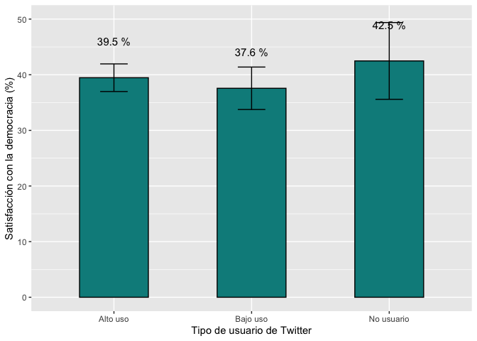

<style type="text/css">
.columns {display: flex;}
h1 {color: #3366CC;}
</style>

# Introducción

En este documento veremos como construir intervalos de confianza de la media usando los datos del Barómetro de las Américas.
Para eso, vamos a usar los reportes "El pulso de la democracia" de 2018/19, disponible [aquí](https://www.vanderbilt.edu/lapop/ab2018/2018-19_AmericasBarometer_Regional_Report_Spanish_W_03.27.20.pdf), y de 2021, disponible [aquí](https://www.vanderbilt.edu/lapop/ab2021/2021_LAPOP_AmericasBarometer_Pulse_of_Democracy.pdf).
En la ronda 2018/19, una de las secciones de este informe, reporta los datos sobre redes sociales y actitudes políticas.
En particular, se reporta, en el gráfico 3.9, el grado de satisfacción con la democracia por tipo de usuario de redes sociales.
En la ronda 2021, una de las secciones reporta los datos sobre golpes ejecutivos.
En el gráfico 1.7 se presenta el porcentaje de ciudadanos que toleran los golpes ejecutivos por país.
En ambos casos, los resultados incluyen las estimaciones puntuales y los intervalos de confianza.

# Sobre las bases de datos

Los datos que vamos a usar deben citarse de la siguiente manera: Fuente: Barómetro de las Américas por el Proyecto de Opinión Pública de América Latina (LAPOP), wwww.LapopSurveys.org.
En este documento se carga una base de datos recortada.
Esta base de datos se encuentra alojada en el repositorio "materials_edu" de la cuenta de LAPOP en GitHub.
Se recomiendo limpiar el Environment antes de proceder con esta sección.

Mediante la librería `rio` y el comando `import` se puede importar esta base de datos desde este repositorio.
Además, se seleccionan los datos de países con códigos menores o iguales a 35, es decir, se elimina las observaciones de Estados Unidos y Canadá.


```r
library(rio)
lapop18 <- import("https://raw.github.com/lapop-central/materials_edu/main/LAPOP_AB_Merge_2018_v1.0.sav")
lapop18 <- subset(lapop18, pais<=35)
```

También cargamos la base de datos de la ronda 2021.


```r
lapop21 = import("lapop21.RData")
lapop21 <- subset(lapop21, pais<=35)
```

# Tolerancia a los golpes ejecutivos

El gráfico 1.7 del reporte El pulso de la Democracia para la ronda del Barómetro de las Américas 2021 presenta los resultados del porcentaje de ciudadanos que tolera un golpe ejecutivo.
Este gráfico, además, presente el intervalo de confianza al 95% de este porcentaje en cada país.

{width="564"}

La variable para construir este gráfico es "jc15a" que está fraseada: ¿Cree usted que cuando el país enfrenta momentos muy difíciles, se justifica que el presidente del país cierre el Congreso/Asamblea y gobierno sin Congreso/Asamblea?
Las opciones de respuesta son:

1.  Sí se justifica
2.  No se justifica

## Describiendo la tolerancia a los golpes ejecutivos

Para calculas los porcentajes de ciudadanos que justifican o toleran los golpes ejecutivos se tiene que recodificar esta variable, de tal manera que aquellos que justifican tengan el valor 100 y los que no justifican, el valor 0.
En este caso se usa el comando `recode` y se tabula, mediante `table`, para verificar la recodificación.


```r
lapop21$jc15ar <- car::recode(lapop21$jc15a, "1=100; 2=0")
table(lapop21$jc15ar)
```

```
## 
##     0   100 
## 14711  5908
```

Para calcular el porcentaje de ciudadanos que toleran los golpes ejecutivos se puede usar los comandos `table` y `prop.table`.
La nueva variable "jc15ar" es una variable dummy.
En este tipo de variables, la media corresponde a la proporción de respuestas 100.
Es decir, si calculamos la media de esta variable, se está calculando el porcentaje para todos los entrevistados.
En esta sección vamos a tratar a esta variable como si fuera una variable numérica.
En sentido estricto es una variable categórica nominal.
Los cálculos de desviaciones estándar y luego de intervalos de confianza, por lo tanto, son referenciales.

El resultado indica que en toda la muestra, el porcentaje de ciudadanos que toleran los golpes ejecutivos es de 28.7%.


```r
summary(lapop21$jc15ar)
```

```
##    Min. 1st Qu.  Median    Mean 3rd Qu.    Max.    NA's 
##    0.00    0.00    0.00   28.65  100.00  100.00   40042
```

## Intervalos de confianza de tolerancia a los golpes ejecutivos

Para calcular el intervalo de confianza al 95% de este porcentaje, se puede usar el comando `t.test` o la librería `lsr`, que tiene el comando `ciMean`.
En ambos casos, el resultado nos indica que el porcentaje de ciudadanos que tolera los golpes ejecutivos en la región está entre 28% y 29.3%.


```r
t.test(lapop21$jc15ar)
```

```
## 
## 	One Sample t-test
## 
## data:  lapop21$jc15ar
## t = 90.996, df = 20618, p-value < 2.2e-16
## alternative hypothesis: true mean is not equal to 0
## 95 percent confidence interval:
##  28.03599 29.27038
## sample estimates:
## mean of x 
##  28.65318
```

```r
library(lsr)
ciMean(as.numeric(lapop21$jc15ar), na.rm=T)
```

```
##          2.5%    97.5%
## [1,] 28.03599 29.27038
```

## Tolerancia a los golpes ejecutivos por país

El gráfico 1.7 muestra el porcentaje de ciudadanos que toleran los golpes ejecutivos por país.
Para replicar este gráfico, primero tenemos que definir que la variable "pais" es de tipo factor.
Se guarda este cambio en una nueva variable "paises", la que se etiqueta con las siglas de cada país.


```r
lapop21$paises <- as.factor(lapop21$pais)
levels(lapop21$paises) <- c("MX", "GT", "SV", "HN", "NI", "CR",
                            "PN", "CO", "EC", "BO", "PE",
                            "PY", "CL", "UY", "BR", "AR", "DO",
                            "HT", "JA", "GU")
table(lapop21$paises)
```

```
## 
##   MX   GT   SV   HN   NI   CR   PN   CO   EC   BO   PE   PY   CL   UY   BR   AR 
## 2998 3000 3245 2999 2997 2977 3183 3003 3005 3002 3038 3004 2954 3009 3016 3011 
##   DO   HT   JA   GU 
## 3000 3088 3121 3011
```

Para calcular estos porcentajes por país, se puede usar varias alternativas.
Por ejemplo, el comando `tapply` permite calcular la media de una variable por grupos de otra variable.


```r
tapply(lapop21$jc15ar, lapop21$paises, mean, na.rm=T)
```

```
##        MX        GT        SV        HN        NI        CR        PN        CO 
## 30.312500 36.687307 48.068670 22.660819 31.111111       NaN 28.962444 35.041447 
##        EC        BO        PE        PY        CL        UY        BR        AR 
## 31.944444 32.082414 43.805613 34.459459 16.544118  8.552632 23.862069 13.795620 
##        DO        HT        JA        GU 
## 25.495959 44.042553 30.583215       NaN
```

Otra forma es usar las librerías `plyr` y `dplyr` que incluye el comando `ddply`.
Este comando requiere que se defina el dataframe "lapop21", la variable de agrupamiento "paises" y luego las funciones que se requiere en cada grupo, que en este caso son "mean" y "sd".


```r
library(plyr)
library(dplyr)
ddply(lapop21, "paises", summarise, mean=mean(jc15ar, na.rm=T), sd=sd(jc15ar, na.rm=T))
```

<div data-pagedtable="false">
  <script data-pagedtable-source type="application/json">
{"columns":[{"label":["paises"],"name":[1],"type":["fct"],"align":["left"]},{"label":["mean"],"name":[2],"type":["dbl"],"align":["right"]},{"label":["sd"],"name":[3],"type":["dbl"],"align":["right"]}],"data":[{"1":"MX","2":"30.312500","3":"45.99683"},{"1":"GT","2":"36.687307","3":"48.23249"},{"1":"SV","2":"48.068670","3":"49.99846"},{"1":"HN","2":"22.660819","3":"41.89433"},{"1":"NI","2":"31.111111","3":"46.32915"},{"1":"CR","2":"NaN","3":"NA"},{"1":"PN","2":"28.962444","3":"45.37325"},{"1":"CO","2":"35.041447","3":"47.72796"},{"1":"EC","2":"31.944444","3":"46.64234"},{"1":"BO","2":"32.082414","3":"46.69652"},{"1":"PE","2":"43.805613","3":"49.63180"},{"1":"PY","2":"34.459459","3":"47.54144"},{"1":"CL","2":"16.544118","3":"37.17149"},{"1":"UY","2":"8.552632","3":"27.97656"},{"1":"BR","2":"23.862069","3":"42.63874"},{"1":"AR","2":"13.795620","3":"34.49799"},{"1":"DO","2":"25.495959","3":"43.59987"},{"1":"HT","2":"44.042553","3":"49.69672"},{"1":"JA","2":"30.583215","3":"46.09229"},{"1":"GU","2":"NaN","3":"NA"}],"options":{"columns":{"min":{},"max":[10]},"rows":{"min":[10],"max":[10]},"pages":{}}}
  </script>
</div>

Como se observa en la tabla, no hay datos para Costa Rica, ni para Guyana.
Con el cálculo de la desviación estándar, se podría calcular el límite inferior y superior del intervalo de confianza.

Esto se puede hacer de manera directa con la librería `Rmisc`.
Esta librería tiene el comando `group.CI`, que calcula la media, el límite inferior y superior de una variable por grupos de otra variable.
Esta tabla se guarda en un objeto llamado "golpe".
Este comando no incluye las filas de los países donde no hay datos, por lo que no hay filas de Costa Rica ni de Guyana.


```r
library(Rmisc)
golpe <- group.CI(jc15ar~paises, lapop21)
golpe
```

<div data-pagedtable="false">
  <script data-pagedtable-source type="application/json">
{"columns":[{"label":["paises"],"name":[1],"type":["fct"],"align":["left"]},{"label":["jc15ar.upper"],"name":[2],"type":["dbl"],"align":["right"]},{"label":["jc15ar.mean"],"name":[3],"type":["dbl"],"align":["right"]},{"label":["jc15ar.lower"],"name":[4],"type":["dbl"],"align":["right"]}],"data":[{"1":"MX","2":"33.88284","3":"30.312500","4":"26.742162"},{"1":"GT","2":"40.41369","3":"36.687307","4":"32.960926"},{"1":"SV","2":"51.78163","3":"48.068670","4":"44.355713"},{"1":"HN","2":"25.80600","3":"22.660819","4":"19.515638"},{"1":"NI","2":"34.61243","3":"31.111111","4":"27.609797"},{"1":"PN","2":"31.20785","3":"28.962444","4":"26.717039"},{"1":"CO","2":"37.61174","3":"35.041447","4":"32.471157"},{"1":"EC","2":"34.35553","3":"31.944444","4":"29.533359"},{"1":"BO","2":"34.56732","3":"32.082414","4":"29.597507"},{"1":"PE","2":"46.35270","3":"43.805613","4":"41.258529"},{"1":"PY","2":"37.01489","3":"34.459459","4":"31.904033"},{"1":"CL","2":"18.52143","3":"16.544118","4":"14.566804"},{"1":"UY","2":"10.03646","3":"8.552632","4":"7.068802"},{"1":"BR","2":"26.05857","3":"23.862069","4":"21.665568"},{"1":"AR","2":"15.62400","3":"13.795620","4":"11.967243"},{"1":"DO","2":"27.81437","3":"25.495959","4":"23.177545"},{"1":"HT","2":"48.54708","3":"44.042553","4":"39.538028"},{"1":"JA","2":"32.99455","3":"30.583215","4":"28.171877"}],"options":{"columns":{"min":{},"max":[10]},"rows":{"min":[10],"max":[10]},"pages":{}}}
  </script>
</div>

Con esta tabla podemos replicar el gráfico 1.7 con la librería `ggplot2`.
Para incluir los intervalos de confianza se tiene que agregar la especificación `geom_errorbar()`.
La tabla "golpe" tiene el dato de "ymin" en la columna "jc15ar.lower" y el dato de "ymax" en la columna "jc15ar.upper".
Estos datos se deben ingresar en la especificación `aes` dentro de `geom_errorbar`.
Además, se tiene como opciones `width` para especificar el ancho de las bigotes de las barras de error, `color` para especificar el color, `cex` para especificar el ancho de las líneas y `linetype` para especificar el tipo de líneas, en este caso puntuadas.

Para poder ordenar las barras de acuerdo al valor de la variable, se puede usar la especificación `reorder(grupo, variable)` dentro de la especificación `aes` de `ggplot`.


```r
library(ggplot2)
graf1 <- ggplot(golpe, aes(x=reorder(paises, -jc15ar.mean), y=jc15ar.mean))+
  geom_bar(width=0.5, fill="darkslategray3", colour="#69b3a2", stat="identity")+
  geom_errorbar(aes(ymin=jc15ar.lower, ymax=jc15ar.upper), width=0.4, 
                color="darkcyan", cex=0.4, linetype=3)+
  geom_text(aes(label=paste(round(jc15ar.mean, 1), "%")), vjust=-4.4, size=2.5)+
  xlab("País") + ylab("Tolerancia a golpes ejecutivos (%)")+
  ylim(0, 60)
graf1
```

<!-- -->

Estos datos, sin embargo, no son exactamente iguales a los presentados en el gráfico 1.7 debido a que estos cálculos no incluyen el efecto de diseño.
Más adelante, se verá cómo incluir el efecto de diseño para replicar el gráfico exactamente.

# Satisfacción con la democracia

El gráfico 3.9 del reporte El Pulso de la Democracia de la ronda 2018/19 presenta el porcentaje de entrevistados que está satisfecho con la democracia por tipo de usuarios de redes sociales.

{width="413"}

La variable satisfacción con la democracia se llama "pn4" y está codificada de la siguiente manera:

1.  Muy satisfecho
2.  Satisfecho
3.  Insatisfecho
4.  Muy insatisfecho

La nota 21 de este reporte indica que "Se codifica a los entrevistados que seleccionan (1) o (2) como satisfechos con la democracia".
Por lo tanto, se tiene que recodificar esta variable.
En este caso se usa el comando `recode` y se tabula, mediante `table`, para verificar la recodificación.


```r
library(car)
table(lapop18$pn4)
```

```
## 
##     1     2     3     4 
##  1727  8916 12455  3855
```

```r
lapop18$pn4rr <- car::recode(lapop18$pn4, "1:2=100; 3:4=0")
table(lapop18$pn4rr)
```

```
## 
##     0   100 
## 16310 10643
```

La nueva variable "pn4rr" es una variable dummy.
En este tipo de variables, la media corresponde a la proporción de respuestas 100.
Es decir, si calculamos la media de esta variable, se está calculando el porcentaje para todos los entrevistados.
En esta sección vamos a tratar a esta variable como si fuera una variable numérica.
En sentido estricto es una variable categórica nominal.
Los cálculos de desviaciones estándar y luego de intervalos de confianza, por lo tanto, son referenciales.


```r
summary(lapop18$pn4rr)
```

```
##    Min. 1st Qu.  Median    Mean 3rd Qu.    Max.    NA's 
##    0.00    0.00    0.00   39.49  100.00  100.00    1089
```

Estos resultados muestran una media de 39.5, es decir el 39.5% de los entrevistados están satisfechos con la democracia.
Se puede calcular también el intervalo de confianza de esta variable de varias formas.
Una primera es mediante la prueba t de una muestra, usando el comando `t.test`.
Otra forma es usando el comando `ciMean` de la librería `lsr`.


```r
t.test(lapop18$pn4rr)
```

```
## 
## 	One Sample t-test
## 
## data:  lapop18$pn4rr
## t = 132.62, df = 26952, p-value < 2.2e-16
## alternative hypothesis: true mean is not equal to 0
## 95 percent confidence interval:
##  38.90364 40.07087
## sample estimates:
## mean of x 
##  39.48726
```

```r
library(lsr)
ciMean(lapop18$pn4rr, na.rm=T)
```

```
##          2.5%    97.5%
## [1,] 38.90364 40.07087
```

Estos resultados indican que el intervalo de confianza de la media de satisfacción con la democracia varía entre 38.9% y 40.1% con 95% de confianza.
Se podría cambiar este valor por defecto a 99% de confianza agregando la especificación `conf = 0.99` al comando `ciMean`.

## Satisfacción con la democracia por grupos de consumo de información en redes sociales

El informe usa una variable que mide la "exposición frecuente a información política".
Esta variable se construye de una manera compleja, sobre la base de las 3 redes sociales por las que se pregunta.
En este caso vamos a empezar con una recodificación más simple para recrear los intervalos de confianza de la variable "satisfacción de la democracia" por grupo de frecuencia de consumo de información de cada red social.
Luego se procederá a replicar la variable que se usa en el reporte.
La frecuencia de consumo de información (variables "smedia2" para Facebook, "smedia5" para Twitter y "smedia8" para Whatsapp) de cada red social se mide en la siguiente escala:

1.  Diariamente
2.  Algunas veces a la semana
3.  Algunas veces al mes
4.  Algunas veces al año
5.  Nunca

Vamos a recodificar estas variables de tal manera que aquellos que responden diariamente o algunas veces a la semana serán clasificados como de "alto uso", aquellos que responden del 3 al 4 serán clasificados como de "bajo uso" y aquellos que responden "nunca" serán clasificados como "no usuarios".
Un esquema similar de clasificación se usa para definir a los usuarios de las 3 redes sociales.
Las nuevas variables recodificadas, se convierten a factor y se etiquetan.


```r
table(lapop18$smedia2)
```

```
## 
##    1    2    3    4    5 
## 8633 4927 1286  282  231
```

```r
table(lapop18$smedia5)
```

```
## 
##   1   2   3   4   5 
## 795 728 422 193 220
```

```r
table(lapop18$smedia8)
```

```
## 
##     1     2     3     4     5 
## 14151  2646   495    50    87
```

```r
lapop18$smedia2r <- car::recode(lapop18$smedia2, "1:2=1; 3:4=2; 5=3")
lapop18$smedia5r <- car::recode(lapop18$smedia5, "1:2=1; 3:4=2; 5=3")
lapop18$smedia8r <- car::recode(lapop18$smedia8, "1:2=1; 3:4=2; 5=3")
lapop18$smedia2r <- as.factor(lapop18$smedia2r)
lapop18$smedia5r <- as.factor(lapop18$smedia5r)
lapop18$smedia8r <- as.factor(lapop18$smedia8r)
levels(lapop18$smedia2r) <- c("Alto uso", "Bajo uso", "No usuario")
levels(lapop18$smedia5r) <- c("Alto uso", "Bajo uso", "No usuario")
levels(lapop18$smedia8r) <- c("Alto uso", "Bajo uso", "No usuario")
table(lapop18$smedia2r)
```

```
## 
##   Alto uso   Bajo uso No usuario 
##      13560       1568        231
```

```r
table(lapop18$smedia5r)
```

```
## 
##   Alto uso   Bajo uso No usuario 
##       1523        615        220
```

```r
table(lapop18$smedia8r)
```

```
## 
##   Alto uso   Bajo uso No usuario 
##      16797        545         87
```

Con estas variables recodificadas, se puede calcular las medias (que son los porcentajes) de satisfacción con la democracia por cada grupo de consumo de información en redes sociales.
Esto se puede hacer de múltiples maneras.
Si se requiere comparar las medias, se puede usar el comando `tapply`.


```r
tapply(lapop18$pn4rr, lapop18$smedia2r, mean, na.rm=T) #Facebook
```

```
##   Alto uso   Bajo uso No usuario 
##   37.55182   37.94466   40.74074
```

```r
tapply(lapop18$pn4rr, lapop18$smedia5r, mean, na.rm=T) #Twitter
```

```
##   Alto uso   Bajo uso No usuario 
##   39.66777   37.37542   41.78404
```

```r
tapply(lapop18$pn4rr, lapop18$smedia8r, mean, na.rm=T) #Whatsapp
```

```
##   Alto uso   Bajo uso No usuario 
##   37.39093   38.92100   43.37349
```

Otra opción que puede presentar tanto la media como la desviación estándar es mediante la librería `plyr` y el comando `ddply`.
El código solo para Facebook sería:


```r
library(plyr)
ddply(lapop18, "smedia2r", summarise, mean=mean(pn4rr, na.rm=T), sd=sd(pn4rr, na.rm=T))
```

<div data-pagedtable="false">
  <script data-pagedtable-source type="application/json">
{"columns":[{"label":["smedia2r"],"name":[1],"type":["fct"],"align":["left"]},{"label":["mean"],"name":[2],"type":["dbl"],"align":["right"]},{"label":["sd"],"name":[3],"type":["dbl"],"align":["right"]}],"data":[{"1":"Alto uso","2":"37.55182","3":"48.42747"},{"1":"Bajo uso","2":"37.94466","3":"48.54092"},{"1":"No usuario","2":"40.74074","3":"49.24932"},{"1":"NA","2":"41.80890","3":"49.32656"}],"options":{"columns":{"min":{},"max":[10]},"rows":{"min":[10],"max":[10]},"pages":{}}}
  </script>
</div>

Es importante notar que en este caso no hemos indicado que internamente no se trabaje con los valores perdidos (usando la especificación `filter(!is.na(wa_user))`), por lo que la tabla anterior presenta una fila de las observaciones NA de usuario de la red social, donde se calcula el promedio y la desviación estándar de la variable satisfacción con la democracia.
Finalmente, una opción que permite mostrar muchos estadísticos por cada grupo es `describeBy` de la librería `psych`.
El código para Twitter es:


```r
library(psych)
describeBy(lapop18$pn4rr, group=lapop18$smedia5r)
```

```
## 
##  Descriptive statistics by group 
## group: Alto uso
##    vars    n  mean    sd median trimmed mad min max range skew kurtosis   se
## X1    1 1505 39.67 48.94      0    37.1   0   0 100   100 0.42    -1.82 1.26
## ------------------------------------------------------------ 
## group: Bajo uso
##    vars   n  mean    sd median trimmed mad min max range skew kurtosis   se
## X1    1 602 37.38 48.42      0   34.23   0   0 100   100 0.52    -1.73 1.97
## ------------------------------------------------------------ 
## group: No usuario
##    vars   n  mean    sd median trimmed mad min max range skew kurtosis   se
## X1    1 213 41.78 49.44      0   39.77   0   0 100   100 0.33     -1.9 3.39
```

Sin embargo, lo que nos interesa es calcular los intervalos de confianza para cada grupo.
En el gráfico 3.9 del reporte se presenta la media de satisfacción con la democracia, mostrado como un punto, y los intervalos de confianza de cada grupo, mostrados como un área gris con límites inferior y superior.
Se puede usar la librería `Rmisc` y el comando `group.CI` para calcular los intervalos de confianza de la variable satisfacción con la democracia por grupos de consumo de información en Facebook.


```r
library(Rmisc)
group.CI(pn4rr~smedia2r, lapop18)
```

<div data-pagedtable="false">
  <script data-pagedtable-source type="application/json">
{"columns":[{"label":["smedia2r"],"name":[1],"type":["fct"],"align":["left"]},{"label":["pn4rr.upper"],"name":[2],"type":["dbl"],"align":["right"]},{"label":["pn4rr.mean"],"name":[3],"type":["dbl"],"align":["right"]},{"label":["pn4rr.lower"],"name":[4],"type":["dbl"],"align":["right"]}],"data":[{"1":"Alto uso","2":"38.37595","3":"37.55182","4":"36.72770"},{"1":"Bajo uso","2":"40.38847","3":"37.94466","4":"35.50086"},{"1":"No usuario","2":"47.34574","3":"40.74074","4":"34.13574"}],"options":{"columns":{"min":{},"max":[10]},"rows":{"min":[10],"max":[10]},"pages":{}}}
  </script>
</div>

Con estos datos, por ejemplo, la media de satisfacción con la democracia entre el grupo de alto uso de información en Facebook es 37.6%.
El límite inferior del intervalo de confianza es 36.7% y el límite superior es 38.4%.
Con estos datos se podría replicar un gráfico de barras similar al 3.9.

## Intervalos de confianza de satisfacción con la democracia

La forma más fácil de graficar los intervalos de confianza por grupos es usando el comando `plotmeans`.


```r
library(gplots)
plotmeans(lapop18$pn4rr~lapop18$smedia5r,
          xlab="Tipo de usuario de Twitter",
          ylab="Satisfacción con la democracia",
          ylim=c(0, 50),
          mean.labels=T, digits=1,
          connect=F
         )
```

<!-- -->

Esta opción muestra los intervalos de confianza pero se dificulta si se quiere graficar las barras.
La librería `ggplot` nos brinda más opciones y nos permite graficar de manera similar al gráfico 3.9 del reporte, en barras, presentar los intervalos de confianza y agregar color.
Para esto, primero se guarda un dataframe "tw.uso" con los datos de la media y los límites superior e inferior de cada grupo, usando el comando `group.CI`.
Son los datos de este dataframe los que se usan con `ggplot` y se crea un gráfico que se guarda en un objeto "graf1".
Con esta librería se agrega la capa `geom_bar()` para definir que se quiere un gráfico de barras de las variables especificadas en `aes`.
Luego, se agrega la capa `geom_errorbar()` para agregar las barras de error y luego los valores de la media con `geom_text()`.
Finalmente, se etiqueta el eje X y Y con `xlab` y `ylab` y se define los límites del eje Y con `ylim`.


```r
tw.uso <- group.CI(pn4rr~smedia5r, lapop18)
library(ggplot2)
graf2 <- ggplot(tw.uso, aes(x=smedia5r, y=pn4rr.mean))+
  geom_bar(width=0.5, fill="darkcyan", colour="black", stat="identity")+
  geom_errorbar(aes(ymin=pn4rr.lower, ymax=pn4rr.upper), width=0.2)+
  geom_text(aes(label=paste(round(pn4rr.mean, 1), "%")), vjust=-4.2, size=4)+
  xlab("Tipo de usuario de Twitter") + ylab("Satisfacción con la democracia (%)")+
  ylim(0, 50)
graf2
```

<!-- -->

Según estos resultados, la satisfacción con la democracia es más alta en aquellos que no son usuarios de Twitter, en comparación con los usuarios, aunque las diferencias no son estadísticamente significativas de una comparación visual entre los intervalos de confianza.

## Satisfacción con la democracia por tipo de usuario de redes sociales

Hasta el momento se ha creado intervalos de confianza de satisfacción con la democracia por tipo de usuarios de Twitter.
El reporte agrega a los usuarios de las tres redes sociales para ubicar tres tipos de usuarios: usuarios de alto uso, de bajo uso y no usuarios de cualquier red social.
La forma de codificación de este tipo de usuarios de tres redes sociales se basa en varias condiciones.
Como dice el reporte: "Usamos la misma codificación que en la anterior sección, para distinguir entre quienes acceden con frecuencia en redes sociales (aquellos con cuentas a las que acceden algunas veces a la semana o a diario) y aquellos que no acceden a las redes sociales muy frecuentemente (aquellos con cuentas a las que acceden algunas veces al mes o algunas veces al año). También incluimos a quienes no son usuarios: quienes no tienen ninguna cuenta en redes sociales (quienes indican que no tienen una cuenta en Facebook, Twitter o Whatsapp) y quienes tienen una cuenta, pero nunca la usan" (p.81).
En primer lugar identificamos a quienes usan cada red social algunas veces a la semana o a diario como 1 y si usan cada red social algunas veces al mes o algunas veces al año, como 0.
Para esto usamos el comando `ifelse`.
Luego, sumamos los valores de cada red social en una sola variable, con valores entre 0 y 3.
Se usa el comando `rowSums` que permite la suma horizontal de variables definidas, en este caso las que están en la posición `[, 89:91]`.
En este comando, usamos la especificación `na.rm=T` para que la suma no tome en cuenta a los valores perdidos.


```r
lapop18$sm2 <- ifelse(lapop18$smedia2==1 | lapop18$smedia2==2, 1, 0)
lapop18$sm5 <- ifelse(lapop18$smedia5==1 | lapop18$smedia5==2, 1, 0)
lapop18$sm8 <- ifelse(lapop18$smedia8==1 | lapop18$smedia8==2, 1, 0)
lapop18$anyhi = rowSums(lapop18[,89:91], na.rm=T)
table(lapop18$anyhi)
```

```
## 
##     0     1     2     3 
##  9831  5811 11131  1269
```

Partiendo de esta variable, se crea una variable que agrega las tres redes sociales, llamada "hi_lo_non".
Primero, se crea esta variable como un vector de NAs.
Luego se le imputa valores de 1, 2, 3 o NA, dependiendo de los valores de "anyhi o de los valores de las variables de redes sociales. Luego se crea una nueva variable de tipo factor, con idénticos valores que "hi_lo_non" y se etiqueta. La definición de la condicionalidad se trabaja mediante los corchetes `[...]`. De esta manera, se define las condiciones de la siguiente manera:

-   La variable "hi_lo_non es igual a 1 si la variable anyhi es mayor o igual a 1 (uso diario o algunas veces a la semana) = `lapop18$hi_lo_non[lapop18$anyhi>=1] <- 1`

-   La variable "hi_lo_non es igual a 2 si la variable anyhi es igual a 0 (uso algunas veces al año o nunca) = `lapop18$hi_lo_non[lapop18$anyhi==0] <- 2`

-   La variable "hi_lo_non es igual a 3 si las variables de tenencia de cuentas son igual a 2 (No) = `lapop18$hi_lo_non[lapop18$smedia1==2 & lapop18$smedia4==2 & lapop18$smedia7==2] <- 3`

Las siguiente reglas de codificación siguen la misma lógica de combinación de otras variables para imputar el valor 3 o NA.


```r
lapop18$hi_lo_non <- NA #se crea un vector con NAs#
lapop18$hi_lo_non[lapop18$anyhi>=1] <- 1 #Se codifica 1 a los que usan diariamente o algunas veces a la semana alguna red social#
lapop18$hi_lo_non[lapop18$anyhi==0] <- 2 #Se codifica como 2 a los que usan algunas veces al mes y al año alguna red social#
lapop18$hi_lo_non[lapop18$smedia1==2 & lapop18$smedia4==2 & lapop18$smedia7==2] <- 3 #Se codifica como 3 a los que no tiene redes sociales#
lapop18$hi_lo_non[lapop18$smedia2==5 & lapop18$smedia5==5 & lapop18$smedia8==5] <- 3 #Se codifica como 3 a los que nunca usan ninguna red social#
lapop18$hi_lo_non[lapop18$pais==3 & (lapop18$smedia2==5 | lapop18$smedia5==5 | lapop18$smedia8==5)] <- 3 #Se aplica un código particular a pais 3#
lapop18$hi_lo_non[lapop18$pais==3 & (lapop18$smedia1==2 | lapop18$smedia4==2 | lapop18$smedia7==2)] <- 3 #Se aplica un código particular a pais 3#
lapop18$hi_lo_non[lapop18$hi_lo_non != 1 & (lapop18$smedia2==NA | lapop18$smedia5==NA | lapop18$smedia8==NA)] <- NA #Se codifican los valores perdidos como perdidos#
lapop18$hi_lo_non[lapop18$hi_lo_non != 1 & (lapop18$smedia1==NA | lapop18$smedia4==NA | lapop18$smedia7==NA)] <- NA
lapop18$hi_lo_non[lapop18$smedia1==NA & lapop18$smedia4==NA & lapop18$smedia7==NA] <- NA
lapop18$hi_lo_non[lapop18$hi_lo_non !=3 & lapop18$smedia2==NA & lapop18$smedia5==NA & lapop18$smedia8==NA] <- NA
lapop18$hilon <- as.factor(lapop18$hi_lo_non)
levels(lapop18$hilon) <- c("Alto uso", "Bajo uso", "No usuario")
prop.table(table(lapop18$hilon))*100
```

```
## 
##   Alto uso   Bajo uso No usuario 
##  64.941873   3.480494  31.577634
```

Según estos datos, el 64.9% de entrevistados reportan un alto uso de redes sociales, mientras que, en el otro extremo, se tiene 31.6% que serían no usuarios de ninguna red social.
Estos datos difieren un poco de los reportados en el Apéndice al reporte, disponible [aquí](https://www.vanderbilt.edu/lapop/ab2018/Appendix_Material_for_2018-19_AmericasBarometer_Report-Comparative_Chapters_10.13.19.pdf), donde se reporte 65.34% de alto uso y 31.60% de no usuarios.
Estas diferencias pueden ser debidas a diferencias en la interpretación de las reglas de codificación desde Stata a R.

De la misma forma que se produjo el gráfico de media de satisfacción con la democracia por tipos de usuarios de Twitter usando `ggplot`, ahora se hará lo mismo pero para los usuarios de las tres redes sociales, variable "hilon".


```r
library(Rmisc)
satis.uso <- group.CI(pn4rr~hilon, lapop18)
library(ggplot2)
graf3.9 <- ggplot(satis.uso, aes(x=hilon, y=pn4rr.mean))+
  geom_bar(width=0.5, fill="darkcyan", colour="black", stat="identity")+
  geom_errorbar(aes(ymin=pn4rr.lower, ymax=pn4rr.upper), width=0.2)+
  geom_text(aes(label=paste(round(pn4rr.mean, 1), "%")), vjust=-2.5, size=4)+
  xlab("Tipo de usuario de redes sociales") + ylab("Satisfacción con la democracia (%)")+
  ylim(0, 50)
graf3.9
```

<!-- -->

Este gráfico sería una reproducción del que se presenta en el informe (Gráfico 3.9 en la página 62), con una mínimas diferencias por codificación de los datos resultantes.

# Resumen

En este documento se ha trabajado con una variable recodificada dummy (satisfacción con la democracia), la que puede ser trabajada como variable numérica para el cálculo de intervalos de confianza de proporciones.
Con esta variable se ha calculado el intervalo de confianza de la media, que sería el de la proporción de entrevistados que están satisfechos con la democracia.
Luego, se ha descrito esta variables por grupos de una variable de factor (consumo de información política).
Se ha presentado cómo calcular los intervalos de confianza de la variable numérica por grupos de la variable de factor.
Finalmente, se ha presentado cómo graficar los intervalos de confianza por grupos.

# Cálculos incluyendo el efecto de diseño

## Resultados de tolerancia a los golpes ejecutivos ponderados

Como se mencionó, los resultados obtenidos acerca de la tolerancia de los golpes ejecutivos, gráfico 1.7 del reporte El Pulso de la Democracia 2021, no son iguales a los obtenidos aquí.
Esto es debido a que los cálculos de más arriba no incluye el efecto de diseño.

Para poder realizar los cálculos tomando en cuenta el efecto de diseño, se puede usar la librería `survey` para definir el diseño muestral.
Primero, se tiene que adecuar la base de datos, eliminando los valores perdidos de las variables que definen el diseño muestral (como "weight1500").
Un paso adicional es transformar las variables del dataframe.
Esto es debido a que cuando se importan, el sistema lee las variables como tipo "haven_labelled", es decir, mantiene las etiquetas de las variables, con lo que se podría producir un libro de códigos.
Esto es útil en otras ocasiones, pero genera problemas con la librería `survey`.
Para esto transformamos las variables a otro tipo con el comando `sapply`.


```r
lapop21 = subset(lapop21, !is.na(weight1500))
sapply(lapop21, haven::zap_labels)
```

Con la base de datos adecuada, se puede definir el diseño muestra y se guarda en un objeto "diseno21".


```r
library(survey)
diseno21 = svydesign(ids = ~upm, strata = ~strata, weights = ~weight1500, nest=TRUE, data=lapop21)
```

La librería `survey` tiene comandos nativos para calcular la media de la variable recodificada de tolerancia a los golpes ejecutivos.
Este cálculo de la media nos brinda el porcentaje de ciudadanos en la región que son tolerantes a los golpes ejecutivos.


```r
svymean(~jc15ar, diseno21, na.rm=T)
```

```
##          mean     SE
## jc15ar 30.391 0.3926
```

Para calcular el intervalo de confianza de esta medida se puede anidar el comando `svymean` dentro de otro comando `confint` que nos brinda el límite inferior y superior del intervalo de confianza.


```r
confint(svymean(~jc15ar, diseno21, na.rm=T))
```

```
##           2.5 %  97.5 %
## jc15ar 29.62125 31.1601
```

Para poder replicar el gráfico 1.7 requerimos el valor del porcentaje de ciudadanos que toleran los golpes ejecutivos por páis, así como el intervalo de confianza de cada uno.
Para este cálculo, podemos usar el comando `svyby`.
Este comando requiere definir la variable a ser calculada (`~jc15ar`), la variable que define los grupos (`~paises`), el objeto que guarda el diseño muestral (`diseno21`), el estadístico que se quiere calcular (`svymean, na.rm=T`) y definir el intervalo de confianza (`vartype = "ci"`).
Estos cálculos se guardan en un objeto "golpepond".


```r
golpepond = svyby(~jc15ar, ~paises, diseno21, svymean, na.rm=T, vartype = "ci")
golpepond = golpepond[-c(6,20),]
```

De la misma manera que con el gráfico con los resultados no poderados, usamos la librería `ggplot` para replicar el gráfico 1.7.
Se debe tomar en cuenta que el comando `svybar` genera columnas con nombre diferentes a los que se generan con el comando `group.CI` usado más arriba.


```r
graf3 <- ggplot(golpepond, aes(x=reorder(paises, -jc15ar), y=jc15ar))+
  geom_bar(width=0.5, fill="darkslategray3", colour="#69b3a2", stat="identity")+
  geom_errorbar(aes(ymin=ci_l, ymax=ci_u), width=0.2, color="darkcyan",
                cex=0.4, linetype=3)+
  geom_text(aes(label=paste(round(jc15ar, 0), "%")), vjust=-4.4, size=2.5)+
  xlab("País") + ylab("Tolerancia a golpes ejecutivos (%)")+
  ylim(0, 60)
graf3
```

<!-- -->

De esta manera se ha replicado exactamente los resultados reportados en El Pulso de la Democracia 2021.

## Resultados de satisfacción con la democracia ponderados

De la misma manera que con la tolerancia a los golpes ejecutivos, se usa la librería `survey` y el comando `confint`junto al comando nativo `svymean`.


```r
library(survey)
diseno18<-svydesign(ids = ~upm, strata = ~estratopri, weights = ~weight1500, nest=TRUE, data=lapop18)
```

Se puede describir la variable de satisfacción con la democracia incorporando el factor de diseño usando el comando `svymean`.


```r
svymean(~pn4rr, diseno18, na.rm=T)
```

```
##         mean     SE
## pn4rr 39.459 0.3317
```

Para calcular el intervalo de confianza, se tiene que anidar el código anterior dentro del comando `confint`.
Este comando calcula el intervalo de confianza al 95% por defecto.
Se podría cambiar este valor por defecto a 99% de confianza agregando la especificación `conf = 0.99` al comando.


```r
confint(svymean(~pn4rr, diseno18, na.rm=T))
```

```
##          2.5 %   97.5 %
## pn4rr 38.80884 40.10901
```

También se puede calcular la media y el intervalo de confianza de satisfacción con la democracia incorporando el efecto de diseño usando el comando `svyby`.
Dentro de este comando se especifica la variable numérica a ser descrita (`~pn4rr`), la variable que forma los grupos (`~smedia5r`), el diseño muestral (`diseno18`), la función que se quiere calcular (`svymean`), que no tome en cuenta los valores perdidos (`na.rm=T`) y que incluya el intervalo de confianza de cada grupo (`vartype="ci"`).


```r
tw.uso.weighted <- svyby(~pn4rr, ~smedia5r, diseno18, svymean, na.rm=T, vartype = "ci")
tw.uso.weighted
```

<div data-pagedtable="false">
  <script data-pagedtable-source type="application/json">
{"columns":[{"label":[""],"name":["_rn_"],"type":[""],"align":["left"]},{"label":["smedia5r"],"name":[1],"type":["fct"],"align":["left"]},{"label":["pn4rr"],"name":[2],"type":["dbl"],"align":["right"]},{"label":["ci_l"],"name":[3],"type":["dbl"],"align":["right"]},{"label":["ci_u"],"name":[4],"type":["dbl"],"align":["right"]}],"data":[{"1":"Alto uso","2":"39.46510","3":"36.98285","4":"41.94735","_rn_":"Alto uso"},{"1":"Bajo uso","2":"37.56570","3":"33.74961","4":"41.38179","_rn_":"Bajo uso"},{"1":"No usuario","2":"42.48075","3":"35.57877","4":"49.38274","_rn_":"No usuario"}],"options":{"columns":{"min":{},"max":[10]},"rows":{"min":[10],"max":[10]},"pages":{}}}
  </script>
</div>

Para poder graficar, estos cálculos se guardan en un dataframe "tw.uso.weighted", que incluye los datos de la media por cada grupo y el límite inferior y superior del intervalo de confianza.
De la misma manera que con los datos que no incluyen el efecto de diseño, se usa la librería `ggplot` y se crea un gráfico que se guarda en un objeto "graf2".
Se usan especificaciones muy similares a los ejemplos anteriores.


```r
graf4 <- ggplot(tw.uso.weighted, aes(x=smedia5r, y=pn4rr))+
  geom_bar(width=0.5, fill="darkcyan", colour="black", stat="identity")+
  geom_errorbar(aes(ymin=ci_l, ymax=ci_u), width=0.2)+
  geom_text(aes(label=paste(round(pn4rr, 1), "%")), vjust=-4.2, size=4)+
  xlab("Tipo de usuario de Twitter") + ylab("Satisfacción con la democracia (%)")+
  ylim(0, 50)
graf4
```

<!-- -->

Estos resultados incluyen el efecto de diseño, pero no son exactamente iguales a los reportados en el gráfico 3.9 del reporte El Pulso de la Democracia de la ronda 2018/19 debido a que el cálculo de la variable que define al tipo de usuario de Twitter es más complejo de lo que se hace en esta sección.
