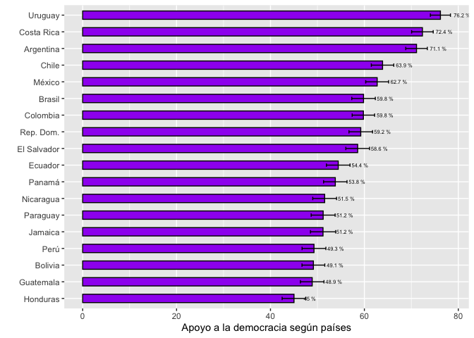
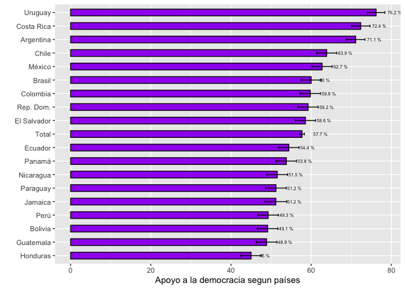

<style type="text/css">
.columns {display: flex;}
h1 {color: #3366CC;}
</style>

# Introducción

En este documento veremos como construir intervalos de confianza de la media usando los datos del Barómetro de las Américas para más de dos grupos.
Para eso, vamos a seguir usando el último informe regional "El pulso de la democracia", disponible [aquí](https://www.vanderbilt.edu/lapop/ab2018/2018-19_AmericasBarometer_Regional_Report_Spanish_W_03.27.20.pdf), donde se presentan los principales hallazgos de la ronda 2018/19 del Barómetro de las Américas.
Una de las secciones de este informe, reporta los resultados acerca del apoyo a la democracia electoral.
En particular, el gráfico 1.2 muestra el apoyo promedio a la democracia según países.
Este tipo de gráficos es uno de los más usados con los datos del Barómetro de las Américas pues usa al máximo los resultados de un ronda, presentando una visión panorámica de la región para una variable crítica como el apoyo a la democracia para 18 países en América Latina.

# Sobre la base de datos

Los datos que vamos a usar deben citarse de la siguiente manera: Fuente: Barómetro de las Américas por el Proyecto de Opinión Pública de América Latina (LAPOP), wwww.LapopSurveys.org.
Pueden descargar los datos de manera libre [aquí](http://datasets.americasbarometer.org/database/login.php).

En este documento se carga nuevamente una base de datos recortada, originalmente en formato SPSS (.sav).
Esta base de datos se encuentra alojada en el repositorio "materials_edu" de la cuenta de LAPOP en GitHub.
Mediante la librería `rio` y el comando `import` se puede importar esta base de datos desde este repositorio.
Además, se seleccionan los datos de países con códigos menores o iguales a 35, es decir, se elimina las observaciones de Estados Unidos y Canadá.


```r
library(rio)
lapop18 <- import("https://raw.github.com/lapop-central/materials_edu/main/LAPOP_AB_Merge_2018_v1.0.sav")
lapop18 <- subset(lapop18, pais<=35)
```

# Apoyo a la democracia según países

El gráfico 1.2 del reporte muestra el promedio del apoyo a la democracia electoral para cada uno de los 18 países analizados.
Presenta, además, los intervalos de confianza por cada país, en forma de una barra gris, que indica el intervalo inferior y superior de este intervalo, con un punto que indica el valor de la media.

{width="363"}

Para reproducir, los datos de este gráfico, primero se tiene que recodificar la variable, de la misma manera que se hizo en la sección sobre [intervalos de confianza](https://arturomaldonado.github.io/BarometroEdu_Web/IC.html).


```r
library(car)
lapop18$ing4r <- car::recode(lapop18$ing4, "1:4=0; 5:7=100")
table(lapop18$ing4r)
```

```
## 
##     0   100 
## 11463 15623
```

Cuando se importa la base de datos, las variables son definidas como numéricas, siendo que muchas de ellas son factores, como la variable "pais".
Para poder evaluar el apoyo a la democracia según países, se va a definir una nueva variable "paises" como factor y se va a etiquetar.


```r
lapop18$paises <- as.factor(lapop18$pais)
levels(lapop18$paises) <- c("México", "Guatemala", "El Salvador", "Honduras", "Nicaragua",
                            "Costa Rica", "Panamá", "Colombia", "Ecuador", "Bolivia", "Perú",
                            "Paraguay", "Chile", "Uruguay", "Brasil", "Argentina", "Rep. Dom.",
                            "Jamaica")
table(lapop18$paises)
```

```
## 
##      México   Guatemala El Salvador    Honduras   Nicaragua  Costa Rica 
##        1580        1596        1511        1560        1547        1501 
##      Panamá    Colombia     Ecuador     Bolivia        Perú    Paraguay 
##        1559        1663        1533        1682        1521        1515 
##       Chile     Uruguay      Brasil   Argentina   Rep. Dom.     Jamaica 
##        1638        1581        1498        1528        1516        1513
```

Con estas variables, se crea un nuevo dataframe con los datos del promedio de apoyo a la democracia por cada país( que es el porcentaje de ciudadanos que apoya a la democracia) , con los datos para construir los intervalos de confianza.
Para esto usamos el comando `summarySE` que es parte de la librería `Rmisc`.
Estos datos se guardan en el dataframe "df".


```r
library(Rmisc)
df <- summarySE(data=lapop18, measurevar="ing4r", groupvar="paises", na.rm=T)
df
```

<div data-pagedtable="false">
  <script data-pagedtable-source type="application/json">
{"columns":[{"label":["paises"],"name":[1],"type":["fct"],"align":["left"]},{"label":["N"],"name":[2],"type":["dbl"],"align":["right"]},{"label":["ing4r"],"name":[3],"type":["dbl"],"align":["right"]},{"label":["sd"],"name":[4],"type":["dbl"],"align":["right"]},{"label":["se"],"name":[5],"type":["dbl"],"align":["right"]},{"label":["ci"],"name":[6],"type":["dbl"],"align":["right"]}],"data":[{"1":"México","2":"1513","3":"62.72307","4":"48.37013","5":"1.243534","6":"2.439235"},{"1":"Guatemala","2":"1524","3":"48.88451","4":"50.00396","5":"1.280890","6":"2.512496"},{"1":"El Salvador","2":"1465","3":"58.56655","4":"49.27750","5":"1.287448","6":"2.525440"},{"1":"Honduras","2":"1493","3":"45.01005","4":"49.76705","5":"1.287989","6":"2.526461"},{"1":"Nicaragua","2":"1496","3":"51.53743","4":"49.99307","5":"1.292540","6":"2.535385"},{"1":"Costa Rica","2":"1458","3":"72.35940","4":"44.73735","5":"1.171633","6":"2.298267"},{"1":"Panamá","2":"1537","3":"53.80612","4":"49.87115","5":"1.272074","6":"2.495186"},{"1":"Colombia","2":"1619","3":"59.78999","4":"49.04734","5":"1.218967","6":"2.390921"},{"1":"Ecuador","2":"1512","3":"54.43122","4":"49.81973","5":"1.281225","6":"2.513169"},{"1":"Bolivia","2":"1630","3":"49.14110","4":"50.00796","5":"1.238641","6":"2.429496"},{"1":"Perú","2":"1496","3":"49.26471","4":"50.01131","5":"1.293012","6":"2.536310"},{"1":"Paraguay","2":"1478","3":"51.21786","4":"50.00208","5":"1.300621","6":"2.551262"},{"1":"Chile","2":"1550","3":"63.87097","4":"48.05295","5":"1.220546","6":"2.394097"},{"1":"Uruguay","2":"1529","3":"76.19359","4":"42.60379","5":"1.089543","6":"2.137158"},{"1":"Brasil","2":"1471","3":"59.82325","4":"49.04221","5":"1.278685","6":"2.508243"},{"1":"Argentina","2":"1495","3":"71.10368","4":"45.34325","5":"1.172714","6":"2.300340"},{"1":"Rep. Dom.","2":"1474","3":"59.22659","4":"49.15800","5":"1.280400","6":"2.511601"},{"1":"Jamaica","2":"1346","3":"51.18871","4":"50.00445","5":"1.362969","6":"2.673777"}],"options":{"columns":{"min":{},"max":[10]},"rows":{"min":[10],"max":[10]},"pages":{}}}
  </script>
</div>

Con este nuevo dataframe, se construye un gráfico similar al Gráfico 1.2 del reporte.
Se tiene que tomar en cuenta que algunos porcentajes no son similares a los mostrados en el reporte porque este código no incluye el factor de expansión.

Para la construcción del gráfico se usa la librería `ggplot2`.
El comando `ggplot` requiere primero especificar el dataframe con el que se trabaja, que en este caso es "df".
Luego, se define la "estética" del gráfico con la especificación `aes`, donde se indica qué información se incluirá en cada eje.
Por defecto las barras son verticales, por lo que en el eje X se define la variable "paises", pero se usa la especificación `reorder` para indicar que las barras no sigan el orden de la variable "paises" sino que vayan ordenadas por los valores de la variable "ing4r".
En el eje Y se define la variable "ing4r" que marcará la altura de la barra.

Una vez definidos los ejes, se usa el comando `geom_bar` para indicar que se va a crear un gráfico de barras.
Dentro de este comando se especifica el ancho, el color interno, el color del borde y, sobre todo, que se use los datos del dataframe "df" tal como aparecen, con la especificación `stat="identity"`.

Además de la barra, se agrega `goem_errorbar` para incluir las barras de error que mancan los límites de los intervalos de confianza.
Esta capa también requiere una estética `aes` donde se define los límites inferior (`ymin=ing4r-ci`) y superior (`ymax=ing4r+ci`).

Se usa `geom_text` para añadir las etiquetas de datos a cada barra.
Esta especificación requiere una estética `aes` donde se define que se usará el dato de "ing4r", pero redondeado a 1 decimal y con el símbolo "%".
Se ajusta la posición de la etiqueta con `hjust` y el tamaño de la etiqueta con `size`.

Finalmente, se indica que el eje X no tenga una etiqueta y que el eje Y se nombre como "Apoyo a la democracia según países. Se usa la especificación `coord_flip()` para girar el gráfico 90 grados y presentar las barras horizontales.


```r
library(ggplot2)
graf1 <- ggplot(df, aes(x=reorder(paises, ing4r), y=ing4r))+
  geom_bar(width=0.5, fill="purple", colour="black", stat="identity")+
  geom_errorbar(aes(ymin=ing4r-ci, ymax=ing4r+ci), width=0.2)+
  geom_text(aes(label=paste(round(ing4r, 1), "%")), hjust=-0.8, size=2)+
  xlab("")+
  ylab("Apoyo a la democracia según países")+
  coord_flip()
graf1
```

<!-- -->

Este tipo de gráficos es bastante usado en los reportes del Barómetro de las Américas y otros elaborados por LAPOP.
Este gráfico muestra el valor promedio del apoyo a la democracia en cada país y una barra con los intervalos de confianza al 95%.
De esta manera, se puede hacer una comparación visual entre los países para saber donde podría haber diferencias estadísticamente significativas.
Cuando los intervalos de confianza de dos países se intersectan, no se puede decir que haya una diferencia en el promedio poblacional del apoyo a la democracia.
De otro lado, si los intervalos de confianza no se intersectan, se podría decir que hay una diferencia poblacional en el promedio de apoyo a la democracia entre los países comparados.

Si, por ejemplo, se compara el apoyo a la democracia promedio entre Uruguay (76.2%) y Costa Rica (72.4%), los países arriba en la clasificación, no se podría decir que los promedios poblacionales de ambos países son diferentes pues los intervalos de confianza se intersectan.
Por el contrario, si se compara Argentina (71.1%) y Chile (63.9), se podría decir que el promedio poblacional de apoyo a la democracia en Argentina es mayor que el equivalente en Chile, pues ambos intervalos de confianza no se intersectan.

Sin embargo, esta comparación visual es referencial, pues para saber si hay diferencias estadísticamente significativas entre los países (o entre un par de países) se tiene que hacer una prueba estadística.
En el documento sobre la [la comparación de 2 medias](https://arturomaldonado.github.io/BarometroEdu_Web/pruebat.html), se uso la prueba t para comparar dos grupos.
Se podría usar este mismo test para comparar si las diferencias en las medias muestrales entre dos países son extrapolables, pero no ayuda si se quisiera tener una comparación general entre todo este grupo de países, o sería muy engorroso tener que hacer las múltiples comparaciones para cada pareja de países.

Para poder tener ese panorama general y, a su vez, poder evaluar los emparejamientos se puede usar otra prueba estadística.

# Test de ANOVA

El test de ANOVA sirve para comparar la media de una variable dependiente numérica entre grupos de una variable de tipo factor.
En este caso, usamos el test de ANOVA con una variable dummy, codificada como 0-1, de tal manera que la media equivale a la proporción.

Esta prueba se basa en la distribución F y propone la siguiente hipótesis nula para la comparación de una variable numérica X entre n grupos de la variable de factor.

$$
H0: \mu_{x1} = \mu_{x2} = \mu_{x1} =...= \mu_{xn}
$$

La hipótesis alternativa que propone es que al menos una media poblacional de un grupo es diferente.

# Evaluando las medias mediante ANOVA

El comando `aov` realiza el análisis de varianza con una variable dependiente numérica y una variable independiente de tipo factor con más de 2 grupos.
Esta prueba se guarda en un objeto "anova" para luego describir los resultados con el comando `summary`.


```r
anova <- aov(lapop18$ing4r~ lapop18$paises)
summary(anova)
```

```
##                   Df   Sum Sq Mean Sq F value Pr(>F)    
## lapop18$paises    17  2020430  118849   50.19 <2e-16 ***
## Residuals      27068 64097287    2368                   
## ---
## Signif. codes:  0 '***' 0.001 '**' 0.01 '*' 0.05 '.' 0.1 ' ' 1
## 956 observations deleted due to missingness
```

El valor del estadístico de la prueba F es 50.19, con un correspondiente p-value muy pequeño.
Como este valor del p-value es menor de 0.05, se puede rechazar la hipótesis nula y afirmar que al menos una media poblacional es diferente.
El test de ANOVA no nos indica cuáles medias son diferentes.

Para averiguar qué medias son diferentes, se tiene que evaluar los diferentes emparejamientos para saber las diferencias en cada pareja.
Este detalle se puede calcular con una prueba post-hoc llamada Test de Tukey.
En R este test se puede correr con el comando `TukeyHSD`.

En este caso los emparejamiento son muchos porque se tienen muchos países.
En cada emparejamiento se tiene el valor de la diferencia de la variable "ing4r" entre los 2 países, así como el límite inferior y superior de esta diferencia.
Se tiene que evaluar el p-value ajustado ("p adj") para saber si la diferencia en el apoyo a la democracia entre esos dos países es estadísticamente significativo y extrapolable a la población.

Por ejemplo, habíamos encontrado visualmente los intervalos de confianza del apoyo a la democracia entre Uruguay y Costa Rica se intersectaban, por lo que probablemente no había diferencias significativas.
El test de Tukey indica que el p-value de este emparejamiento (0.785) es mayor a 0.05, por lo que efectivamente no se puede decir que haya diferencias poblacionales en el apoyo a la democracia entre estos dos países.

También habíamos visto que los intervalos de confianza del apoyo a la democracia entre Argentina y Chile no se intersectaban, por lo que se intuía que había una diferencia significativa.
El test de Tukey muestra un p-value de 0.0053, menor de 0.05, por lo que se puede afirmar que existe una diferencia estadísticamente significativa en el apoyo a la democracia entre estos dos países a un 95% de confianza.


```r
TukeyHSD(anova)
```

```
##   Tukey multiple comparisons of means
##     95% family-wise confidence level
## 
## Fit: aov(formula = lapop18$ing4r ~ lapop18$paises)
## 
## $`lapop18$paises`
##                                diff          lwr         upr     p adj
## Guatemala-México       -13.83855232 -19.99973268  -7.6773720 0.0000000
## El Salvador-México      -4.15651385 -10.37919495   2.0661672 0.6610391
## Honduras-México        -17.71301987 -23.90598442 -11.5200553 0.0000000
## Nicaragua-México       -11.18563360 -17.37547195  -4.9957953 0.0000000
## Costa Rica-México        9.63632968   3.40606390  15.8665955 0.0000102
## Panamá-México           -8.91695094 -15.06513692  -2.7687650 0.0000619
## Colombia-México         -2.93307293  -9.00353098   3.1373851 0.9695508
## Ecuador-México          -8.29184982 -14.46519846  -2.1185012 0.0003980
## Bolivia-México         -13.58196246 -19.64251748  -7.5214074 0.0000000
## Perú-México            -13.45836087 -19.64819922  -7.2685225 0.0000000
## Paraguay-México        -11.50520478 -17.71396660  -5.2964430 0.0000000
## Chile-México             1.14790099  -4.98748174   7.2832837 0.9999999
## Uruguay-México          13.47052383   7.31436420  19.6266835 0.0000000
## Brasil-México           -2.89981726  -9.11604738   3.3164129 0.9784115
## Argentina-México         8.38061217   2.18973298  14.5714914 0.0003337
## Rep. Dom.-México        -3.49647245  -9.70949428   2.7165494 0.8866710
## Jamaica-México         -11.53435947 -17.89525932  -5.1734596 0.0000000
## El Salvador-Guatemala    9.68203847   3.47041480  15.8936621 0.0000081
## Honduras-Guatemala      -3.87446755 -10.05632152   2.3073864 0.7629801
## Nicaragua-Guatemala      2.65291872  -3.52580342   8.8316409 0.9909291
## Costa Rica-Guatemala    23.47488200  17.25566016  29.6941038 0.0000000
## Panamá-Guatemala         4.92160137  -1.21539295  11.0585957 0.3140668
## Colombia-Guatemala      10.90547939   4.84635656  16.9646022 0.0000001
## Ecuador-Guatemala        5.54670250  -0.61550019  11.7089052 0.1398789
## Bolivia-Guatemala        0.25658986  -5.79261139   6.3057911 1.0000000
## Perú-Guatemala           0.38019145  -5.79853069   6.5589136 1.0000000
## Paraguay-Guatemala       2.33334754  -3.86433201   8.5310271 0.9980099
## Chile-Guatemala         14.98645331   8.86228563  21.1106210 0.0000000
## Uruguay-Guatemala       27.30907615  21.16409365  33.4540586 0.0000000
## Brasil-Guatemala        10.93873505   4.73357386  17.1438962 0.0000001
## Argentina-Guatemala     22.21916449  16.03939963  28.3989294 0.0000000
## Rep. Dom.-Guatemala     10.34207987   4.14013269  16.5440270 0.0000009
## Jamaica-Guatemala        2.30419285  -4.04589026   8.6542759 0.9987355
## Honduras-El Salvador   -13.55650602 -19.79965707  -7.3133550 0.0000000
## Nicaragua-El Salvador   -7.02911975 -13.26916973  -0.7890698 0.0104582
## Costa Rica-El Salvador  13.79284353   7.51268933  20.0729977 0.0000000
## Panamá-El Salvador      -4.76043709 -10.95917211   1.4382979 0.3949840
## Colombia-El Salvador     1.22344092  -4.89820804   7.3450899 0.9999997
## Ecuador-El Salvador     -4.13533597 -10.35902928   2.0883573 0.6701881
## Bolivia-El Salvador     -9.42544861 -15.53727749  -3.3136197 0.0000112
## Perú-El Salvador        -9.30184702 -15.54189701  -3.0617970 0.0000296
## Paraguay-El Salvador    -7.34869093 -13.60751257  -1.0898693 0.0054118
## Chile-El Salvador        5.30441484  -0.88162156  11.4904512 0.2039906
## Uruguay-El Salvador     17.62703768  11.42039395  23.8336814 0.0000000
## Brasil-El Salvador       1.25669659  -5.00953369   7.5229269 0.9999997
## Argentina-El Salvador   12.53712603   6.29604357  18.7782085 0.0000000
## Rep. Dom.-El Salvador    0.66004140  -5.60300621   6.9230890 1.0000000
## Jamaica-El Salvador     -7.37784562 -13.78761722  -0.9680740 0.0074802
## Nicaragua-Honduras       6.52738627   0.31696971  12.7378028 0.0274890
## Costa Rica-Honduras     27.34934955  21.09863865  33.6000604 0.0000000
## Panamá-Honduras          8.79606892   2.62716579  14.9649721 0.0000960
## Colombia-Honduras       14.77994694   8.68850737  20.8713865 0.0000000
## Ecuador-Honduras         9.42117005   3.22718842  15.6151517 0.0000167
## Bolivia-Honduras         4.13105741  -1.95051329  10.2126281 0.6311571
## Perú-Honduras            4.25465900  -1.95575756  10.4650756 0.6156150
## Paraguay-Honduras        6.20781509  -0.02146242  12.4370926 0.0519721
## Chile-Honduras          18.86092086  12.70477789  25.0170638 0.0000000
## Uruguay-Honduras        31.18354370  25.00669366  37.3603937 0.0000000
## Brasil-Honduras         14.81320260   8.57648136  21.0499239 0.0000000
## Argentina-Honduras      26.09363204  19.88217809  32.3050860 0.0000000
## Rep. Dom.-Honduras      14.21654742   7.98302391  20.4500709 0.0000000
## Jamaica-Honduras         6.17866040  -0.20226602  12.5595868 0.0707770
## Costa Rica-Nicaragua    20.82196328  14.57434969  27.0695769 0.0000000
## Panamá-Nicaragua         2.26868265  -3.89708207   8.4344474 0.9984972
## Colombia-Nicaragua       8.25256067   2.16429944  14.3408219 0.0003239
## Ecuador-Nicaragua        2.89378378  -3.29707216   9.0846397 0.9779746
## Bolivia-Nicaragua       -2.39632886  -8.47471606   3.6820583 0.9965500
## Perú-Nicaragua          -2.27272727  -8.48002641   3.9345719 0.9985861
## Paraguay-Nicaragua      -0.31957118  -6.54574072   5.9065984 1.0000000
## Chile-Nicaragua         12.33353459   6.18053653  18.4865326 0.0000000
## Uruguay-Nicaragua       24.65615743  18.48244176  30.8298731 0.0000000
## Brasil-Nicaragua         8.28581634   2.05219935  14.5194333 0.0005013
## Argentina-Nicaragua     19.56624577  13.35790871  25.7745828 0.0000000
## Rep. Dom.-Nicaragua      7.68916115   1.45874350  13.9195788 0.0022475
## Jamaica-Nicaragua       -0.34872587  -6.72661822   6.0291665 1.0000000
## Panamá-Costa Rica      -18.55328062 -24.75962960 -12.3469316 0.0000000
## Colombia-Costa Rica    -12.56940261 -18.69876128  -6.4400439 0.0000000
## Ecuador-Costa Rica     -17.92817950 -24.15945627 -11.6969027 0.0000000
## Bolivia-Costa Rica     -23.21829214 -29.33784310 -17.0987412 0.0000000
## Perú-Costa Rica        -23.09469055 -29.34230414 -16.8470770 0.0000000
## Paraguay-Costa Rica    -21.14153446 -27.40789705 -14.8751719 0.0000000
## Chile-Costa Rica        -8.48842869 -14.68209465  -2.2947627 0.0002512
## Uruguay-Costa Rica       3.83419415  -2.38005384  10.0484421 0.7849131
## Brasil-Costa Rica      -12.53614694 -18.80990926  -6.2623846 0.0000000
## Argentina-Costa Rica    -1.25571750  -7.50436232   4.9929273 0.9999997
## Rep. Dom.-Costa Rica   -13.13280213 -19.40338560  -6.8622187 0.0000000
## Jamaica-Costa Rica     -21.17068915 -27.58782431 -14.7535540 0.0000000
## Colombia-Panamá          5.98387801  -0.06203109  12.0297871 0.0560681
## Ecuador-Panamá           0.62510112  -5.52410933   6.7743116 1.0000000
## Bolivia-Panamá          -4.66501152 -10.70097731   1.3709543 0.3827833
## Perú-Panamá             -4.54140993 -10.70717465   1.6243548 0.4764882
## Paraguay-Panamá         -2.58825383  -8.77301569   3.5965080 0.9931650
## Chile-Panamá            10.06485193   3.95375734  16.1759465 0.0000014
## Uruguay-Panamá          22.38747477  16.25552099  28.5194286 0.0000000
## Brasil-Panamá            6.01713368  -0.17512542  12.2093928 0.0682368
## Argentina-Panamá        17.29756312  11.13075348  23.4643728 0.0000000
## Rep. Dom.-Panamá         5.42047849  -0.76855989  11.6095169 0.1742618
## Jamaica-Panamá          -2.61740853  -8.95488459   3.7200675 0.9941058
## Ecuador-Colombia        -5.35877689 -11.43027254   0.7127188 0.1640827
## Bolivia-Colombia       -10.64888953 -16.60566325  -4.6921158 0.0000001
## Perú-Colombia          -10.52528794 -16.61354917  -4.4370267 0.0000002
## Paraguay-Colombia       -8.57213185 -14.67963128  -2.4646324 0.0001422
## Chile-Colombia           4.08097392  -1.95191488  10.1138627 0.6386588
## Uruguay-Colombia        16.40359676  10.34957930  22.4576142 0.0000000
## Brasil-Colombia          0.03325567  -6.08183574   6.1483471 1.0000000
## Argentina-Colombia      11.31368511   5.22436566  17.4030045 0.0000000
## Rep. Dom.-Colombia      -0.56339952  -6.67522955   5.5484305 1.0000000
## Jamaica-Colombia        -8.60128654 -14.86338467  -2.3391884 0.0002385
## Bolivia-Ecuador         -5.29011264 -11.35170695   0.7714817 0.1790447
## Perú-Ecuador            -5.16651105 -11.35736698   1.0243449 0.2458647
## Paraguay-Ecuador        -3.21335496  -9.42313126   2.9964213 0.9429345
## Chile-Ecuador            9.43975081   3.30334147  15.5761602 0.0000120
## Uruguay-Ecuador         21.76237365  15.60519087  27.9195564 0.0000000
## Brasil-Ecuador           5.39203256  -0.82521082  11.6092759 0.1877095
## Argentina-Ecuador       16.67246200  10.48056539  22.8643586 0.0000000
## Rep. Dom.-Ecuador        4.79537737  -1.41865825  11.0094130 0.3856771
## Jamaica-Ecuador         -3.24250965  -9.60439972   3.1193804 0.9500850
## Perú-Bolivia             0.12360159  -5.95478562   6.2019888 1.0000000
## Paraguay-Bolivia         2.07675768  -4.02089888   8.1744142 0.9994346
## Chile-Bolivia           14.72986345   8.70693945  20.7527874 0.0000000
## Uruguay-Bolivia         27.05248629  21.00839880  33.0965738 0.0000000
## Brasil-Bolivia          10.68214520   4.57688442  16.7874060 0.0000002
## Argentina-Bolivia       21.96257464  15.88312750  28.0420218 0.0000000
## Rep. Dom.-Bolivia       10.08549001   3.98349586  16.1874841 0.0000012
## Jamaica-Bolivia          2.04760299  -4.20489565   8.3001016 0.9996615
## Paraguay-Perú            1.95315609  -4.27301345   8.1793256 0.9998095
## Chile-Perú              14.60626186   8.45326381  20.7592599 0.0000000
## Uruguay-Perú            26.92888470  20.75516903  33.1026004 0.0000000
## Brasil-Perú             10.55854361   4.32492662  16.7921606 0.0000005
## Argentina-Perú          21.83897305  15.63063599  28.0473101 0.0000000
## Rep. Dom.-Perú           9.96188842   3.73147077  16.1923061 0.0000037
## Jamaica-Perú             1.92400140  -4.45389094   8.3018937 0.9998882
## Chile-Paraguay          12.65310577   6.48107129  18.8251402 0.0000000
## Uruguay-Paraguay        24.97572861  18.78304020  31.1684170 0.0000000
## Brasil-Paraguay          8.60538751   2.35297956  14.8577955 0.0002275
## Argentina-Paraguay      19.88581695  13.65861264  26.1130213 0.0000000
## Rep. Dom.-Paraguay       8.00873233   1.75951408  14.2579506 0.0010806
## Jamaica-Paraguay        -0.02915469  -6.42541417   6.3671048 1.0000000
## Uruguay-Chile           12.32262284   6.20350627  18.4417394 0.0000000
## Brasil-Chile            -4.04771825 -10.22726542   2.1318289 0.6944042
## Argentina-Chile          7.23271119   1.07866605  13.3867563 0.0053246
## Rep. Dom.-Chile         -4.64437344 -10.82069326   1.5319464 0.4358759
## Jamaica-Chile          -12.68226046 -19.00731644  -6.3572045 0.0000000
## Brasil-Uruguay         -16.37034109 -22.57051716 -10.1701650 0.0000000
## Argentina-Uruguay       -5.08991165 -11.26467089   1.0848476 0.2661992
## Rep. Dom.-Uruguay      -16.96699628 -23.16395575 -10.7700368 0.0000000
## Jamaica-Uruguay        -25.00488330 -31.35009514 -18.6596715 0.0000000
## Argentina-Brasil        11.28042944   5.04577891  17.5150800 0.0000000
## Rep. Dom.-Brasil        -0.59665519  -6.85329344   5.6599831 1.0000000
## Jamaica-Brasil          -8.63454221 -15.03805131  -2.2310331 0.0003647
## Rep. Dom.-Argentina    -11.87708463 -18.10853635  -5.6456329 0.0000000
## Jamaica-Argentina      -19.91497165 -26.29387416 -13.5360691 0.0000000
## Jamaica-Rep. Dom.       -8.03788702 -14.43828171  -1.6374923 0.0016139
```

# Resumen

En esta sección se ha expandido la comparación de medias de 2 grupos a más de 2 grupos.
En primer lugar, se realizó una exploración visual, mediante un gráfico de barras con intervalos de confianza.
Luego, se formalizó estas comparaciones con el test de ANOVA y con la prueba post hoc de Tukey que permite evaluar cada emparejamiento entre grupos y saber si hay diferencias estadísticamente significativas.

# Cálculos incluyendo el efecto de diseño

Para reproducir el Gráfico 1.2 tomando en cuenta el factor de expansión se tiene que incluir un código que permita hacer los cálculos tomando en cuenta la variable "weight1500".
Algunos comandos en R permiten incluir una variable como factor de expansión o como variable ponderadora.
Por ejemplo, la librería `descr` incluye el comando `compmeans` que se puede usar para calcular la media (o proporción para una variable dummy) según grupos de otra variable, usando una variable de expansión.
Este comando calcula la media, el N de cada grupo y la desviación estándar.
De esta manera, se puede calcular estos nuevos datos y guardarlos en un nuevo dataframe "df2".


```r
library(descr)
df2 <- as.data.frame(compmeans(lapop18$ing4r, lapop18$paises, lapop18$weight1500, plot=F))
```

```r
df2
```

<div data-pagedtable="false">
  <script data-pagedtable-source type="application/json">
{"columns":[{"label":[""],"name":["_rn_"],"type":[""],"align":["left"]},{"label":["Mean"],"name":[1],"type":["dbl"],"align":["right"]},{"label":["N"],"name":[2],"type":["dbl"],"align":["right"]},{"label":["Std. Dev."],"name":[3],"type":["dbl"],"align":["right"]}],"data":[{"1":"62.72307","2":"1436","3":"48.37099","_rn_":"México"},{"1":"48.88451","2":"1432","3":"50.00501","_rn_":"Guatemala"},{"1":"58.56655","2":"1454","3":"49.27762","_rn_":"El Salvador"},{"1":"45.01005","2":"1436","3":"49.76772","_rn_":"Honduras"},{"1":"51.53743","2":"1451","3":"49.99359","_rn_":"Nicaragua"},{"1":"72.35940","2":"1457","3":"44.73736","_rn_":"Costa Rica"},{"1":"53.80612","2":"1479","3":"49.87179","_rn_":"Panamá"},{"1":"59.78999","2":"1460","3":"49.04899","_rn_":"Colombia"},{"1":"54.43122","2":"1479","3":"49.82010","_rn_":"Ecuador"},{"1":"49.14110","2":"1454","3":"50.00983","_rn_":"Bolivia"},{"1":"49.26471","2":"1475","3":"50.01155","_rn_":"Perú"},{"1":"51.21786","2":"1463","3":"50.00225","_rn_":"Paraguay"},{"1":"63.87097","2":"1419","3":"48.05438","_rn_":"Chile"},{"1":"76.19359","2":"1451","3":"42.60454","_rn_":"Uruguay"},{"1":"59.99750","2":"1470","3":"49.00697","_rn_":"Brasil"},{"1":"71.10368","2":"1468","3":"45.34353","_rn_":"Argentina"},{"1":"59.22659","2":"1458","3":"49.15818","_rn_":"Rep. Dom."},{"1":"51.18871","2":"1334","3":"50.00461","_rn_":"Jamaica"},{"1":"57.71191","2":"26078","3":"49.40263","_rn_":"Total"}],"options":{"columns":{"min":{},"max":[10]},"rows":{"min":[10],"max":[10]},"pages":{}}}
  </script>
</div>

Este comando calcula la media, el N y la desviación estándar de una variable por cada grupo de otra variable.
Para reproducir el gráfico de barras, se requiere partir de estos datos y calcular el error estándar y el intervalo de confianza y agregar estos datos al dataframe como nuevas columnas.

En primer lugar, se crea un vector con los nombres que asignaremos a las columnas, las que asignamos con el comando `colnames`.
El comando `compmeans` no crea una columna con los nombres de los países, por lo que se tiene que agregar una columna de nombre de países con el comando `row.names`.
Finalmente, se crea una nueva columna con los datos del error estándar (desviación estándar dividido por la raíz de n) y el intervalo de confianza (1.96, al 95% de confianza, multiplicado por el error estándar).


```r
varnames <- c("media", "n", "sd")
colnames(df2) <- varnames
df2$pais <- row.names(df2)
df2$err.st <- df2$sd/sqrt(df2$n)
df2$ci <- df2$err.st*1.96
df2
```

<div data-pagedtable="false">
  <script data-pagedtable-source type="application/json">
{"columns":[{"label":[""],"name":["_rn_"],"type":[""],"align":["left"]},{"label":["media"],"name":[1],"type":["dbl"],"align":["right"]},{"label":["n"],"name":[2],"type":["dbl"],"align":["right"]},{"label":["sd"],"name":[3],"type":["dbl"],"align":["right"]},{"label":["pais"],"name":[4],"type":["chr"],"align":["left"]},{"label":["err.st"],"name":[5],"type":["dbl"],"align":["right"]},{"label":["ci"],"name":[6],"type":["dbl"],"align":["right"]}],"data":[{"1":"62.72307","2":"1436","3":"48.37099","4":"México","5":"1.2764616","6":"2.5018646","_rn_":"México"},{"1":"48.88451","2":"1432","3":"50.00501","4":"Guatemala","5":"1.3214236","6":"2.5899902","_rn_":"Guatemala"},{"1":"58.56655","2":"1454","3":"49.27762","4":"El Salvador","5":"1.2923124","6":"2.5329324","_rn_":"El Salvador"},{"1":"45.01005","2":"1436","3":"49.76772","4":"Honduras","5":"1.3133198","6":"2.5741069","_rn_":"Honduras"},{"1":"51.53743","2":"1451","3":"49.99359","4":"Nicaragua","5":"1.3124436","6":"2.5723894","_rn_":"Nicaragua"},{"1":"72.35940","2":"1457","3":"44.73736","4":"Costa Rica","5":"1.1720349","6":"2.2971884","_rn_":"Costa Rica"},{"1":"53.80612","2":"1479","3":"49.87179","4":"Panamá","5":"1.2967936","6":"2.5417155","_rn_":"Panamá"},{"1":"59.78999","2":"1460","3":"49.04899","4":"Colombia","5":"1.2836708","6":"2.5159947","_rn_":"Colombia"},{"1":"54.43122","2":"1479","3":"49.82010","4":"Ecuador","5":"1.2954495","6":"2.5390809","_rn_":"Ecuador"},{"1":"49.14110","2":"1454","3":"50.00983","4":"Bolivia","5":"1.3115147","6":"2.5705687","_rn_":"Bolivia"},{"1":"49.26471","2":"1475","3":"50.01155","4":"Perú","5":"1.3021897","6":"2.5522918","_rn_":"Perú"},{"1":"51.21786","2":"1463","3":"50.00225","4":"Paraguay","5":"1.3072764","6":"2.5622617","_rn_":"Paraguay"},{"1":"63.87097","2":"1419","3":"48.05438","4":"Chile","5":"1.2756800","6":"2.5003328","_rn_":"Chile"},{"1":"76.19359","2":"1451","3":"42.60454","4":"Uruguay","5":"1.1184645","6":"2.1921904","_rn_":"Uruguay"},{"1":"59.99750","2":"1470","3":"49.00697","4":"Brasil","5":"1.2782012","6":"2.5052744","_rn_":"Brasil"},{"1":"71.10368","2":"1468","3":"45.34353","4":"Argentina","5":"1.1834565","6":"2.3195747","_rn_":"Argentina"},{"1":"59.22659","2":"1458","3":"49.15818","4":"Rep. Dom.","5":"1.2874105","6":"2.5233246","_rn_":"Rep. Dom."},{"1":"51.18871","2":"1334","3":"50.00461","4":"Jamaica","5":"1.3690903","6":"2.6834171","_rn_":"Jamaica"},{"1":"57.71191","2":"26078","3":"49.40263","4":"Total","5":"0.3059236","6":"0.5996102","_rn_":"Total"}],"options":{"columns":{"min":{},"max":[10]},"rows":{"min":[10],"max":[10]},"pages":{}}}
  </script>
</div>

Con este nuevo dataframe "df2", que ya incluye el valor del intervalo de confianza, se puede reproducir el Gráfico 1.2, de manera muy similar al gráfico anterior, pero con los datos considerando el factor de expansión.


```r
graf2 <- ggplot(df2, aes(x=reorder(pais, media), y=media))+
  geom_bar(width=0.5, fill="purple", colour="black", stat="identity")+
  geom_errorbar(aes(ymin=media-ci, ymax=media+ci), width=0.2)+
  geom_text(aes(label=paste(round(media, 1), "%")), hjust=-0.8, size=2)+
  xlab("")+
  ylab("Apoyo a la democracia segun países")+
  coord_flip()
graf2
```

<!-- -->

Otra forma de incluir el factor de expansión, es mediante de el uso de la librería `survey`.
Se define primero el diseño muestral.


```r
library(survey)
lapop.design<-svydesign(ids = ~upm, strata = ~estratopri, weights = ~weight1500, nest=TRUE, data=lapop18)
```

Para el cálculo de la prueba de anova se puede definir un modelo lineal, usando el apoyo a la democracia como variable dependiente y paises como variable independiente.
Este modelo se guarda en un objeto "modelo.anova".


```r
modelo.anova=svyglm(ing4r ~ paises, lapop.design)
```

Para calcular la prueba de anova de este modelo, se puede usar el comando `aov` que usa como argumento el objeto con el modelo lineal.
Estos resultados, a su vez, se guardan en otro objeto "anova.w".
Se puede presentar un `summary` de estos resultados, los que muestran los datos para sacar conclusiones de anova.
Como el p-value (Pr>F) es menor a 0.05, se concluye que al menos un par de medias son diferentes.


```r
anova.w=aov(modelo.anova)
summary(anova.w)
```

```
##                Df   Sum Sq Mean Sq F value Pr(>F)    
## paises         17  2022326  118960   50.25 <2e-16 ***
## Residuals   27068 64077761    2367                   
## ---
## Signif. codes:  0 '***' 0.001 '**' 0.01 '*' 0.05 '.' 0.1 ' ' 1
## 956 observations deleted due to missingness
```

El modelo lineal también se puede describir.
Estos resultados muestran que el modelo ha descompuesto en diferentes indicadores a cada país, tomando a México como el país de referencia.
Esto hace que la media de apoyo a la democracia en México se pueda ver en el valor del intercepto (62.7).
Luego, el valor del intercepto de cada país corresponde a la diferencia con México.
Por ejemplo, el valor del coeficiente para Guatelama es -13.8, que corresponde a la diferencia del apoyo a la democracia entre México y Guatemala.
Esta diferencia es igual a la que se observa en la tabla de emparejamientos de más arriba.
Estos resultados, sin embargo, muestran los emparejamientos, todos relativos a México.


```r
summary(modelo.anova)
```

```
## 
## Call:
## svyglm(formula = ing4r ~ paises, design = lapop.design)
## 
## Survey design:
## svydesign(ids = ~upm, strata = ~estratopri, weights = ~weight1500, 
##     nest = TRUE, data = lapop18)
## 
## Coefficients:
##                   Estimate Std. Error t value Pr(>|t|)    
## (Intercept)         62.723      1.246  50.342  < 2e-16 ***
## paisesGuatemala    -13.839      1.843  -7.508 1.10e-13 ***
## paisesEl Salvador   -4.157      1.777  -2.339   0.0195 *  
## paisesHonduras     -17.713      1.728 -10.249  < 2e-16 ***
## paisesNicaragua    -11.186      1.889  -5.922 4.05e-09 ***
## paisesCosta Rica     9.636      1.959   4.918 9.84e-07 ***
## paisesPanamá        -8.917      1.854  -4.811 1.68e-06 ***
## paisesColombia      -2.933      1.738  -1.687   0.0918 .  
## paisesEcuador       -8.292      1.843  -4.499 7.42e-06 ***
## paisesBolivia      -13.582      1.855  -7.320 4.30e-13 ***
## paisesPerú         -13.458      1.828  -7.363 3.16e-13 ***
## paisesParaguay     -11.505      2.048  -5.619 2.34e-08 ***
## paisesChile          1.148      1.703   0.674   0.5004    
## paisesUruguay       13.471      1.758   7.660 3.58e-14 ***
## paisesBrasil        -2.726      1.994  -1.367   0.1719    
## paisesArgentina      8.381      1.886   4.444 9.59e-06 ***
## paisesRep. Dom.     -3.496      1.630  -2.145   0.0321 *  
## paisesJamaica      -11.534      1.819  -6.340 3.16e-10 ***
## ---
## Signif. codes:  0 '***' 0.001 '**' 0.01 '*' 0.05 '.' 0.1 ' ' 1
## 
## (Dispersion parameter for gaussian family taken to be 2365.803)
## 
## Number of Fisher Scoring iterations: 2
```

Para poder todos los emparejamientos, se puede usar el comando `TukeyHSD`, usando los resultados de anova con el modelo lineal, el objeto "anova.w".
Este comando nos muestra el valor de todos los emparejamientos, tomando en cuenta el efecto de diseño.


```r
TukeyHSD(anova.w)
```

```
##   Tukey multiple comparisons of means
##     95% family-wise confidence level
## 
## Fit: aov(formula = modelo.anova)
## 
## $paises
##                                diff           lwr         upr     p adj
## Guatemala-México       -13.83855232 -1.999973e+01  -7.6773698 0.0000000
## El Salvador-México      -4.15651385 -1.037920e+01   2.0661694 0.6610397
## Honduras-México        -17.71301987 -2.390599e+01 -11.5200532 0.0000000
## Nicaragua-México       -11.18563360 -1.737547e+01  -4.9957931 0.0000000
## Costa Rica-México        9.63632968  3.406062e+00  15.8665976 0.0000102
## Panamá-México           -8.91695094 -1.506514e+01  -2.7687628 0.0000619
## Colombia-México         -2.93307293 -9.003533e+00   3.1373872 0.9695509
## Ecuador-México          -8.29184982 -1.446520e+01  -2.1184990 0.0003980
## Bolivia-México         -13.58196246 -1.964252e+01  -7.5214053 0.0000000
## Perú-México            -13.45836087 -1.964820e+01  -7.2685204 0.0000000
## Paraguay-México        -11.50520478 -1.771397e+01  -5.2964408 0.0000000
## Chile-México             1.14790099 -4.987484e+00   7.2832859 0.9999999
## Uruguay-México          13.47052383  7.314362e+00  19.6266856 0.0000000
## Brasil-México           -2.72556793 -8.941800e+00   3.4906644 0.9886264
## Argentina-México         8.38061217  2.189731e+00  14.5714935 0.0003337
## Rep. Dom.-México        -3.49647245 -9.709496e+00   2.7165515 0.8866713
## Jamaica-México         -11.53435947 -1.789526e+01  -5.1734574 0.0000000
## El Salvador-Guatemala    9.68203847  3.470413e+00  15.8936643 0.0000081
## Honduras-Guatemala      -3.87446755 -1.005632e+01   2.3073886 0.7629806
## Nicaragua-Guatemala      2.65291872 -3.525806e+00   8.8316430 0.9909291
## Costa Rica-Guatemala    23.47488200  1.725566e+01  29.6941060 0.0000000
## Panamá-Guatemala         4.92160137 -1.215395e+00  11.0585978 0.3140674
## Colombia-Guatemala      10.90547939  4.846354e+00  16.9646043 0.0000001
## Ecuador-Guatemala        5.54670250 -6.155023e-01  11.7089073 0.1398794
## Bolivia-Guatemala        0.25658986 -5.792613e+00   6.3057932 1.0000000
## Perú-Guatemala           0.38019145 -5.798533e+00   6.5589157 1.0000000
## Paraguay-Guatemala       2.33334754 -3.864334e+00   8.5310293 0.9980099
## Chile-Guatemala         14.98645331  8.862283e+00  21.1106231 0.0000000
## Uruguay-Guatemala       27.30907615  2.116409e+01  33.4540608 0.0000000
## Brasil-Guatemala        11.11298439  4.907821e+00  17.3181477 0.0000001
## Argentina-Guatemala     22.21916449  1.603940e+01  28.3989315 0.0000000
## Rep. Dom.-Guatemala     10.34207987  4.140131e+00  16.5440292 0.0000009
## Jamaica-Guatemala        2.30419285 -4.045892e+00   8.6542782 0.9987355
## Honduras-El Salvador   -13.55650602 -1.979966e+01  -7.3133528 0.0000000
## Nicaragua-El Salvador   -7.02911975 -1.326917e+01  -0.7890676 0.0104583
## Costa Rica-El Salvador  13.79284353  7.512687e+00  20.0729999 0.0000000
## Panamá-El Salvador      -4.76043709 -1.095917e+01   1.4383001 0.3949847
## Colombia-El Salvador     1.22344092 -4.898210e+00   7.3450920 0.9999997
## Ecuador-El Salvador     -4.13533597 -1.035903e+01   2.0883595 0.6701887
## Bolivia-El Salvador     -9.42544861 -1.553728e+01  -3.3136176 0.0000112
## Perú-El Salvador        -9.30184702 -1.554190e+01  -3.0617949 0.0000296
## Paraguay-El Salvador    -7.34869093 -1.360751e+01  -1.0898671 0.0054118
## Chile-El Salvador        5.30441484 -8.816237e-01  11.4904534 0.2039911
## Uruguay-El Salvador     17.62703768  1.142039e+01  23.8336836 0.0000000
## Brasil-El Salvador       1.43094592 -4.835287e+00   7.6971784 0.9999980
## Argentina-El Salvador   12.53712603  6.296041e+00  18.7782107 0.0000000
## Rep. Dom.-El Salvador    0.66004140 -5.603008e+00   6.9230912 1.0000000
## Jamaica-El Salvador     -7.37784562 -1.378762e+01  -0.9680718 0.0074803
## Nicaragua-Honduras       6.52738627  3.169675e-01  12.7378050 0.0274891
## Costa Rica-Honduras     27.34934955  2.109864e+01  33.6000626 0.0000000
## Panamá-Honduras          8.79606892  2.627164e+00  14.9649742 0.0000960
## Colombia-Honduras       14.77994694  8.688505e+00  20.8713886 0.0000000
## Ecuador-Honduras         9.42117005  3.227186e+00  15.6151538 0.0000167
## Bolivia-Honduras         4.13105741 -1.950515e+00  10.2126302 0.6311577
## Perú-Honduras            4.25465900 -1.955760e+00  10.4650777 0.6156156
## Paraguay-Honduras        6.20781509 -2.146459e-02  12.4370948 0.0519723
## Chile-Honduras          18.86092086  1.270478e+01  25.0170660 0.0000000
## Uruguay-Honduras        31.18354370  2.500669e+01  37.3603959 0.0000000
## Brasil-Honduras         14.98745194  8.750729e+00  21.2241754 0.0000000
## Argentina-Honduras      26.09363204  1.988218e+01  32.3050882 0.0000000
## Rep. Dom.-Honduras      14.21654742  7.983022e+00  20.4500731 0.0000000
## Jamaica-Honduras         6.17866040 -2.022682e-01  12.5595890 0.0707772
## Costa Rica-Nicaragua    20.82196328  1.457435e+01  27.0695790 0.0000000
## Panamá-Nicaragua         2.26868265 -3.897084e+00   8.4344495 0.9984972
## Colombia-Nicaragua       8.25256067  2.164297e+00  14.3408240 0.0003239
## Ecuador-Nicaragua        2.89378378 -3.297074e+00   9.0846419 0.9779747
## Bolivia-Nicaragua       -2.39632886 -8.474718e+00   3.6820605 0.9965500
## Perú-Nicaragua          -2.27272727 -8.480029e+00   3.9345740 0.9985861
## Paraguay-Nicaragua      -0.31957118 -6.545743e+00   5.9066005 1.0000000
## Chile-Nicaragua         12.33353459  6.180534e+00  18.4865348 0.0000000
## Uruguay-Nicaragua       24.65615743  1.848244e+01  30.8298752 0.0000000
## Brasil-Nicaragua         8.46006567  2.226447e+00  14.6936848 0.0003148
## Argentina-Nicaragua     19.56624577  1.335791e+01  25.7745850 0.0000000
## Rep. Dom.-Nicaragua      7.68916115  1.458741e+00  13.9195810 0.0022475
## Jamaica-Nicaragua       -0.34872587 -6.726620e+00   6.0291687 1.0000000
## Panamá-Costa Rica      -18.55328062 -2.475963e+01 -12.3469295 0.0000000
## Colombia-Costa Rica    -12.56940261 -1.869876e+01  -6.4400418 0.0000000
## Ecuador-Costa Rica     -17.92817950 -2.415946e+01 -11.6969006 0.0000000
## Bolivia-Costa Rica     -23.21829214 -2.933785e+01 -17.0987390 0.0000000
## Perú-Costa Rica        -23.09469055 -2.934231e+01 -16.8470748 0.0000000
## Paraguay-Costa Rica    -21.14153446 -2.740790e+01 -14.8751697 0.0000000
## Chile-Costa Rica        -8.48842869 -1.468210e+01  -2.2947606 0.0002512
## Uruguay-Costa Rica       3.83419415 -2.380056e+00  10.0484443 0.7849136
## Brasil-Costa Rica      -12.36189761 -1.863566e+01  -6.0881331 0.0000000
## Argentina-Costa Rica    -1.25571750 -7.504364e+00   4.9929295 0.9999997
## Rep. Dom.-Costa Rica   -13.13280213 -1.940339e+01  -6.8622165 0.0000000
## Jamaica-Costa Rica     -21.17068915 -2.758783e+01 -14.7535518 0.0000000
## Colombia-Panamá          5.98387801 -6.203319e-02  12.0297892 0.0560683
## Ecuador-Panamá           0.62510112 -5.524111e+00   6.7743137 1.0000000
## Bolivia-Panamá          -4.66501152 -1.070098e+01   1.3709564 0.3827840
## Perú-Panamá             -4.54140993 -1.070718e+01   1.6243569 0.4764889
## Paraguay-Panamá         -2.58825383 -8.773018e+00   3.5965102 0.9931650
## Chile-Panamá            10.06485193  3.953755e+00  16.1759487 0.0000014
## Uruguay-Panamá          22.38747477  1.625552e+01  28.5194307 0.0000000
## Brasil-Panamá            6.19138302 -8.782402e-04  12.3836443 0.0500799
## Argentina-Panamá        17.29756312  1.113075e+01  23.4643749 0.0000000
## Rep. Dom.-Panamá         5.42047849 -7.685621e-01  11.6095190 0.1742623
## Jamaica-Panamá          -2.61740853 -8.954887e+00   3.7200697 0.9941059
## Ecuador-Colombia        -5.35877689 -1.143027e+01   0.7127209 0.1640831
## Bolivia-Colombia       -10.64888953 -1.660567e+01  -4.6921137 0.0000001
## Perú-Colombia          -10.52528794 -1.661355e+01  -4.4370246 0.0000002
## Paraguay-Colombia       -8.57213185 -1.467963e+01  -2.4646303 0.0001422
## Chile-Colombia           4.08097392 -1.951917e+00  10.1138648 0.6386594
## Uruguay-Colombia        16.40359676  1.034958e+01  22.4576163 0.0000000
## Brasil-Colombia          0.20750500 -5.907589e+00   6.3225985 1.0000000
## Argentina-Colombia      11.31368511  5.224364e+00  17.4030067 0.0000000
## Rep. Dom.-Colombia      -0.56339952 -6.675232e+00   5.5484326 1.0000000
## Jamaica-Colombia        -8.60128654 -1.486339e+01  -2.3391862 0.0002385
## Bolivia-Ecuador         -5.29011264 -1.135171e+01   0.7714838 0.1790452
## Perú-Ecuador            -5.16651105 -1.135737e+01   1.0243470 0.2458653
## Paraguay-Ecuador        -3.21335496 -9.423133e+00   2.9964235 0.9429346
## Chile-Ecuador            9.43975081  3.303339e+00  15.5761623 0.0000120
## Uruguay-Ecuador         21.76237365  1.560519e+01  27.9195586 0.0000000
## Brasil-Ecuador           5.56628189 -6.509637e-01  11.7835274 0.1462565
## Argentina-Ecuador       16.67246200  1.048056e+01  22.8643608 0.0000000
## Rep. Dom.-Ecuador        4.79537737 -1.418660e+00  11.0094152 0.3856778
## Jamaica-Ecuador         -3.24250965 -9.604402e+00   3.1193826 0.9500852
## Perú-Bolivia             0.12360159 -5.954788e+00   6.2019909 1.0000000
## Paraguay-Bolivia         2.07675768 -4.020901e+00   8.1744164 0.9994346
## Chile-Bolivia           14.72986345  8.706937e+00  20.7527895 0.0000000
## Uruguay-Bolivia         27.05248629  2.100840e+01  33.0965759 0.0000000
## Brasil-Bolivia          10.85639453  4.751132e+00  16.9616574 0.0000001
## Argentina-Bolivia       21.96257464  1.588313e+01  28.0420239 0.0000000
## Rep. Dom.-Bolivia       10.08549001  3.983494e+00  16.1874863 0.0000012
## Jamaica-Bolivia          2.04760299 -4.204898e+00   8.3001038 0.9996615
## Paraguay-Perú            1.95315609 -4.273016e+00   8.1793278 0.9998095
## Chile-Perú              14.60626186  8.453262e+00  20.7592621 0.0000000
## Uruguay-Perú            26.92888470  2.075517e+01  33.1026025 0.0000000
## Brasil-Perú             10.73279294  4.499174e+00  16.9664121 0.0000003
## Argentina-Perú          21.83897305  1.563063e+01  28.0473123 0.0000000
## Rep. Dom.-Perú           9.96188842  3.731469e+00  16.1923082 0.0000037
## Jamaica-Perú             1.92400140 -4.453893e+00   8.3018960 0.9998882
## Chile-Paraguay          12.65310577  6.481069e+00  18.8251424 0.0000000
## Uruguay-Paraguay        24.97572861  1.878304e+01  31.1684192 0.0000000
## Brasil-Paraguay          8.77963685  2.527227e+00  15.0320470 0.0001405
## Argentina-Paraguay      19.88581695  1.365861e+01  26.1130234 0.0000000
## Rep. Dom.-Paraguay       8.00873233  1.759512e+00  14.2579527 0.0010806
## Jamaica-Paraguay        -0.02915469 -6.425416e+00   6.3671070 1.0000000
## Uruguay-Chile           12.32262284  6.203504e+00  18.4417415 0.0000000
## Brasil-Chile            -3.87346892 -1.005302e+01   2.3060804 0.7628142
## Argentina-Chile          7.23271119  1.078664e+00  13.3867585 0.0053246
## Rep. Dom.-Chile         -4.64437344 -1.082070e+01   1.5319485 0.4358766
## Jamaica-Chile          -12.68226046 -1.900732e+01  -6.3572023 0.0000000
## Brasil-Uruguay         -16.19609176 -2.239627e+01  -9.9959135 0.0000000
## Argentina-Uruguay       -5.08991165 -1.126467e+01   1.0848497 0.2661998
## Rep. Dom.-Uruguay      -16.96699628 -2.316396e+01 -10.7700347 0.0000000
## Jamaica-Uruguay        -25.00488330 -3.135010e+01 -18.6596693 0.0000000
## Argentina-Brasil        11.10618010  4.871527e+00  17.3408328 0.0000001
## Rep. Dom.-Brasil        -0.77090452 -7.027545e+00   5.4857359 1.0000000
## Jamaica-Brasil          -8.80879154 -1.521230e+01  -2.4052802 0.0002302
## Rep. Dom.-Argentina    -11.87708463 -1.810854e+01  -5.6456307 0.0000000
## Jamaica-Argentina      -19.91497165 -2.629388e+01 -13.5360669 0.0000000
## Jamaica-Rep. Dom.       -8.03788702 -1.443828e+01  -1.6374901 0.0016139
```
