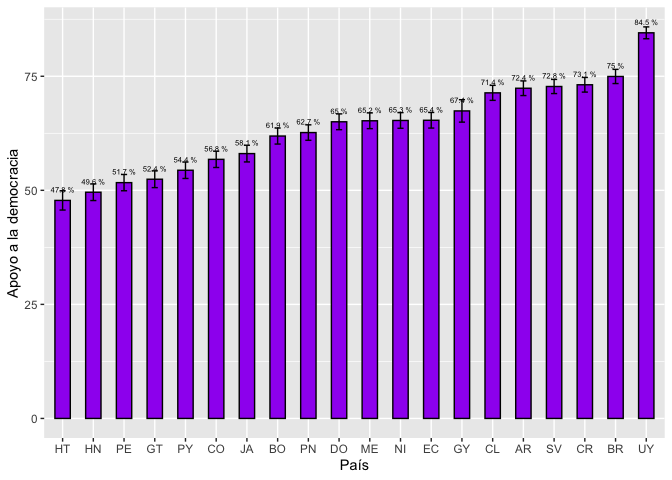
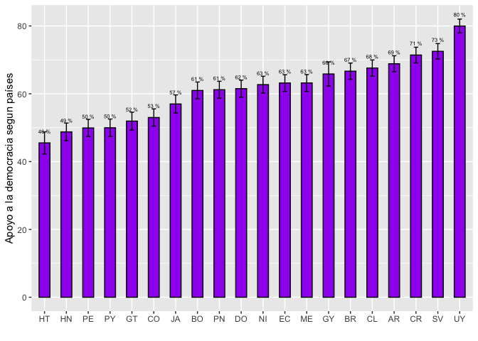

<style type="text/css">
.columns {display: flex;}
h1 {color: #3366CC;}
</style>

# Introducción

En este documento veremos como construir intervalos de confianza de la media usando los datos del Barómetro de las Américas para más de dos grupos.
Para eso, vamos a seguir usando los últimos reportes "El pulso de la democracia", del 2021, disponible [aquí](https://www.vanderbilt.edu/lapop/ab2021/2021_LAPOP_AmericasBarometer_Pulse_of_Democracy.pdf), y del 2018/19, disponible [aquí](https://www.vanderbilt.edu/lapop/ab2018/2018-19_AmericasBarometer_Regional_Report_Spanish_W_03.27.20.pdf), donde se presentan los principales hallazgos del Barómetro de las Américas.

En ambos reportes, una de las secciones reporta los resultados acerca del apoyo a la democracia electoral por país.
Este tipo de gráficos es uno de los más usados con los datos del Barómetro de las Américas pues usa al máximo los resultados de un ronda, presentando una visión panorámica de la región para una variable crítica como el apoyo a la democracia para todos los países en América Latina.

# Sobre la base de datos

Los datos que vamos a usar deben citarse de la siguiente manera: Fuente: Barómetro de las Américas por el Proyecto de Opinión Pública de América Latina (LAPOP), wwww.LapopSurveys.org.
Pueden descargar los datos de manera libre [aquí](http://datasets.americasbarometer.org/database/login.php).

En este documento se carga nuevamente una base de datos recortada, originalmente en formato SPSS (.sav).
Esta base de datos se encuentra alojada en el repositorio "materials_edu" de la cuenta de LAPOP en GitHub.
Mediante la librería `rio` y el comando `import` se puede importar esta base de datos desde este repositorio.
Además, se seleccionan los datos de países con códigos menores o iguales a 35, es decir, se elimina las observaciones de Estados Unidos y Canadá.


```r
library(rio)
lapop18 <- import("https://raw.github.com/lapop-central/materials_edu/main/LAPOP_AB_Merge_2018_v1.0.sav")
lapop18 <- subset(lapop18, pais<=35)
```

También cargamos la base de datos de la ronda 2021.


```r
lapop21 = import("lapop21.RData") 
lapop21 <- subset(lapop21, pais<=35)
```

# Apoyo a la democracia según países para 2021

El gráfico 1.1 muestra el porcentaje de ciudadanos en cada país que apoya a la democracia.
Cada barra de país incluye el intervalo de confianza al 95%.
La pregunta en la que se basa este gráfico es: **ING4.** Puede que la democracia tenga problemas, pero es mejor que cualquier otra forma de gobierno.
¿Hasta qué puntó está de acuerdo o en desacuerdo con esta frase?
Los entrevistados podían responder en una escala de 1 a 7, donde 1 significa "muy en desacuerdo" y 7 "muy de acuerdo".

Para el cálculo de estos porcentajes, se recodificaron todas las respuestas entre 5 y 7 como aquellos que apoyan a la democracia.

{width="584"}

En primer lugar, por tanto, es crear una nueva variable con esta recodificación que identifica a los que apoyan a la democracia.


```r
library(car)
lapop21$ing4r <- car::recode(lapop21$ing4, "1:4=0; 5:7=100")
table(lapop21$ing4r)
```

```
## 
##     0   100 
## 20523 36240
```

Para poder replicar el gráfico 1.1 se tiene que definir a la variable que identifica a los países como una variable de tipo factor.
Para esto se crea una nueva variable de tipo factor con el comando `as.factor`, la que se etiqueta con las siglas de cada país, con el comando `levels`, de la misma manera en que se presenta en el gráfico 1.1.


```r
lapop21$paises <- as.factor(lapop21$pais)
levels(lapop21$paises) <- c("ME", "GT", "SV", "HN", "NI",
                            "CR", "PN", "CO", "EC", "BO", "PE",
                            "PY", "CL", "UY", "BR", "AR", "DO",
                            "HT", "JA", "GY")
table(lapop21$paises)
```

```
## 
##   ME   GT   SV   HN   NI   CR   PN   CO   EC   BO   PE   PY   CL   UY   BR   AR 
## 2998 3000 3245 2999 2997 2977 3183 3003 3005 3002 3038 3004 2954 3009 3016 3011 
##   DO   HT   JA   GY 
## 3000 3088 3121 3011
```

Una vez hecho este trabajo, se puede usar la librería `Rmisc` y el comando `summarySE` para calcular las medias (es decir, los porcentajes) del apoyo a la democracia por cada país.
este comando adicionalmente incluye la desviación estándar, el error estándar y el intervalo de confianza.
Esta tabla se guarda en un objeto "df".


```r
library(Rmisc)
df <- summarySE(data=lapop21, measurevar="ing4r", groupvar="paises", na.rm=T)
df
```

<div data-pagedtable="false">
  <script data-pagedtable-source type="application/json">
{"columns":[{"label":["paises"],"name":[1],"type":["fct"],"align":["left"]},{"label":["N"],"name":[2],"type":["dbl"],"align":["right"]},{"label":["ing4r"],"name":[3],"type":["dbl"],"align":["right"]},{"label":["sd"],"name":[4],"type":["dbl"],"align":["right"]},{"label":["se"],"name":[5],"type":["dbl"],"align":["right"]},{"label":["ci"],"name":[6],"type":["dbl"],"align":["right"]}],"data":[{"1":"ME","2":"2929","3":"65.24411","4":"47.62763","5":"0.8800337","6":"1.725548"},{"1":"GT","2":"2836","3":"52.43300","4":"49.94958","5":"0.9379479","6":"1.839129"},{"1":"SV","2":"3168","3":"72.75884","4":"44.52708","5":"0.7911005","6":"1.551121"},{"1":"HN","2":"2886","3":"49.58420","4":"50.00694","5":"0.9308551","6":"1.825208"},{"1":"NI","2":"2955","3":"65.31303","4":"47.60544","5":"0.8757454","6":"1.717133"},{"1":"CR","2":"2926","3":"73.13739","4":"44.33208","5":"0.8195603","6":"1.606974"},{"1":"PN","2":"3128","3":"62.65985","4":"48.37847","5":"0.8650053","6":"1.696036"},{"1":"CO","2":"2953","3":"56.78971","4":"49.54524","5":"0.9117384","6":"1.787707"},{"1":"EC","2":"2976","3":"65.35618","4":"47.59148","5":"0.8723941","6":"1.710557"},{"1":"BO","2":"2942","3":"61.89667","4":"48.57233","5":"0.8955041","6":"1.755878"},{"1":"PE","2":"3022","3":"51.68762","4":"49.97978","5":"0.9091742","6":"1.782663"},{"1":"PY","2":"2930","3":"54.40273","4":"49.81428","5":"0.9202802","6":"1.804462"},{"1":"CL","2":"2902","3":"71.36458","4":"45.21349","5":"0.8393040","6":"1.645692"},{"1":"UY","2":"2979","3":"84.52501","4":"36.17268","5":"0.6627435","6":"1.299482"},{"1":"BR","2":"2987","3":"74.95815","4":"43.33266","5":"0.7928622","6":"1.554612"},{"1":"AR","2":"2983","3":"72.37680","4":"44.72079","5":"0.8188095","6":"1.605489"},{"1":"DO","2":"2919","3":"65.02227","4":"47.69812","5":"0.8828445","6":"1.731062"},{"1":"HT","2":"2149","3":"47.78967","4":"49.96275","5":"1.0777750","6":"2.113591"},{"1":"JA","2":"2794","3":"58.05297","4":"49.35607","5":"0.9337430","6":"1.830896"},{"1":"GY","2":"1399","3":"67.40529","4":"46.88952","5":"1.2536230","6":"2.459185"}],"options":{"columns":{"min":{},"max":[10]},"rows":{"min":[10],"max":[10]},"pages":{}}}
  </script>
</div>

Con esta table "df" se usa para poder replicar el gráfico 1.1 usando la librería `ggplot2`, de la misma manera que se ha hecho en módulos anteriores.


```r
library(ggplot2)
graf1 <- ggplot(df, aes(x=reorder(paises, ing4r), y=ing4r))+
  geom_bar(width=0.5, fill="purple", colour="black", stat="identity")+
  geom_errorbar(aes(ymin=ing4r-ci, ymax=ing4r+ci), width=0.2)+
  geom_text(aes(label=paste(round(ing4r, 1), "%")), vjust=-1.5, size=2)+
  xlab("País")+
  ylab("Apoyo a la democracia")
graf1
```

<!-- -->

Estos resultados no reproducen exactamente los resultados del gráfico 1.1 debido a que los procedimiento usados hasta el momento no toman en cuenta el efecto de diseño.

# Apoyo a la democracia según países para 2018/19

El gráfico 1.2 del reporte 2018 muestra el promedio del apoyo a la democracia electoral para cada uno de los 18 países analizados.
Presenta, además, los intervalos de confianza por cada país, en forma de una barra gris, que indica el intervalo inferior y superior de este intervalo, con un punto que indica el valor de la media.

{width="363"}

Para reproducir, los datos de este gráfico, primero se tiene que recodificar la variable, de la misma manera que se hizo en la sección sobre [intervalos de confianza](https://arturomaldonado.github.io/BarometroEdu_Web/IC.html).


```r
library(car)
lapop18$ing4r <- car::recode(lapop18$ing4, "1:4=0; 5:7=100")
table(lapop18$ing4r)
```

```
## 
##     0   100 
## 11463 15623
```

Cuando se importa la base de datos, las variables son definidas como numéricas, siendo que muchas de ellas son factores, como la variable "pais".
Para poder evaluar el apoyo a la democracia según países, se va a definir una nueva variable "paises" como factor y se va a etiquetar.


```r
lapop18$paises <- as.factor(lapop18$pais)
levels(lapop18$paises) <- c("México", "Guatemala", "El Salvador", "Honduras", "Nicaragua",
                            "Costa Rica", "Panamá", "Colombia", "Ecuador", "Bolivia", "Perú",
                            "Paraguay", "Chile", "Uruguay", "Brasil", "Argentina", "Rep. Dom.",
                            "Jamaica")
table(lapop18$paises)
```

```
## 
##      México   Guatemala El Salvador    Honduras   Nicaragua  Costa Rica 
##        1580        1596        1511        1560        1547        1501 
##      Panamá    Colombia     Ecuador     Bolivia        Perú    Paraguay 
##        1559        1663        1533        1682        1521        1515 
##       Chile     Uruguay      Brasil   Argentina   Rep. Dom.     Jamaica 
##        1638        1581        1498        1528        1516        1513
```

Con estas variables, se crea un nuevo dataframe con los datos del promedio de apoyo a la democracia por cada país( que es el porcentaje de ciudadanos que apoya a la democracia) , con los datos para construir los intervalos de confianza.
Para esto usamos el comando `summarySE` que es parte de la librería `Rmisc`.
Estos datos se guardan en el dataframe "df".


```r
library(Rmisc)
df <- summarySE(data=lapop18, measurevar="ing4r", groupvar="paises", na.rm=T)
df
```

<div data-pagedtable="false">
  <script data-pagedtable-source type="application/json">
{"columns":[{"label":["paises"],"name":[1],"type":["fct"],"align":["left"]},{"label":["N"],"name":[2],"type":["dbl"],"align":["right"]},{"label":["ing4r"],"name":[3],"type":["dbl"],"align":["right"]},{"label":["sd"],"name":[4],"type":["dbl"],"align":["right"]},{"label":["se"],"name":[5],"type":["dbl"],"align":["right"]},{"label":["ci"],"name":[6],"type":["dbl"],"align":["right"]}],"data":[{"1":"México","2":"1513","3":"62.72307","4":"48.37013","5":"1.243534","6":"2.439235"},{"1":"Guatemala","2":"1524","3":"48.88451","4":"50.00396","5":"1.280890","6":"2.512496"},{"1":"El Salvador","2":"1465","3":"58.56655","4":"49.27750","5":"1.287448","6":"2.525440"},{"1":"Honduras","2":"1493","3":"45.01005","4":"49.76705","5":"1.287989","6":"2.526461"},{"1":"Nicaragua","2":"1496","3":"51.53743","4":"49.99307","5":"1.292540","6":"2.535385"},{"1":"Costa Rica","2":"1458","3":"72.35940","4":"44.73735","5":"1.171633","6":"2.298267"},{"1":"Panamá","2":"1537","3":"53.80612","4":"49.87115","5":"1.272074","6":"2.495186"},{"1":"Colombia","2":"1619","3":"59.78999","4":"49.04734","5":"1.218967","6":"2.390921"},{"1":"Ecuador","2":"1512","3":"54.43122","4":"49.81973","5":"1.281225","6":"2.513169"},{"1":"Bolivia","2":"1630","3":"49.14110","4":"50.00796","5":"1.238641","6":"2.429496"},{"1":"Perú","2":"1496","3":"49.26471","4":"50.01131","5":"1.293012","6":"2.536310"},{"1":"Paraguay","2":"1478","3":"51.21786","4":"50.00208","5":"1.300621","6":"2.551262"},{"1":"Chile","2":"1550","3":"63.87097","4":"48.05295","5":"1.220546","6":"2.394097"},{"1":"Uruguay","2":"1529","3":"76.19359","4":"42.60379","5":"1.089543","6":"2.137158"},{"1":"Brasil","2":"1471","3":"59.82325","4":"49.04221","5":"1.278685","6":"2.508243"},{"1":"Argentina","2":"1495","3":"71.10368","4":"45.34325","5":"1.172714","6":"2.300340"},{"1":"Rep. Dom.","2":"1474","3":"59.22659","4":"49.15800","5":"1.280400","6":"2.511601"},{"1":"Jamaica","2":"1346","3":"51.18871","4":"50.00445","5":"1.362969","6":"2.673777"}],"options":{"columns":{"min":{},"max":[10]},"rows":{"min":[10],"max":[10]},"pages":{}}}
  </script>
</div>

Con este nuevo dataframe, se construye un gráfico similar al Gráfico 1.2 del reporte.
Se tiene que tomar en cuenta que algunos porcentajes no son similares a los mostrados en el reporte porque este código no incluye el factor de expansión.

Para la construcción del gráfico se usa la librería `ggplot2`.
El comando `ggplot` requiere primero especificar el dataframe con el que se trabaja, que en este caso es "df".
Luego, se define la "estética" del gráfico con la especificación `aes`, donde se indica qué información se incluirá en cada eje.
Por defecto las barras son verticales, por lo que en el eje X se define la variable "paises", pero se usa la especificación `reorder` para indicar que las barras no sigan el orden de la variable "paises" sino que vayan ordenadas por los valores de la variable "ing4r".
En el eje Y se define la variable "ing4r" que marcará la altura de la barra.

Una vez definidos los ejes, se usa el comando `geom_bar` para indicar que se va a crear un gráfico de barras.
Dentro de este comando se especifica el ancho, el color interno, el color del borde y, sobre todo, que se use los datos del dataframe "df" tal como aparecen, con la especificación `stat="identity"`.

Además de la barra, se agrega `goem_errorbar` para incluir las barras de error que mancan los límites de los intervalos de confianza.
Esta capa también requiere una estética `aes` donde se define los límites inferior (`ymin=ing4r-ci`) y superior (`ymax=ing4r+ci`).

Se usa `geom_text` para añadir las etiquetas de datos a cada barra.
Esta especificación requiere una estética `aes` donde se define que se usará el dato de "ing4r", pero redondeado a 1 decimal y con el símbolo "%".
Se ajusta la posición de la etiqueta con `hjust` y el tamaño de la etiqueta con `size`.

Finalmente, se indica que el eje X no tenga una etiqueta y que el eje Y se nombre como "Apoyo a la democracia según países. Se usa la especificación `coord_flip()` para girar el gráfico 90 grados y presentar las barras horizontales.


```r
library(ggplot2)
graf1 <- ggplot(df, aes(x=reorder(paises, ing4r), y=ing4r))+
  geom_bar(width=0.5, fill="purple", colour="black", stat="identity")+
  geom_errorbar(aes(ymin=ing4r-ci, ymax=ing4r+ci), width=0.2)+
  geom_text(aes(label=paste(round(ing4r, 1), "%")), hjust=-0.8, size=2)+
  xlab("")+
  ylab("Apoyo a la democracia según países")+
  coord_flip()
graf1
```

<!-- -->

Este tipo de gráficos es bastante usado en los reportes del Barómetro de las Américas y otros elaborados por LAPOP.
Este gráfico muestra el valor promedio del apoyo a la democracia en cada país y una barra con los intervalos de confianza al 95%.
De esta manera, se puede hacer una comparación visual entre los países para saber donde podría haber diferencias estadísticamente significativas.
Cuando los intervalos de confianza de dos países se intersectan, no se puede decir que haya una diferencia en el promedio poblacional del apoyo a la democracia.
De otro lado, si los intervalos de confianza no se intersectan, se podría decir que hay una diferencia poblacional en el promedio de apoyo a la democracia entre los países comparados.

Si, por ejemplo, se compara el apoyo a la democracia promedio entre Uruguay (76.2%) y Costa Rica (72.4%), los países arriba en la clasificación, no se podría decir que los promedios poblacionales de ambos países son diferentes pues los intervalos de confianza se intersectan.
Por el contrario, si se compara Argentina (71.1%) y Chile (63.9), se podría decir que el promedio poblacional de apoyo a la democracia en Argentina es mayor que el equivalente en Chile, pues ambos intervalos de confianza no se intersectan.

Sin embargo, esta comparación visual es referencial, pues para saber si hay diferencias estadísticamente significativas entre los países (o entre un par de países) se tiene que hacer una prueba estadística.
En el documento sobre la [la comparación de 2 medias](https://arturomaldonado.github.io/BarometroEdu_Web/pruebat.html), se uso la prueba t para comparar dos grupos.
Se podría usar este mismo test para comparar si las diferencias en las medias muestrales entre dos países son extrapolables, pero no ayuda si se quisiera tener una comparación general entre todo este grupo de países, o sería muy engorroso tener que hacer las múltiples comparaciones para cada pareja de países.

Para poder tener ese panorama general y, a su vez, poder evaluar los emparejamientos se puede usar otra prueba estadística.

# Test de ANOVA

El test de ANOVA sirve para comparar la media de una variable dependiente numérica entre grupos de una variable de tipo factor.
En este caso, usamos el test de ANOVA con una variable dummy, codificada como 0-1, de tal manera que la media equivale a la proporción.

Esta prueba se basa en la distribución F y propone la siguiente hipótesis nula para la comparación de una variable numérica X entre n grupos de la variable de factor.

$$
H0: \mu_{x1} = \mu_{x2} = \mu_{x1} =...= \mu_{xn}
$$

La hipótesis alternativa que propone es que al menos una media poblacional de un grupo es diferente.

# Evaluando las medias mediante ANOVA

El comando `aov` realiza el análisis de varianza con una variable dependiente numérica y una variable independiente de tipo factor con más de 2 grupos.
Esta prueba se guarda en un objeto "anova" para luego describir los resultados con el comando `summary`.

Por ejemplo, para el caso del reporte 2021.


```r
anova1 <- aov(lapop21$ing4r~ lapop21$paises)
summary(anova1)
```

```
##                   Df    Sum Sq Mean Sq F value Pr(>F)    
## lapop21$paises    19   5043583  265452   119.6 <2e-16 ***
## Residuals      56743 125984290    2220                   
## ---
## Signif. codes:  0 '***' 0.001 '**' 0.01 '*' 0.05 '.' 0.1 ' ' 1
## 3898 observations deleted due to missingness
```

El valor del estadístico de la prueba F es 119.6, con un correspondiente p-value muy pequeño.
Como este valor del p-value es menor de 0.05, se puede rechazar la hipótesis nula y afirmar que al menos una media poblacional es diferente.
El test de ANOVA no nos indica cuáles medias son diferentes.

Para averiguar qué medias son diferentes, se tiene que evaluar los diferentes emparejamientos para saber las diferencias en cada pareja.
Este detalle se puede calcular con una prueba post-hoc llamada Test de Tukey.
En R este test se puede correr con el comando `TukeyHSD`.

En este caso los emparejamiento son muchos porque se tienen muchos países.
En cada emparejamiento se tiene el valor de la diferencia de la variable "ing4r" entre los 2 países, así como el límite inferior y superior de esta diferencia.
Se tiene que evaluar el p-value ajustado ("p adj") para saber si la diferencia en el apoyo a la democracia entre esos dos países es estadísticamente significativo y extrapolable a la población.

Por ejemplo, el gráfico 1.1 muestra que los intervalos de confianza del apoyo a la democracia entre Uruguay y El Salvador no se intersectan, por lo que probablemente sí había diferencias significativas.
El test de Tukey indica que el p-value de este emparejamiento es menor a 0.05, por lo que efectivamente se puede concluir que sí existen diferencias estadísticamente significativas.

El gráfico 1.1 también muestra que la comparación de intervalos entre El Salvador y Costa Rica se interectan, por lo que probablemente no se pueda decir que haya diferencias.
El test de Tukey muestra que este emparejamiento reporta un p-value muy cercano a 1, mayor a 0.05, con lo que efectivamente no se puede concluir que haya diferencias significativas entre estos dos países.


```r
TukeyHSD(anova1)
```

```
##   Tukey multiple comparisons of means
##     95% family-wise confidence level
## 
## Fit: aov(formula = lapop21$ing4r ~ lapop21$paises)
## 
## $`lapop21$paises`
##               diff          lwr           upr     p adj
## GT-ME -12.81110639 -17.21014734  -8.412065438 0.0000000
## SV-ME   7.51472777   3.23440052  11.795055007 0.0000001
## HN-ME -15.65991103 -20.03954846 -11.280273609 0.0000000
## NI-ME   0.06891815  -4.28488763   4.422723926 1.0000000
## CR-ME   7.89327831   3.52874562  12.257811001 0.0000000
## PN-ME  -2.58426407  -6.87771869   1.709190547 0.8399056
## CO-ME  -8.45440523 -12.80894488  -4.099865590 0.0000000
## EC-ME   0.11207218  -4.23408021   4.458224564 1.0000000
## BO-ME  -3.34744169  -7.70603319   1.011149820 0.4118048
## PE-ME -13.55648653 -17.88620050  -9.226772555 0.0000000
## PY-ME -10.84138024 -15.20442232  -6.478338170 0.0000000
## CL-ME   6.12046554   1.74691370  10.494017378 0.0001281
## UY-ME  19.28089777  14.93583101  23.625964536 0.0000000
## BR-ME   9.71404137   5.37186027  14.056222482 0.0000000
## AR-ME   7.13269126   2.78906902  11.476313499 0.0000011
## DO-ME  -0.22184272  -4.58899259   4.145307157 1.0000000
## HT-ME -17.45444100 -22.19729333 -12.711588678 0.0000000
## JA-ME  -7.19113997 -11.60694748  -2.775332452 0.0000015
## GY-ME   2.16117887  -3.26565130   7.588009046 0.9977259
## SV-GT  20.32583415  16.00919456  24.642473747 0.0000000
## HN-GT  -2.84880465  -7.26393772   1.566328428 0.7442009
## NI-GT  12.88002453   8.49051421  17.269534855 0.0000000
## CR-GT  20.70438470  16.30423450  25.104534888 0.0000000
## PN-GT  10.22684232   5.89718544  14.556499191 0.0000000
## CO-GT   4.35670115  -0.03353706   8.746939370 0.0545886
## EC-GT  12.92317856   8.54125927  17.305097854 0.0000000
## BO-GT   9.46366470   5.06940754  13.857921863 0.0000000
## PE-GT  -0.74538014  -5.11099570   3.620235415 1.0000000
## PY-GT   1.96972614  -2.42894550   6.368397787 0.9904296
## CL-GT  18.93157192  14.52247544  23.340668407 0.0000000
## UY-GT  32.09200416  27.71116163  36.472846690 0.0000000
## BR-GT  22.52514776  18.14716731  26.903128216 0.0000000
## AR-GT  19.94379765  15.56438784  24.323207453 0.0000000
## DO-GT  12.58926367   8.18651747  16.992009871 0.0000000
## HT-GT  -4.64333462  -9.41898371   0.132314478 0.0683755
## JA-GT   5.61996642   1.16895169  10.070981147 0.0013071
## GY-GT  14.97228526   9.51676862  20.427801901 0.0000000
## HN-SV -23.17463880 -27.47150278 -18.877774816 0.0000000
## NI-SV  -7.44580962 -11.71634131  -3.175277933 0.0000001
## CR-SV   0.37855054  -3.90291670   4.660017785 1.0000000
## PN-SV -10.09899184 -14.30797849  -5.890005180 0.0000000
## CO-SV -15.96913300 -20.24041286 -11.697853141 0.0000000
## EC-SV  -7.40265559 -11.66538437  -3.139926804 0.0000001
## BO-SV -10.86216945 -15.13758008  -6.586758824 0.0000000
## PE-SV -21.07121429 -25.31718170 -16.825246888 0.0000000
## PY-SV -18.35610801 -22.63605570 -14.076160316 0.0000000
## CL-SV  -1.39426223  -5.68492323   2.896398772 0.9998649
## UY-SV  11.76617001   7.50454810  16.027791917 0.0000000
## BR-SV   2.19931361  -2.05936610   6.457993321 0.9564240
## AR-SV  -0.38203651  -4.64218560   3.878112585 1.0000000
## DO-SV  -7.73657048 -12.02070565  -3.452435315 0.0000000
## HT-SV -24.96916877 -29.63569471 -20.302642835 0.0000000
## JA-SV -14.70586773 -19.03959270 -10.372142762 0.0000000
## GY-SV  -5.35354889 -10.71380092   0.006703139 0.0507278
## NI-HN  15.72882918  11.35876470  20.098893661 0.0000000
## CR-HN  23.55318934  19.17243776  27.933940925 0.0000000
## PN-HN  13.07564696   8.76570597  17.385587955 0.0000000
## CO-HN   7.20550580   2.83471019  11.576301415 0.0000010
## EC-HN  15.77198321  11.40954360  20.134422823 0.0000000
## BO-HN  12.31246935   7.93763693  16.687301769 0.0000000
## PE-HN   2.10342451  -2.24263830   6.449487309 0.9773844
## PY-HN   4.81853079   0.43926431   9.197797274 0.0142698
## CL-HN  21.78037657  17.39063916  26.170113978 0.0000000
## UY-HN  34.94080881  30.57945077  39.302166850 0.0000000
## BR-HN  25.37395241  21.01546923  29.732435581 0.0000000
## AR-HN  22.79260229  18.43268338  27.152521210 0.0000000
## DO-HN  15.43806832  11.05470924  19.821427396 0.0000000
## HT-HN  -1.79452997  -6.55231170   2.963251759 0.9988893
## JA-HN   8.46877107   4.03693231  12.900609828 0.0000000
## GY-HN  17.82108991  12.38120714  23.260972675 0.0000000
## CR-NI   7.82436016   3.46943362  12.179286707 0.0000000
## PN-NI  -2.65318222  -6.93687130   1.630506864 0.8040200
## CO-NI  -8.52332338 -12.86823478  -4.178411978 0.0000000
## EC-NI   0.04315403  -4.29335149   4.379659554 1.0000000
## BO-NI  -3.41635983  -7.76533207   0.932612403 0.3668110
## PE-NI -13.62540467 -17.94543508  -9.305374272 0.0000000
## PY-NI -10.91029839 -15.26373103  -6.556865753 0.0000000
## CL-NI   6.05154739   1.68758184  10.415512937 0.0001607
## UY-NI  19.21197963  14.87656214  23.547397111 0.0000000
## BR-NI   9.64512323   5.31259782  13.977648630 0.0000000
## AR-NI   7.06377311   2.72980337  11.397742858 0.0000014
## DO-NI  -0.29076086  -4.64831036   4.066788632 1.0000000
## HT-NI -17.52335915 -22.25737307 -12.789345233 0.0000000
## JA-NI  -7.26005811 -11.66637127  -2.853744961 0.0000010
## GY-NI   2.09226073  -3.32684670   7.511368155 0.9984831
## PN-CR -10.47754238 -14.77213351  -6.182951246 0.0000000
## CO-CR -16.34768354 -20.70334376 -11.992023322 0.0000000
## EC-CR  -7.78120613 -12.12848126  -3.433931006 0.0000000
## BO-CR -11.24071999 -15.60043103  -6.881008953 0.0000000
## PE-CR -21.44976484 -25.78060581 -17.118923863 0.0000000
## PY-CR -18.73465855 -23.09881902 -14.370498085 0.0000000
## CL-CR  -1.77281277  -6.14748032   2.601854776 0.9971565
## UY-CR  11.38761947   7.04142968  15.733809247 0.0000000
## BR-CR   1.82076307  -2.52254181   6.164067938 0.9956520
## AR-CR  -0.76058705  -5.10533268   3.584158583 1.0000000
## DO-CR  -8.11512103 -12.48338824  -3.746853810 0.0000000
## HT-CR -25.34771931 -30.09160049 -20.603838135 0.0000000
## JA-CR -15.08441828 -19.50133082 -10.667505728 0.0000000
## GY-CR  -5.73209943 -11.15982881  -0.304370060 0.0253704
## CO-PN  -5.87014116 -10.15457612  -1.585706207 0.0002154
## EC-PN   2.69633625  -1.57957394   6.972246438 0.7789850
## BO-PN  -0.76317761  -5.05173067   3.525375439 1.0000000
## PE-PN -10.97222246 -15.23142314  -6.713021773 0.0000000
## PY-PN  -8.25711617 -12.55019240  -3.964039942 0.0000000
## CL-PN   8.70472961   4.40097275  13.008486465 0.0000000
## UY-PN  21.86516184  17.59035512  26.139968572 0.0000000
## BR-PN  12.29830544   8.02643183  16.570179056 0.0000000
## AR-PN   9.71695533   5.44361688  13.990293784 0.0000000
## DO-PN   2.36242135  -1.93482956   6.659672266 0.9225956
## HT-PN -14.87017693 -19.54874675 -10.191607113 0.0000000
## JA-PN  -4.60687590  -8.95356698  -0.260184811 0.0241854
## GY-PN   4.74544295  -0.62529752  10.116183406 0.1675043
## EC-CO   8.56647741   4.22923510  12.903719726 0.0000000
## BO-CO   5.10696355   0.75725663   9.456670463 0.0050722
## PE-CO  -5.10208129  -9.42285130  -0.781311291 0.0045949
## PY-CO  -2.38697501  -6.74114157   1.967191555 0.9244792
## CL-CO  14.57487077  10.21017307  18.939568474 0.0000000
## UY-CO  27.73530301  23.39914855  32.071457468 0.0000000
## BR-CO  18.16844661  13.83518374  22.501709478 0.0000000
## AR-CO  15.58709649  11.25238953  19.921803461 0.0000000
## DO-CO   8.23256252   3.87427978  12.590845246 0.0000000
## HT-CO  -9.00003577 -13.73472462  -4.265346919 0.0000000
## JA-CO   1.26326527  -3.14377301   5.670303540 0.9999800
## GY-CO  10.61558411   5.19588706  16.035281152 0.0000000
## BO-EC  -3.45951386  -7.80082418   0.881796458 0.3390271
## PE-EC -13.66855871 -17.98087577  -9.356241639 0.0000000
## PY-EC -10.95345242 -15.29923101  -6.607673834 0.0000000
## CL-EC   6.00839336   1.65206335  10.364723362 0.0001835
## UY-EC  19.16882560  14.84109402  23.496557169 0.0000000
## BR-EC   9.60196920   5.27713485  13.926803547 0.0000000
## AR-EC   7.02061908   2.69433782  11.346900343 0.0000017
## DO-EC  -0.33391490  -4.68381759   4.015987795 1.0000000
## HT-EC -17.56651318 -22.29348934 -12.839537026 0.0000000
## JA-EC  -7.30321214 -11.70196326  -2.904461027 0.0000008
## GY-EC   2.04910670  -3.36385378   7.462067172 0.9988335
## PE-BO -10.20904484 -14.53389835  -5.884191339 0.0000000
## PY-BO  -7.49393856 -11.85215733  -3.135719785 0.0000002
## CL-BO   9.46790722   5.09916708  13.836647366 0.0000000
## UY-BO  22.62833946  18.28811597  26.968562945 0.0000000
## BR-BO  13.06148306   8.72414845  17.398817668 0.0000000
## AR-BO  10.48013294   6.14135559  14.818910295 0.0000000
## DO-BO   3.12559897  -1.23673215   7.487930083 0.5529493
## HT-BO -14.10699932 -18.84541497  -9.368583664 0.0000000
## JA-BO  -3.84369828  -8.25474019   0.567343629 0.1869365
## GY-BO   5.50862056   0.08566745  10.931573671 0.0415494
## PY-PE   2.71510629  -1.61423247   7.044445040 0.7868317
## CL-PE  19.67695206  15.33702192  24.016882205 0.0000000
## UY-PE  32.83738430  28.52616138  37.148607225 0.0000000
## BR-PE  23.27052790  18.96221330  27.578842502 0.0000000
## AR-PE  20.68917779  16.37941073  24.998944844 0.0000000
## DO-PE  13.33464381   9.00116531  17.668122314 0.0000000
## HT-PE  -3.89795448  -8.60982100   0.813912044 0.2702314
## JA-PE   6.36534656   1.98283656  10.747856564 0.0000485
## GY-PE  15.71766540  10.31789470  21.117436104 0.0000000
## CL-PY  16.96184578  12.58866540  21.335026163 0.0000000
## UY-PY  30.12227802  25.77758515  34.466970886 0.0000000
## BR-PY  20.55542162  16.21361465  24.897228583 0.0000000
## AR-PY  17.97407150  13.63082328  22.317319724 0.0000000
## DO-PY  10.61953752   6.25275965  14.986315397 0.0000000
## HT-PY  -6.61306076 -11.35557056  -1.870550968 0.0001401
## JA-PY   3.65024028  -0.76519934   8.065679887 0.2714271
## GY-PY  13.00255912   7.57602830  18.429089931 0.0000000
## UY-CL  13.16043224   8.80518532  17.515679154 0.0000000
## BR-CL   3.59357584  -0.75879217   7.945943849 0.2736383
## AR-CL   1.01222572  -3.34158005   5.366031495 0.9999993
## DO-CL  -6.34230825 -10.71958693  -1.965029583 0.0000518
## HT-CL -23.57490654 -28.32708696 -18.822726123 0.0000000
## JA-CL -13.31160550 -17.73743046  -8.885780547 0.0000000
## GY-CL  -3.95928666  -9.39427114   1.475697814 0.5194288
## BR-UY  -9.56685640 -13.89059977  -5.243113026 0.0000000
## AR-UY -12.14820651 -16.47339716  -7.823015865 0.0000000
## DO-UY -19.50274049 -23.85155850 -15.153922489 0.0000000
## HT-UY -36.73533878 -41.46131679 -32.009360765 0.0000000
## JA-UY -26.47203774 -30.86971622 -22.074359262 0.0000000
## GY-UY -17.11971890 -22.53180775 -11.707630051 0.0000000
## AR-BR  -2.58135011  -6.90364184   1.740941611 0.8488682
## DO-BR  -9.93588409 -14.28181893  -5.589949253 0.0000000
## HT-BR -27.16848238 -31.89180746 -22.445157301 0.0000000
## JA-BR -16.90518134 -21.30000871 -12.510353972 0.0000000
## GY-BR  -7.55286250 -12.96263489  -2.143090109 0.0001358
## DO-AR  -7.35453398 -11.70190870  -3.007159250 0.0000004
## HT-AR -24.58713226 -29.31178222 -19.862482311 0.0000000
## JA-AR -14.32383123 -18.72008247  -9.927579983 0.0000000
## GY-AR  -4.97151238 -10.38244158   0.439416806 0.1197505
## HT-DO -17.23259829 -21.97888747 -12.486309100 0.0000000
## JA-DO  -6.96929725 -11.38879596  -2.549798538 0.0000043
## GY-DO   2.38302159  -3.04681253   7.812855712 0.9924358
## JA-HT  10.26330104   5.47220315  15.054398930 0.0000000
## GY-HT  19.61561988  13.87926662  25.351973139 0.0000000
## GY-JA   9.35231884   3.88327354  14.821364146 0.0000003
```

De la misma manera, se puede hacer para las comparaciones entre países de la ronda 2018/19.


```r
anova <- aov(lapop18$ing4r~ lapop18$paises)
summary(anova)
```

```
##                   Df   Sum Sq Mean Sq F value Pr(>F)    
## lapop18$paises    17  2020430  118849   50.19 <2e-16 ***
## Residuals      27068 64097287    2368                   
## ---
## Signif. codes:  0 '***' 0.001 '**' 0.01 '*' 0.05 '.' 0.1 ' ' 1
## 956 observations deleted due to missingness
```

El valor del estadístico de la prueba F es 50.19, con un correspondiente p-value muy pequeño.
Como este valor del p-value es menor de 0.05, se puede rechazar la hipótesis nula y afirmar que al menos una media poblacional es diferente.
El test de ANOVA no nos indica cuáles medias son diferentes.

En este caso habíamos encontrado visualmente los intervalos de confianza del apoyo a la democracia entre Uruguay y Costa Rica se intersectaban, por lo que probablemente no había diferencias significativas.
El test de Tukey indica que el p-value de este emparejamiento (0.785) es mayor a 0.05, por lo que efectivamente no se puede decir que haya diferencias poblacionales en el apoyo a la democracia entre estos dos países.

También habíamos visto que los intervalos de confianza del apoyo a la democracia entre Argentina y Chile no se intersectaban, por lo que se intuía que había una diferencia significativa.
El test de Tukey muestra un p-value de 0.0053, menor de 0.05, por lo que se puede afirmar que existe una diferencia estadísticamente significativa en el apoyo a la democracia entre estos dos países a un 95% de confianza.


```r
TukeyHSD(anova)
```

```
##   Tukey multiple comparisons of means
##     95% family-wise confidence level
## 
## Fit: aov(formula = lapop18$ing4r ~ lapop18$paises)
## 
## $`lapop18$paises`
##                                diff          lwr         upr     p adj
## Guatemala-México       -13.83855232 -19.99973268  -7.6773720 0.0000000
## El Salvador-México      -4.15651385 -10.37919495   2.0661672 0.6610391
## Honduras-México        -17.71301987 -23.90598442 -11.5200553 0.0000000
## Nicaragua-México       -11.18563360 -17.37547195  -4.9957953 0.0000000
## Costa Rica-México        9.63632968   3.40606390  15.8665955 0.0000102
## Panamá-México           -8.91695094 -15.06513692  -2.7687650 0.0000619
## Colombia-México         -2.93307293  -9.00353098   3.1373851 0.9695508
## Ecuador-México          -8.29184982 -14.46519846  -2.1185012 0.0003980
## Bolivia-México         -13.58196246 -19.64251748  -7.5214074 0.0000000
## Perú-México            -13.45836087 -19.64819922  -7.2685225 0.0000000
## Paraguay-México        -11.50520478 -17.71396660  -5.2964430 0.0000000
## Chile-México             1.14790099  -4.98748174   7.2832837 0.9999999
## Uruguay-México          13.47052383   7.31436420  19.6266835 0.0000000
## Brasil-México           -2.89981726  -9.11604738   3.3164129 0.9784115
## Argentina-México         8.38061217   2.18973298  14.5714914 0.0003337
## Rep. Dom.-México        -3.49647245  -9.70949428   2.7165494 0.8866710
## Jamaica-México         -11.53435947 -17.89525932  -5.1734596 0.0000000
## El Salvador-Guatemala    9.68203847   3.47041480  15.8936621 0.0000081
## Honduras-Guatemala      -3.87446755 -10.05632152   2.3073864 0.7629801
## Nicaragua-Guatemala      2.65291872  -3.52580342   8.8316409 0.9909291
## Costa Rica-Guatemala    23.47488200  17.25566016  29.6941038 0.0000000
## Panamá-Guatemala         4.92160137  -1.21539295  11.0585957 0.3140668
## Colombia-Guatemala      10.90547939   4.84635656  16.9646022 0.0000001
## Ecuador-Guatemala        5.54670250  -0.61550019  11.7089052 0.1398789
## Bolivia-Guatemala        0.25658986  -5.79261139   6.3057911 1.0000000
## Perú-Guatemala           0.38019145  -5.79853069   6.5589136 1.0000000
## Paraguay-Guatemala       2.33334754  -3.86433201   8.5310271 0.9980099
## Chile-Guatemala         14.98645331   8.86228563  21.1106210 0.0000000
## Uruguay-Guatemala       27.30907615  21.16409365  33.4540586 0.0000000
## Brasil-Guatemala        10.93873505   4.73357386  17.1438962 0.0000001
## Argentina-Guatemala     22.21916449  16.03939963  28.3989294 0.0000000
## Rep. Dom.-Guatemala     10.34207987   4.14013269  16.5440270 0.0000009
## Jamaica-Guatemala        2.30419285  -4.04589026   8.6542759 0.9987355
## Honduras-El Salvador   -13.55650602 -19.79965707  -7.3133550 0.0000000
## Nicaragua-El Salvador   -7.02911975 -13.26916973  -0.7890698 0.0104582
## Costa Rica-El Salvador  13.79284353   7.51268933  20.0729977 0.0000000
## Panamá-El Salvador      -4.76043709 -10.95917211   1.4382979 0.3949840
## Colombia-El Salvador     1.22344092  -4.89820804   7.3450899 0.9999997
## Ecuador-El Salvador     -4.13533597 -10.35902928   2.0883573 0.6701881
## Bolivia-El Salvador     -9.42544861 -15.53727749  -3.3136197 0.0000112
## Perú-El Salvador        -9.30184702 -15.54189701  -3.0617970 0.0000296
## Paraguay-El Salvador    -7.34869093 -13.60751257  -1.0898693 0.0054118
## Chile-El Salvador        5.30441484  -0.88162156  11.4904512 0.2039906
## Uruguay-El Salvador     17.62703768  11.42039395  23.8336814 0.0000000
## Brasil-El Salvador       1.25669659  -5.00953369   7.5229269 0.9999997
## Argentina-El Salvador   12.53712603   6.29604357  18.7782085 0.0000000
## Rep. Dom.-El Salvador    0.66004140  -5.60300621   6.9230890 1.0000000
## Jamaica-El Salvador     -7.37784562 -13.78761722  -0.9680740 0.0074802
## Nicaragua-Honduras       6.52738627   0.31696971  12.7378028 0.0274890
## Costa Rica-Honduras     27.34934955  21.09863865  33.6000604 0.0000000
## Panamá-Honduras          8.79606892   2.62716579  14.9649721 0.0000960
## Colombia-Honduras       14.77994694   8.68850737  20.8713865 0.0000000
## Ecuador-Honduras         9.42117005   3.22718842  15.6151517 0.0000167
## Bolivia-Honduras         4.13105741  -1.95051329  10.2126281 0.6311571
## Perú-Honduras            4.25465900  -1.95575756  10.4650756 0.6156150
## Paraguay-Honduras        6.20781509  -0.02146242  12.4370926 0.0519721
## Chile-Honduras          18.86092086  12.70477789  25.0170638 0.0000000
## Uruguay-Honduras        31.18354370  25.00669366  37.3603937 0.0000000
## Brasil-Honduras         14.81320260   8.57648136  21.0499239 0.0000000
## Argentina-Honduras      26.09363204  19.88217809  32.3050860 0.0000000
## Rep. Dom.-Honduras      14.21654742   7.98302391  20.4500709 0.0000000
## Jamaica-Honduras         6.17866040  -0.20226602  12.5595868 0.0707770
## Costa Rica-Nicaragua    20.82196328  14.57434969  27.0695769 0.0000000
## Panamá-Nicaragua         2.26868265  -3.89708207   8.4344474 0.9984972
## Colombia-Nicaragua       8.25256067   2.16429944  14.3408219 0.0003239
## Ecuador-Nicaragua        2.89378378  -3.29707216   9.0846397 0.9779746
## Bolivia-Nicaragua       -2.39632886  -8.47471606   3.6820583 0.9965500
## Perú-Nicaragua          -2.27272727  -8.48002641   3.9345719 0.9985861
## Paraguay-Nicaragua      -0.31957118  -6.54574072   5.9065984 1.0000000
## Chile-Nicaragua         12.33353459   6.18053653  18.4865326 0.0000000
## Uruguay-Nicaragua       24.65615743  18.48244176  30.8298731 0.0000000
## Brasil-Nicaragua         8.28581634   2.05219935  14.5194333 0.0005013
## Argentina-Nicaragua     19.56624577  13.35790871  25.7745828 0.0000000
## Rep. Dom.-Nicaragua      7.68916115   1.45874350  13.9195788 0.0022475
## Jamaica-Nicaragua       -0.34872587  -6.72661822   6.0291665 1.0000000
## Panamá-Costa Rica      -18.55328062 -24.75962960 -12.3469316 0.0000000
## Colombia-Costa Rica    -12.56940261 -18.69876128  -6.4400439 0.0000000
## Ecuador-Costa Rica     -17.92817950 -24.15945627 -11.6969027 0.0000000
## Bolivia-Costa Rica     -23.21829214 -29.33784310 -17.0987412 0.0000000
## Perú-Costa Rica        -23.09469055 -29.34230414 -16.8470770 0.0000000
## Paraguay-Costa Rica    -21.14153446 -27.40789705 -14.8751719 0.0000000
## Chile-Costa Rica        -8.48842869 -14.68209465  -2.2947627 0.0002512
## Uruguay-Costa Rica       3.83419415  -2.38005384  10.0484421 0.7849131
## Brasil-Costa Rica      -12.53614694 -18.80990926  -6.2623846 0.0000000
## Argentina-Costa Rica    -1.25571750  -7.50436232   4.9929273 0.9999997
## Rep. Dom.-Costa Rica   -13.13280213 -19.40338560  -6.8622187 0.0000000
## Jamaica-Costa Rica     -21.17068915 -27.58782431 -14.7535540 0.0000000
## Colombia-Panamá          5.98387801  -0.06203109  12.0297871 0.0560681
## Ecuador-Panamá           0.62510112  -5.52410933   6.7743116 1.0000000
## Bolivia-Panamá          -4.66501152 -10.70097731   1.3709543 0.3827833
## Perú-Panamá             -4.54140993 -10.70717465   1.6243548 0.4764882
## Paraguay-Panamá         -2.58825383  -8.77301569   3.5965080 0.9931650
## Chile-Panamá            10.06485193   3.95375734  16.1759465 0.0000014
## Uruguay-Panamá          22.38747477  16.25552099  28.5194286 0.0000000
## Brasil-Panamá            6.01713368  -0.17512542  12.2093928 0.0682368
## Argentina-Panamá        17.29756312  11.13075348  23.4643728 0.0000000
## Rep. Dom.-Panamá         5.42047849  -0.76855989  11.6095169 0.1742618
## Jamaica-Panamá          -2.61740853  -8.95488459   3.7200675 0.9941058
## Ecuador-Colombia        -5.35877689 -11.43027254   0.7127188 0.1640827
## Bolivia-Colombia       -10.64888953 -16.60566325  -4.6921158 0.0000001
## Perú-Colombia          -10.52528794 -16.61354917  -4.4370267 0.0000002
## Paraguay-Colombia       -8.57213185 -14.67963128  -2.4646324 0.0001422
## Chile-Colombia           4.08097392  -1.95191488  10.1138627 0.6386588
## Uruguay-Colombia        16.40359676  10.34957930  22.4576142 0.0000000
## Brasil-Colombia          0.03325567  -6.08183574   6.1483471 1.0000000
## Argentina-Colombia      11.31368511   5.22436566  17.4030045 0.0000000
## Rep. Dom.-Colombia      -0.56339952  -6.67522955   5.5484305 1.0000000
## Jamaica-Colombia        -8.60128654 -14.86338467  -2.3391884 0.0002385
## Bolivia-Ecuador         -5.29011264 -11.35170695   0.7714817 0.1790447
## Perú-Ecuador            -5.16651105 -11.35736698   1.0243449 0.2458647
## Paraguay-Ecuador        -3.21335496  -9.42313126   2.9964213 0.9429345
## Chile-Ecuador            9.43975081   3.30334147  15.5761602 0.0000120
## Uruguay-Ecuador         21.76237365  15.60519087  27.9195564 0.0000000
## Brasil-Ecuador           5.39203256  -0.82521082  11.6092759 0.1877095
## Argentina-Ecuador       16.67246200  10.48056539  22.8643586 0.0000000
## Rep. Dom.-Ecuador        4.79537737  -1.41865825  11.0094130 0.3856771
## Jamaica-Ecuador         -3.24250965  -9.60439972   3.1193804 0.9500850
## Perú-Bolivia             0.12360159  -5.95478562   6.2019888 1.0000000
## Paraguay-Bolivia         2.07675768  -4.02089888   8.1744142 0.9994346
## Chile-Bolivia           14.72986345   8.70693945  20.7527874 0.0000000
## Uruguay-Bolivia         27.05248629  21.00839880  33.0965738 0.0000000
## Brasil-Bolivia          10.68214520   4.57688442  16.7874060 0.0000002
## Argentina-Bolivia       21.96257464  15.88312750  28.0420218 0.0000000
## Rep. Dom.-Bolivia       10.08549001   3.98349586  16.1874841 0.0000012
## Jamaica-Bolivia          2.04760299  -4.20489565   8.3001016 0.9996615
## Paraguay-Perú            1.95315609  -4.27301345   8.1793256 0.9998095
## Chile-Perú              14.60626186   8.45326381  20.7592599 0.0000000
## Uruguay-Perú            26.92888470  20.75516903  33.1026004 0.0000000
## Brasil-Perú             10.55854361   4.32492662  16.7921606 0.0000005
## Argentina-Perú          21.83897305  15.63063599  28.0473101 0.0000000
## Rep. Dom.-Perú           9.96188842   3.73147077  16.1923061 0.0000037
## Jamaica-Perú             1.92400140  -4.45389094   8.3018937 0.9998882
## Chile-Paraguay          12.65310577   6.48107129  18.8251402 0.0000000
## Uruguay-Paraguay        24.97572861  18.78304020  31.1684170 0.0000000
## Brasil-Paraguay          8.60538751   2.35297956  14.8577955 0.0002275
## Argentina-Paraguay      19.88581695  13.65861264  26.1130213 0.0000000
## Rep. Dom.-Paraguay       8.00873233   1.75951408  14.2579506 0.0010806
## Jamaica-Paraguay        -0.02915469  -6.42541417   6.3671048 1.0000000
## Uruguay-Chile           12.32262284   6.20350627  18.4417394 0.0000000
## Brasil-Chile            -4.04771825 -10.22726542   2.1318289 0.6944042
## Argentina-Chile          7.23271119   1.07866605  13.3867563 0.0053246
## Rep. Dom.-Chile         -4.64437344 -10.82069326   1.5319464 0.4358759
## Jamaica-Chile          -12.68226046 -19.00731644  -6.3572045 0.0000000
## Brasil-Uruguay         -16.37034109 -22.57051716 -10.1701650 0.0000000
## Argentina-Uruguay       -5.08991165 -11.26467089   1.0848476 0.2661992
## Rep. Dom.-Uruguay      -16.96699628 -23.16395575 -10.7700368 0.0000000
## Jamaica-Uruguay        -25.00488330 -31.35009514 -18.6596715 0.0000000
## Argentina-Brasil        11.28042944   5.04577891  17.5150800 0.0000000
## Rep. Dom.-Brasil        -0.59665519  -6.85329344   5.6599831 1.0000000
## Jamaica-Brasil          -8.63454221 -15.03805131  -2.2310331 0.0003647
## Rep. Dom.-Argentina    -11.87708463 -18.10853635  -5.6456329 0.0000000
## Jamaica-Argentina      -19.91497165 -26.29387416 -13.5360691 0.0000000
## Jamaica-Rep. Dom.       -8.03788702 -14.43828171  -1.6374923 0.0016139
```

# Resumen

En esta sección se ha expandido la comparación de medias de 2 grupos a más de 2 grupos.
En primer lugar, se realizó una exploración visual, mediante un gráfico de barras con intervalos de confianza.
Luego, se formalizó estas comparaciones con el test de ANOVA y con la prueba post hoc de Tukey que permite evaluar cada emparejamiento entre grupos y saber si hay diferencias estadísticamente significativas.

# Cálculos incluyendo el efecto de diseño

## Para la ronda 2021

Para replicar el gráfico 1.1, se debe crear una tabla con el promedio del apoyo a la democracia por país, incluyendo la variable de ponderación.
Para esto se puede usar el comando `compmeans`, que permite calcular la media de la variable "ing4r" por cada grupo de la variable "paises", incluyendo el efecto de diseño de la variable "weight1500".
Estos datos se guardan en una tabla como un dataframe.


```r
library(descr)
df2 <- as.data.frame(compmeans(lapop21$ing4r, lapop21$paises, lapop21$weight1500, plot=F))
```

```r
df2
```

<div data-pagedtable="false">
  <script data-pagedtable-source type="application/json">
{"columns":[{"label":[""],"name":["_rn_"],"type":[""],"align":["left"]},{"label":["Mean"],"name":[1],"type":["dbl"],"align":["right"]},{"label":["N"],"name":[2],"type":["dbl"],"align":["right"]},{"label":["Std. Dev."],"name":[3],"type":["dbl"],"align":["right"]}],"data":[{"1":"63.19034","2":"1450","3":"48.24541","_rn_":"ME"},{"1":"51.94371","2":"1397","3":"49.98009","_rn_":"GT"},{"1":"72.51405","2":"1460","3":"44.65964","_rn_":"SV"},{"1":"48.76840","2":"1425","3":"50.00237","_rn_":"HN"},{"1":"62.69484","2":"1464","3":"48.37809","_rn_":"NI"},{"1":"71.42359","2":"1476","3":"45.19307","_rn_":"CR"},{"1":"61.20172","2":"1471","3":"48.74563","_rn_":"PN"},{"1":"52.99566","2":"1471","3":"49.92716","_rn_":"CO"},{"1":"63.17680","2":"1483","3":"48.24875","_rn_":"EC"},{"1":"60.97236","2":"1462","3":"48.79791","_rn_":"BO"},{"1":"49.92388","2":"1490","3":"50.01672","_rn_":"PE"},{"1":"49.97591","2":"1453","3":"50.01720","_rn_":"PY"},{"1":"67.58364","2":"1469","3":"46.82209","_rn_":"CL"},{"1":"79.97897","2":"1479","3":"40.02930","_rn_":"UY"},{"1":"66.66251","2":"1479","3":"47.15787","_rn_":"BR"},{"1":"68.85568","2":"1479","3":"46.32402","_rn_":"AR"},{"1":"61.51482","2":"1450","3":"48.67282","_rn_":"DO"},{"1":"45.51642","2":"903","3":"49.82617","_rn_":"HT"},{"1":"56.99446","2":"1324","3":"49.52707","_rn_":"JA"},{"1":"65.83942","2":"680","3":"47.45972","_rn_":"GY"},{"1":"61.34003","2":"27766","3":"48.69794","_rn_":"Total"}],"options":{"columns":{"min":{},"max":[10]},"rows":{"min":[10],"max":[10]},"pages":{}}}
  </script>
</div>

En primer lugar, se crea un vector con los nombres que asignaremos a las columnas, las que asignamos con el comando `colnames`.
El comando `compmeans` no crea una columna con los nombres de los países, por lo que se tiene que agregar una columna de nombre de países con el comando `row.names`.
Finalmente, se crea una nueva columna con los datos del error estándar (desviación estándar dividido por la raíz de n) y el intervalo de confianza (1.96, al 95% de confianza, multiplicado por el error estándar).


```r
varnames <- c("media", "n", "sd")
colnames(df2) <- varnames
df2$pais <- row.names(df2)
df2$err.st <- df2$sd/sqrt(df2$n)
df2$ci <- df2$err.st*1.96
df2 = df2[c(-21),]
df2
```

<div data-pagedtable="false">
  <script data-pagedtable-source type="application/json">
{"columns":[{"label":[""],"name":["_rn_"],"type":[""],"align":["left"]},{"label":["media"],"name":[1],"type":["dbl"],"align":["right"]},{"label":["n"],"name":[2],"type":["dbl"],"align":["right"]},{"label":["sd"],"name":[3],"type":["dbl"],"align":["right"]},{"label":["pais"],"name":[4],"type":["chr"],"align":["left"]},{"label":["err.st"],"name":[5],"type":["dbl"],"align":["right"]},{"label":["ci"],"name":[6],"type":["dbl"],"align":["right"]}],"data":[{"1":"63.19034","2":"1450","3":"48.24541","4":"ME","5":"1.266987","6":"2.483294","_rn_":"ME"},{"1":"51.94371","2":"1397","3":"49.98009","4":"GT","5":"1.337208","6":"2.620927","_rn_":"GT"},{"1":"72.51405","2":"1460","3":"44.65964","4":"SV","5":"1.168796","6":"2.290840","_rn_":"SV"},{"1":"48.76840","2":"1425","3":"50.00237","4":"HN","5":"1.324595","6":"2.596207","_rn_":"HN"},{"1":"62.69484","2":"1464","3":"48.37809","4":"NI","5":"1.264382","6":"2.478188","_rn_":"NI"},{"1":"71.42359","2":"1476","3":"45.19307","4":"CR","5":"1.176329","6":"2.305604","_rn_":"CR"},{"1":"61.20172","2":"1471","3":"48.74563","4":"PN","5":"1.270953","6":"2.491067","_rn_":"PN"},{"1":"52.99566","2":"1471","3":"49.92716","4":"CO","5":"1.301759","6":"2.551447","_rn_":"CO"},{"1":"63.17680","2":"1483","3":"48.24875","4":"EC","5":"1.252897","6":"2.455679","_rn_":"EC"},{"1":"60.97236","2":"1462","3":"48.79791","4":"BO","5":"1.276226","6":"2.501403","_rn_":"BO"},{"1":"49.92388","2":"1490","3":"50.01672","4":"PE","5":"1.295753","6":"2.539675","_rn_":"PE"},{"1":"49.97591","2":"1453","3":"50.01720","4":"PY","5":"1.312159","6":"2.571832","_rn_":"PY"},{"1":"67.58364","2":"1469","3":"46.82209","4":"CL","5":"1.221631","6":"2.394396","_rn_":"CL"},{"1":"79.97897","2":"1479","3":"40.02930","4":"UY","5":"1.040864","6":"2.040093","_rn_":"UY"},{"1":"66.66251","2":"1479","3":"47.15787","4":"BR","5":"1.226225","6":"2.403400","_rn_":"BR"},{"1":"68.85568","2":"1479","3":"46.32402","4":"AR","5":"1.204543","6":"2.360903","_rn_":"AR"},{"1":"61.51482","2":"1450","3":"48.67282","4":"DO","5":"1.278211","6":"2.505293","_rn_":"DO"},{"1":"45.51642","2":"903","3":"49.82617","4":"HT","5":"1.658111","6":"3.249898","_rn_":"HT"},{"1":"56.99446","2":"1324","3":"49.52707","4":"JA","5":"1.361127","6":"2.667809","_rn_":"JA"},{"1":"65.83942","2":"680","3":"47.45972","4":"GY","5":"1.819997","6":"3.567195","_rn_":"GY"}],"options":{"columns":{"min":{},"max":[10]},"rows":{"min":[10],"max":[10]},"pages":{}}}
  </script>
</div>

Con esta tabla, se puede reproducir el gráfico 1.1 usando el comando `ggplot`, de la misma manera que en gráficos anteriores.
Se observa que los valores que se reportan sí reproducen exactamente los datos reportados en el gráfico 1.1.


```r
graf2 <- ggplot(df2, aes(x=reorder(pais, media), y=media))+
  geom_bar(width=0.5, fill="purple", colour="black", stat="identity")+
  geom_errorbar(aes(ymin=media-ci, ymax=media+ci), width=0.2)+
  geom_text(aes(label=paste(round(media, 0), "%")), vjust=-2.5, size=2)+
  xlab("")+
  ylab("Apoyo a la democracia segun países")
graf2
```

<!-- -->

De la misma manera que en la sección inicial, las inferencias de este gráfico tienen que ser formalizadas mediante una prueba estadística.
Para calcular si existen diferencias entre estas medias, se puede usar la librería `survey`.
Antes, se tiene que adecuar los datos.


```r
lapop21 = subset(lapop21, !is.na(weight1500))
sapply(lapop21, haven::zap_labels)
```

Y luego se guarda el diseño en un objeto "diseno21".


```r
library(survey)
diseno21 = svydesign(ids = ~upm, strata = ~strata, weights = ~weight1500, nest=TRUE, data=lapop21)
```

Para el cálculo de la prueba de anova se puede definir un modelo lineal, usando el apoyo a la democracia como variable dependiente y paises como variable independiente.
Este modelo se guarda en un objeto "modelo.anova".

El modelo lineal se puede describir.
Estos resultados muestran que el modelo ha descompuesto en diferentes indicadores a cada país, tomando a México como el país de referencia.
Esto hace que la media de apoyo a la democracia en México se pueda ver en el valor del intercepto (63.2).
Luego, el valor del intercepto de cada país corresponde a la diferencia con México.
Por ejemplo, el valor del coeficiente para Guatemala es -11.2, que corresponde a la diferencia del apoyo a la democracia entre México y Guatemala.
Esta diferencia es igual a la que se observa en la tabla de emparejamientos de más arriba.
Estos resultados, sin embargo, muestran los emparejamientos, todos relativos a México.


```r
modelo.anova1=svyglm(ing4r ~ paises, diseno21)
summary(modelo.anova1)
```

```
## 
## Call:
## svyglm(formula = ing4r ~ paises, design = diseno21)
## 
## Survey design:
## svydesign(ids = ~upm, strata = ~strata, weights = ~weight1500, 
##     nest = TRUE, data = lapop21)
## 
## Coefficients:
##              Estimate Std. Error t value Pr(>|t|)    
## (Intercept)  63.19034    1.05514  59.888  < 2e-16 ***
## paisesGT    -11.24663    1.52445  -7.378 1.63e-13 ***
## paisesSV      9.32371    1.39984   6.661 2.75e-11 ***
## paisesHN    -14.42194    1.55413  -9.280  < 2e-16 ***
## paisesNI     -0.49551    1.58617  -0.312  0.75474    
## paisesCR      8.23324    1.43356   5.743 9.34e-09 ***
## paisesPN     -1.98863    1.47711  -1.346  0.17821    
## paisesCO    -10.19468    1.57860  -6.458 1.07e-10 ***
## paisesEC     -0.01354    1.47670  -0.009  0.99268    
## paisesBO     -2.21798    1.49084  -1.488  0.13683    
## paisesPE    -13.26646    1.52923  -8.675  < 2e-16 ***
## paisesPY    -13.21443    1.52474  -8.667  < 2e-16 ***
## paisesCL      4.39330    1.47807   2.972  0.00296 ** 
## paisesUY     16.78863    1.40219  11.973  < 2e-16 ***
## paisesBR      3.47217    1.64218   2.114  0.03449 *  
## paisesAR      5.66533    1.50069   3.775  0.00016 ***
## paisesDO     -1.67552    1.53256  -1.093  0.27427    
## paisesHT    -17.67392    1.80621  -9.785  < 2e-16 ***
## paisesJA     -6.19588    1.48863  -4.162 3.16e-05 ***
## paisesGY      2.64908    1.88539   1.405  0.16001    
## ---
## Signif. codes:  0 '***' 0.001 '**' 0.01 '*' 0.05 '.' 0.1 ' ' 1
## 
## (Dispersion parameter for gaussian family taken to be 2269.381)
## 
## Number of Fisher Scoring iterations: 2
```

Para calcular la prueba de anova de este modelo, se puede usar el comando `aov` que usa como argumento el objeto con el modelo lineal.
Estos resultados, a su vez, se guardan en otro objeto "anova.w1".
Se puede presentar un `summary` de estos resultados, los que muestran los datos para sacar conclusiones de anova.
Como el p-value (Pr>F) es menor a 0.05, se concluye que al menos un par de medias son diferentes.


```r
anova.w1=aov(modelo.anova1)
summary(anova.w1)
```

```
##                Df    Sum Sq Mean Sq F value Pr(>F)    
## paises         19   4325971  227683   100.3 <2e-16 ***
## Residuals   56733 128791904    2270                   
## ---
## Signif. codes:  0 '***' 0.001 '**' 0.01 '*' 0.05 '.' 0.1 ' ' 1
## 3898 observations deleted due to missingness
```

Para poder evaluar todos los emparejamientos, se puede usar el comando `TukeyHSD`, usando los resultados de anova con el modelo lineal, el objeto "anova.w1".
Este comando nos muestra el valor de todos los emparejamientos, tomando en cuenta el efecto de diseño.


```r
TukeyHSD(anova.w1)
```

```
##   Tukey multiple comparisons of means
##     95% family-wise confidence level
## 
## Fit: aov(formula = modelo.anova1)
## 
## $paises
##               diff           lwr          upr     p adj
## GT-ME -11.24663349 -15.655677424  -6.83758955 0.0000000
## SV-ME   9.32370920   5.033648918  13.61376949 0.0000000
## HN-ME -14.42193823 -18.811534518 -10.03234194 0.0000000
## NI-ME  -0.49550702  -4.859212929   3.86819888 1.0000000
## CR-ME   8.23324428   3.858787066  12.60770149 0.0000000
## PN-ME  -1.98862590  -6.291843413   2.31459161 0.9863114
## CO-ME -10.19467955 -14.562811779  -5.82654732 0.0000000
## EC-ME  -0.01354389  -4.369578999   4.34249122 1.0000000
## BO-ME  -2.21798400  -6.586486515   2.15051851 0.9630956
## PE-ME -13.26645772 -17.606017039  -8.92689840 0.0000000
## PY-ME -13.21443351 -17.587396711  -8.84147031 0.0000000
## CL-ME   4.39329834   0.009801469   8.77679521 0.0487209
## UY-ME  16.78862613  12.433679109  21.14357314 0.0000000
## BR-ME   3.47216639  -0.879888412   7.82422119 0.3367705
## AR-ME   5.66533305   1.311833838  10.01883226 0.0006962
## DO-ME  -1.67552383  -6.052604173   2.70155652 0.9986462
## HT-ME -17.67391966 -22.427556763 -12.92028255 0.0000000
## JA-ME  -6.19588247 -10.621731094  -1.77003384 0.0001269
## GY-ME   2.64908230  -2.790087949   8.08825255 0.9758382
## SV-GT  20.57034269  16.243887482  24.89679790 0.0000000
## HN-GT  -3.17530474  -7.600477394   1.24986791 0.5499872
## NI-GT  10.75112647   6.351634829  15.15061810 0.0000000
## CR-GT  19.47987776  15.069722063  23.89003347 0.0000000
## PN-GT   9.25800759   4.918505498  13.59750968 0.0000000
## CO-GT   1.05195394  -3.351928054   5.45583593 0.9999989
## EC-GT  11.23308960   6.841206255  15.62497294 0.0000000
## BO-GT   9.02864949   4.624400216  13.43289876 0.0000000
## PE-GT  -2.01982423  -6.395366771   2.35571830 0.9864787
## PY-GT  -1.96780002  -6.376473812   2.44087377 0.9907831
## CL-GT  15.63993183  11.220809489  20.05905416 0.0000000
## UY-GT  28.03525961  23.644455479  32.42606375 0.0000000
## BR-GT  14.71879988  10.330864324  19.10673543 0.0000000
## AR-GT  16.91196654  12.522598381  21.30133469 0.0000000
## DO-GT   9.57110966   5.158352045  13.98386728 0.0000000
## HT-GT  -6.42728617 -11.213794621  -1.64077772 0.0003460
## JA-GT   5.05075102   0.589615124   9.51188692 0.0092314
## GY-GT  13.89571579   8.427793840  19.36363774 0.0000000
## HN-SV -23.74564743 -28.052282062 -19.43901280 0.0000000
## NI-SV  -9.81921623 -14.099458682  -5.53897377 0.0000000
## CR-SV  -1.09046493  -5.381667804   3.20073795 0.9999971
## PN-SV -11.31233510 -15.530892583  -7.09377762 0.0000000
## CO-SV -19.51838875 -23.803143754 -15.23363375 0.0000000
## EC-SV  -9.33725309 -13.609674903  -5.06483128 0.0000000
## BO-SV -11.54169320 -15.826825695  -7.25656071 0.0000000
## PE-SV -22.59016692 -26.845789244 -18.33454461 0.0000000
## PY-SV -22.53814271 -26.827822586 -18.24846284 0.0000000
## CL-SV  -4.93041087  -9.230828409  -0.62999332 0.0075473
## UY-SV   7.46491692   3.193604505  11.73622934 0.0000001
## BR-SV  -5.85154281 -10.119906346  -1.58317928 0.0002124
## AR-SV  -3.65837615  -7.928212407   0.61146010 0.2122197
## DO-SV -10.99923303 -15.293109903  -6.70535616 0.0000000
## HT-SV -26.99762886 -31.674766017 -22.32049170 0.0000000
## JA-SV -15.51959167 -19.863171106 -11.17601223 0.0000000
## GY-SV  -6.67462690 -12.047067620  -1.30218618 0.0018013
## NI-HN  13.92643121   9.546429627  18.30643278 0.0000000
## CR-HN  22.65518250  18.264469524  27.04589549 0.0000000
## PN-HN  12.43331233   8.113570952  16.75305370 0.0000000
## CO-HN   4.22725868  -0.157152772   8.61167013 0.0747421
## EC-HN  14.40839434  10.036034968  18.78075371 0.0000000
## BO-HN  12.20395423   7.819173867  16.58873459 0.0000000
## PE-HN   1.15548051  -3.200464817   5.51142583 0.9999941
## PY-HN   1.20750472  -3.181719786   5.59672922 0.9999895
## CL-HN  18.81523657  14.415517326  23.21495581 0.0000000
## UY-HN  31.21056435  26.839289012  35.58183970 0.0000000
## BR-HN  17.89410462  13.525710681  22.26249855 0.0000000
## AR-HN  20.08727128  15.717438332  24.45710422 0.0000000
## DO-HN  12.74641440   8.353087991  17.13974081 0.0000000
## HT-HN  -3.25198143  -8.020581887   1.51661903 0.6487710
## JA-HN   8.22605576   3.784139434  12.66797209 0.0000000
## GY-HN  17.07102053  11.618768003  22.52327306 0.0000000
## CR-NI   8.72875130   4.363922079  13.09358052 0.0000000
## PN-NI  -1.49311888  -5.786548648   2.80031089 0.9996389
## CO-NI  -9.69917253 -14.057662794  -5.34068226 0.0000000
## EC-NI   0.48196313  -3.864403178   4.82832945 1.0000000
## BO-NI  -1.72247698  -6.081338349   2.63638439 0.9979430
## PE-NI -12.77095070 -17.100804427  -8.44109697 0.0000000
## PY-NI -12.71892649 -17.082258401  -8.35559457 0.0000000
## CL-NI   4.88880536   0.514916583   9.26269414 0.0112702
## UY-NI  17.28413315  12.938857351  21.62940895 0.0000000
## BR-NI   3.96767341  -0.374703728   8.31005055 0.1259014
## AR-NI   6.16084007   1.817015304  10.50466484 0.0000911
## DO-NI  -1.18001681  -5.547474942   3.18744133 0.9999921
## HT-NI -17.17841263 -21.923191235 -12.43363403 0.0000000
## JA-NI  -5.70037544 -10.116708120  -1.28404277 0.0008288
## GY-NI   3.14458932  -2.286840621   8.57601927 0.8809078
## PN-CR -10.22187018 -14.526226790  -5.91751357 0.0000000
## CO-CR -18.42792383 -22.797178232 -14.05866942 0.0000000
## EC-CR  -8.24678817 -12.603948568  -3.88962776 0.0000000
## BO-CR -10.45122828 -14.820852873  -6.08160368 0.0000000
## PE-CR -21.49970200 -25.840390879 -17.15901312 0.0000000
## PY-CR -21.44767779 -25.821761925 -17.07359365 0.0000000
## CL-CR  -3.83994594  -8.224561052   0.54466917 0.1797525
## UY-CR   8.55538185   4.199309259  12.91145444 0.0000000
## BR-CR  -4.76107789  -9.114259010  -0.40789677 0.0155842
## AR-CR  -2.56791123  -6.922536386   1.78671393 0.8626206
## DO-CR  -9.90876810 -14.286968333  -5.53056788 0.0000000
## HT-CR -25.90716393 -30.661832232 -21.15249563 0.0000000
## JA-CR -14.42912674 -18.856082917 -10.00217057 0.0000000
## GY-CR  -5.58416198 -11.024233474  -0.14409048 0.0365583
## CO-PN  -8.20605365 -12.503982118  -3.90812518 0.0000000
## EC-PN   1.97508201  -2.310551178   6.26071520 0.9867244
## BO-PN  -0.22935810  -4.527662902   4.06894670 1.0000000
## PE-PN -11.27783182 -15.546717510  -7.00894613 0.0000000
## PY-PN -11.22580761 -15.528645872  -6.92296934 0.0000000
## CL-PN   6.38192424   2.068381060  10.69546742 0.0000291
## UY-PN  18.77725203  14.492724809  23.06177924 0.0000000
## BR-PN   5.46079229   1.179204857   9.74237972 0.0010641
## AR-PN   7.65395895   3.370903343  11.93701456 0.0000000
## DO-PN   0.31310207  -3.993920367   4.62012451 1.0000000
## HT-PN -15.68529376 -20.374502185 -10.99608533 0.0000000
## JA-PN  -4.20725657  -8.563831600   0.14931847 0.0734775
## GY-PN   4.63770820  -0.745244795  10.02066120 0.2037244
## EC-CO  10.18113566   5.830325389  14.53194594 0.0000000
## BO-CO   7.97669555   3.613402944  12.33998816 0.0000000
## PE-CO  -3.07177817  -7.406092791   1.26253645 0.5747492
## PY-CO  -3.01975396  -7.387512573   1.34800466 0.6229728
## CL-CO  14.58797789  10.209673085  18.96628269 0.0000000
## UY-CO  26.98330568  22.633584804  31.33302655 0.0000000
## BR-CO  13.66684594   9.320020760  18.01367112 0.0000000
## AR-CO  15.86001260  11.511741273  20.20828393 0.0000000
## DO-CO   8.51915572   4.147275064  12.89103638 0.0000000
## HT-CO  -7.47924011 -12.228089850  -2.73039036 0.0000045
## JA-CO   3.99879708  -0.421909219   8.41950339 0.1375912
## GY-CO  12.84376185   7.408775084  18.27874862 0.0000000
## BO-EC  -2.20444011  -6.555622146   2.14674192 0.9638743
## PE-EC -13.25291383 -17.575036685  -8.93079098 0.0000000
## PY-EC -13.20088962 -17.556550081  -8.84522916 0.0000000
## CL-EC   4.40684223   0.040606356   8.77307810 0.0448627
## UY-EC  16.80217002  12.464597606  21.13974242 0.0000000
## BR-EC   3.48571028  -0.848958322   7.82037888 0.3217890
## AR-EC   5.67887694   1.342758137  10.01499574 0.0006061
## DO-EC  -1.66197994  -6.021773882   2.69781400 0.9987192
## HT-EC -17.66037577 -22.398100603 -12.92265093 0.0000000
## JA-EC  -6.18233858 -10.591092024  -1.77358513 0.0001216
## GY-EC   2.66262619  -2.762642826   8.08789521 0.9738312
## PE-BO -11.04847372 -15.383161517  -6.71378593 0.0000000
## PY-BO -10.99644951 -15.364578442  -6.62832057 0.0000000
## CL-BO   6.61128234   2.232608108  10.98995657 0.0000162
## UY-BO  19.00661013  14.656517399  23.35670285 0.0000000
## BR-BO   5.69015039   1.342953108  10.03734767 0.0006136
## AR-BO   7.88331705   3.534673745  12.23196035 0.0000000
## DO-BO   0.54246017  -3.829790456   4.91471080 1.0000000
## HT-BO -15.45593566 -20.205126003 -10.70674531 0.0000000
## JA-BO  -3.97789847  -8.398970653   0.44317372 0.1440493
## GY-BO   4.86706630  -0.568218073  10.30235068 0.1500265
## PY-PE   0.05202421  -4.287159033   4.39120746 1.0000000
## CL-PE  17.65975606  13.309957343  22.00955478 0.0000000
## UY-PE  30.05508385  25.734057628  34.37611007 0.0000000
## BR-PE  16.73862411  12.420512826  21.05673539 0.0000000
## AR-PE  18.93179077  14.612223726  23.25135781 0.0000000
## DO-PE  11.59093389   7.247601485  15.93426630 0.0000000
## HT-PE  -4.40746194  -9.130042777   0.31511891 0.1035032
## JA-PE   7.07057525   2.678099855  11.46305065 0.0000022
## GY-PE  15.91554002  10.503490773  21.32758927 0.0000000
## CL-PY  17.60773185  13.224607280  21.99085641 0.0000000
## UY-PY  30.00305964  25.648487361  34.35763191 0.0000000
## BR-PY  16.68659990  12.334920089  21.03827971 0.0000000
## AR-PY  18.87976656  14.526642215  23.23289090 0.0000000
## DO-PY  11.53890968   7.162202185  15.91561718 0.0000000
## HT-PY  -4.45948615  -9.212779943   0.29380765 0.0984075
## JA-PY   7.01855104   2.593071155  11.44403093 0.0000036
## GY-PY  15.86351581  10.424645598  21.30238602 0.0000000
## UY-CL  12.39532779   8.030177468  16.76047811 0.0000000
## BR-CL  -0.92113195  -5.283396818   3.44113292 0.9999999
## AR-CL   1.27203471  -3.091671188   5.63574061 0.9999740
## DO-CL  -6.06882217 -10.456054339  -1.68158999 0.0001708
## HT-CL -22.06721799 -26.830204404 -17.30423158 0.0000000
## JA-CL -10.58918080 -15.025069652  -6.15329196 0.0000000
## GY-CL  -1.74421604  -7.191559133   3.70312706 0.9998914
## BR-UY -13.31645974 -17.650034880  -8.98288459 0.0000000
## AR-UY -11.12329308 -15.458318787  -6.78826737 0.0000000
## DO-UY -18.46414995 -22.822856743 -14.10544317 0.0000000
## HT-UY -34.46254578 -39.199270206 -29.72582136 0.0000000
## JA-UY -22.98450859 -27.392186961 -18.57683023 0.0000000
## GY-UY -14.13954383 -19.563939233  -8.71514842 0.0000000
## AR-BR   2.19316666  -2.138953533   6.52528685 0.9641375
## DO-BR  -5.14769022  -9.503507286  -0.79187315 0.0045297
## HT-BR -21.14608605 -25.880151501 -16.41202059 0.0000000
## JA-BR  -9.66804886 -14.072869631  -5.26322808 0.0000000
## GY-BR  -0.82308409  -6.245157769   4.59898959 1.0000000
## DO-AR  -7.34085688 -11.698117107  -2.98359665 0.0000004
## HT-AR -23.33925271 -28.074646048 -18.60385936 0.0000000
## JA-AR -11.86121552 -16.267463402  -7.45496763 0.0000000
## GY-AR  -3.01625075  -8.439483860   2.40698236 0.9144352
## HT-DO -15.99839583 -20.755477611 -11.24131405 0.0000000
## JA-DO  -4.52035864  -8.949906856  -0.09081042 0.0392847
## GY-DO   4.32460613  -1.117574900   9.76678716 0.3444281
## JA-HT  11.47803719   6.676044811  16.28002957 0.0000000
## GY-HT  20.32300196  14.573604793  26.07239912 0.0000000
## GY-JA   8.84496477   3.363483391  14.32644614 0.0000020
```

## Para la ronda 2018/19

Para reproducir el Gráfico 1.2 tomando en cuenta el factor de expansión se tiene que incluir un código que permita hacer los cálculos tomando en cuenta la variable "weight1500".
Algunos comandos en R permiten incluir una variable como factor de expansión o como variable ponderadora.
Por ejemplo, la librería `descr` incluye el comando `compmeans` que se puede usar para calcular la media (o proporción para una variable dummy) según grupos de otra variable, usando una variable de expansión.
Este comando calcula la media, el N de cada grupo y la desviación estándar.
De esta manera, se puede calcular estos nuevos datos y guardarlos en un nuevo dataframe "df3".


```r
library(descr)
df3 <- as.data.frame(compmeans(lapop18$ing4r, lapop18$paises, lapop18$weight1500, plot=F))
```

```r
df3
```

<div data-pagedtable="false">
  <script data-pagedtable-source type="application/json">
{"columns":[{"label":[""],"name":["_rn_"],"type":[""],"align":["left"]},{"label":["Mean"],"name":[1],"type":["dbl"],"align":["right"]},{"label":["N"],"name":[2],"type":["dbl"],"align":["right"]},{"label":["Std. Dev."],"name":[3],"type":["dbl"],"align":["right"]}],"data":[{"1":"62.72307","2":"1436","3":"48.37099","_rn_":"México"},{"1":"48.88451","2":"1432","3":"50.00501","_rn_":"Guatemala"},{"1":"58.56655","2":"1454","3":"49.27762","_rn_":"El Salvador"},{"1":"45.01005","2":"1436","3":"49.76772","_rn_":"Honduras"},{"1":"51.53743","2":"1451","3":"49.99359","_rn_":"Nicaragua"},{"1":"72.35940","2":"1457","3":"44.73736","_rn_":"Costa Rica"},{"1":"53.80612","2":"1479","3":"49.87179","_rn_":"Panamá"},{"1":"59.78999","2":"1460","3":"49.04899","_rn_":"Colombia"},{"1":"54.43122","2":"1479","3":"49.82010","_rn_":"Ecuador"},{"1":"49.14110","2":"1454","3":"50.00983","_rn_":"Bolivia"},{"1":"49.26471","2":"1475","3":"50.01155","_rn_":"Perú"},{"1":"51.21786","2":"1463","3":"50.00225","_rn_":"Paraguay"},{"1":"63.87097","2":"1419","3":"48.05438","_rn_":"Chile"},{"1":"76.19359","2":"1451","3":"42.60454","_rn_":"Uruguay"},{"1":"59.99750","2":"1470","3":"49.00697","_rn_":"Brasil"},{"1":"71.10368","2":"1468","3":"45.34353","_rn_":"Argentina"},{"1":"59.22659","2":"1458","3":"49.15818","_rn_":"Rep. Dom."},{"1":"51.18871","2":"1334","3":"50.00461","_rn_":"Jamaica"},{"1":"57.71191","2":"26078","3":"49.40263","_rn_":"Total"}],"options":{"columns":{"min":{},"max":[10]},"rows":{"min":[10],"max":[10]},"pages":{}}}
  </script>
</div>

De la misma manera que con los datos de la ronda 2021, la tabla anterior se tiene que adecuar añadiendo los vectores con los datos que servirán para crear el gráfico.


```r
varnames <- c("media", "n", "sd")
colnames(df3) <- varnames
df3$pais <- row.names(df3)
df3$err.st <- df3$sd/sqrt(df3$n)
df3$ci <- df3$err.st*1.96
df3
```

<div data-pagedtable="false">
  <script data-pagedtable-source type="application/json">
{"columns":[{"label":[""],"name":["_rn_"],"type":[""],"align":["left"]},{"label":["media"],"name":[1],"type":["dbl"],"align":["right"]},{"label":["n"],"name":[2],"type":["dbl"],"align":["right"]},{"label":["sd"],"name":[3],"type":["dbl"],"align":["right"]},{"label":["pais"],"name":[4],"type":["chr"],"align":["left"]},{"label":["err.st"],"name":[5],"type":["dbl"],"align":["right"]},{"label":["ci"],"name":[6],"type":["dbl"],"align":["right"]}],"data":[{"1":"62.72307","2":"1436","3":"48.37099","4":"México","5":"1.2764616","6":"2.5018646","_rn_":"México"},{"1":"48.88451","2":"1432","3":"50.00501","4":"Guatemala","5":"1.3214236","6":"2.5899902","_rn_":"Guatemala"},{"1":"58.56655","2":"1454","3":"49.27762","4":"El Salvador","5":"1.2923124","6":"2.5329324","_rn_":"El Salvador"},{"1":"45.01005","2":"1436","3":"49.76772","4":"Honduras","5":"1.3133198","6":"2.5741069","_rn_":"Honduras"},{"1":"51.53743","2":"1451","3":"49.99359","4":"Nicaragua","5":"1.3124436","6":"2.5723894","_rn_":"Nicaragua"},{"1":"72.35940","2":"1457","3":"44.73736","4":"Costa Rica","5":"1.1720349","6":"2.2971884","_rn_":"Costa Rica"},{"1":"53.80612","2":"1479","3":"49.87179","4":"Panamá","5":"1.2967936","6":"2.5417155","_rn_":"Panamá"},{"1":"59.78999","2":"1460","3":"49.04899","4":"Colombia","5":"1.2836708","6":"2.5159947","_rn_":"Colombia"},{"1":"54.43122","2":"1479","3":"49.82010","4":"Ecuador","5":"1.2954495","6":"2.5390809","_rn_":"Ecuador"},{"1":"49.14110","2":"1454","3":"50.00983","4":"Bolivia","5":"1.3115147","6":"2.5705687","_rn_":"Bolivia"},{"1":"49.26471","2":"1475","3":"50.01155","4":"Perú","5":"1.3021897","6":"2.5522918","_rn_":"Perú"},{"1":"51.21786","2":"1463","3":"50.00225","4":"Paraguay","5":"1.3072764","6":"2.5622617","_rn_":"Paraguay"},{"1":"63.87097","2":"1419","3":"48.05438","4":"Chile","5":"1.2756800","6":"2.5003328","_rn_":"Chile"},{"1":"76.19359","2":"1451","3":"42.60454","4":"Uruguay","5":"1.1184645","6":"2.1921904","_rn_":"Uruguay"},{"1":"59.99750","2":"1470","3":"49.00697","4":"Brasil","5":"1.2782012","6":"2.5052744","_rn_":"Brasil"},{"1":"71.10368","2":"1468","3":"45.34353","4":"Argentina","5":"1.1834565","6":"2.3195747","_rn_":"Argentina"},{"1":"59.22659","2":"1458","3":"49.15818","4":"Rep. Dom.","5":"1.2874105","6":"2.5233246","_rn_":"Rep. Dom."},{"1":"51.18871","2":"1334","3":"50.00461","4":"Jamaica","5":"1.3690903","6":"2.6834171","_rn_":"Jamaica"},{"1":"57.71191","2":"26078","3":"49.40263","4":"Total","5":"0.3059236","6":"0.5996102","_rn_":"Total"}],"options":{"columns":{"min":{},"max":[10]},"rows":{"min":[10],"max":[10]},"pages":{}}}
  </script>
</div>

Con este nuevo dataframe "df3", que ya incluye el valor del intervalo de confianza, se puede reproducir el Gráfico 1.2, de manera muy similar al gráfico anterior, pero con los datos considerando el factor de expansión.


```r
graf2 <- ggplot(df3, aes(x=reorder(pais, media), y=media))+
  geom_bar(width=0.5, fill="purple", colour="black", stat="identity")+
  geom_errorbar(aes(ymin=media-ci, ymax=media+ci), width=0.2)+
  geom_text(aes(label=paste(round(media, 1), "%")), hjust=-0.8, size=2)+
  xlab("")+
  ylab("Apoyo a la democracia segun países")+
  coord_flip()
graf2
```

<!-- -->

Otra forma de incluir el factor de expansión, es mediante de el uso de la librería `survey`.
Se define primero el diseño muestral.


```r
library(survey)
diseno18<-svydesign(ids = ~upm, strata = ~estratopri, weights = ~weight1500, nest=TRUE, data=lapop18)
```

De la misma manera que en la ronda 2021, se usa un modelo generalizado lineal para calcular la prueba de ANOVA.


```r
modelo.anova=svyglm(ing4r ~ paises, diseno18)
```

Este modelo se describe y se encuentra que el p-value es menor a 0.05, con lo que afirmamos que al menos una diferencia en el apoyo a la democracia entre países es significativa.


```r
anova.w=aov(modelo.anova)
summary(anova.w)
```

```
##                Df   Sum Sq Mean Sq F value Pr(>F)    
## paises         17  2022326  118960   50.25 <2e-16 ***
## Residuals   27068 64077761    2367                   
## ---
## Signif. codes:  0 '***' 0.001 '**' 0.01 '*' 0.05 '.' 0.1 ' ' 1
## 956 observations deleted due to missingness
```

Este modelo también se puede describir para calcular la media ponderada de México en el intercepto y las diferencias con respecto a este país de referencia.


```r
summary(modelo.anova)
```

```
## 
## Call:
## svyglm(formula = ing4r ~ paises, design = lapop.design)
## 
## Survey design:
## svydesign(ids = ~upm, strata = ~estratopri, weights = ~weight1500, 
##     nest = TRUE, data = lapop18)
## 
## Coefficients:
##                   Estimate Std. Error t value Pr(>|t|)    
## (Intercept)         62.723      1.246  50.342  < 2e-16 ***
## paisesGuatemala    -13.839      1.843  -7.508 1.10e-13 ***
## paisesEl Salvador   -4.157      1.777  -2.339   0.0195 *  
## paisesHonduras     -17.713      1.728 -10.249  < 2e-16 ***
## paisesNicaragua    -11.186      1.889  -5.922 4.05e-09 ***
## paisesCosta Rica     9.636      1.959   4.918 9.84e-07 ***
## paisesPanamá        -8.917      1.854  -4.811 1.68e-06 ***
## paisesColombia      -2.933      1.738  -1.687   0.0918 .  
## paisesEcuador       -8.292      1.843  -4.499 7.42e-06 ***
## paisesBolivia      -13.582      1.855  -7.320 4.30e-13 ***
## paisesPerú         -13.458      1.828  -7.363 3.16e-13 ***
## paisesParaguay     -11.505      2.048  -5.619 2.34e-08 ***
## paisesChile          1.148      1.703   0.674   0.5004    
## paisesUruguay       13.471      1.758   7.660 3.58e-14 ***
## paisesBrasil        -2.726      1.994  -1.367   0.1719    
## paisesArgentina      8.381      1.886   4.444 9.59e-06 ***
## paisesRep. Dom.     -3.496      1.630  -2.145   0.0321 *  
## paisesJamaica      -11.534      1.819  -6.340 3.16e-10 ***
## ---
## Signif. codes:  0 '***' 0.001 '**' 0.01 '*' 0.05 '.' 0.1 ' ' 1
## 
## (Dispersion parameter for gaussian family taken to be 2365.803)
## 
## Number of Fisher Scoring iterations: 2
```

Para evaluar todos los emparejamiento se puede usar el comando `TukeyHSD` del objeto "anova.w".


```r
TukeyHSD(anova.w)
```

```
##   Tukey multiple comparisons of means
##     95% family-wise confidence level
## 
## Fit: aov(formula = modelo.anova)
## 
## $paises
##                                diff           lwr         upr     p adj
## Guatemala-México       -13.83855232 -1.999973e+01  -7.6773698 0.0000000
## El Salvador-México      -4.15651385 -1.037920e+01   2.0661694 0.6610397
## Honduras-México        -17.71301987 -2.390599e+01 -11.5200532 0.0000000
## Nicaragua-México       -11.18563360 -1.737547e+01  -4.9957931 0.0000000
## Costa Rica-México        9.63632968  3.406062e+00  15.8665976 0.0000102
## Panamá-México           -8.91695094 -1.506514e+01  -2.7687628 0.0000619
## Colombia-México         -2.93307293 -9.003533e+00   3.1373872 0.9695509
## Ecuador-México          -8.29184982 -1.446520e+01  -2.1184990 0.0003980
## Bolivia-México         -13.58196246 -1.964252e+01  -7.5214053 0.0000000
## Perú-México            -13.45836087 -1.964820e+01  -7.2685204 0.0000000
## Paraguay-México        -11.50520478 -1.771397e+01  -5.2964408 0.0000000
## Chile-México             1.14790099 -4.987484e+00   7.2832859 0.9999999
## Uruguay-México          13.47052383  7.314362e+00  19.6266856 0.0000000
## Brasil-México           -2.72556793 -8.941800e+00   3.4906644 0.9886264
## Argentina-México         8.38061217  2.189731e+00  14.5714935 0.0003337
## Rep. Dom.-México        -3.49647245 -9.709496e+00   2.7165515 0.8866713
## Jamaica-México         -11.53435947 -1.789526e+01  -5.1734574 0.0000000
## El Salvador-Guatemala    9.68203847  3.470413e+00  15.8936643 0.0000081
## Honduras-Guatemala      -3.87446755 -1.005632e+01   2.3073886 0.7629806
## Nicaragua-Guatemala      2.65291872 -3.525806e+00   8.8316430 0.9909291
## Costa Rica-Guatemala    23.47488200  1.725566e+01  29.6941060 0.0000000
## Panamá-Guatemala         4.92160137 -1.215395e+00  11.0585978 0.3140674
## Colombia-Guatemala      10.90547939  4.846354e+00  16.9646043 0.0000001
## Ecuador-Guatemala        5.54670250 -6.155023e-01  11.7089073 0.1398794
## Bolivia-Guatemala        0.25658986 -5.792613e+00   6.3057932 1.0000000
## Perú-Guatemala           0.38019145 -5.798533e+00   6.5589157 1.0000000
## Paraguay-Guatemala       2.33334754 -3.864334e+00   8.5310293 0.9980099
## Chile-Guatemala         14.98645331  8.862283e+00  21.1106231 0.0000000
## Uruguay-Guatemala       27.30907615  2.116409e+01  33.4540608 0.0000000
## Brasil-Guatemala        11.11298439  4.907821e+00  17.3181477 0.0000001
## Argentina-Guatemala     22.21916449  1.603940e+01  28.3989315 0.0000000
## Rep. Dom.-Guatemala     10.34207987  4.140131e+00  16.5440292 0.0000009
## Jamaica-Guatemala        2.30419285 -4.045892e+00   8.6542782 0.9987355
## Honduras-El Salvador   -13.55650602 -1.979966e+01  -7.3133528 0.0000000
## Nicaragua-El Salvador   -7.02911975 -1.326917e+01  -0.7890676 0.0104583
## Costa Rica-El Salvador  13.79284353  7.512687e+00  20.0729999 0.0000000
## Panamá-El Salvador      -4.76043709 -1.095917e+01   1.4383001 0.3949847
## Colombia-El Salvador     1.22344092 -4.898210e+00   7.3450920 0.9999997
## Ecuador-El Salvador     -4.13533597 -1.035903e+01   2.0883595 0.6701887
## Bolivia-El Salvador     -9.42544861 -1.553728e+01  -3.3136176 0.0000112
## Perú-El Salvador        -9.30184702 -1.554190e+01  -3.0617949 0.0000296
## Paraguay-El Salvador    -7.34869093 -1.360751e+01  -1.0898671 0.0054118
## Chile-El Salvador        5.30441484 -8.816237e-01  11.4904534 0.2039911
## Uruguay-El Salvador     17.62703768  1.142039e+01  23.8336836 0.0000000
## Brasil-El Salvador       1.43094592 -4.835287e+00   7.6971784 0.9999980
## Argentina-El Salvador   12.53712603  6.296041e+00  18.7782107 0.0000000
## Rep. Dom.-El Salvador    0.66004140 -5.603008e+00   6.9230912 1.0000000
## Jamaica-El Salvador     -7.37784562 -1.378762e+01  -0.9680718 0.0074803
## Nicaragua-Honduras       6.52738627  3.169675e-01  12.7378050 0.0274891
## Costa Rica-Honduras     27.34934955  2.109864e+01  33.6000626 0.0000000
## Panamá-Honduras          8.79606892  2.627164e+00  14.9649742 0.0000960
## Colombia-Honduras       14.77994694  8.688505e+00  20.8713886 0.0000000
## Ecuador-Honduras         9.42117005  3.227186e+00  15.6151538 0.0000167
## Bolivia-Honduras         4.13105741 -1.950515e+00  10.2126302 0.6311577
## Perú-Honduras            4.25465900 -1.955760e+00  10.4650777 0.6156156
## Paraguay-Honduras        6.20781509 -2.146459e-02  12.4370948 0.0519723
## Chile-Honduras          18.86092086  1.270478e+01  25.0170660 0.0000000
## Uruguay-Honduras        31.18354370  2.500669e+01  37.3603959 0.0000000
## Brasil-Honduras         14.98745194  8.750729e+00  21.2241754 0.0000000
## Argentina-Honduras      26.09363204  1.988218e+01  32.3050882 0.0000000
## Rep. Dom.-Honduras      14.21654742  7.983022e+00  20.4500731 0.0000000
## Jamaica-Honduras         6.17866040 -2.022682e-01  12.5595890 0.0707772
## Costa Rica-Nicaragua    20.82196328  1.457435e+01  27.0695790 0.0000000
## Panamá-Nicaragua         2.26868265 -3.897084e+00   8.4344495 0.9984972
## Colombia-Nicaragua       8.25256067  2.164297e+00  14.3408240 0.0003239
## Ecuador-Nicaragua        2.89378378 -3.297074e+00   9.0846419 0.9779747
## Bolivia-Nicaragua       -2.39632886 -8.474718e+00   3.6820605 0.9965500
## Perú-Nicaragua          -2.27272727 -8.480029e+00   3.9345740 0.9985861
## Paraguay-Nicaragua      -0.31957118 -6.545743e+00   5.9066005 1.0000000
## Chile-Nicaragua         12.33353459  6.180534e+00  18.4865348 0.0000000
## Uruguay-Nicaragua       24.65615743  1.848244e+01  30.8298752 0.0000000
## Brasil-Nicaragua         8.46006567  2.226447e+00  14.6936848 0.0003148
## Argentina-Nicaragua     19.56624577  1.335791e+01  25.7745850 0.0000000
## Rep. Dom.-Nicaragua      7.68916115  1.458741e+00  13.9195810 0.0022475
## Jamaica-Nicaragua       -0.34872587 -6.726620e+00   6.0291687 1.0000000
## Panamá-Costa Rica      -18.55328062 -2.475963e+01 -12.3469295 0.0000000
## Colombia-Costa Rica    -12.56940261 -1.869876e+01  -6.4400418 0.0000000
## Ecuador-Costa Rica     -17.92817950 -2.415946e+01 -11.6969006 0.0000000
## Bolivia-Costa Rica     -23.21829214 -2.933785e+01 -17.0987390 0.0000000
## Perú-Costa Rica        -23.09469055 -2.934231e+01 -16.8470748 0.0000000
## Paraguay-Costa Rica    -21.14153446 -2.740790e+01 -14.8751697 0.0000000
## Chile-Costa Rica        -8.48842869 -1.468210e+01  -2.2947606 0.0002512
## Uruguay-Costa Rica       3.83419415 -2.380056e+00  10.0484443 0.7849136
## Brasil-Costa Rica      -12.36189761 -1.863566e+01  -6.0881331 0.0000000
## Argentina-Costa Rica    -1.25571750 -7.504364e+00   4.9929295 0.9999997
## Rep. Dom.-Costa Rica   -13.13280213 -1.940339e+01  -6.8622165 0.0000000
## Jamaica-Costa Rica     -21.17068915 -2.758783e+01 -14.7535518 0.0000000
## Colombia-Panamá          5.98387801 -6.203319e-02  12.0297892 0.0560683
## Ecuador-Panamá           0.62510112 -5.524111e+00   6.7743137 1.0000000
## Bolivia-Panamá          -4.66501152 -1.070098e+01   1.3709564 0.3827840
## Perú-Panamá             -4.54140993 -1.070718e+01   1.6243569 0.4764889
## Paraguay-Panamá         -2.58825383 -8.773018e+00   3.5965102 0.9931650
## Chile-Panamá            10.06485193  3.953755e+00  16.1759487 0.0000014
## Uruguay-Panamá          22.38747477  1.625552e+01  28.5194307 0.0000000
## Brasil-Panamá            6.19138302 -8.782402e-04  12.3836443 0.0500799
## Argentina-Panamá        17.29756312  1.113075e+01  23.4643749 0.0000000
## Rep. Dom.-Panamá         5.42047849 -7.685621e-01  11.6095190 0.1742623
## Jamaica-Panamá          -2.61740853 -8.954887e+00   3.7200697 0.9941059
## Ecuador-Colombia        -5.35877689 -1.143027e+01   0.7127209 0.1640831
## Bolivia-Colombia       -10.64888953 -1.660567e+01  -4.6921137 0.0000001
## Perú-Colombia          -10.52528794 -1.661355e+01  -4.4370246 0.0000002
## Paraguay-Colombia       -8.57213185 -1.467963e+01  -2.4646303 0.0001422
## Chile-Colombia           4.08097392 -1.951917e+00  10.1138648 0.6386594
## Uruguay-Colombia        16.40359676  1.034958e+01  22.4576163 0.0000000
## Brasil-Colombia          0.20750500 -5.907589e+00   6.3225985 1.0000000
## Argentina-Colombia      11.31368511  5.224364e+00  17.4030067 0.0000000
## Rep. Dom.-Colombia      -0.56339952 -6.675232e+00   5.5484326 1.0000000
## Jamaica-Colombia        -8.60128654 -1.486339e+01  -2.3391862 0.0002385
## Bolivia-Ecuador         -5.29011264 -1.135171e+01   0.7714838 0.1790452
## Perú-Ecuador            -5.16651105 -1.135737e+01   1.0243470 0.2458653
## Paraguay-Ecuador        -3.21335496 -9.423133e+00   2.9964235 0.9429346
## Chile-Ecuador            9.43975081  3.303339e+00  15.5761623 0.0000120
## Uruguay-Ecuador         21.76237365  1.560519e+01  27.9195586 0.0000000
## Brasil-Ecuador           5.56628189 -6.509637e-01  11.7835274 0.1462565
## Argentina-Ecuador       16.67246200  1.048056e+01  22.8643608 0.0000000
## Rep. Dom.-Ecuador        4.79537737 -1.418660e+00  11.0094152 0.3856778
## Jamaica-Ecuador         -3.24250965 -9.604402e+00   3.1193826 0.9500852
## Perú-Bolivia             0.12360159 -5.954788e+00   6.2019909 1.0000000
## Paraguay-Bolivia         2.07675768 -4.020901e+00   8.1744164 0.9994346
## Chile-Bolivia           14.72986345  8.706937e+00  20.7527895 0.0000000
## Uruguay-Bolivia         27.05248629  2.100840e+01  33.0965759 0.0000000
## Brasil-Bolivia          10.85639453  4.751132e+00  16.9616574 0.0000001
## Argentina-Bolivia       21.96257464  1.588313e+01  28.0420239 0.0000000
## Rep. Dom.-Bolivia       10.08549001  3.983494e+00  16.1874863 0.0000012
## Jamaica-Bolivia          2.04760299 -4.204898e+00   8.3001038 0.9996615
## Paraguay-Perú            1.95315609 -4.273016e+00   8.1793278 0.9998095
## Chile-Perú              14.60626186  8.453262e+00  20.7592621 0.0000000
## Uruguay-Perú            26.92888470  2.075517e+01  33.1026025 0.0000000
## Brasil-Perú             10.73279294  4.499174e+00  16.9664121 0.0000003
## Argentina-Perú          21.83897305  1.563063e+01  28.0473123 0.0000000
## Rep. Dom.-Perú           9.96188842  3.731469e+00  16.1923082 0.0000037
## Jamaica-Perú             1.92400140 -4.453893e+00   8.3018960 0.9998882
## Chile-Paraguay          12.65310577  6.481069e+00  18.8251424 0.0000000
## Uruguay-Paraguay        24.97572861  1.878304e+01  31.1684192 0.0000000
## Brasil-Paraguay          8.77963685  2.527227e+00  15.0320470 0.0001405
## Argentina-Paraguay      19.88581695  1.365861e+01  26.1130234 0.0000000
## Rep. Dom.-Paraguay       8.00873233  1.759512e+00  14.2579527 0.0010806
## Jamaica-Paraguay        -0.02915469 -6.425416e+00   6.3671070 1.0000000
## Uruguay-Chile           12.32262284  6.203504e+00  18.4417415 0.0000000
## Brasil-Chile            -3.87346892 -1.005302e+01   2.3060804 0.7628142
## Argentina-Chile          7.23271119  1.078664e+00  13.3867585 0.0053246
## Rep. Dom.-Chile         -4.64437344 -1.082070e+01   1.5319485 0.4358766
## Jamaica-Chile          -12.68226046 -1.900732e+01  -6.3572023 0.0000000
## Brasil-Uruguay         -16.19609176 -2.239627e+01  -9.9959135 0.0000000
## Argentina-Uruguay       -5.08991165 -1.126467e+01   1.0848497 0.2661998
## Rep. Dom.-Uruguay      -16.96699628 -2.316396e+01 -10.7700347 0.0000000
## Jamaica-Uruguay        -25.00488330 -3.135010e+01 -18.6596693 0.0000000
## Argentina-Brasil        11.10618010  4.871527e+00  17.3408328 0.0000001
## Rep. Dom.-Brasil        -0.77090452 -7.027545e+00   5.4857359 1.0000000
## Jamaica-Brasil          -8.80879154 -1.521230e+01  -2.4052802 0.0002302
## Rep. Dom.-Argentina    -11.87708463 -1.810854e+01  -5.6456307 0.0000000
## Jamaica-Argentina      -19.91497165 -2.629388e+01 -13.5360669 0.0000000
## Jamaica-Rep. Dom.       -8.03788702 -1.443828e+01  -1.6374901 0.0016139
```

Las diferencias con respecto a México son iguales a las reportadas en el modelo lineal generalizado.
Estas diferencias incluyen el efecto de diseño.
