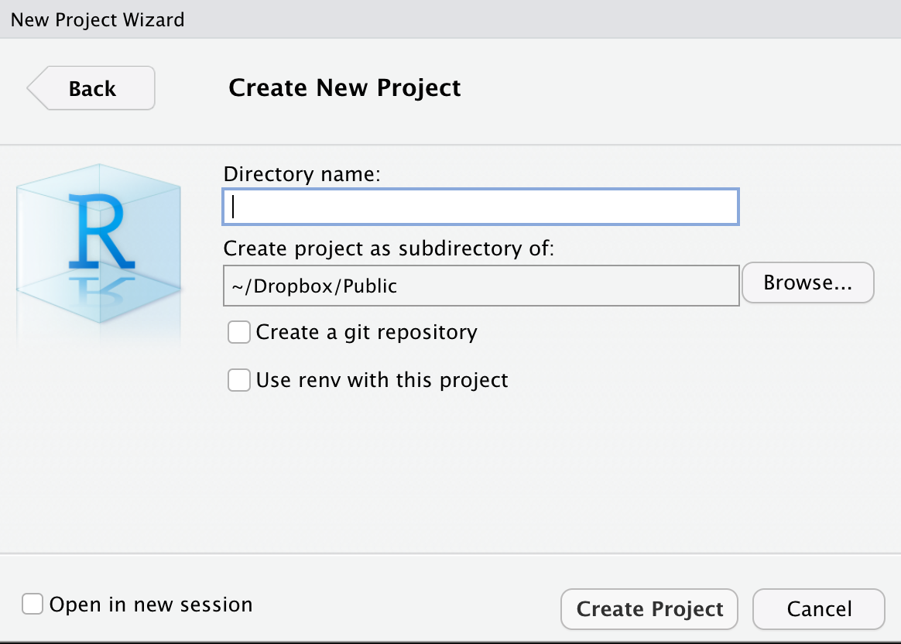

```{r setup, include=FALSE}
knitr::opts_chunk$set(message=FALSE,warning=FALSE, cache=TRUE)
```

```{css color, echo=FALSE}
.columns {display: flex;}
h1 {color: #3366CC;}
```

# Introducción

Los datos que vamos a usar a lo largo de todos estos temas son los del proyecto del Barómetro de las Américas de [LAPOP Lab](https://www.vanderbilt.edu/lapop/). Como centro de excelencia en investigación por encuestas, LAPOP Lab usa enfoques y métodos innovadores con los "estándares más altos" para llevar a cabo encuestas nacionales; conducir estudios de evaluación de impacto, y producir reportes acerca de las actitudes, evaluaciones y experiencias de los individuos. El Barómetro de las Américas es la única encuesta comparativa y científicamente rigurosa que cubre 34 naciones incluyendo Norte, Centro y Sudamérica, así como también, un significativo número de países en el Caribe. Cada año publica docenas de estudios académicos de alta calidad y artículos de relevancia para la elaboración de políticas públicas. Los reportes producidos por el proyecto se pueden ver y descargar es este [link](https://www.vanderbilt.edu/lapop/publications.php).

El Barómetro de las Américas del 2018/19 es la octava ronda de este proyecto. El cuestionario contiene un módulo común que permite evaluar hasta qué punto los ciudadanos apoyan los valores democráticos, perciben que hay suficiente provisión de libertades básicas, cómo experimentan el Estado de Derecho, cómo participan en la vida política, si apoyan su sistema de gobierno, si usan las redes sociales, entre otros temas. Los cuestionarios generales y los específicos para cada país pueden encontrarse en este [link](https://www.vanderbilt.edu/lapop/core-surveys.php).

La base de datos y los reportes del proyecto son públicos y se encuentran disponibles de forma gratuita en la página web del proyecto.

Estos datos deben citarse de la siguiente manera: Fuente: Barómetro de las Américas por el Proyecto de Opinión Pública de América Latina (LAPOP), wwww.LapopSurveys.org.

# Para descargar los datos del Barómetro de las Américas

Los datos se puede descargar de manera libre [aquí](http://datasets.americasbarometer.org/database/login.php). En este enlace, se pueden registrar o entrar como "Free User". En el buscador, se puede ingresar el texto "2018". Ahí se tendrá acceso a la base de datos completa "2004-2018 LAPOP AmericasBarometer Merge (v1.0FREE).dta" (434.6MB) en versión para STATA.

{width="372"}

También se puede acceder a las bases de datos de cada país. Por ejemplo, si en el buscador se ingresa el texto "Mexico", se puede acceder a las bases de datos de México para cada una de las rondas del Barómetro de las Américas en ese país. Los datos de la última ronda se pueden descargar como un archivo llamado "Mexico LAPOP AmericasBarometer 2019 v1.0_W.dta", en formato STATA. Este archivo también se descarga directamente como un archivo .dta. Además de la base de datos, también se tiene acceso al cuestionario y al libro de códigos.

{width="376"}

# Importar las bases de datos del Barómetro de las Américas

Una vez descargados los datos, es una buena práctica crear un nuevo proyecto en RStudio. En el menú "File", se tiene la opción "New Project", donde se selecciona la opción "New directory" y "New project", donde se tiene que nombrar el proyecto y darle una ruta en el disco.

{width="380"}

Esta ruta será el directorio de trabajo donde se guardará los archivos que se vaya trabajando y produciendo. Si no queda claro cuál es la ruta seleccionada, siempre se puede visualizar el directorio de trabajo en la consola de RStudio o se puede encontrar con el comando `getwd()`. Si se desea cambiar de directorio de trabajo, se puede usar el comando `setwd()`. Por ejemplo, se podría definir:

`setwd("ruta_del_directorio_de_trabajo/directorio_de_trabajo")`

La base de datos del Barómetro de las Américas descargada se tiene que guardar en el directorio de trabajo. De esta manera, se puede leer la base de datos en STATA como un objeto dataframe en R. Hay varias maneras de leer una base de datos en R. Una primera manera es mediante el menú "File" y el submenú "Import Dataset". Dentro de esta opción se ve que se pueden importar archivos en formato text, Excel, SPSS, SAS o STATA. Si se escoge STATA, se abre una ventana donde se debe buscar la ruta del archivo. Esta ventana mostrará una previsualización de la base de datos. La base de datos muestra el nombre original por defecto, pero el nombre puede cambiarse por uno más simple. En este ejemplo hemos cambiado el nombre de "LAPOP_Merge_2004_2018.dta" a solo "lapop". Con ese nombre aparecerá en el Environment.

{width="700"}

Esta forma de importar las bases de datos se puede hacer también mediante código, lo que es recomendable cuando se tiene un Script de R o un archivo RMarkdown. De hecho, el menú "Import Dataset" muestra el código que se puede aplicar para reproducir el proceso.

Aquí es necesario indicar que R y RStudio trabajan con paquetes ("packages") que contienen comandos y algoritmos para realizar procedimientos. Algunos de estos paquetes vienen cargados desde la instalación, otros hay que instalarlos desde el repositorio de R (CRAN). En los siguientes módulos vamos a trabajar con algunos paquetes que no vienen cargados y que se tienen que instalar. Para esto se va a usar el código `install.packages("paquete")`.

Una vez instalado un paquete, este se tiene que llamar para que esté "activo". Los paquetes activos tiene un check en el módulo de Packages. Para llamar a los paquetes se usa el comando `library(paquete)`.

En este caso, para importar una base de datos en Stata se llama a la librería `haven` y se usa el comando `read_stata`. Los detalles de esta librería se pueden encontrar [aquí](https://cran.r-project.org/web/packages/haven/index.html). En esta librería también se tiene el comando `read_dta` para leer archivos de STATA o el comando `read_sav` para archivos de SPSS. En nuestro ejemplo, si el archivo sobre México en formato STATA está en el directorio de trabajo, el código para cargar este archivo como un Dataframe de R llamado "mex18" sería:

`library(haven)`

Luego

`mex18 <- read_stata("Mexico LAPOP AmericasBarometer 2019 v1.0_W.dta")`.

Tenga en cuenta que siempre se debe cargar la librería, con el comando `library`, antes de usar comandos pertenecientes a esas librerías. Si no se carga la librería antes, el código resultará en un error.

Dentro del menú "Import Dataset" también se puede cargar la librería `readxl` y el comando `read_excel` para importar archivos Excel. Finalmente, también se puede cargar la librería `readr` para leer archivos .txt.

En la sección sobre [correlación](https://arturomaldonado.github.io/BarometroEdu_Web/correlacion.html) se trabajará con datos del proyecto Varieties of Democracy (o V-Dem). Estos datos pueden ser descargados de la web del proyecto en formato .csv o .xls. Si descargamos estos datos y los guardamos en el directorio de trabajo con el nombre "vdem.xlsx", estos datos se pueden leer como un nuevo dataframe. Primero se carga la librería

`library(readxl)`

Luego la base de datos

`vdem <- read_excel("vdem.xlsx")`.

Una opción general para cargar bases de datos en RStudio es instalar y usar la librería `rio`. Esta librería permite importar, exportar y convertir diferentes tipos de archivos de datos, como Stata, SPSS, Excel, csv, SAS, RData, Minitab, dbf, entre muchos otros. Para esta web, esta librería es útil dado que incluso permite importar bases de datos almacenadas en repositorios virtuales, como de GitHub.

# Leyendo los datos del Barómetro en RStudio

A lo largo de estas secciones, se usarán bases de datos recortadas de la ronda 2018/19 por temas de espacio y también se usarán bases de datos en formato RData, un tipo de archivo de datos nativo de R, que es eficiente en términos de almacenamiento y que permite cargar la base de datos de la ronda 2018/19 con todas las variables.

Estas base de datos se encuentran alojadas en el repositorio "materials_edu" de la cuenta de LAPOP en [GitHub](https://github.com/lapop-central/materials_edu). A partir de aquí usaremos código que se puede replicar.

Por ejemplo, para cargar una versión recortada de la base de datos de la ronda 2018/19, guardada en GitHub en formato SPSS, se puede cargar la libraría `rio` y llamar a esta base de datos remota con el comando `import`.

```{r importar GitHub}
#install.packages("rio") Este código se usaría en caso no tengan instalado este paquete
library(rio) 
lapop18 <- import("https://raw.github.com/lapop-central/materials_edu/main/LAPOP_AB_Merge_2018_v1.0.sav")
```

Una vez corrido este código, vemos que aparece la base de datos en el Environment. Esta base consta de 31,050 observaciones y 84 variables.

De la misma manera, se puede usar la librería `rio` para llamar a la base de datos completa, en formato RData, con el mismo comando. Se guarda esta nueva base de datos en un dataframe "lapop18v2".

```{r importar RData}
lapop18v2 <- import("https://raw.github.com/lapop-central/materials_edu/main/lapop18.RData")
```

Esta otra base de datos tiene 28,042 observaciones (pues no incluye a Estados Unidos y Canadá) e incluye 1,369 variables.

# Resumen

En esta sección se ha explicado brevemente cómo descargar las bases de datos del Barómetro de las Américas, ya sea de una ronda completa o de algún país en particular. Luego, se ha explicado cómo definir un Proyecto en RStudio y cómo definir un directorio de trabajo. Es en este directorio donde se deben guardar las bases de datos descargadas para poder importarlas a RStudio. Esta importación se puede hacer usando principalmente la librería `haven` y la librería `rio`. Con estas librerías podemos importar múltiples formatos de bases de datos, incluyendo Stata, SPSS, csv, formatos en los que se pueden descargar las bases de datos del Barómetro de las Américas.
