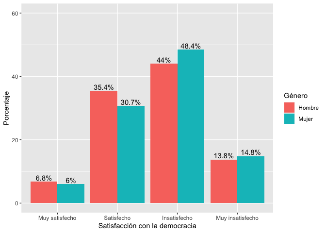
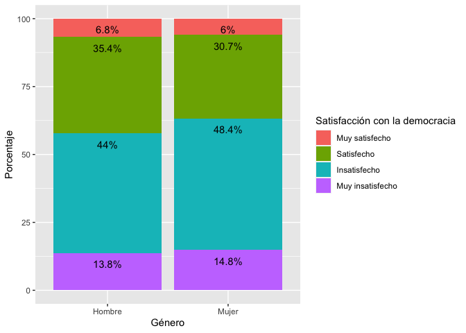

<style type="text/css">
.columns {display: flex;}
h1 {color: #3366CC;}
</style>

# Introducción

Las secciones anteriores correspondientes a la [prueba t](https://arturomaldonado.github.io/BarometroEdu_Web/pruebat.html) y a la prueba de [ANOVA](https://arturomaldonado.github.io/BarometroEdu_Web/anova.html) tratan sobre la relación de una variable numérica con una variable categórica, de tal manera que el objetivo es comparar y extrapolar las medias de la variable numérica por grupos de la variable categórica.

En esta sección veremos las relaciones bivariadas entre dos variables categóricas (o de factor en la terminología de R).
Esta evaluación se hace mediante tablas cruzadas (o de contingencia) y se evalúa mediante la prueba de chi-cuadrado.

# Sobre la base de datos

Los datos que vamos a usar deben citarse de la siguiente manera: Fuente: Barómetro de las Américas por el Proyecto de Opinión Pública de América Latina (LAPOP), wwww.LapopSurveys.org.
Pueden descargar los datos de manera libre [aquí](http://datasets.americasbarometer.org/database/login.php).

En este documento se carga nuevamente una base de datos recortada, originalmente en formato SPSS (.sav).
Se recomiendo limpiar el Environment antes de iniciar esta sección.

Esta base de datos se encuentra alojada en el repositorio "materials_edu" de la cuenta de LAPOP en GitHub.
Mediante la librería rio y el comando import se puede importar esta base de datos desde este repositorio.
Además, se seleccionan los datos de países con códigos menores o iguales a 35, es decir, se elimina las observaciones de Estados Unidos y Canadá.


```r
library(rio) 
lapop18 <- import("https://raw.github.com/lapop-central/materials_edu/main/LAPOP_AB_Merge_2018_v1.0.sav")
lapop18 <- subset(lapop18, pais<=35)
```

# Evaluación de la democracia en la práctica

Desde la página 20 del reporte El Pulso de la Democracia se hace una evaluación de la democracia en la práctica.
En particular, esta sección del reporte usa la variable "pn4".
Esta variable está fraseada de la siguiente manera: "En general, ¿usted diría que está muy satisfecho(a), satisfecho(a), insatisfecho(a) o muy insatisfecho(a) con la forma en que la democracia funciona en [país]?"

En el reporte se indica que esta variable se recodifica como una variable dicotómica para poder trabajar con porcentajes.
En esta sección vamos a trabajar con la variable original, que es una variable categórica (o de factor) ordinal.

En el Gráfico 1.14 del reporte se presenta una evaluación de la satisfacción con la democracia por variables demográficas y socioeconómicas, como nivel educativo, quintiles de riqueza, lugar de residencia, género o grupos de edad.
Es decir, se usa la satisfacción con la democracia como variable dependiente y a cada variable demográfica o socioeconómica como variable independiente.

Por ejemplo, se reporta que entre los hombres, el 42.3% están satisfechos con la democracia (usando la variable recodificada como dummy), mientras que entre las mujeres, este porcentaje disminuye a 36.9%.
Aquí vamos a analizar estas mismas variables, pero usando la variable "pn4" en su forma original (como categórica ordinal).
Antes de proceder, tenemos que recodificar las variables en forma de factor y etiquetarlas.


```r
lapop18$genero <- as.factor(lapop18$q1)
levels(lapop18$genero) <- c("Hombre", "Mujer")
table(lapop18$genero)
```

```
## 
## Hombre  Mujer 
##  13943  14084
```

Se hace lo mismo para la variable "pn4" que se transforma en una nueva variable "satis".


```r
lapop18$satis <- as.factor(lapop18$pn4)
levels(lapop18$satis) <- c("Muy satisfecho", "Satisfecho", "Insatisfecho", "Muy insatisfecho")
table(lapop18$satis)
```

```
## 
##   Muy satisfecho       Satisfecho     Insatisfecho Muy insatisfecho 
##             1727             8916            12455             3855
```

# Tabla cruzada de satisfacción con la democracia según género

Con las nuevas variables de factor, lo primero es calcular la tabla cruzada o de contingencia.
El comando `table` sirve para presentar las frecuencias de una o del cruce de dos variables.
Por convención, la variable dependiente "satisfacción con la democracia" se ubica en las filas y la variable independiente "género" en las columnas.


```r
table(lapop18$satis, lapop18$genero)
```

```
##                   
##                    Hombre Mujer
##   Muy satisfecho      919   803
##   Satisfecho         4821  4091
##   Insatisfecho       5994  6457
##   Muy insatisfecho   1874  1979
```

Para calcular las frecuencias relativas, se tiene que anidar el comando `table` dentro del comando `prop.table`.
Si se anida solamente, este comando calcula las proporciones sobre el total de observaciones.


```r
prop.table(table(lapop18$satis, lapop18$genero))
```

```
##                   
##                        Hombre      Mujer
##   Muy satisfecho   0.03411538 0.02980919
##   Satisfecho       0.17896652 0.15186725
##   Insatisfecho     0.22251095 0.23969857
##   Muy insatisfecho 0.06956715 0.07346499
```

Estas proporciones no son de mucha utilidad para la comparación que queremos hacer.
Lo que requerimos son las distribuciones condicionales de "satisfacción con la democracia" por cada grupo de género.
Es decir, calcular los porcentajes por cada columna.
Para que `prop.table` calcule estas proporciones, se tiene que agregar la especificación `(…, 2)`.
Se multiplica por 100 para pasar de proporciones a porcentajes.
También se puede anidar todo dentro del comando `addmargins` para verificar la suma de proporciones sobre las columnas, con la especificación `(…, 1)`.


```r
addmargins(prop.table(table(lapop18$satis, lapop18$genero), 2)*100, 1)
```

```
##                   
##                        Hombre      Mujer
##   Muy satisfecho     6.753380   6.024006
##   Satisfecho        35.427690  30.690173
##   Insatisfecho      44.047619  48.439610
##   Muy insatisfecho  13.771311  14.846212
##   Sum              100.000000 100.000000
```

En la tabla se muestra que el 6.8% de los hombres se encuentra muy satisfecho con la democracia, un porcentaje muy similar al de las mujeres.
El 44% de los hombres se encuentra insatisfecho con la democracia.
En esta categoría, las mujeres tienen un porcentaje mayor (48.4%).

De esta manera, se puede comparar los porcentajes de la variable dependiente "satisfacción con la democracia" por cada categoría de la variable independiente "género".

# Gráficos de satisfacción con la democracia según género

En la sección sobre [Descriptivos de variables ordinales](https://arturomaldonado.github.io/BarometroEdu_Web/Descriptivos2.html) se presentó un adelanto de lo que estamos viendo en esta sección.
Se crearon tablas cruzadas y gráficos de dos variables.
Aquí volveremos a visitar esos temas, usando el tidyverse.

Para hacer el gráfico, lo primero que se tiene que crear es un nuevo dataframe con los datos del cruce de variables.
Se usa el comando `as.data.frame` para transformar la tabla bivariada en un nuevo dataframe llamado "tabla".
Usando este comando, los resultados se ordenan por nuevas columnas (Var1, Var2 y Freq) de forma que pueden usarse para crear un gráfico.


```r
tabla <- as.data.frame(prop.table(table(lapop18$satis, lapop18$genero), 2)*100)
tabla
```

<div data-pagedtable="false">
  <script data-pagedtable-source type="application/json">
{"columns":[{"label":["Var1"],"name":[1],"type":["fct"],"align":["left"]},{"label":["Var2"],"name":[2],"type":["fct"],"align":["left"]},{"label":["Freq"],"name":[3],"type":["dbl"],"align":["right"]}],"data":[{"1":"Muy satisfecho","2":"Hombre","3":"6.753380"},{"1":"Satisfecho","2":"Hombre","3":"35.427690"},{"1":"Insatisfecho","2":"Hombre","3":"44.047619"},{"1":"Muy insatisfecho","2":"Hombre","3":"13.771311"},{"1":"Muy satisfecho","2":"Mujer","3":"6.024006"},{"1":"Satisfecho","2":"Mujer","3":"30.690173"},{"1":"Insatisfecho","2":"Mujer","3":"48.439610"},{"1":"Muy insatisfecho","2":"Mujer","3":"14.846212"}],"options":{"columns":{"min":{},"max":[10]},"rows":{"min":[10],"max":[10]},"pages":{}}}
  </script>
</div>

Usaremos la librería `ggplot2` y el comando `ggplot` para crear un gráfico de barras, usando el dataframe "tabla" que contiene los porcentajes de satisfacción con la democracia para hombres y mujeres.
El comando requiere una estética donde se especifica que en el eje X se incluirá la "Var1", que corresponde a las categorías de satisfacción con la democracia.
En el eje Y se incluye la "Freq", que corresponde a los porcentajes.
Se incluye también la especificación `fill` para indicar que se dividirá en grupos Hombre/Mujer por cada categoría de "Var1" y `ymax` para especificar el límite superior del eje Y.

Luego de definir las variables en los ejes, se indica que se quiere un gráfico de barras con el comando `geom_bar` y con la especificación `position="dodge"` se indica que se quiere un gráfico con barras separadas por cada combinación de categorías de las variables.
Se agrega la especificación `stat="identity"` para indicar que el comando trabaje con los datos de la tabla.

Con el comando `geom_text` se incluye los porcentajes de cada barra, que se encuentra en la columna "Freq".
Estos porcentajes se redondean con `round` a 1 decimal y se añade el símbolo "%" con `paste`.
También se incluye la especificación `position=position_dodge(…)` que ubica estos porcentajes arriba de cada columna.
La opción por defecto dentro de esta especificación es `width=NULL`, pero de esta manera los porcentajes quedarían mal ubicados, por esto se define `width=0.9` para centrar los porcentajes.

Por defecto la leyenda incluye el nombre de la columna con los datos de género, que es "Var2".
Para cambiar este nombre, se usa el comando `labs(fill="Género")` para nombrar adecuadamente la leyenda.
Finalmente, se etiqueta el eje Y y X con `ylab` y `xlab.`


```r
library(ggplot2)
ggplot(data=tabla, aes(x=Var1, y=Freq, fill=Var2, ymax=60))+
  geom_bar(position="dodge", stat="identity")+
  geom_text(aes(label=paste(round(Freq, 1), "%", sep="")),
            position=position_dodge(width=0.9), vjust=-0.25)+
  labs(fill="Género")+
  ylab("Porcentaje")+
  xlab("Satisfacción con la democracia")
```

<!-- -->

Otra forma de mostrar estos datos es mediante barras apiladas.
Es decir, por cada categoría de género se muestra la distribución de satisfacción con la democracia.
Para esto, usamos el mismo comando `ggplot` pero ahora se cambia el orden de las variables en la estética.
Ahora la variable "Var2" (con las categorías de género) se ubica en el eje X y cada barra se divide de acuerdo a los valores de Var1.

El tipo de barra cambia en el comando `geom_bar` a `position="stack"`.
De la misma manera, las etiquetas de datos tienen que considerar que la posición de cada sector, con `position=position_stack()`.


```r
ggplot(data=tabla, aes(x=Var2, y=Freq, fill=Var1, ymax=100))+
  geom_bar(position="stack", stat="identity")+
  geom_text(aes(label=paste(round(Freq, 1), "%", sep="")),
            position=position_stack(), vjust=2)+
  labs(fill="Satisfacción con la democracia")+
  ylab("Porcentaje")+
  xlab("Género")
```

<!-- -->

# Prueba de independencia de chi-cuadrado de satisfacción con la democracia según género

Se dice que dos variables categóricas con estadísticamente independientes si las distribuciones condicionales (poblacionales) son idénticas por cada categoría de la variable independiente En la relación bivariada anterior, esto significa que ser hombre o mujer no cambia las opiniones con respecto a la satisfacción con la democracia.
A medida que estas distribuciones condicionales difieren más entre sí, se dice que ambas variables están más relacionadas o son más dependientes.

Esta evaluación se hace mediante la prueba de independencia de chi-cuadrado o de $\chi^2$.
Esta prueba se basa en la comparación de las frecuencias observadas (las observaciones que se recoge en campo) versus las frecuencias esperadas (las observaciones que deberían haber en cada celda si las variables fueran independientes).
El estadístico de la prueba resume qué tan cerca están las frecuencias esperadas de las frecuencias observadas.

$$
\chi^2 = \sum\frac{(f_o-f_e)^2}{f_e}
$$

Mientras más pequeña la distancia en cada celda, menos probabilidad de rechazar la hipótesis nula.
Mientras la distancia sea más grande en cada celda, mas probabilidades de rechazar la hipótesis nula.

$$
H0: f_o = f_e
$$

Con el valor de $\chi^2$ y con los grados de libertad (filas-1\*columnas-1), se calcula un p-value en la distribución de chi-cuadrado.
Si este p-value es menor de 0.05, se rechaza la H0.
Esta prueba requiere que haya al menos 5 observaciones en cada celda.

En R se usa el comando `chisq.test` para calcular el estadístico y el p-value asociado.
Esta prueba se puede guardar en un nuevo objeto "prueba".


```r
prueba <- chisq.test(lapop18$satis, lapop18$genero)
prueba
```

```
## 
## 	Pearson's Chi-squared test
## 
## data:  lapop18$satis and lapop18$genero
## X-squared = 84.828, df = 3, p-value < 2.2e-16
```

El p-value obtenido es menor de 0.05, por lo que se rechaza la H0, con lo que decimos que las frecuencias observadas parecen ser diferentes de las frecuencias esperadas que hubieran en cada celda si no hubiera relación, por lo que decimos que hay una relación entre las variables o que hay una dependencia entre ambas.

Es importante notar que "prueba" es un objeto de tipo *lista*.
Este tipo de objeto puede almacenar otra información de diferente tipo.
Por ejemplo, "prueba" guarda las tablas de frecuencias observadas (mismo resultado que con el comando `table`) y de frecuencias esperadas.
En este objeto también se guarda el valor de los residuales, los residuos estandarizados y el valor del p-value.


```r
prueba$observed
```

```
##                   lapop18$genero
## lapop18$satis      Hombre Mujer
##   Muy satisfecho      919   803
##   Satisfecho         4821  4091
##   Insatisfecho       5994  6457
##   Muy insatisfecho   1874  1979
```

```r
prueba$expected
```

```
##                   lapop18$genero
## lapop18$satis         Hombre     Mujer
##   Muy satisfecho    869.8855  852.1145
##   Satisfecho       4501.9859 4410.0141
##   Insatisfecho     6289.7471 6161.2529
##   Muy insatisfecho 1946.3815 1906.6185
```

# Tabla cruzada de satisfacción con la democracia según nivel educativo

El Gráfico 1.14 del reporte muestra los datos de satisfacción con la democracia (según la variable recodificada dummy) por niveles educativo.
Como segundo ejemplo, aquí vamos a replicar esa relación usando la variable original de tipo factor.

Lo primero es recodificar la variable educación.
La variable original "ed" está recogida como una variable numérica (años de estudio).
Esta variable tiene valores que van desde 0 a 18.
Se recodifica de tal manera que aquellos con cero años de educación se les asigna el valor de 0 "Ninguna", aquellos entre 1 y 6 años de educación se les asigna el valor 1 "Primaria", aquellos entre 7 y 11 años de educación se les asigna el valor de 2 "Secundaria" y entre 12 y 18 años de educación el valor de 3 "Superior".


```r
library(car)
lapop18$educ <- car::recode(lapop18$ed, "0=0; 1:6=1; 7:11=2; 12:18=3")
lapop18$educ <- as.factor(lapop18$educ)
levels(lapop18$educ) <- c("Ninguna", "Primaria", "Secundaria", "Superior")
table(lapop18$educ)
```

```
## 
##    Ninguna   Primaria Secundaria   Superior 
##        643       6156      10176      10595
```

Con la variable recodificada se puede calcular la tabla cruzada de satisfacción con la democracia según niveles educativos.


```r
addmargins(prop.table(table(lapop18$satis, lapop18$educ), 2)*100, 1)
```

```
##                   
##                       Ninguna   Primaria Secundaria   Superior
##   Muy satisfecho    13.818182   9.874826   6.002645   4.324428
##   Satisfecho        38.363636  34.961752  33.045071  31.760523
##   Insatisfecho      34.363636  42.576495  46.596805  48.596963
##   Muy insatisfecho  13.454545  12.586926  14.355479  15.318086
##   Sum              100.000000 100.000000 100.000000 100.000000
```

Para crear el gráfico se tiene que guardar la tabla como un dataframe.
Se usa el comando `as.data.frame` para salvar los porcentajes y poder usarlos con el comando `ggplot`.


```r
tabla2 <- as.data.frame(prop.table(table(lapop18$satis, lapop18$educ), 2)*100)
tabla2
```

<div data-pagedtable="false">
  <script data-pagedtable-source type="application/json">
{"columns":[{"label":["Var1"],"name":[1],"type":["fct"],"align":["left"]},{"label":["Var2"],"name":[2],"type":["fct"],"align":["left"]},{"label":["Freq"],"name":[3],"type":["dbl"],"align":["right"]}],"data":[{"1":"Muy satisfecho","2":"Ninguna","3":"13.818182"},{"1":"Satisfecho","2":"Ninguna","3":"38.363636"},{"1":"Insatisfecho","2":"Ninguna","3":"34.363636"},{"1":"Muy insatisfecho","2":"Ninguna","3":"13.454545"},{"1":"Muy satisfecho","2":"Primaria","3":"9.874826"},{"1":"Satisfecho","2":"Primaria","3":"34.961752"},{"1":"Insatisfecho","2":"Primaria","3":"42.576495"},{"1":"Muy insatisfecho","2":"Primaria","3":"12.586926"},{"1":"Muy satisfecho","2":"Secundaria","3":"6.002645"},{"1":"Satisfecho","2":"Secundaria","3":"33.045071"},{"1":"Insatisfecho","2":"Secundaria","3":"46.596805"},{"1":"Muy insatisfecho","2":"Secundaria","3":"14.355479"},{"1":"Muy satisfecho","2":"Superior","3":"4.324428"},{"1":"Satisfecho","2":"Superior","3":"31.760523"},{"1":"Insatisfecho","2":"Superior","3":"48.596963"},{"1":"Muy insatisfecho","2":"Superior","3":"15.318086"}],"options":{"columns":{"min":{},"max":[10]},"rows":{"min":[10],"max":[10]},"pages":{}}}
  </script>
</div>

En este caso, como tenemos 4 categorías para satisfacción con la democracia y otras 4 para niveles educativo, un gráfico de barras separadas crearía 16 barras, lo que complicaría la comparación.
Por eso, en este caso, se prefiere el tipo de barras apiladas.


```r
library(ggplot2)
ggplot(data=tabla2, aes(x=Var2, y=Freq, fill=Var1, ymax=100))+
  geom_bar(position="stack", stat="identity")+
  geom_text(aes(label=paste(round(Freq, 1), "%", sep="")),
            position=position_stack(), vjust=2)+
  labs(fill="Satisfacción con la democracia")+
  ylab("Porcentaje")+
  xlab("Nivel educativo")
```

<!-- -->

En el Gráfico 1.14 se observa que se tiene un mayor porcentaje de satisfacción con la democracia entre los menos educados.
Esta relación también puede observarse en este gráfico.
Los sectores "muy satisfechos" (en rosado) y "satisfechos" (en verde) disminuyen a medida que se pasa de ninguna a primaria, secundaria y superior.

Para comprobar la relación entre estas variables, también se puede usar la prueba de independencia de $\chi^2$.
Esta evaluación se guarda en un objeto "prueba2".


```r
prueba2 <- chisq.test(lapop18$satis, lapop18$genero)
prueba2
```

```
## 
## 	Pearson's Chi-squared test
## 
## data:  lapop18$satis and lapop18$genero
## X-squared = 84.828, df = 3, p-value < 2.2e-16
```

Con el valor de estadístico se obtiene un p-value menor de 0.05, con lo que se rechaza la hipótesis nula y se afirma que las frecuencias observadas son diferentes de las esperadas, con lo que concluimos que existiría una relación de dependencia entre las variables.

Para evaluar la fuerza de la relación, se tiene que trabajar con otras medidas de asociación, debido a que se tiene una tabla con dos variables ordinales.
Para esto usaremos la librería `oii` y el comando `association.measures`.


```r
library(oii)
association.measures(lapop18$satis, lapop18$educ)
```

```
## Chi-square-based measures of association:
##    Phi:                      0.108 
##    Contingency coefficient:  0.108 
##    Cramer's V:               0.063 
## 
## Ordinal measures of association:
##    Total number of pairs:   352092916 
##    Concordant pairs:        84356625   ( 23.96 %)
##    Discordant pairs:        68163337   ( 19.36 %)
##    Tied on first variable:  80445182   ( 22.85 %)
##    Tied on second variable: 77098765   ( 21.9 %)
##    Tied on both variables:  42029007   ( 11.94 %)
## 
##    Goodman-Kruskal Gamma: 0.106 
##    Somers' d (col dep.):  0.071 
##    Kendall's tau-b:       0.070 
##    Stuart's tau-c:        0.061
```

En este caso se observan las medidas de asociación para variables ordinales.
Este comando reporta 4 se estas medidas, todas ellas varían entre -1 a +1.
En nuestro ejemplo, todas tiene signo positivo, lo que indica una relación directa entre ambas variables.
Esto parecería ir contra lo que se reporta en el Gráfico 1.14 del reporte donde se observa claramente que la satisfacción con la democracia disminuye a niveles educativos más altos, lo que se expresaría en un signo negativo.

Esta aparente contradicción es debido a la forma como se ha codificado la satisfacción con la democracia (variable "satis" que se crea desde "pn4").
La variable original tiene valores entre 1 a 4, donde 1 significa "muy satisfecho" y 4 "muy insatisfecho".
Es decir, esta variable tiene una codificación donde valores altos indican "menos" de la variable.
Es por ese motivo que la prueba de asociación resulta con un signo positivo, que en este caso indicaría que un valor mayor de la variable de educación significa "más" de la variable satisfacción con la democracia (que en realidad es menos).

Para evitar esta confusión se debió cambiar la monotonía de la variable satisfacción con la democracia para que valores más altos indiquen una mayor satisfacción y, con esto, se obtenga un signo negativo en las medidas de asociación.
En esta sección se ha procedido de esa manera para llamar la atención a que la codificación tiene consecuencias en los resultados y puede llevar a confusión si no se presta atención.

Finalmente, el valor de las medidas de asociación son menores a 0.3, con lo que se indica que la relación entre las variables es débil.

# Resumen

En esta sección hemos trabajado con relaciones bivariadas entre variables categóricas.
Se ha calculado las tablas cruzadas y los gráficos de barras para mostrar los resultados descriptivos.
Luego, se ha trabajado con la prueba de independencia de chi-cuadrado para inferir si existe una relación de dependencia entre las variables en la población y finalmente se evalúa la fuerza de la asociación entre las variables, diferenciando cuando se trata de variables nominales u ordinales.
