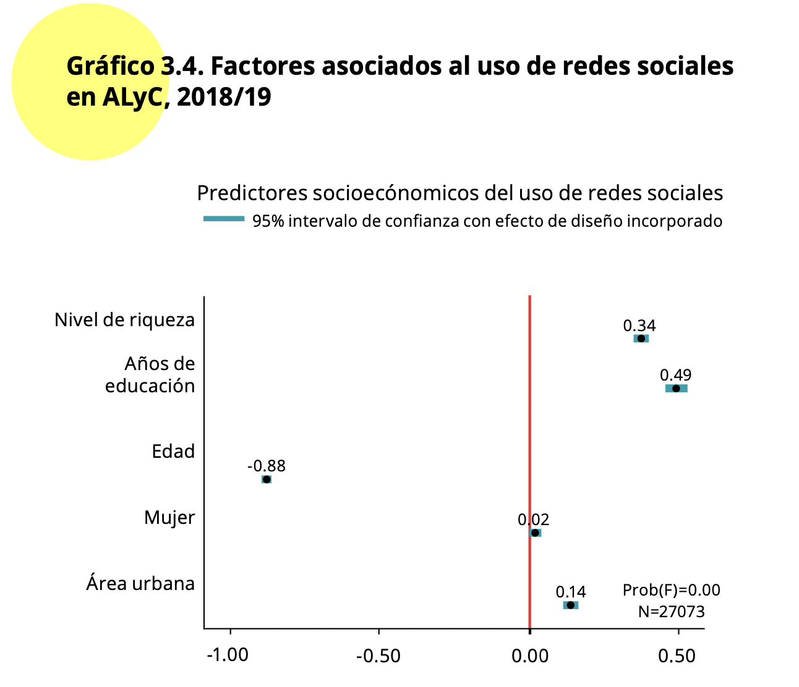

```{r setup, include=FALSE}
knitr::opts_chunk$set(echo = TRUE)
```

# Introducción

En la sección anterior vimos los aspectos básicos del modelo logístico para analizar la relación entre una variable dependiente binaria y una variable independiente.

En esta sección se seguirá replicando los análisis del capítulo "Redes sociales y actitudes políticas" del reporte [El Pulso de la Democracia](https://www.vanderbilt.edu/lapop/ab2018/2018-19_AmericasBarometer_Regional_Report_Spanish_W_03.27.20.pdf) de la ronda 2018/19.
En ese capítulo se analiza una medición de apoyo a la democracia.

# Sobre la base de datos

Los datos que vamos a usar deben citarse de la siguiente manera: Fuente: Barómetro de las Américas por el Proyecto de Opinión Pública de América Latina (LAPOP), wwww.LapopSurveys.org.
Pueden descargar los datos de manera libre [aquí](http://datasets.americasbarometer.org/database/login.php).

Se recomienda limpiar el Environment antes de iniciar esta sección.
En este documento nuevamente se carga una base de datos en formato RData.
Este formato es eficiente en términos de espacio de almacenamiento.
Esta base de datos se encuentra alojada en el repositorio"materials_edu" de la cuenta de LAPOP en GitHub.
Mediante la librería `rio` y el comando `import` se puede importar esta base de datos desde este repositorio, usando el siguiente código.

```{r base, message=FALSE, warning=FALSE}
library(rio)
lapop18 <- import("https://raw.github.com/lapop-central/materials_edu/main/lapop18.RData")
lapop18 <- subset(lapop18, pais<=35)
```

# Determinantes del uso de redes sociales

En la sección sobre redes sociales, se presenta los resultados de un modelo de regresión logística en el Gráfico 3.4.
Como dice el reporte, este gráfico "muestra los resultados de una regresión logística que modela el uso de redes sociales en las medidas del lugar de residencia (urbano versus rural), género (mujer vs. hombre), edad, educación y nivel de riqueza" (p. 59).

{width="479"}

Como indica el reporte, "la variable dependiente, usuario de redes sociales, se basa en las respuestas a las tres preguntas sobre tener cuenta de Facebook, Twitter y Whatsapp. Esta medida dicotómica distingue entre las personas que son usuarios de cuentas en una o varias de estas plataformas, comparado con quienes no interactúan con ninguna cuenta en redes sociales" (p. 59).
Además, como indica la nota, "quienes tienen una cuenta y dicen nunca acceder al contenido de cualquiera de estas plataformas se consideran no usuarios" (p. 64).

En la sección sobre [estadística descriptiva](https://arturomaldonado.github.io/BarometroEdu_Web/Descriptivos.html) se presenta el código para crear a los usuario de cada red social usando el comando `ifelse`.

```{r usuariosredes}
lapop18$fb_user <- ifelse(lapop18$smedia1==1 & lapop18$smedia2<=4, 1, 0)
lapop18$tw_user <- ifelse(lapop18$smedia4==1 & lapop18$smedia5<=4, 1, 0)
lapop18$wa_user <- ifelse(lapop18$smedia7==1 & lapop18$smedia8<=4, 1, 0)
```

Sobre la base de estas variables, se crea una variable de usuario de cualquier red social.
Esta variable es dicotómica y toma el valor 1 si el entrevistado reporta ser usuario de alguna red social evaluada (Facebook o Twitter o WhatsApp).

```{r usuario}
lapop18$user = ifelse(lapop18$fb_user==1 | lapop18$wa_user==1 | lapop18$tw_user ==1, 1, 0)
table(lapop18$user)
```

El Gráfico 3.4 muestra los determinantes asociados al uso de redes sociales.
Estas variables son:

-   Nivel de riqueza: variable "quintall" en la base de datos.

-   Años de educación: variable "ed" en la base de datos.

-   Edad: variable "q2" en la base de datos.

-   Mujer: variable "mujer" en la base de datos.

-   Área urbana: variable "ur" en la base de datos.

La nota 16 indica que "la edad y la educación se miden en años, recodificadas de 0 a 1, donde 0 indica a los más jóvenes o el nivel más bajo de educación, y 1 los más adultos o el nivel más alto de educación. La riqueza es una variable original, recodificada de 0 a 1, donde 0 indica el menor nivel de riqueza, y 1 el nivel más alto de riqueza. El lugar de residencia se codifica de tal forma que 1 indica la zona urbana y 0 la zona rural. El género se codifica de forma que 1 es mujer y 0 es hombre" (p. 64).

Se procede a recodificar las variables "quintall", "ed" y "q2" en variables que varíen entre 0 y 1, llamadas "riqueza", "educ" y "edad".
La variable "mujer" y "urban", disponibles en la base de datos, son variables dicotómicas que varían en los valores 0 y 1, por lo que no se tienen que recodificar.

```{r recodificar}
lapop18$riqueza = (lapop18$quintall - 1)/4
lapop18$educ = (lapop18$ed)/18
lapop18$edad = (lapop18$q2 - 16)/83
summary(lapop18$riqueza)
summary(lapop18$educ)
summary(lapop18$edad)
```

Con el comando `summary` se comprueba que las variables varíen entre 0 y 1.
Se debe notar que estas variables tienen valores perdidos "NA's" que no serán incluidos en los cálculos.

# Modelo de regresión logística

Para evaluar los factores asociados al uso de redes sociales se puede calcular un modelo de regresión.
En este caso, a diferencia del modelo de regresión lineal, la variable dependiente no es numérica, sino que se trata de una variable dicotómica, con valores 0, para indicar a los no usuarios, y 1 para identificar a los usuarios de redes sociales.

Con este tipo de variable dependiente no es apropiado usar un modelo de regresión lineal.
Las razones para esto son múltiples.
Un modelo lineal para aproximar la relación entre una variable dependiente dicotómica y una independiente numérica podría dar valores predichos mayores que 1 o menores que 0, por lo que no es una buena aproximación para calcular probabilidades.

Por el contrario, un modelo de regresión logística restringe los resultados entre 0 y 1, por lo que se puede interpretar como una probabilidad.
En nuestro ejemplo, se calcula la probabilidad de ser usuario de redes sociales para diferentes valores de las variables independientes.

Otras razones para no usar un modelo de regresión lineal son más técnicas y tienen que ver con los residuos.
Si se usara un modelo de regresión lineal para aproximar la relación entre una variable dependiente dicotómica y una independiente numérica se tendría residuos no normalmente distribuidos y hererocedásticos

El modelo se calcula con el comando `glm` donde se indica la variable Y y luego las variables independientes.
Cada variable independiente se suma al modelo.
El modelo incluye efectos fijos por país.
En la sección sobre [regresión lineal múltiple](https://arturomaldonado.github.io/BarometroEdu_Web/regresion2.html#Incluyendo_variables_de_control) se explicó el uso de efectos fijos por país para una regresión lineal, es decir, cuando la variable dependiente es numérica.
Aquí se usará el mismo comando `factor()` para incluir variables dummy de cada país, tomando a México (país 1) como referencia.

Este modelo de guarda en un objeto "modelo1" el que se puede describir con el comando `summary`.

```{r modelo}
modelo1 <- glm(user ~ riqueza + educ + edad + mujer + urban + factor(pais), family = binomial, data=lapop18)
summary(modelo1)
```

Los resultados muestran los coeficientes, los errores estándar, el estadístico Z y el p-value asociado.
Con estos datos se puede extraer conclusiones acerca de la dirección de la relación entre cada variable independiente y la variable dependiente.
Por ejemplo, la relación entre riqueza y la probabilidad de ser usuario de redes sociales es directa, a medida que aumenta la riqueza aumenta las probabilidades de ser usuario.
La relación entre edad y la probabilidad de ser usuario de redes sociales es negativa, a medida que aumenta la edad disminuyen las probabilidades de ser usuario de redes sociales.
En ambos casos, dado que el p-value es menor a 0.05, se tienen relaciones estadísticamente significativas.

Los coeficientes de la regresión se interpretan como el cambio en el log odds de la variable dependiente por cada incremento de una unidad de la variable independiente.
Por ejemplo, por cada año adicional en la edad, el log odd de ser usuario de una red social (versus no ser usuario) disminuye en 5.69.

Otra manera de presentar estos coeficientes es transformarlos con la función exponencial.
De esta manera los resultados se pueden interpretar como aumentos en la probabilidad en un factor de acuerdo al resultado.

Con el código siguiente se realiza esta operación para las principales variables independientes, excluyendo a las variables dummy por país.

```{r odds}
exp(coef(modelo1)[1:6])
```

De esta manera se puede interpretar que un aumento de una unidad en la variable riqueza aumenta la probabilidad de ser usuario de una red social en un factor de 7.7.
Como la variable riqueza fue recodificada para que varíe entre 0 y 1, un aumento de una unidad es el máximo aumento posible.

Para el caso de las mujeres, se puede concluir que las mujeres tienen un 15.9% más de probabilidades de ser usuarias de una red social que los hombres.

Para presentar los resultados de una manera más ordenada, se pueden usar varias librerías y comandos.
En esta sección usamos la librería `jtools` y el comando `summs`.
Este comando nos brinda además estadísticos para evaluar el ajuste del modelo.
Por ejemplo, el estadístico de $\chi^2$ evalúa el modelo multivariado versus el modelo nulo.
Como se obtiene un estadístico grande y un p-value menor a 0.05, se concluye que el modelo se ajusta a los datos.

Otro estadístico es el Pseudo-$R^2$, que aunque no se puede interpretar como el coeficiente de determinación de una regresión lineal, da una idea de la capacidad explicativa del modelo.

```{r tabla}
#library(stargazer)
#stargazer(modelo1[1:6], align=T, type = 'text')
library(jtools)
summ(modelo1)
```

El Gráfico 3.4 muestra los coeficientes de cada variable y el intervalo de confianza al 95% de este estimado.
Se incluye una línea vertical en el punto 0.
Si un intervalo de confianza cruza esta línea vertical, se puede decir que no tiene una relación estadísticamente significativa con la variable dependiente de apoyo al sistema.
Los intervalos de confianza que no cruzan esta línea y que se encuentran a la derecha (izquierda) de esta línea tienen una relación positiva (negativa) con el apoyo al sistema, es decir, cuando aumenta esta variable, el apoyo al sistema promedio aumenta (disminuye).
En este ejemplo, las cinco variables son estadísticamente significativas y muestran tienen una relación positiva con el apoyo al sistema.
Para aproximar un gráfico similar al mostrado en el reporte, se puede usar la librería `jtools` y el comando `plot_summs`.
Se selecciona solo las variables independientes de relevancia.

```{r grafico}
library(jtools)
plot_summs(modelo1, coefs=c("Nivel de riqueza"="riqueza", "Años de educación"="educ", 
                            "Edad"="edad", "Mujer"="mujer", "Área urbana"="urban"))
```

El gráfico producido es similar y sigue la misma tendencia que el Gráfico 3.4 presentado en el informe.
Sin embargo, no presenta los mismos resultados pues, como indica el reporte, "los puntos en el Gráfico 3.4 son los cambios estimados en la probabilidad de que la variable dependiente tome un valor de "1" (usa redes sociales), dado un cambio del valor mínimo al máximo de la variable independiente" (p. 59).
En este gráfico producido en esta sección se grafica el coeficiente de la regresión logística.

# Resumen

En esta sección hemos usado un modelo de regresión ligística para modelar la relación de variables independientes con una variable dependiente dicotómica.
En particular, se ha presentado un modelo con cinco predictores del uso de redes sociales.
Este modelo se ha presentado de manera estándar en una tabla de resultados y mediante un gráfico similar al Gráfico 3.4 del reporte.

# Incluyendo el efecto de diseño

Los cálculos realizados no incluyen el efecto de diseño muestral.
Para hacer esto se debe considerar el factor de expansión.
Se hizo una introducción al uso del factor de expansión [aquí](https://arturomaldonado.github.io/BarometroEdu_Web/Expansion.html).
En este parte usaremos la librería `survey`.

Usaremos el comando `svydesign` (similar al comando svyset en STATA).
Con este comando se crea un nuevo objeto llamado "lapop.design", que guarda la información de las variables contenidas en el dataframe, incluyendo en los cálculos el factor de expansión.
Por tanto, si luego se creara una nueva variable, se tendría que calcular nuevamente esté comando para que este objeto "lapop.design" incluya esta nueva variable.

```{r diseno, message=FALSE, warning=FALSE}
library(survey)
lapop.design<-svydesign(ids = ~upm, strata = ~estratopri, weights = ~weight1500, nest=TRUE, data=lapop18)
```

La librería `survey` incluye el comando `svyglm` que permite calcular un modelo de regresión logística.
Las mismas variables usadas en el modelo 1 se pueden incluir en este comando.
Se tiene que especificar que se quiere calcular un modelo binomial con la especificación `family=quasibinomial`.
También se tiene que especificar el diseño que se utiliza y el tratamiento de los valores perdidos.
Este cálculo se guarda en un objeto "modelo2".
Se usa el comando `summ` de la librería `jtools` para describir el modelo.

```{r modelow, message=FALSE, warning=FALSE}
modelo2 <- svyglm(user ~ riqueza + educ + edad + mujer + urban + factor(pais), family=quasibinomial, design=lapop.design, na.action = na.omit)
summ(modelo2)
```

De la misma manera que con el modelo 1, estos resultados también se pueden graficar usando el comando `plot_summs`, seleccionando las variables que se quieren mostrar.

```{r graficow}
plot_summs(modelo2, coefs=c("Nivel de riqueza"="riqueza", "Años de educación"="educ", 
                            "Edad"="edad", "Mujer"="mujer", "Área urbana"="urban"))
```

De la misma manera que con los resultados que no incluyen el efecto de diseño, este gráfico es similar al reportado en el informe, aunque no es exactamente igual.
