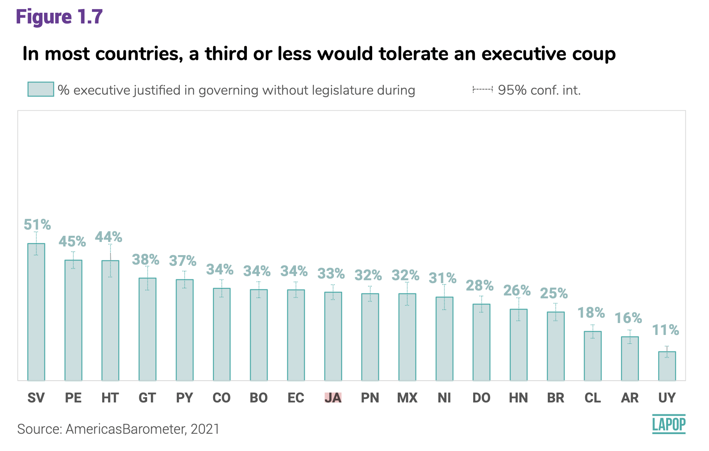

# Introducción

En esta sección se hará una introducción a una herramienta muy usada en la actualidad: la presentación de datos en forma de mapas.
Veremos la manera de calcular los promedios o el porcentaje de alguna variable de interés y presentar las variaciones por país en un mapa con diferentes tonalidades de color.

Un ejemplo de este tipo de gráficos es el presentado en este [tweet](https://twitter.com/participacionpc/status/1524478511788052480?s=21&t=Xa3pZLkl349NzhgneJhfPQ) que publicó nuestro socio en Ecuador [Participación Ciudadana](https://www.participacionciudadana.org/web/).
Uno de estos mapas es el siguiente:

{width="454"}

Este mapa muestra el porcentaje de personas que justifica un auto-golpe en cada país usando los datos de la ronda 2021 del Barómetro de las Américas.
Colores más rojos indican un mayor porcentaje y colores más pastel indican un menor porcentaje.

En esta sección veremos cómo se puede replicar este tipo de mapas, para lo cual primero se tiene que producir la información desde las bases de datos del Barómetro de las Américas.

# Sobre la base de datos del Barómetro de las Américas 2021

Los datos que vamos a usar deben citarse de la siguiente manera: Fuente: Barómetro de las Américas por el Proyecto de Opinión Pública de América Latina (LAPOP), wwww.LapopSurveys.org.
Pueden descargar los datos de manera libre [aquí](http://datasets.americasbarometer.org/database/login.php).

Se recomienda limpiar el Environment antes de iniciar esta sección.
En este documento nuevamente se carga una base de datos de la ronda 2021 en formato RData.
Este formato es eficiente en términos de espacio de almacenamiento.
Mediante la librería `rio` y el comando `import` se puede importar esta base de datos desde este repositorio, usando el siguiente código.
En este caso, no eliminamos las observaciones de Canadá o Estados Unidos, países que no muestran datos en el mapa anterior, pero donde se realizó la pregunta sobre auto-golpes.


```r
library(rio)
lapop21 = import("lapop21.RData") 
```

Para producir el mapa, lo primero es calcular el porcentaje de personas que justifica un auto-golpe por país.
El gráfico 1.7 del reporte [El Pulso de la Democracia](https://www.vanderbilt.edu/lapop/ab2021/2021_LAPOP_AmericasBarometer_2021_Pulse_of_Democracy.pdf) de la ronda 2021 presenta estos datos.

{width="579"}

En la sección sobre [intervalos de confianza](https://arturomaldonado.github.io/BarometroEdu_Web/IC.html) vimos cómo construir esta información usando la base de datos del Barómetro de las Américas de la ronda 2021.

# Preparando los datos

La variable para construir este gráfico es "jc15a" que está fraseada: ¿Cree usted que cuando el país enfrenta momentos muy difíciles, se justifica que el presidente del país cierre el Congreso/Asamblea y gobierno sin Congreso/Asamblea?
Las opciones de respuesta son:

1.  Sí se justifica

2.  No se justifica

Para calcular el porcentaje, se transforma la variable de tal manera que los que justifican un cierre del congreso se les asigna 100 y los que no, el valor de 0.
Esta transformación se guarda en una nueva variable "jc15ar".


```r
lapop21$jc15ar <- car::recode(lapop21$jc15a, "1=100; 2=0")
table(lapop21$jc15ar)
```

```
## 
##     0   100 
## 17360  6951
```

Luego, requerimos calcular el porcentaje de personas que toleran un golpe ejecutivo por cada país.
Cuando se carga la base de datos del Barómetro de las Américas, las variables son generalmente cargadas como de tipo "numérico" (num en lenguaje de R).

Para poder trabajar con estas variables en esta sección, requerimos transformar la variable país a una variable categórica (factor en lenguaje de R).
Esto se hace con el comando `as.factor`.
A continuación, se etiqueta la variable con el comando `levels`.


```r
lapop21$pais = as.factor(lapop21$pais)
levels(lapop21$pais) <- c("México", "Guatemala", "El Salvador", "Honduras",
                        "Nicaragua","Costa Rica", "Panamá", "Colombia", 
                        "Ecuador", "Bolivia", "Perú", "Paraguay", "Chile",
                        "Uruguay", "Brasil", "Argentina", "Rep. Dom.",
                        "Haití", "Jamaica", "Guyana","Estados Unidos", "Canada")
table(lapop21$pais)
```

```
## 
##         México      Guatemala    El Salvador       Honduras      Nicaragua 
##           2998           3000           3245           2999           2997 
##     Costa Rica         Panamá       Colombia        Ecuador        Bolivia 
##           2977           3183           3003           3005           3002 
##           Perú       Paraguay          Chile        Uruguay         Brasil 
##           3038           3004           2954           3009           3016 
##      Argentina      Rep. Dom.          Haití        Jamaica         Guyana 
##           3011           3000           3088           3121           3011 
## Estados Unidos         Canada 
##           1500           2201
```

# Auto-golpes por país

En R existen muchos caminos para llegar al mismo resultado.
Para calcular el porcentaje de personas que tolera un golpe ejecutivo se puede usar el tidyverse.
Esta es una forma de escribir códigos que incluye el operador %\>%.
En este caso se activa la librería "dplyr".
Luego, se crea un objeto "golpe" donde se guardará información del dataframe "lapop21".
Con este dataframe, se calcularán resultados agrupados por país, con el comando `group_by()`.
Finalmente, se calcula la media de la variable "jc15ar" con el comando \`summarise_at.


```r
library(dplyr)
```

```
## 
## Attaching package: 'dplyr'
```

```
## The following objects are masked from 'package:stats':
## 
##     filter, lag
```

```
## The following objects are masked from 'package:base':
## 
##     intersect, setdiff, setequal, union
```

```r
golpe = lapop21 %>%
          group_by(pais) %>%
          summarise_at(vars(jc15ar), list(golpe=mean), na.rm=T)
```

El objeto "golpe" contiene la información de la media (es decir, el porcentaje) de personas que toleran los golpes ejecutivos por país.
Algunas filas están vacías porque esa pregunta no se realizó en ese país.
Es el caso de Costa Rica y Guyana.

Otra opción es usar el comando `compmeans` de la librería `descr`.
Este comando nos permite calcular la media, el número de observaciones y la desviación estándar de una variable por grupos de otra variable.
Incluso, permite este cálculo incluyendo un factor de ponderación.

Estos cálculos se guardan en un data frame "tabla" con el comando `as.data.frame`.
Luego de etiqueta las columnas de datos con el comando `colnames`, se incluye una columna con los nombres de los países y, finalmente, se elimina la última fila, donde se calcula la media (es decir, el porcentaje) para toda la base de datos, que no requerimos.


```r
library(descr) 
tabla <- as.data.frame(
  compmeans(lapop21$jc15ar, lapop21$pais, lapop21$weight1500, plot=FALSE))
```

```
## Warning in compmeans(lapop21$jc15ar, lapop21$pais, lapop21$weight1500, plot =
## FALSE): 40056 rows with missing values dropped
```

```r
varnames <- c("media_golpe", "n_golpe", "sd_golpe")
colnames(tabla) <- varnames
tabla$pais <- row.names(tabla)
tabla <- tabla[-23, ]
```

Finalmente, requerimos agregar una columna que permita unir (hacer el merge) de los datos de la "tabla" con los datos vectoriales para poder producir el mapa.
Llamaremos a esta variable "OBJECTID" y tendrá una codificación que luego veremos viene de los archivos vectoriales de los mapas, pero que sigue un orden alfabético.
Luego, de incluir estos datos, la "tabla" se ordena de menor a mayor en esos datos de "OBJECTID".
Con este reordenamiento, los países quedan en orden alfabético.

Vemos en el código que tenemos unas líneas con #.
Si agregáramos estos códigos tendríamos un orden alfebético con todos los países de América (incluidos Barbados, Bahamas, Belice, Granada, Surinám, entre otros).
Estas líneas pertenecen a países que no están incluidos en el Barómetro de las Américas 2021.

Sin embargo, veremos que estos países sí figuran en los datos vectoriales del mapa.


```r
tabla$OBJECTID <- NA
tabla <- within(tabla, {
  OBJECTID[pais=="Argentina"] <- 1
 # OBJECTID[pais=="Barbados"]<- 2
 # OBJECTID[pais=="Bahamas"]<- 3
 # OBJECTID[pais=="Belice"]<-4
  OBJECTID[pais=="Bolivia"]<-5
  OBJECTID[pais=="Brasil"]<-6
  OBJECTID[pais=="Canada"]<-7
  OBJECTID[pais=="Chile"]<-8
  OBJECTID[pais=="Colombia"]<-9
  OBJECTID[pais=="Costa Rica"]<-10
  OBJECTID[pais=="Dominica"]<-11
  OBJECTID[pais=="Rep. Dom."]<-12
  OBJECTID[pais=="Ecuador"]<-13
  OBJECTID[pais=="El Salvador"]<-14
 # OBJECTID[pais=="Granada"]<-15
  OBJECTID[pais=="Guatemala"]<-16
  OBJECTID[pais=="Guyana"]<-17
  OBJECTID[pais=="Haití"]<-18
  OBJECTID[pais=="Honduras"]<-19
  OBJECTID[pais=="Jamaica"]<-20
  OBJECTID[pais=="México"]<-21
  #OBJECTID[pais=="Surinam"]<-22
  OBJECTID[pais=="Nicaragua"]<-23
  OBJECTID[pais=="Paraguay"]<-24
  OBJECTID[pais=="Perú"]<-25
  OBJECTID[pais=="Panamá"]<-26
  #OBJECTID[pais=="San Cristobal y Nieves"]<-27
  #OBJECTID[pais=="Santa Lucía"]<-28
  #OBJECTID[pais=="Trinidad y Tobago"]<-29
  OBJECTID[pais=="Uruguay"]<-30
  #OBJECTID[pais=="San Vicente y las Granadinas"]<-31
  #OBJECTID[pais=="Venezuela"]<-32
  OBJECTID[pais=="Estados Unidos"]<-33
})
tabla <- tabla[order(tabla$OBJECTID),]
```

# Datos vectoriales para mapas

Los archivos para producir mapas son capas vectoriales en formato EESRI Shapefile (.shp).
Existen varios repositorios en la web donde se pueden encontrar los archivos requeridos para producir mapas.
Por ejemplo, esta [web](https://www.efrainmaps.es/descargas-gratuitas/américa/) tiene como libre descarga las capas de los países de América.

Cuando se descarga esta información y se descomprime, se crea una carpeta que incluye varios archivos.
Todos esos archivos son necesarios para crear el mapa y deben copiarse en el directorio de trabajo.
De estos archivos, la capa vectorial que grafica el mapa se llama "América.shp".

Para poder leer estos datos vectoriales en R también hay múltiples maneras.
Una de ellas es usando la librería `sf`.
Esta librería incluye el comando `st_read` que permite leer esta información y luego trabajarla con `ggplot`.
Esta información se guarda en un objeto "al", que produce una tabla de 53 observaciones y 2 variables.
Las 53 observaciones corresponden a todos los países de las Américas, que incluye, por ejemplo, a Aruba, Antigua y Barbuda, etc.
La primera columna de este objeto contiene el nombre de los paises y la segunda la geometría para dibujar el mapa.


```r
library(sf)
```

```
## Linking to GEOS 3.9.1, GDAL 3.2.3, PROJ 7.2.1; sf_use_s2() is TRUE
```

```r
al = st_read("Americas.shp")
```

```
## Reading layer `Americas' from data source 
##   `/Users/Arturo/Documents/GitHub/BarometroEdu_Web/Americas.shp' 
##   using driver `ESRI Shapefile'
## Simple feature collection with 53 features and 1 field
## Geometry type: MULTIPOLYGON
## Dimension:     XY
## Bounding box:  xmin: -186.5396 ymin: -58.49861 xmax: -12.15764 ymax: 83.6236
## Geodetic CRS:  WGS 84
```

Como el Barómetro de las Américas 2021 no incluye información de todos estos países y para tener la misma lista de países que aparecen en la "tabla", vamos a eliminar las observaciones de los países que no requerimos.


```r
al <- al[-c(1, 2, 4, 5, 6, 7, 8, 13, 16, 17, 21, 22, 23, 24, 25, 31, 32, 34, 39, 40, 41, 42, 43, 44, 45, 47, 48, 49, 50, 51, 52), ]
```

Con esta eliminación, el objeto "al" solo contiene observaciones de los países incluidos en el Barómetro y que coinciden con los que están en la "tabla".

De la misma manera que en la "tabla", se tiene que añadir en el objeto "al" una columna de datos "OBJECTID" que coincida con la que tenemos en "tabla" y que permita hacer el merge.
Vemos que estos códigos incluyen líneas con \# de países que no están en el Barómetro.


```r
al$OBJECTID <- NA
al <- within(al, {
  OBJECTID[COUNTRY=="Argentina"] <- 1
 # OBJECTID[COUNTRY=="Barbados"]<- 2
 # OBJECTID[COUNTRY=="Bahamas"]<- 3
 # OBJECTID[COUNTRY=="Belice"]<-4
  OBJECTID[COUNTRY=="Bolivia"]<-5
  OBJECTID[COUNTRY=="Brazil"]<-6
  OBJECTID[COUNTRY=="Canada"]<-7
  OBJECTID[COUNTRY=="Chile"]<-8
  OBJECTID[COUNTRY=="Colombia"]<-9
  OBJECTID[COUNTRY=="Costa Rica"]<-10
 # OBJECTID[COUNTRY=="Dominica"]<-11
  OBJECTID[COUNTRY=="Dominican Republic"]<-12
  OBJECTID[COUNTRY=="Ecuador"]<-13
  OBJECTID[COUNTRY=="El Salvador"]<-14
 # OBJECTID[COUNTRY=="Granada"]<-15
  OBJECTID[COUNTRY=="Guatemala"]<-16
  OBJECTID[COUNTRY=="Guyana"]<-17
  OBJECTID[COUNTRY=="Haiti"]<-18
  OBJECTID[COUNTRY=="Honduras"]<-19
  OBJECTID[COUNTRY=="Jamaica"]<-20
  OBJECTID[COUNTRY=="Mexico"]<-21
  #OBJECTID[COUNTRY=="Surinam"]<-22
  OBJECTID[COUNTRY=="Nicaragua"]<-23
  OBJECTID[COUNTRY=="Paraguay"]<-24
  OBJECTID[COUNTRY=="Peru"]<-25
  OBJECTID[COUNTRY=="Panama"]<-26
  #OBJECTID[COUNTRY=="San Cristobal y Nieves"]<-27
  #OBJECTID[COUNTRY=="Santa Lucía"]<-28
  #OBJECTID[COUNTRY=="Trinidad y Tobago"]<-29
  OBJECTID[COUNTRY=="Uruguay"]<-30
  #OBJECTID[COUNTRY=="San Vicente y las Granadinas"]<-31
  #OBJECTID[COUNTRY=="Venezuela"]<-32
  OBJECTID[COUNTRY=="United States"]<-33
})
al <- al[order(al$OBJECTID),]
```

Ahora, vemos a unir la información en un nuevo objeto "al_datos".
Esto lo hacemos con el comando `left_join` del tidyverse.
Se indica que al objeto "al" se le añadan los datos de "tabla".
Por defecto el código identifica una variable de unión que es "OBJECTID".


```r
al_datos <- al %>%
              left_join(tabla)
```

```
## Joining, by = "OBJECTID"
```

En este nuevo objeto tenemos los datos vectoriales para crear el mapa y los datos del Barómetro del porcentaje de personas que tolera los golpes ejecutivos en cada país.

# Mapa de tolerancia a golpes ejecutivos por país

Como indicamos, los objetos vectoriales se pueden usar con la librería `ggplot2`.
Con el comando `ggplot` se especifica que usaremos `data=al_datos` y, luego, con el comando `geom_sf` se especifica la variable que se quiere graficar.

Vamos a empezar con un gráfico básico.
Dentro del comando `geom_sf` usaremos la especificación `fill="skyblue3"` para indicar que todos los países tienen que ser coloreados de un mismo color azul.
Además, especificamos que los contornos de los países sean negros con `color="black".`


```r
library(ggplot2)
ggplot(data=al_datos) +
  geom_sf(fill="skyblue3", color="black")
```

<!-- -->

Ahora, graficaremos los datos de la variable de tolerancia a los golpes ejecutivos.
Nuevamente, definimos con el comando `ggplot` que los datos vienen de "al_datos".
Ahora, en el comando `geom_sf` especificamos que los colores de cada país deben estar definidos por la variable "media_golpe".
Para crear un gráfico donde se use una gradiente de colores para indicar el mayor o menos porcentaje, se usa el comando `scale_fill_gradient` donde se define el color inferior y superior de la gradiente.
En nuestro caso, usamos el color "yellow" para los porcentajes más bajos y el color "red" para los porcentajes más altos.

Luego, agregamos el comando `geom_sf_text` donde la especificación `aes(label=pais)` indica que queremos agregar el texto con las etiquetas de cada país.
Se detalla el tamaño con la especificación `size=2`.
Finalmente, con `labs` definimos el título del gráfico, el caption, el eje X y la leyenda.
Escogemos un tema básico de blancos y negros para el gráfico con `theme_bw()`.


```r
ggplot(al_datos) +
  geom_sf(aes(fill = media_golpe))+
  scale_fill_gradient(low = "yellow", high = "red")+
  geom_sf_text(aes(label=pais), size=2)+
  labs(title = "Tolerancia a golpes ejecutivos en América Latina",
       caption = "Fuente: Barómetro de las Américas 2021",
       x="Longitud",
       fill = "% que tolera golpes ejecutivos")+
  theme_bw()
```

```
## Warning in st_is_longlat(x): bounding box has potentially an invalid value range
## for longlat data
```

```
## Warning in st_point_on_surface.sfc(sf::st_zm(x)): st_point_on_surface may not
## give correct results for longitude/latitude data
```

<!-- -->
