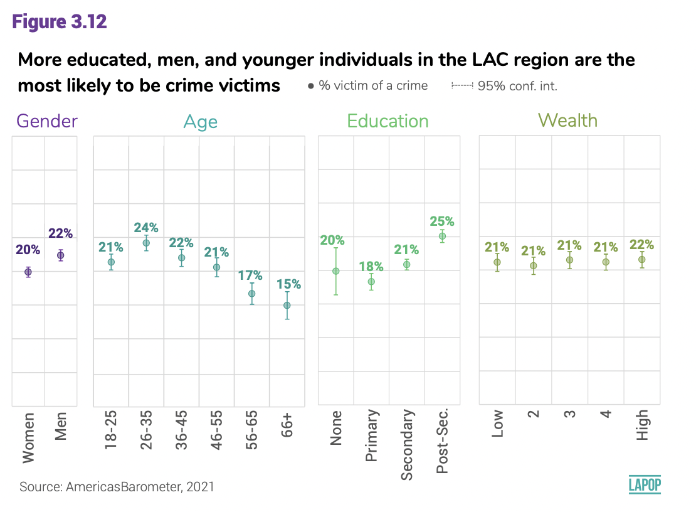

<style type="text/css">
.columns {display: flex;}
h1 {color: #3366CC;}
</style>

# Introducción

En este documento veremos como comparar dos medias y saber si las diferencias se pueden inferir a la población, mediante la prueba t de comparación de medias.
Para eso, vamos a seguir usando los últimos reportes "El pulso de la democracia", del 2021, disponible [aquí](https://www.vanderbilt.edu/lapop/ab2021/2021_LAPOP_AmericasBarometer_Pulse_of_Democracy.pdf), y del 2018/19, disponible [aquí](https://www.vanderbilt.edu/lapop/ab2018/2018-19_AmericasBarometer_Regional_Report_Spanish_W_03.27.20.pdf), donde se presentan los principales hallazgos del Barómetro de las Américas.

En el reporte 2021 se presentan los resultados sobre la victimización por el crimen por grupos de género, edad, educación y riqueza (ver Gráfico 3.12).
En el informe de la ronda 2018/19 se reportan los resultados sobre apoyo a la democracia electoral, variable que se cruza con algunas otras variables sociodemográficas como sexo o lugar de residencia (ver Gráfico 1.5).

En esta sección analizaremos los casos cuando la victimización por el crimen se compara entre hombres y mujeres y cuando el apoyo a la democracia se compara entre grupos de género y de residencia urbana o rural.

# Sobre la base de datos

Los datos que vamos a usar deben citarse de la siguiente manera: Fuente: Barómetro de las Américas por el Proyecto de Opinión Pública de América Latina (LAPOP), wwww.LapopSurveys.org.
En este documento se carga una base de datos recortada.
Esta base de datos se encuentra alojada en el repositorio "materials_edu" de la cuenta de LAPOP en GitHub.
Se recomiendo limpiar el Environment antes de proceder con esta sección.

Mediante la librería `rio` y el comando `import` se puede importar esta base de datos desde este repositorio.
Además, se seleccionan los datos de países con códigos menores o iguales a 35, es decir, se elimina las observaciones de Estados Unidos y Canadá.


```r
library(rio) 
lapop18 <- import("https://raw.github.com/lapop-central/materials_edu/main/LAPOP_AB_Merge_2018_v1.0.sav") 
lapop18 <- subset(lapop18, pais<=35)
```

También cargamos la base de datos de la ronda 2021.


```r
lapop21 = import("lapop21.RData") 
lapop21 <- subset(lapop21, pais<=35)
```

# Victimización por el crimen

La victimización por el crimen está medida con la variable "vic1ext".
La pregunta está fraseada: "Ahora, cambiando de tema, ¿ha sido usted víctima de algún acto de delincuencia en los últimos 12 meses? Es decir, ¿ha sido víctima de un robo, hurto, agresión, fraude, chantaje, extorsión, amenazas o algún otro tipo de acto delincuencial en los últimos 12 meses?".

Esta variable está codificada como 1 "Sí" y 2 "No. Para poder replicar los resultados del gráfico 3.12 tenemos que recodificar esta variable. Como indicamos en el módulo anterior, esta codificación nos permite calcular el porcentaje de víctimas del crimen mediante el comando `mean`. El resultado nos indica que el 22% de ciudadanos en la región reporta haber sido víctima del crimen.


```r
library(car)
lapop21$crimen <- car::recode(lapop21$vic1ext, "1=100; 2=0")
mean(lapop21$crimen, na.rm=T)
```

```
## [1] 21.92233
```

El gráfico 3.12 muestra la comparación de la victimización por el crimen cruzada por cuatro variables sociodemográficas: género, edad, educación y quintiles de riqueza.

{width="534"}

Para replicar las diferencias entre géneros, se tiene que recodificar la variable "q1tb" y luego declararla como factor.


```r
lapop21$genero = car::recode(lapop21$q1tb, "1=2; 2=1; 3=1")
lapop21$genero = as.factor(lapop21$genero)
levels(lapop21$genero) = c("Mujer", "Hombre")
table(lapop21$genero)
```

```
## 
##  Mujer Hombre 
##  31487  29174
```

De la misma manera que en el documento sobre intervalos de confianza, usamos el comando `tapply` para calcular el porcentaje de victimización por crimen por grupos de género.


```r
 tapply(lapop21$crimen, lapop21$genero, mean, na.rm=T) #Para género
```

```
##    Mujer   Hombre 
## 20.87127 23.06949
```

Para reproducir el gráfico de barras, incluyendo los intervalos de confianza, primero se puede producir una tabla que guarde el valor del porcentaje de cada grupo, así como el valor inferior y superior del intervalo de confianza.
Esto se puede hacer con el comando `group.CI` del paquete `Rmisc`.

Con esta table, se puede usar la librería `ggplot` para reproducir el primer panel del gráfico 3.12.
Los resultados no son idénticos dado que no se ha usado el efecto de diseño.


```r
library(Rmisc)
crxgen <- group.CI(crimen~genero, lapop21)
library(ggplot2)
graf3.12a <- ggplot(crxgen, aes(x=genero, y=crimen.mean))+
  geom_bar(width=0.5, fill="darkcyan", colour="black", stat="identity")+
  geom_errorbar(aes(ymin=crimen.lower, ymax=crimen.upper), width=0.2)+
  geom_text(aes(label=paste(round(crimen.mean, 1), "%")), vjust=-1.5, size=4)+
  xlab("Género") + ylab("Victimización por crimen (%)")+
  ylim(0, 40)
graf3.12a
```

<!-- -->

En este gráfico se puede comparar visualmente los intervalos de confianza de cada grupo.
Como estos no se traslapan, se puede concluir de manera inicial que existen diferencias estadísticamente significativas entre hombres y mujeres en sus niveles de victimización por el crimen.

Estos resultados, sin embargo, se tienen que comprobar formalmente mediante una prueba de significancia, que veremos más adelante.

# Apoyo a la democracia

El apoyo a la democracia, variable "ING4", medida en una escala del 1 al 7, donde 1 significa "muy en desacuerdo" y 7 significa "muy de acuerdo", se tiene que recodificar.
De acuerdo al reporte "Se consideran las respuestas en la porción de la escala que indica estar de acuerdo, esto es los valores de 5 a 7, para indicar el porcentaje que apoya a la democracia" (p. 11).
Se usa el comando `mean` para reportar el promedio regional de apoyo a la democracia.
Se especifica `na.rm=T` para que el comando no tome en cuenta los valores perdidos en el cálculo.


```r
library(car)
lapop18$ing4r <- car::recode(lapop18$ing4, "1:4=0; 5:7=100")
mean(lapop18$ing4r, na.rm=T)
```

```
## [1] 57.67924
```

Se observa que en general, el 57.7% de entrevistados apoyo a la democracia en el conjunto de países evaluados en 2018.

## Factores asociados al apoyo a la democracia

El gráfico 1.5 muestra cómo varía el apoyo a la democracia por grupos sociodemográficos.
En particular, se presenta los resultados para la variable lugar de residencia que distingue el ámbito urbano y rural, y para la variable género, que distingue hombre y mujeres.

{width="333"}

Como vimos en la sección sobre intervalos de confianza, se puede calcular el porcentaje de apoyo por cada grupo.
En primer lugar, vamos a crear nuevas variables de factor para lugar de residencia y género, que son importadas como variables numéricas.
Estas nuevas variables luego se etiquetan.


```r
lapop18$genero <- as.factor(lapop18$q1)
levels(lapop18$genero) <- c("Hombre", "Mujer")
lapop18$ambito <- as.factor(lapop18$ur)
levels(lapop18$ambito) <- c("Urbano", "Rural")
```

De la misma manera que en el documento sobre intervalos de confianza, usamos el comando `tapply` para calcular el apoyo a la democracia promedio por grupos de género y de ámbito.


```r
tapply(lapop18$ing4r, lapop18$genero, mean, na.rm=T) #Para género
```

```
##   Hombre    Mujer 
## 59.42899 55.90933
```

```r
tapply(lapop18$ing4r, lapop18$ambito, mean, na.rm=T) #Para urbano-rural
```

```
##   Urbano    Rural 
## 58.71664 55.07453
```

Se puede reproducir los gráficos de barras que comparan el promedio de apoyo a la democracia entre grupos de género y ámbito.
Primero, para género, se tiene que crear una tabla con los datos de la media y los límites de los intervalos de confianza para cada grupo.
Esto lo haremos con el comando `group.CI` que es parte de la librería `Rmisc`.
Estos datos los guardamos en un objeto de tipo tabla de R llamado "apxgen".

Esta tabla guarda los resultados de la media de apoyo a la democracia para cada grupo (columna "ing4r.mean") y los límites superior e inferior de los intervalos de confianza (columnas "ing4r.lower" y "ing4r.upper").
También guarda la columna "genero" con los nombres de los grupos.

Se reproduce el gráfico 1.5 usando el comando `ggplot` de la misma manera que en la sección anterior.


```r
library(Rmisc)
apxgen <- group.CI(ing4r~genero, lapop18)
library(ggplot2)
graf1.5 <- ggplot(apxgen, aes(x=genero, y=ing4r.mean))+
  geom_bar(width=0.5, fill="darkcyan", colour="black", stat="identity")+
  geom_errorbar(aes(ymin=ing4r.lower, ymax=ing4r.upper), width=0.2)+
  geom_text(aes(label=paste(round(ing4r.mean, 1), "%")), vjust=-1.5, size=4)+
  xlab("Género") + ylab("Apoyo a la democracia (%)")+
  ylim(0, 70)
graf1.5
```

<!-- -->

Se puede general un gráfico similar que presente el porcentaje de apoyo a la democracia y los intervalos de confianza por grupos urbano y rural.


```r
apxamb <- group.CI(ing4r~ambito, lapop18)
library(ggplot2)
graf1.5_2 <- ggplot(apxamb, aes(x=ambito, y=ing4r.mean))+
  geom_bar(width=0.5, fill="darkcyan", colour="black", stat="identity")+
  geom_errorbar(aes(ymin=ing4r.lower, ymax=ing4r.upper), width=0.2)+
  geom_text(aes(label=paste(round(ing4r.mean, 1), "%")), vjust=-1.5, size=4)+
  xlab("Lugar de residencia") + ylab("Apoyo a la democracia (%)")+
  ylim(0, 70)
graf1.5_2
```

<!-- -->

LAPOP Lab generalmente presenta en sus gráficos los intervalos de confianza de cada grupo.
Estas barras grises en el reporte sirven como una forma de comparación rápida.
Si las barras se traslapan, eso significaría que no habrían diferencias estadísticamente significativas entre los grupos.
Por el contrario, si las barras grises no se traslapan, se podría decir que la diferencia entre los grupos es significativa al 95% de confianza.
Sin embargo, para comprobar estas observaciones se tiene que calcular una prueba estadística.
Cuando la comparación es entre las medias de dos grupos, la prueba estadística apropiada es la prueba t de diferencias de medias.
En esta sección estamos asumiendo que podemos tratar a las variables "jc15a" o "ing4r" como variables numéricas, de las que se puede calcular la media y la desviación estándar, aunque estas variables en estricto son de tipo cualitativa nominal.

# Prueba t

La prueba t de Student pone a prueba las siguientes hipótesis:

$$
H_0: µ_1 = µ_2
$$

$$
H_a: µ_1 ≠ µ_2
$$

El estadístico de la prueba t se calcula con un error estándar que depende de si las varianzas parecen diferentes o de si las varianzas parecen iguales.
Para determinar esta condición, lo primero es calcular una prueba de igualdad de varianzas entre los grupos, llamada prueba de Levene.

$$
H_0: var_1 = var_2
$$

$$
H_a: var_1 ≠ var_2
$$

## Prueba t para la diferencia de medias de victimización por crimen por género

El primer paso es hacer la prueba de Levene para comprobar la igualdad o diferencia de varianzas, que es una condición que luego se usa en la prueba t.
Para correr este test, se usa la librería `DescTools`, que incluye el comando `LeveneTest`.


```r
library(DescTools)
LeveneTest(lapop21$crimen, lapop21$genero)
```

<div data-pagedtable="false">
  <script data-pagedtable-source type="application/json">
{"columns":[{"label":[""],"name":["_rn_"],"type":[""],"align":["left"]},{"label":["Df"],"name":[1],"type":["int"],"align":["right"]},{"label":["F value"],"name":[2],"type":["dbl"],"align":["right"]},{"label":["Pr(>F)"],"name":[3],"type":["dbl"],"align":["right"]}],"data":[{"1":"1","2":"21.36284","3":"3.816323e-06","_rn_":"group"},{"1":"30305","2":"NA","3":"NA","_rn_":""}],"options":{"columns":{"min":{},"max":[10]},"rows":{"min":[10],"max":[10]},"pages":{}}}
  </script>
</div>

Como el p-value (Pr(>F) es menor a 0.05, se rechaza la hipótesis cero y se afirma que las varianzas son diferentes.
Con este resultado, se puede correr el comando `t.test`, cuya hipótesis cero indica que las medias de victimización por crimen son iguales entre hombre y mujeres y la hipótesis alternativa indica que ambas medias son diferentes.
Se incluye la especificación `var.equal=F` debido al resultado de la prueba de Levene que indica que las varianzas parecen diferentes.


```r
t.test(crimen ~ genero, data = lapop21, var.equal=F)
```

```
## 
## 	Welch Two Sample t-test
## 
## data:  crimen by genero
## t = -4.6147, df = 29850, p-value = 3.952e-06
## alternative hypothesis: true difference in means between group Mujer and group Hombre is not equal to 0
## 95 percent confidence interval:
##  -3.131886 -1.264558
## sample estimates:
##  mean in group Mujer mean in group Hombre 
##             20.87127             23.06949
```

El valor del p-value es menor a 0.05, con lo que se rechaza la hipótesis nula y se afirma la hipótesis alternativa de que las medias entre ambos grupos son diferentes.
Con esto se concluye que los hombres reportan una mayor victimización por crimen que las mujeres en toda la región.

## Prueba t para la diferencia de medias de apoyo a la democracia por género

De la misma manera que en el caso anterior, se corre primero la prueba de Levene para comprobar la igualdad o diferencia de varianzas.


```r
library(DescTools)
LeveneTest(lapop18$ing4r, lapop18$genero)
```

<div data-pagedtable="false">
  <script data-pagedtable-source type="application/json">
{"columns":[{"label":[""],"name":["_rn_"],"type":[""],"align":["left"]},{"label":["Df"],"name":[1],"type":["int"],"align":["right"]},{"label":["F value"],"name":[2],"type":["dbl"],"align":["right"]},{"label":["Pr(>F)"],"name":[3],"type":["dbl"],"align":["right"]}],"data":[{"1":"1","2":"34.38526","3":"4.573811e-09","_rn_":"group"},{"1":"27069","2":"NA","3":"NA","_rn_":""}],"options":{"columns":{"min":{},"max":[10]},"rows":{"min":[10],"max":[10]},"pages":{}}}
  </script>
</div>

Como el p-value (Pr(>F) es menor a 0.05, se rechaza la hipótesis cero y se afirma que las varianzas son diferentes.
Con este resultado, se puede correr el comando `t.test`, cuya hipótesis cero indica que las medias de apoyo a la democracia son iguales entre hombre y mujeres y la hipótesis alternativa indica que ambas medias son diferentes.
Se incluye la especificación `var.equal=F` debido al resultado de la prueba de Levene que indica que las varianzas parecen diferentes.


```r
t.test(ing4r ~ genero, data = lapop18, var.equal=F)
```

```
## 
## 	Welch Two Sample t-test
## 
## data:  ing4r by genero
## t = 5.8633, df = 27046, p-value = 4.59e-09
## alternative hypothesis: true difference in means between group Hombre and group Mujer is not equal to 0
## 95 percent confidence interval:
##  2.343068 4.696255
## sample estimates:
## mean in group Hombre  mean in group Mujer 
##             59.42899             55.90933
```

El valor del p-value (4.59e-09) es menor a 0.05, por lo que se rechaza la hipótesis cero y se afirma la alternativa, llegando a la conclusión que las diferencias son diferentes en la población al 95% de confianza.

## Prueba t para la diferencia de medias de apoyo a la democracia por grupos de ámbito

Un último ejemplo es evaluar la diferencia en el apoyo a la democracia entre ámbito de residencia.
Se corre la prueba de Levena.


```r
LeveneTest(lapop18$ing4r, lapop18$ambito)
```

<div data-pagedtable="false">
  <script data-pagedtable-source type="application/json">
{"columns":[{"label":[""],"name":["_rn_"],"type":[""],"align":["left"]},{"label":["Df"],"name":[1],"type":["int"],"align":["right"]},{"label":["F value"],"name":[2],"type":["dbl"],"align":["right"]},{"label":["Pr(>F)"],"name":[3],"type":["dbl"],"align":["right"]}],"data":[{"1":"1","2":"30.01406","3":"4.327404e-08","_rn_":"group"},{"1":"27084","2":"NA","3":"NA","_rn_":""}],"options":{"columns":{"min":{},"max":[10]},"rows":{"min":[10],"max":[10]},"pages":{}}}
  </script>
</div>

Nuevamente, el p-value es menor a 0.05, con lo que se rechaza la hipótesis de igualdad de varianzas.
Luego se corre la prueba t con la especificación de varianzas diferentes.


```r
t.test(ing4r ~ ambito, data = lapop18, var.equal=F)
```

```
## 
## 	Welch Two Sample t-test
## 
## data:  ing4r by ambito
## t = 5.4543, df = 14056, p-value = 5e-08
## alternative hypothesis: true difference in means between group Urbano and group Rural is not equal to 0
## 95 percent confidence interval:
##  2.333228 4.950988
## sample estimates:
## mean in group Urbano  mean in group Rural 
##             58.71664             55.07453
```

A diferencia de los ejemplos anteriores, en esta comparación el p-value también es menor a 0.05, por lo que se rechaza la hipótesis cero y se encuentra que las diferencias en el apoyo a la democracia entre el ámbito urbano y rural son estadísticamente significativas al 95% de confianza.
Tal como indica el reporte "Considerando la región en su conjunto, el Gráfico 1.5 muestra relaciones estadísticamente significativas entre cinco variables demográficas y grupos socioeconómicos (educación, riqueza, residencia urbana/rural, género y edad) y el apoyo a la democracia" (p. 13).
En esta sección hemos comprobado estos resultados estadísticos para variables demográficas de dos grupos, como género y residencia urbana/rural.

# Resumen

En esta sección hemos descrito y graficado, como apoyo a la democracia, por grupos de otra variable.
Partiendo de la comparación de intervalos de confianza, formalizamos esta comparación con una prueba estadística, como la prueba t, para concluir si las diferencias entre grupos son estadísticamente significativas.

# Cálculos incluyendo el efecto de diseño

## Para victimización por crimen

Para calcular la diferencia de medias incluyendo el factor de expansión se puede usar la librería `survey`.
Este comando requiere una adecuación de la base de datos, de la misma manera que se hizo en este [módulo](https://arturomaldonado.github.io/BarometroEdu_Web/Descriptivos2.html).


```r
lapop21 = subset(lapop21, !is.na(weight1500))
sapply(lapop21, haven::zap_labels)
```

Una vez adecuada la base de datos, se tiene que definir el diseño muestral con el comando `svydesign` y guardar este diseño en un objeto, aquí llamado "diseno21".


```r
library(survey)
diseno21 = svydesign(ids = ~upm, strata = ~strata, weights = ~weight1500, nest=TRUE, data=lapop21)
```

En primer lugar, se puede calcular la tabla de la media de victimización por crimen para cada valor de la variable género incluyendo el factor de expansión.
De la misma manera que se vio en la sección sobre [intervalos de confianza](https://arturomaldonado.github.io/BarometroEdu_Web/IC.html), se usa el comando `svyby`.


```r
crxgen.w <- svyby(~crimen, ~genero, diseno21, svymean, na.rm=T, vartype = "ci")
crxgen.w
```

<div data-pagedtable="false">
  <script data-pagedtable-source type="application/json">
{"columns":[{"label":[""],"name":["_rn_"],"type":[""],"align":["left"]},{"label":["genero"],"name":[1],"type":["fct"],"align":["left"]},{"label":["crimen"],"name":[2],"type":["dbl"],"align":["right"]},{"label":["ci_l"],"name":[3],"type":["dbl"],"align":["right"]},{"label":["ci_u"],"name":[4],"type":["dbl"],"align":["right"]}],"data":[{"1":"Mujer","2":"19.89003","3":"19.13471","4":"20.64535","_rn_":"Mujer"},{"1":"Hombre","2":"22.37644","3":"21.55720","4":"23.19569","_rn_":"Hombre"}],"options":{"columns":{"min":{},"max":[10]},"rows":{"min":[10],"max":[10]},"pages":{}}}
  </script>
</div>

Se debe notar que estos resultados son iguales a los presentados en el gráfico 3.12.
Con esta tabla se puede proceder a replicar el gráfico de barras del panel izquierdo de ese gráfico, de la misma manera que se realizó arriba en esta sección.

Para el cálculo de la prueba t de diferencia de medias, el paquete `survey` cuenta con un comando nativo que permite hacer este calculo `svyttest`.
Sin embargo, en este caso no se cuenta con un comando para evaluar la igualdad de varianzas, como el `LeveneTest`.
El comando `svyttest` es una derivación de un comando más general para modelos lineales generalizados, que asumen igualdad de varianzas.
Si se quisiera comprobar este supuesto, se puede hacer de manera manual, tal como se indica en este [link](https://stats.stackexchange.com/questions/148314/f-test-for-equality-of-variances-with-weighted-survey-data).
Aquí se va a proceder asumiendo el supuesto.
Se observa que el comando regresa resultados muy parecidos al comando sin el efecto de diseño y para todo efecto se llegan a las mismas conclusiones.
El p-value es menor a 0.05, por lo que se puede rechazar la H0 de igualdad de medias y afirmar que existe una diferencia en el apoyo a la democracia entre hombres y mujeres en la población, tomando en cuenta el efecto de diseño.


```r
svyttest(crimen~genero, diseno21)
```

```
## 
## 	Design-based t-test
## 
## data:  crimen ~ genero
## t = 4.3654, df = 30282, p-value = 1.273e-05
## alternative hypothesis: true difference in mean is not equal to 0
## 95 percent confidence interval:
##  1.370025 3.602805
## sample estimates:
## difference in mean 
##           2.486415
```

Como el p-value es menor a 0.05, se concluye que existen diferencias entre hombre y mujeres en sus niveles de victimización por el crimen en toda la región.

## Para apoyo a la democracia

De la misma manera que en el ejemplo anterior, en primer lugar se define el efecto de diseño y se guarda en un objeto "diseno18".


```r
library(survey)
diseno18<-svydesign(ids = ~upm, strata = ~estratopri, weights = ~weight1500, nest=TRUE, data=lapop18)
```

Luego, se usa el comando `svyby` para calcular la media de apoyo a la democracia por grupos de género.


```r
apxgen.w <- svyby(~ing4r, ~genero, diseno18, svymean, na.rm=T, vartype = "ci")
apxgen.w
```

<div data-pagedtable="false">
  <script data-pagedtable-source type="application/json">
{"columns":[{"label":[""],"name":["_rn_"],"type":[""],"align":["left"]},{"label":["genero"],"name":[1],"type":["fct"],"align":["left"]},{"label":["ing4r"],"name":[2],"type":["dbl"],"align":["right"]},{"label":["ci_l"],"name":[3],"type":["dbl"],"align":["right"]},{"label":["ci_u"],"name":[4],"type":["dbl"],"align":["right"]}],"data":[{"1":"Hombre","2":"59.45019","3":"58.60266","4":"60.29772","_rn_":"Hombre"},{"1":"Mujer","2":"55.95399","3":"55.09168","4":"56.81630","_rn_":"Mujer"}],"options":{"columns":{"min":{},"max":[10]},"rows":{"min":[10],"max":[10]},"pages":{}}}
  </script>
</div>

Con esta tabla se puede proceder a crear el gráfico de barras, de la misma manera que se realizó arriba en esta sección.

Igual que en el ejemplo anterior, se procede a usar el comando nativo `svyttest` para evaluar la diferencia de medias de apoyo a la democracia entre hombres y mujeres.


```r
svyttest(ing4r~genero, diseno18)
```

```
## 
## 	Design-based t-test
## 
## data:  ing4r ~ genero
## t = -5.8332, df = 1329, p-value = 6.822e-09
## alternative hypothesis: true difference in mean is not equal to 0
## 95 percent confidence interval:
##  -4.672004 -2.320395
## sample estimates:
## difference in mean 
##          -3.496199
```

Como el p-value es menor a 0.05, se concluye que sí existen diferencias entre hombre y mujeres en el apoyo a la democracia en toda la región.
