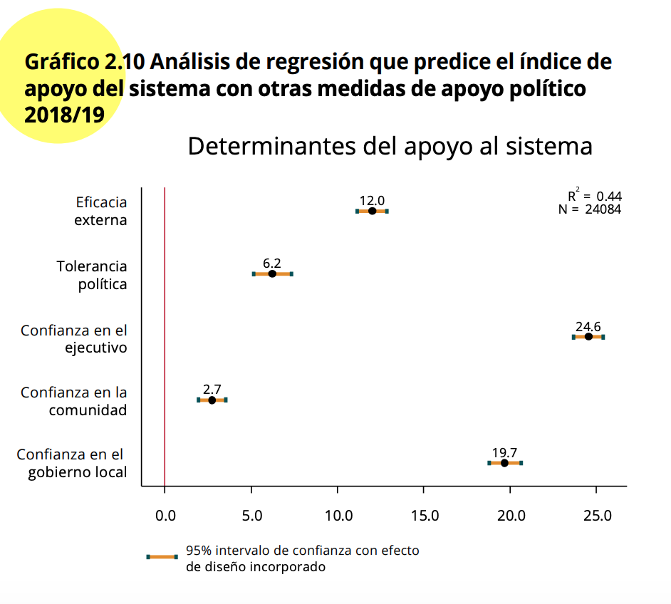

# Introducción

En la sección anterior vimos los aspectos básicos del modelo de mínimos cuadrados ordinarios para analizar la relación entre una variable dependiente y una independiente, ambas numéricas.
En esta sección se expandirá el análisis, desde un análisis bivariado a un análisis multivariado.
Es decir, se usará el método de mínimos cuadrados ordinarios para analizar la relación de una variable dependiente numérica con varias variables independientes.

En esta sección se seguirá replicando los análisis del capítulo "Legitimidad democrática" del reporte [El Pulso de la Democracia](https://www.vanderbilt.edu/lapop/ab2018/2018-19_AmericasBarometer_Regional_Report_Spanish_W_03.27.20.pdf).
En ese capítulo se analiza una medición de apoyo a la democracia.

# Sobre la base de datos

Los datos que vamos a usar deben citarse de la siguiente manera: Fuente: Barómetro de las Américas por el Proyecto de Opinión Pública de América Latina (LAPOP), wwww.LapopSurveys.org.
Pueden descargar los datos de manera libre [aquí](http://datasets.americasbarometer.org/database/login.php).

Se recomienda limpiar el Environment antes de iniciar esta sección.
En este documento nuevamente se carga una base de datos en formato RData.
Este formato es eficiente en términos de espacio de almacenamiento.
Esta base de datos se encuentra alojada en el repositorio"materials_edu" de la cuenta de LAPOP en GitHub.
Mediante la librería `rio` y el comando `import` se puede importar esta base de datos desde este repositorio, usando el siguiente código.


```r
library(rio)
lapop18 <- import("https://raw.github.com/lapop-central/materials_edu/main/lapop18.RData")
lapop18 <- subset(lapop18, pais<=35)
```

# Determinantes del apoyo al sistema

En la sección anterior vimos que la sección del reporte sobre Legitimidad Democrática presenta un modelo de regresión múltiple con los predictores del índice de apoyo al sistema.
El Gráfico 2.10 muestra los resultados para 5 variables independientes, aunque el modelo completo incluye controles socioeconómicos y demográficos.

{width="475"}

Las 5 variables mostradas en el gráfico son: eficacia externa, tolerancia política, confianza en el ejecutivo, confianza en la comunidad y confianza en el gobierno local.

La base de datos incluye la variable "psar" que mide el apoyo al sistema y que en la sección anterior se procedió a calcular desde las variables originales.
Esta variable ya está recodificada en la escala 0-100.


```r
summary(lapop18$psar)
```

```
##    Min. 1st Qu.  Median    Mean 3rd Qu.    Max.    NA's 
##    0.00   33.33   50.00   48.90   66.67  100.00     327
```

El Gráfico 2.10 muestra la relación entre apoyo al sistema y cinco variables independientes, usadas como predictores de esta variable dependiente.
Estas variables son:

-   Índice de tolerancia política, construida a partir de cuatro variables: D1, D2, D3 y D4.
    En la base de datos, la variable recodificada se llama "tol1r".

-   Eficacia externa (EFF1): "A los que gobiernan el país les interesa lo que piensa la gente como usted- ¿Hasta qué punto está de acuerdo o en desacuerdo con esta frase?".
    En la base de datos, la variable recodificada de llama "eff1r".

-   Confianza en el ejecutivo (B21A): "¿Hasta qué punto tiene confianza en el presidente/primer ministro?".

-   Confianza en el gobierno local (B32): "¿Hasta qué punto tiene usted confianza en su alcaldía?".
    En la base de datos, la variable recodificada se llama "b32r".

-   Confianza en su comunidad (IT1): "Ahora, hablando de la gente de por aquí, ¿diría que la gente de su comunidad es muy confiable, algo confiable, poco confiable o nada confiable?".
    En la base de datos, la variable recodificada de llama "it1r".

De la misma manera que en la sección anterior, se tiene que calcular la variable de confianza en el ejecutivo, recodificada a una escala de 0 a 100.


```r
lapop18$ejec <- ((lapop18$b21a-1)/6)*100
summary(lapop18$ejec)
```

```
##    Min. 1st Qu.  Median    Mean 3rd Qu.    Max.    NA's 
##    0.00    0.00   50.00   42.88   66.67  100.00     390
```

# Modelo de regresión lineal multivariada

Para evaluar los determinantes del apoyo al sistema se puede calcular un modelo de regresión lineal multivariado.
El modelo se calcula con el comando `lm` donde se indica la variable Y y luego las variables independientes.
Cada variable independiente se suma al modelo.
Este modelo de guarda en un objeto "modelo1" el que se puede describir con el comando `summary`.


```r
modelo1 <- lm(psar ~ eff1r + ejec + tolr + it1r + b32r, data=lapop18)
summary(modelo1)
```

```
## 
## Call:
## lm(formula = psar ~ eff1r + ejec + tolr + it1r + b32r, data = lapop18)
## 
## Residuals:
##     Min      1Q  Median      3Q     Max 
## -80.738 -11.985   0.626  12.249  76.319 
## 
## Coefficients:
##              Estimate Std. Error t value Pr(>|t|)    
## (Intercept) 19.063373   0.377552  50.492   <2e-16 ***
## eff1r        0.127794   0.003722  34.331   <2e-16 ***
## ejec         0.225187   0.003673  61.313   <2e-16 ***
## tolr         0.057712   0.004873  11.842   <2e-16 ***
## it1r         0.030792   0.003637   8.465   <2e-16 ***
## b32r         0.210219   0.003966  53.000   <2e-16 ***
## ---
## Signif. codes:  0 '***' 0.001 '**' 0.01 '*' 0.05 '.' 0.1 ' ' 1
## 
## Residual standard error: 18.01 on 24767 degrees of freedom
##   (3269 observations deleted due to missingness)
## Multiple R-squared:  0.4007,	Adjusted R-squared:  0.4006 
## F-statistic:  3312 on 5 and 24767 DF,  p-value: < 2.2e-16
```

Para presentar los resultados de una manera más ordenada, se pueden usar varias librerías y comandos.
En la sección anterior usamos la librería `jtools` y el comando `summs`.
En esta sección usaremos la librería `stargazer` y el comando del mismo nombre.


```r
library(stargazer)
```

```
## 
## Please cite as:
```

```
##  Hlavac, Marek (2018). stargazer: Well-Formatted Regression and Summary Statistics Tables.
```

```
##  R package version 5.2.2. https://CRAN.R-project.org/package=stargazer
```

```r
stargazer(modelo1, align=T, type = 'text')
```

```
## 
## ================================================
##                         Dependent variable:     
##                     ----------------------------
##                                 psar            
## ------------------------------------------------
## eff1r                         0.128***          
##                               (0.004)           
##                                                 
## ejec                          0.225***          
##                               (0.004)           
##                                                 
## tolr                          0.058***          
##                               (0.005)           
##                                                 
## it1r                          0.031***          
##                               (0.004)           
##                                                 
## b32r                          0.210***          
##                               (0.004)           
##                                                 
## Constant                     19.063***          
##                               (0.378)           
##                                                 
## ------------------------------------------------
## Observations                   24,773           
## R2                             0.401            
## Adjusted R2                    0.401            
## Residual Std. Error     18.007 (df = 24767)     
## F Statistic         3,312.080*** (df = 5; 24767)
## ================================================
## Note:                *p<0.1; **p<0.05; ***p<0.01
```

El Gráfico 2.10 muestra los coeficientes de cada variable y el intervalo de confianza al 95% de este estimado.
Se incluye una línea vertical en el punto 0.
Si un intervalo de confianza cruza esta línea vertical, se puede decir que no tiene una relación estadísticamente significativa con la variable dependiente de apoyo al sistema.
Los intervalos de confianza que no cruzan esta línea y que se encuentran a la derecha (izquierda) de esta línea tienen una relación positiva (negativa) con el apoyo al sistema, es decir, cuando aumenta esta variable, el apoyo al sistema promedio aumenta (disminuye).
En este ejemplo, las cinco variables son estadísticamente significativas y muestran tienen una relación positiva con el apoyo al sistema.
Para aproximar un gráfico similar al mostrado en el reporte, se puede usar la librería `jtools` y el comando `plot_summs`.


```r
library(jtools)
plot_summs(modelo1)
```

```
## Registered S3 methods overwritten by 'broom':
##   method            from  
##   tidy.glht         jtools
##   tidy.summary.glht jtools
```

```
## Loading required namespace: broom.mixed
```

<!-- -->

# Interpretación

Como indica el reporte: "Para la región en su conjunto, estas cinco dimensiones adicionales tienen una relación positiva y significativa con el apoyo al sistema, de acuerdo con el intervalo de confianza al 95%...Esto indica que a medida que aumenta la eficacia externa, la tolerancia política, la confianza en el ejecutivo (presidente), la comunidad y el gobierno local, también lo hace el nivel promedio de apoyo al sistema".

Antes de analizar la relación de cada variable independiente con la variable dependiente, se puede analizar la validez del modelo en su conjunto.

## Validez del modelo

La prueba F sirve para evaluar el modelo en general.
Esta prueba tiene como hipótesis:

$$
H0: \beta_1 = \beta_2 = \beta_3 = \beta_4 = \beta_5 = 0
$$

Es decir, la hipótesis nula es que todos los coeficientes en su conjunto son iguales a cero.
En nuestro ejemplo, el p-value es menor a 0.05, con lo que se puede rechazar la H0 y afirmar que al menos un coeficiente es diferente de cero.
Con esto se concluye que el modelo tiene validez.

## Relación entre las variables independientes y la dependiente

Para cada variable independiente se calcula una prueba t.
Este test de significancia pone a prueba $H0: \beta_n =0$.
Es decir, si el coeficiente de una variable independiente particular es igual a cero.

Por ejemplo, la variable independiente eficacia externa tiene un coeficiente de 0.128, un estadístico de la prueba t de 34.3 y un t-value asociado de 0.004.
De la misma manera que en análisis bivariado, se plantea un valor crítico, convencionalmente de 0.05.
Como este t-value es menor de 0.05, se puede rechazar la hipótesis nula y afirmar que el coeficiente es diferente de cero con un 95% de confianza.

La misma conclusión se puede sacar para las otras variables independientes, al presentar un t-value menor a 0.05.
Con esto se puede corroborar que las cinco variables independientes son significativas, como indica el reporte.

## Dirección de la relación

La dirección de la relación está marcada por el signo del coeficiente de la variable independiente.
En nuestro ejemplo, los cinco coeficientes presentan signos positivos, lo que indica una relación directa; es decir, cuando aumenta la variable independiente, aumenta la variable dependiente, en promedio.

## Coeficiente de determinación $R^2$

El Gráfico 2.10 además de mostrar gráficamente los coeficientes y los intervalos de confianza al 95%, también muestra el dato para el coeficiente de determinación $R^2$ y para el número de observaciones con los que se calcula el modelo.

En nuestro ejemplo el valor de $R^2=0.401$.
Este valor no es igual al que se presenta en el reporte (0.44) debido a que el modelo de nuestro ejemplo no incluye los controles socioeconómicos y demográficos.
El resultado de nuestro ejemplo indica que el modelo reduce un 40.1% el error de usar solamente el promedio para estimar el apoyo al sistema.

# Incluyendo variables "dummy"

El reporte indica que "se controla por los mismos indicadores socioeconómicos y demográficos y por efectos fijos por país".
Aunque los coeficientes para estas variables no se muestran, los resultados mostrados en el Gráfico 2.10 incluyen el efecto de estas variables.

Antes de replicar el modelo completo, se explicará el rol de las variables "dummy".
Una variable dummy es aquella que está codificada como 0 y 1.
En la base de datos "lapop18" tenemos una variable llamada "mujer", que identifica con 1 a aquellas entrevistadas mujeres y con 0 a todos los demás.

En esta sección se puede querer comparar el apoyo al sistema entre mujeres y los demás.
En la sección referente a la [prueba t](https://arturomaldonado.github.io/BarometroEdu_Web/pruebat.html) se explicó el procedimiento para comparar una variable dependiente numérica entre grupos de una variable dicotómica.
Aquí seguiremos un procedimiento similar.
En primer lugar se calcula la prueba de Levene de igualdad de varianzas.


```r
library(DescTools)
LeveneTest(lapop18$psar, lapop18$mujer)
```

```
## Warning in LeveneTest.default(lapop18$psar, lapop18$mujer): lapop18$mujer
## coerced to factor.
```

<div data-pagedtable="false">
  <script data-pagedtable-source type="application/json">
{"columns":[{"label":[""],"name":["_rn_"],"type":[""],"align":["left"]},{"label":["Df"],"name":[1],"type":["int"],"align":["right"]},{"label":["F value"],"name":[2],"type":["dbl"],"align":["right"]},{"label":["Pr(>F)"],"name":[3],"type":["dbl"],"align":["right"]}],"data":[{"1":"1","2":"0.001510476","3":"0.9689984","_rn_":"group"},{"1":"27698","2":"NA","3":"NA","_rn_":""}],"options":{"columns":{"min":{},"max":[10]},"rows":{"min":[10],"max":[10]},"pages":{}}}
  </script>
</div>

Con este resultado no se puede rechazar la hipótesis cero de igualdad de varianzas, por lo que asumiremos que las varianzas son iguales en la prueba t.


```r
t.test(psar ~ mujer, data = lapop18, var.equal=T)
```

```
## 
## 	Two Sample t-test
## 
## data:  psar by mujer
## t = -4.7381, df = 27698, p-value = 2.168e-06
## alternative hypothesis: true difference in means between group 0 and group 1 is not equal to 0
## 95 percent confidence interval:
##  -1.8863128 -0.7823502
## sample estimates:
## mean in group 0 mean in group 1 
##        48.22274        49.55707
```

Los resultados indican que el grupo de mujeres presenta un mayor apoyo al sistema (49.6) que el grupo de hombres (48.2), y que esta diferencia es estadísticamente significativa con un p-value menor a 0.05 (2.17x10-6).

Estos resultados se pueden replicar mediante un análisis de regresión lineal simple, usando apoyo al sistema, una variable numérica, como variable dependiente, y mujer, una variable dummy, como variable independiente.


```r
modelo2 <- lm(psar ~ mujer, data=lapop18)
summary(modelo2)
```

```
## 
## Call:
## lm(formula = psar ~ mujer, data = lapop18)
## 
## Residuals:
##     Min      1Q  Median      3Q     Max 
## -49.557 -16.224   1.777  17.110  51.777 
## 
## Coefficients:
##             Estimate Std. Error t value Pr(>|t|)    
## (Intercept)  48.2227     0.1992 242.050  < 2e-16 ***
## mujer         1.3343     0.2816   4.738 2.17e-06 ***
## ---
## Signif. codes:  0 '***' 0.001 '**' 0.01 '*' 0.05 '.' 0.1 ' ' 1
## 
## Residual standard error: 23.44 on 27698 degrees of freedom
##   (342 observations deleted due to missingness)
## Multiple R-squared:  0.0008099,	Adjusted R-squared:  0.0007738 
## F-statistic: 22.45 on 1 and 27698 DF,  p-value: 2.168e-06
```

El estimado para el intercepto, cuando X=0, es decir, para los hombres replica el resultado obtenido en la prueba t del promedio de apoyo al sistema para los hombres.
Para el caso del promedio de las mujeres se tiene que reemplazar X=1 en la ecuación del modelo, con lo que se tendría 48.22+1.33 = 49.55, similar al resultado obtenido en la prueba t.
El p-value del coeficiente de la variable dummy, a su vez, también replica el p-value obtenido en la prueba t.

De esta manera se ve que mediante un modelo de regresión lineal simple se puede replicar los resultados de una prueba t, pues ambos evalúan si existen diferencias en la media de una variable numérica entre dos grupos.

Se puede hacer la evaluación con una variable que indique alguno de los países incluidos en la ronda 2018/19.
Por ejemplo, si se quisiera evaluar si existen diferencias entre los ciudadanos mexicanos y los no mexicanos en sus niveles de apoyo al sistema se tendría que crear esta variable dummy y luego proceder de la misma manera que con la variable "mujer".

En primer lugar se crea la variable dummy "mexico" con valores 1 si la persona entrevistado es de México y 0 en cualquier otro caso.


```r
lapop18$mexico = ifelse(lapop18$pais==1, 1, 0)
```

Con esta variable, se puede evaluar las diferencias en el apoyo al sistema entre los mexicanos y el resto de entrevistados.


```r
LeveneTest(lapop18$psar, lapop18$mexico)
```

```
## Warning in LeveneTest.default(lapop18$psar, lapop18$mexico): lapop18$mexico
## coerced to factor.
```

<div data-pagedtable="false">
  <script data-pagedtable-source type="application/json">
{"columns":[{"label":[""],"name":["_rn_"],"type":[""],"align":["left"]},{"label":["Df"],"name":[1],"type":["int"],"align":["right"]},{"label":["F value"],"name":[2],"type":["dbl"],"align":["right"]},{"label":["Pr(>F)"],"name":[3],"type":["dbl"],"align":["right"]}],"data":[{"1":"1","2":"15.83093","3":"6.943704e-05","_rn_":"group"},{"1":"27713","2":"NA","3":"NA","_rn_":""}],"options":{"columns":{"min":{},"max":[10]},"rows":{"min":[10],"max":[10]},"pages":{}}}
  </script>
</div>


```r
t.test(psar ~ mexico, data = lapop18, var.equal=F)
```

```
## 
## 	Welch Two Sample t-test
## 
## data:  psar by mexico
## t = -12.058, df = 1768.7, p-value < 2.2e-16
## alternative hypothesis: true difference in means between group 0 and group 1 is not equal to 0
## 95 percent confidence interval:
##  -8.062505 -5.806558
## sample estimates:
## mean in group 0 mean in group 1 
##        48.50774        55.44227
```

Este resultado es similar al que se obtiene con una regresión lineal simple


```r
modelo3 <- lm(psar ~ mexico, data=lapop18)
summary(modelo3)
```

```
## 
## Call:
## lm(formula = psar ~ mexico, data = lapop18)
## 
## Residuals:
##     Min      1Q  Median      3Q     Max 
## -55.442 -15.175   1.492  18.159  51.492 
## 
## Coefficients:
##             Estimate Std. Error t value Pr(>|t|)    
## (Intercept)  48.5077     0.1446  335.40   <2e-16 ***
## mexico        6.9345     0.6112   11.35   <2e-16 ***
## ---
## Signif. codes:  0 '***' 0.001 '**' 0.01 '*' 0.05 '.' 0.1 ' ' 1
## 
## Residual standard error: 23.39 on 27713 degrees of freedom
##   (327 observations deleted due to missingness)
## Multiple R-squared:  0.004624,	Adjusted R-squared:  0.004588 
## F-statistic: 128.7 on 1 and 27713 DF,  p-value: < 2.2e-16
```

# Incluyendo variables categóricas

El cálculo del apoyo al sistema para los mexicanos implicó la creación de una variable "dummy" a partir de la variable categórica "pais".
Esta variable es una de tipo "factor", que incluye a los 18 países incluidos en esta base de datos.

Si se quisiera evaluar el apoyo al sistema en cada país, primero se podría crear una variable "dummy" para cada grupo.
En el análisis de regresión lineal simple, se evalúa la diferencia en el apoyo al sistema entre los ciudadanos del país incluido y el resto de entrevistados.

Otra forma de hacer esta evaluación es incluir todas las variables "dummy" (excepto una) en un modelo de regresión lineal múltiple.
La variable excluida actuará como variable de referencia y se evaluarán los demás grupos en función de esta variable.

En lugar de crear las 18 variables "dummy" por cada país, se puede usar la función `factor` dentro de la función `lm` para indicar que esta es una variable de tipo categórica y que se evalúe cada grupo por separado.
Por defecto se toma el primer grupo (es decir, pais=1, México) como referencia.


```r
modelo4 <- lm(psar ~ factor(pais), data=lapop18)
summary(modelo4)
```

```
## 
## Call:
## lm(formula = psar ~ factor(pais), data = lapop18)
## 
## Residuals:
##    Min     1Q Median     3Q    Max 
## -59.16 -15.92   0.94  16.85  58.19 
## 
## Coefficients:
##                Estimate Std. Error t value Pr(>|t|)    
## (Intercept)     55.4423     0.5844  94.876  < 2e-16 ***
## factor(pais)2   -4.8799     0.8267  -5.903 3.61e-09 ***
## factor(pais)3   -5.1837     0.8331  -6.222 4.98e-10 ***
## factor(pais)4  -12.1896     0.8271 -14.738  < 2e-16 ***
## factor(pais)5   -3.6108     0.8302  -4.349 1.37e-05 ***
## factor(pais)6    3.7224     0.8344   4.461 8.18e-06 ***
## factor(pais)7   -9.7110     0.8276 -11.734  < 2e-16 ***
## factor(pais)8   -5.3478     0.8138  -6.571 5.08e-11 ***
## factor(pais)9   -3.3549     0.8295  -4.044 5.26e-05 ***
## factor(pais)10  -6.3823     0.8136  -7.845 4.49e-15 ***
## factor(pais)11 -13.6326     0.8317 -16.391  < 2e-16 ***
## factor(pais)12  -8.6253     0.8340 -10.342  < 2e-16 ***
## factor(pais)13 -10.0246     0.8182 -12.252  < 2e-16 ***
## factor(pais)14  -1.3612     0.8244  -1.651   0.0987 .  
## factor(pais)15 -12.8693     0.8351 -15.410  < 2e-16 ***
## factor(pais)17  -9.5257     0.8314 -11.457  < 2e-16 ***
## factor(pais)21  -9.3756     0.8344 -11.236  < 2e-16 ***
## factor(pais)23  -5.6218     0.8370  -6.717 1.89e-11 ***
## ---
## Signif. codes:  0 '***' 0.001 '**' 0.01 '*' 0.05 '.' 0.1 ' ' 1
## 
## Residual standard error: 23.02 on 27697 degrees of freedom
##   (327 observations deleted due to missingness)
## Multiple R-squared:  0.03658,	Adjusted R-squared:  0.03599 
## F-statistic: 61.86 on 17 and 27697 DF,  p-value: < 2.2e-16
```

Los resultados indican que el intercepto es 55.44, que es la media de apoyo al sistema para el grupo de referencia, México, tal como se calculó en los procedimientos anteriores.
La media de apoyo al sistema para el resto de países se puede calcular sumando (o restando) el valor del coeficiente del país del valor de referencia.

Por ejemplo, Guatemala es el país 2.
Para calcular la media de apoyo al sistema en ese país se tiene que calcular 55.44-4.88=50.56.
No solo eso, el p-value correspondiente al país 2 indica que la diferencia en el apoyo al sistema entre Guatemala y México es estadísticamente significativa.

Otro ejemplo, Perú es el país 11.
La media de apoyo al sistema en Perú sería 55.44-13.63=41.81 y es estadísticamente diferente de la media de apoyo en México.

# Incluyendo variables de control

La inclusión de variables "dummy" por cada país nos permite analizar la media de apoyo al sistema en cada grupo y saber si hay diferencias estadísticamente significativas con el país de referencia.
Muchas veces estas variables "dummy" se incluyen como parte de un análisis más general.
Tal es el caso del Gráfico 2.10, donde se analiza el efecto de cinco variables independientes en el apoyo al sistema y "se controla por los mismos indicadores socioeconómicos y demográficos y por efectos fijos por país".
Estos llamados "efectos fijos por país" se refiere a la inclusión de estas variables "dummy" como variables de control en una regresión lineal múltiple.
Estas variables capturan efectos idiosincráticos presentes en cada país.

Por ejemplo, si se quisiera evaluar la relación entre la eficacia externa y el apoyo al sistema, incluyendo efectos fijos por país, se tendría que calcular un modelo de regresión lineal múltiple con el apoyo al sistema como variable dependiente, la eficacia externa como principal variable independiente y las variables "dummy" por cada país, excepto la del país de referencia.


```r
modelo5 <- lm(psar ~ eff1r + factor(pais), data=lapop18)
summary(modelo5)
```

```
## 
## Call:
## lm(formula = psar ~ eff1r + factor(pais), data = lapop18)
## 
## Residuals:
##     Min      1Q  Median      3Q     Max 
## -74.219 -14.355   1.174  14.935  69.887 
## 
## Coefficients:
##                  Estimate Std. Error t value Pr(>|t|)    
## (Intercept)     40.221907   0.582982  68.993  < 2e-16 ***
## eff1r            0.269289   0.003945  68.260  < 2e-16 ***
## factor(pais)2   -1.283208   0.766097  -1.675  0.09395 .  
## factor(pais)3   -1.061799   0.769619  -1.380  0.16771    
## factor(pais)4   -6.312159   0.767894  -8.220  < 2e-16 ***
## factor(pais)5   -1.395543   0.765276  -1.824  0.06823 .  
## factor(pais)6    7.068293   0.769040   9.191  < 2e-16 ***
## factor(pais)7   -4.715749   0.764862  -6.165 7.13e-10 ***
## factor(pais)8   -3.111784   0.750645  -4.145 3.40e-05 ***
## factor(pais)9   -0.762552   0.764028  -0.998  0.31826    
## factor(pais)10  -4.566197   0.750926  -6.081 1.21e-09 ***
## factor(pais)11 -10.464442   0.766590 -13.651  < 2e-16 ***
## factor(pais)12  -6.194721   0.769992  -8.045 8.98e-16 ***
## factor(pais)13  -4.255263   0.759044  -5.606 2.09e-08 ***
## factor(pais)14   1.824124   0.760984   2.397  0.01653 *  
## factor(pais)15 -10.109041   0.770314 -13.123  < 2e-16 ***
## factor(pais)17  -4.408314   0.768863  -5.734 9.94e-09 ***
## factor(pais)23  -2.510171   0.778686  -3.224  0.00127 ** 
## ---
## Signif. codes:  0 '***' 0.001 '**' 0.01 '*' 0.05 '.' 0.1 ' ' 1
## 
## Residual standard error: 21.07 on 25870 degrees of freedom
##   (2154 observations deleted due to missingness)
## Multiple R-squared:  0.1851,	Adjusted R-squared:  0.1845 
## F-statistic: 345.6 on 17 and 25870 DF,  p-value: < 2.2e-16
```

Se puede calcular otro modelo incluyendo las cinco variables independientes de interés y los efectos fijos por país.


```r
modelo6 <- lm(psar ~ eff1r + ejec + tolr + it1r + b32r + factor(pais), data=lapop18)
summary(modelo6)
```

```
## 
## Call:
## lm(formula = psar ~ eff1r + ejec + tolr + it1r + b32r + factor(pais), 
##     data = lapop18)
## 
## Residuals:
##     Min      1Q  Median      3Q     Max 
## -83.421 -11.541   0.581  11.672  83.518 
## 
## Coefficients:
##                 Estimate Std. Error t value Pr(>|t|)    
## (Intercept)    18.042261   0.597709  30.186  < 2e-16 ***
## eff1r           0.123037   0.003651  33.702  < 2e-16 ***
## ejec            0.245316   0.003743  65.546  < 2e-16 ***
## tolr            0.059463   0.004775  12.454  < 2e-16 ***
## it1r            0.022774   0.003592   6.340 2.34e-10 ***
## b32r            0.199306   0.003975  50.141  < 2e-16 ***
## factor(pais)2   5.874244   0.659653   8.905  < 2e-16 ***
## factor(pais)3   2.254085   0.666982   3.380 0.000727 ***
## factor(pais)4  -2.528939   0.666218  -3.796 0.000147 ***
## factor(pais)5   3.394305   0.656248   5.172 2.33e-07 ***
## factor(pais)6   9.828894   0.659125  14.912  < 2e-16 ***
## factor(pais)7   5.252759   0.658864   7.972 1.62e-15 ***
## factor(pais)8   1.079195   0.639643   1.687 0.091581 .  
## factor(pais)9   4.797174   0.650208   7.378 1.66e-13 ***
## factor(pais)10  0.219212   0.641355   0.342 0.732508    
## factor(pais)11 -4.286303   0.652026  -6.574 5.00e-11 ***
## factor(pais)12 -3.483247   0.657532  -5.297 1.18e-07 ***
## factor(pais)13 -2.215527   0.647355  -3.422 0.000622 ***
## factor(pais)14  5.144355   0.655011   7.854 4.20e-15 ***
## factor(pais)15 -7.506204   0.654577 -11.467  < 2e-16 ***
## factor(pais)17  2.849686   0.664574   4.288 1.81e-05 ***
## factor(pais)23  0.366617   0.683767   0.536 0.591844    
## ---
## Signif. codes:  0 '***' 0.001 '**' 0.01 '*' 0.05 '.' 0.1 ' ' 1
## 
## Residual standard error: 17.52 on 24751 degrees of freedom
##   (3269 observations deleted due to missingness)
## Multiple R-squared:  0.433,	Adjusted R-squared:  0.4325 
## F-statistic:   900 on 21 and 24751 DF,  p-value: < 2.2e-16
```

Para replicar el modelo presentado en el Gráfico 2.10 hace falta agregar los controles sociodemográficos: nivel de educación, quintiles de riqueza, lugar de residencia, género y edad (en grupos).
El siguiente modelo incluye todos estos controles.
Como se trata de variables de variables categóricas, se incluye el comando `factor` para hacer variables "dummy" por cada categoría de la variable, dejando como categoría de referencia al primer grupo de cada variable.


```r
modelo7 <- lm(psar ~ eff1r + ejec + tolr + it1r + b32r + factor(pais)
              + factor(edr) + factor(quintall) + factor(urban) + factor(mujer)
              + factor(edad), data=lapop18)
summary(modelo7)
```

```
## 
## Call:
## lm(formula = psar ~ eff1r + ejec + tolr + it1r + b32r + factor(pais) + 
##     factor(edr) + factor(quintall) + factor(urban) + factor(mujer) + 
##     factor(edad), data = lapop18)
## 
## Residuals:
##     Min      1Q  Median      3Q     Max 
## -82.923 -11.452   0.635  11.565  83.708 
## 
## Coefficients:
##                    Estimate Std. Error t value Pr(>|t|)    
## (Intercept)       25.238284   1.077472  23.424  < 2e-16 ***
## eff1r              0.118781   0.003684  32.244  < 2e-16 ***
## ejec               0.245818   0.003798  64.724  < 2e-16 ***
## tolr               0.063572   0.004889  13.002  < 2e-16 ***
## it1r               0.027886   0.003670   7.599 3.10e-14 ***
## b32r               0.192699   0.004020  47.936  < 2e-16 ***
## factor(pais)2      4.909332   0.669281   7.335 2.28e-13 ***
## factor(pais)3      1.588472   0.682881   2.326 0.020020 *  
## factor(pais)4     -3.755768   0.677621  -5.543 3.01e-08 ***
## factor(pais)5      2.438619   0.660267   3.693 0.000222 ***
## factor(pais)6      9.258804   0.663994  13.944  < 2e-16 ***
## factor(pais)7      4.880653   0.661942   7.373 1.72e-13 ***
## factor(pais)8      0.923837   0.640161   1.443 0.148996    
## factor(pais)9      4.391761   0.663259   6.621 3.63e-11 ***
## factor(pais)10    -0.080546   0.644643  -0.125 0.900567    
## factor(pais)11    -4.350131   0.660879  -6.582 4.73e-11 ***
## factor(pais)12    -4.281331   0.663541  -6.452 1.12e-10 ***
## factor(pais)13    -1.874951   0.650075  -2.884 0.003928 ** 
## factor(pais)14     5.478034   0.657810   8.328  < 2e-16 ***
## factor(pais)15    -7.317981   0.655948 -11.156  < 2e-16 ***
## factor(pais)17     2.922762   0.666485   4.385 1.16e-05 ***
## factor(pais)23    -0.204536   0.696405  -0.294 0.768988    
## factor(edr)1      -1.756767   0.843487  -2.083 0.037285 *  
## factor(edr)2      -2.388068   0.846357  -2.822 0.004783 ** 
## factor(edr)3      -2.717511   0.881744  -3.082 0.002059 ** 
## factor(quintall)2 -0.809320   0.357849  -2.262 0.023730 *  
## factor(quintall)3 -0.650724   0.359260  -1.811 0.070108 .  
## factor(quintall)4 -1.536633   0.363703  -4.225 2.40e-05 ***
## factor(quintall)5 -1.697764   0.381232  -4.453 8.49e-06 ***
## factor(urban)1    -2.606313   0.267281  -9.751  < 2e-16 ***
## factor(mujer)1     1.380202   0.225837   6.111 1.00e-09 ***
## factor(edad)2     -3.282294   0.323640 -10.142  < 2e-16 ***
## factor(edad)3     -4.193760   0.348896 -12.020  < 2e-16 ***
## factor(edad)4     -3.497258   0.385234  -9.078  < 2e-16 ***
## factor(edad)5     -2.547496   0.434275  -5.866 4.52e-09 ***
## factor(edad)6     -1.687481   0.476292  -3.543 0.000396 ***
## ---
## Signif. codes:  0 '***' 0.001 '**' 0.01 '*' 0.05 '.' 0.1 ' ' 1
## 
## Residual standard error: 17.34 on 24048 degrees of freedom
##   (3958 observations deleted due to missingness)
## Multiple R-squared:  0.4438,	Adjusted R-squared:  0.443 
## F-statistic: 548.3 on 35 and 24048 DF,  p-value: < 2.2e-16
```

El Gráfico 2.10 incluye estos controles, pero no los presenta en el gráfico.
Esto se puede replicar con el comando `polt_summs`, que puede graficar el modelo 7, pero se le indica qué coeficientes incluir en el gráfico con el comando `coefs`.


```r
plot_summs(modelo7, coefs=c("Eficacia externa"="eff1r", "Confianza en el ejecutivo"= "ejec",
                            "Tolerancia política"="tolr", "Confianza en la comunidad"="it1r",
                            "Confianza en el gobierno local"="b32r"))
```

<!-- -->

De esta manera se ha creado un modelo de regresión lineal múltiple, en el que se han incluido cinco variables independientes numéricas de interés y una serie de controles sociodemográficos y efectos fijos por país.

# Incluyendo el efecto de diseño

Los cálculos realizados no incluyen el efecto de diseño muestral.
Para hacer esto se debe considerar el factor de expansión.
Se hizo una introducción al uso del factor de expansión [aquí](https://arturomaldonado.github.io/BarometroEdu_Web/Expansion.html).
En este parte usaremos la librería `survey`.

Usaremos el comando `svydesign` (similar al comando svyset en STATA).
Con este comando se crea un nuevo objeto llamado "lapop.design", que guarda la información de las variables contenidas en el dataframe, incluyendo en los cálculos el factor de expansión.
Por tanto, si luego se creara una nueva variable, se tendría que calcular nuevamente esté comando para que este objeto "lapop.design" incluya esta nueva variable.


```r
library(survey)
lapop.design<-svydesign(ids = ~upm, strata = ~estratopri, weights = ~weight1500, nest=TRUE, data=lapop18)
```

La librería `survey` incluye el comando `svyglm` que permite calcular un modelo de regresión lineal múltiple.
Las mismas variables usadas en el modelo 7 se pueden incluir en este comando.
Se tiene que especificar el diseño que se utiliza y el tratamiento de los valores perdidos.
Este cálculo se guarda en un objeto "modelo8".
Se usa el comando `summ` de la librería `jtools` para describir el modelo.


```r
modelo8 <- svyglm(psar ~ eff1r + ejec + tolr + it1r + b32r + factor(pais) + 
    factor(edr) + factor(quintall) + factor(urban) + factor(mujer) + 
    factor(edad), design=lapop.design, na.action = na.omit)
summ(modelo8)
```

<table class="table table-striped table-hover table-condensed table-responsive" style="width: auto !important; margin-left: auto; margin-right: auto;">
<tbody>
  <tr>
   <td style="text-align:left;font-weight: bold;"> Observations </td>
   <td style="text-align:right;"> 24084 </td>
  </tr>
  <tr>
   <td style="text-align:left;font-weight: bold;"> Dependent variable </td>
   <td style="text-align:right;"> psar </td>
  </tr>
  <tr>
   <td style="text-align:left;font-weight: bold;"> Type </td>
   <td style="text-align:right;"> Survey-weighted linear regression </td>
  </tr>
</tbody>
</table> <table class="table table-striped table-hover table-condensed table-responsive" style="width: auto !important; margin-left: auto; margin-right: auto;">
<tbody>
  <tr>
   <td style="text-align:left;font-weight: bold;"> R² </td>
   <td style="text-align:right;"> 0.44 </td>
  </tr>
  <tr>
   <td style="text-align:left;font-weight: bold;"> Adj. R² </td>
   <td style="text-align:right;"> -9.83 </td>
  </tr>
</tbody>
</table> <table class="table table-striped table-hover table-condensed table-responsive" style="width: auto !important; margin-left: auto; margin-right: auto;border-bottom: 0;">
 <thead>
  <tr>
   <th style="text-align:left;">   </th>
   <th style="text-align:right;"> Est. </th>
   <th style="text-align:right;"> S.E. </th>
   <th style="text-align:right;"> t val. </th>
   <th style="text-align:right;"> p </th>
  </tr>
 </thead>
<tbody>
  <tr>
   <td style="text-align:left;font-weight: bold;"> (Intercept) </td>
   <td style="text-align:right;"> 25.35 </td>
   <td style="text-align:right;"> 1.27 </td>
   <td style="text-align:right;"> 19.98 </td>
   <td style="text-align:right;"> 0.00 </td>
  </tr>
  <tr>
   <td style="text-align:left;font-weight: bold;"> eff1r </td>
   <td style="text-align:right;"> 0.12 </td>
   <td style="text-align:right;"> 0.00 </td>
   <td style="text-align:right;"> 27.03 </td>
   <td style="text-align:right;"> 0.00 </td>
  </tr>
  <tr>
   <td style="text-align:left;font-weight: bold;"> ejec </td>
   <td style="text-align:right;"> 0.25 </td>
   <td style="text-align:right;"> 0.00 </td>
   <td style="text-align:right;"> 56.82 </td>
   <td style="text-align:right;"> 0.00 </td>
  </tr>
  <tr>
   <td style="text-align:left;font-weight: bold;"> tolr </td>
   <td style="text-align:right;"> 0.06 </td>
   <td style="text-align:right;"> 0.01 </td>
   <td style="text-align:right;"> 11.45 </td>
   <td style="text-align:right;"> 0.00 </td>
  </tr>
  <tr>
   <td style="text-align:left;font-weight: bold;"> it1r </td>
   <td style="text-align:right;"> 0.03 </td>
   <td style="text-align:right;"> 0.00 </td>
   <td style="text-align:right;"> 7.09 </td>
   <td style="text-align:right;"> 0.00 </td>
  </tr>
  <tr>
   <td style="text-align:left;font-weight: bold;"> b32r </td>
   <td style="text-align:right;"> 0.19 </td>
   <td style="text-align:right;"> 0.00 </td>
   <td style="text-align:right;"> 41.47 </td>
   <td style="text-align:right;"> 0.00 </td>
  </tr>
  <tr>
   <td style="text-align:left;font-weight: bold;"> factor(pais)2 </td>
   <td style="text-align:right;"> 4.90 </td>
   <td style="text-align:right;"> 0.78 </td>
   <td style="text-align:right;"> 6.29 </td>
   <td style="text-align:right;"> 0.00 </td>
  </tr>
  <tr>
   <td style="text-align:left;font-weight: bold;"> factor(pais)3 </td>
   <td style="text-align:right;"> 1.56 </td>
   <td style="text-align:right;"> 0.69 </td>
   <td style="text-align:right;"> 2.27 </td>
   <td style="text-align:right;"> 0.02 </td>
  </tr>
  <tr>
   <td style="text-align:left;font-weight: bold;"> factor(pais)4 </td>
   <td style="text-align:right;"> -3.78 </td>
   <td style="text-align:right;"> 0.77 </td>
   <td style="text-align:right;"> -4.89 </td>
   <td style="text-align:right;"> 0.00 </td>
  </tr>
  <tr>
   <td style="text-align:left;font-weight: bold;"> factor(pais)5 </td>
   <td style="text-align:right;"> 2.44 </td>
   <td style="text-align:right;"> 0.77 </td>
   <td style="text-align:right;"> 3.16 </td>
   <td style="text-align:right;"> 0.00 </td>
  </tr>
  <tr>
   <td style="text-align:left;font-weight: bold;"> factor(pais)6 </td>
   <td style="text-align:right;"> 9.25 </td>
   <td style="text-align:right;"> 0.66 </td>
   <td style="text-align:right;"> 13.94 </td>
   <td style="text-align:right;"> 0.00 </td>
  </tr>
  <tr>
   <td style="text-align:left;font-weight: bold;"> factor(pais)7 </td>
   <td style="text-align:right;"> 4.88 </td>
   <td style="text-align:right;"> 0.72 </td>
   <td style="text-align:right;"> 6.74 </td>
   <td style="text-align:right;"> 0.00 </td>
  </tr>
  <tr>
   <td style="text-align:left;font-weight: bold;"> factor(pais)8 </td>
   <td style="text-align:right;"> 0.93 </td>
   <td style="text-align:right;"> 0.72 </td>
   <td style="text-align:right;"> 1.28 </td>
   <td style="text-align:right;"> 0.20 </td>
  </tr>
  <tr>
   <td style="text-align:left;font-weight: bold;"> factor(pais)9 </td>
   <td style="text-align:right;"> 4.39 </td>
   <td style="text-align:right;"> 0.78 </td>
   <td style="text-align:right;"> 5.59 </td>
   <td style="text-align:right;"> 0.00 </td>
  </tr>
  <tr>
   <td style="text-align:left;font-weight: bold;"> factor(pais)10 </td>
   <td style="text-align:right;"> -0.08 </td>
   <td style="text-align:right;"> 0.69 </td>
   <td style="text-align:right;"> -0.11 </td>
   <td style="text-align:right;"> 0.91 </td>
  </tr>
  <tr>
   <td style="text-align:left;font-weight: bold;"> factor(pais)11 </td>
   <td style="text-align:right;"> -4.35 </td>
   <td style="text-align:right;"> 0.72 </td>
   <td style="text-align:right;"> -6.04 </td>
   <td style="text-align:right;"> 0.00 </td>
  </tr>
  <tr>
   <td style="text-align:left;font-weight: bold;"> factor(pais)12 </td>
   <td style="text-align:right;"> -4.29 </td>
   <td style="text-align:right;"> 0.68 </td>
   <td style="text-align:right;"> -6.32 </td>
   <td style="text-align:right;"> 0.00 </td>
  </tr>
  <tr>
   <td style="text-align:left;font-weight: bold;"> factor(pais)13 </td>
   <td style="text-align:right;"> -1.89 </td>
   <td style="text-align:right;"> 0.68 </td>
   <td style="text-align:right;"> -2.78 </td>
   <td style="text-align:right;"> 0.01 </td>
  </tr>
  <tr>
   <td style="text-align:left;font-weight: bold;"> factor(pais)14 </td>
   <td style="text-align:right;"> 5.47 </td>
   <td style="text-align:right;"> 0.78 </td>
   <td style="text-align:right;"> 7.04 </td>
   <td style="text-align:right;"> 0.00 </td>
  </tr>
  <tr>
   <td style="text-align:left;font-weight: bold;"> factor(pais)15 </td>
   <td style="text-align:right;"> -7.21 </td>
   <td style="text-align:right;"> 0.74 </td>
   <td style="text-align:right;"> -9.71 </td>
   <td style="text-align:right;"> 0.00 </td>
  </tr>
  <tr>
   <td style="text-align:left;font-weight: bold;"> factor(pais)17 </td>
   <td style="text-align:right;"> 2.91 </td>
   <td style="text-align:right;"> 0.81 </td>
   <td style="text-align:right;"> 3.58 </td>
   <td style="text-align:right;"> 0.00 </td>
  </tr>
  <tr>
   <td style="text-align:left;font-weight: bold;"> factor(pais)23 </td>
   <td style="text-align:right;"> -0.19 </td>
   <td style="text-align:right;"> 0.79 </td>
   <td style="text-align:right;"> -0.24 </td>
   <td style="text-align:right;"> 0.81 </td>
  </tr>
  <tr>
   <td style="text-align:left;font-weight: bold;"> factor(edr)1 </td>
   <td style="text-align:right;"> -1.92 </td>
   <td style="text-align:right;"> 1.00 </td>
   <td style="text-align:right;"> -1.92 </td>
   <td style="text-align:right;"> 0.05 </td>
  </tr>
  <tr>
   <td style="text-align:left;font-weight: bold;"> factor(edr)2 </td>
   <td style="text-align:right;"> -2.55 </td>
   <td style="text-align:right;"> 1.02 </td>
   <td style="text-align:right;"> -2.50 </td>
   <td style="text-align:right;"> 0.01 </td>
  </tr>
  <tr>
   <td style="text-align:left;font-weight: bold;"> factor(edr)3 </td>
   <td style="text-align:right;"> -2.87 </td>
   <td style="text-align:right;"> 1.05 </td>
   <td style="text-align:right;"> -2.72 </td>
   <td style="text-align:right;"> 0.01 </td>
  </tr>
  <tr>
   <td style="text-align:left;font-weight: bold;"> factor(quintall)2 </td>
   <td style="text-align:right;"> -0.74 </td>
   <td style="text-align:right;"> 0.38 </td>
   <td style="text-align:right;"> -1.98 </td>
   <td style="text-align:right;"> 0.05 </td>
  </tr>
  <tr>
   <td style="text-align:left;font-weight: bold;"> factor(quintall)3 </td>
   <td style="text-align:right;"> -0.60 </td>
   <td style="text-align:right;"> 0.37 </td>
   <td style="text-align:right;"> -1.63 </td>
   <td style="text-align:right;"> 0.10 </td>
  </tr>
  <tr>
   <td style="text-align:left;font-weight: bold;"> factor(quintall)4 </td>
   <td style="text-align:right;"> -1.47 </td>
   <td style="text-align:right;"> 0.37 </td>
   <td style="text-align:right;"> -3.93 </td>
   <td style="text-align:right;"> 0.00 </td>
  </tr>
  <tr>
   <td style="text-align:left;font-weight: bold;"> factor(quintall)5 </td>
   <td style="text-align:right;"> -1.68 </td>
   <td style="text-align:right;"> 0.37 </td>
   <td style="text-align:right;"> -4.50 </td>
   <td style="text-align:right;"> 0.00 </td>
  </tr>
  <tr>
   <td style="text-align:left;font-weight: bold;"> factor(urban)1 </td>
   <td style="text-align:right;"> -2.61 </td>
   <td style="text-align:right;"> 0.29 </td>
   <td style="text-align:right;"> -9.08 </td>
   <td style="text-align:right;"> 0.00 </td>
  </tr>
  <tr>
   <td style="text-align:left;font-weight: bold;"> factor(mujer)1 </td>
   <td style="text-align:right;"> 1.41 </td>
   <td style="text-align:right;"> 0.24 </td>
   <td style="text-align:right;"> 5.86 </td>
   <td style="text-align:right;"> 0.00 </td>
  </tr>
  <tr>
   <td style="text-align:left;font-weight: bold;"> factor(edad)2 </td>
   <td style="text-align:right;"> -3.26 </td>
   <td style="text-align:right;"> 0.32 </td>
   <td style="text-align:right;"> -10.29 </td>
   <td style="text-align:right;"> 0.00 </td>
  </tr>
  <tr>
   <td style="text-align:left;font-weight: bold;"> factor(edad)3 </td>
   <td style="text-align:right;"> -4.21 </td>
   <td style="text-align:right;"> 0.35 </td>
   <td style="text-align:right;"> -11.87 </td>
   <td style="text-align:right;"> 0.00 </td>
  </tr>
  <tr>
   <td style="text-align:left;font-weight: bold;"> factor(edad)4 </td>
   <td style="text-align:right;"> -3.47 </td>
   <td style="text-align:right;"> 0.40 </td>
   <td style="text-align:right;"> -8.68 </td>
   <td style="text-align:right;"> 0.00 </td>
  </tr>
  <tr>
   <td style="text-align:left;font-weight: bold;"> factor(edad)5 </td>
   <td style="text-align:right;"> -2.46 </td>
   <td style="text-align:right;"> 0.46 </td>
   <td style="text-align:right;"> -5.38 </td>
   <td style="text-align:right;"> 0.00 </td>
  </tr>
  <tr>
   <td style="text-align:left;font-weight: bold;"> factor(edad)6 </td>
   <td style="text-align:right;"> -1.69 </td>
   <td style="text-align:right;"> 0.51 </td>
   <td style="text-align:right;"> -3.35 </td>
   <td style="text-align:right;"> 0.00 </td>
  </tr>
</tbody>
<tfoot><tr><td style="padding: 0; " colspan="100%">
<sup></sup> Standard errors: Robust</td></tr></tfoot>
</table>

De la misma manera que con el modelo 7, estos resultados también se pueden graficar usando el comando `plot_summs`, seleccionando las variables que se quieren mostrar.


```r
plot_summs(modelo8, coefs=c("Eficacia externa"="eff1r", "Confianza en el ejecutivo"= "ejec",
                            "Tolerancia política"="tolr", "Confianza en la comunidad"="it1r",
                            "Confianza en el gobierno local"="b32r"))
```

<!-- -->

# Resumen

En esta sección hemos usado el método de mínimos cuadrados para calcular un modelo multivariado.
En particular, se ha presentado un modelo con cinco predictores del apoyo al sistema.
Este modelo se ha presentado de manera estándar en una tabla de resultados y mediante un gráfico similar al Gráfico 2.10 del reporte.

De acuerdo a los resultados de este modelo multivariado, se ha explicado la validez del modelo, la prueba de inferencia para evaluar la relación entre cada variable independiente con la variable dependiente, la dirección de la relación y la disminución del error mediante el coeficiente de determinación.

Luego, se ha incluido variables "dummy" de control y efectos fijos por país en el modelo multivariado para replicar el Gráfico 2.10.

Finalmente, se ha visto cómo replicar el modelo completo incluyendo el factor de expansión para incluir el efecto de diseño.
